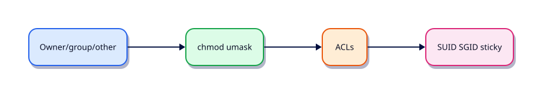

# Permissions, ACLs, and Special Bits

## Overview

Most “permission denied” tickets are mode, ownership, or umask mistakes — not mysterious kernel bugs.

This is **Tutorial 7** in **Module 4: Users & Permissions** of the REBASH Academy **Linux for Cloud & DevOps Engineers** series — written for administrators, DevOps engineers, SREs, and platform engineers operating production Linux.

## Prerequisites

- Users, Groups, and sudo
- Terminal access with a regular user account (sudo where noted)

## Learning Objectives

By the end of this tutorial, you will be able to:

- [ ] Apply the core ideas of “Permissions, ACLs, and Special Bits” on a real Linux host
- [ ] Use modern tools (`ip`/`ss`, `systemctl`/`journalctl`) where they apply
- [ ] Complete the lab under `~/rebash-linux/` with clear outputs
- [ ] Relate this topic to Cloud, DevOps, and production operations
- [ ] Explain the failure modes you would check first in an incident

## Architecture

Linux ops work sits between humans/automation and the kernel, services, and network. This topic’s control points are shown below.



## Theory

### chmod, chown, chgrp

POSIX modes: user / group / other × read(4) write(2) execute(1).

```bash
chmod 640 file.conf
chmod u=rwX,g=rX,o= dir/
chown user:group file
chgrp group file
```

Capital `X` sets execute only on directories or files that already had execute.

### umask

**umask** masks permissions at creation time. Common: `0022` (files `644`, dirs `755`) or `0002` for collaborative groups.

```bash
umask
umask 0027
```

### ACLs

**Access Control Lists (ACLs)** add named-user/named-group entries beyond owner/group/other.

```bash
setfacl -m u:appuser:rw file.txt
getfacl file.txt
setfacl -x u:appuser file.txt
```

Useful for shared deploy directories without widening “other”.

### Sticky bit, SUID, SGID

| Bit | On files | On directories |
|-----|----------|----------------|
| **Sticky** (`+t`) | (rare) | Only owner can delete their files (`/tmp`) |
| **SUID** (`+s` user) | Runs as file owner | — |
| **SGID** (`+s` group) | Runs as file group | New files inherit directory group |

```bash
chmod +t shared_dir
chmod u+s /usr/bin/passwd   # example — do not invent SUID binaries
chmod g+s team_dir
```

Audit unexpected SUID/SGID binaries on hardened hosts.

## Hands-on Lab

Create a workspace for this tutorial.

```bash
mkdir -p ~/rebash-linux/lab07 && cd ~/rebash-linux/lab07
```

**Focus:** set modes/umask; ACL grant; sticky/SGID directory demo

### Step 1 – Skeleton

```bash
cat > lab.sh << 'EOF'
#!/usr/bin/env bash
set -euo pipefail
echo "lab07 permissions-acls-and-special-bits on $(hostname -s)"
EOF
chmod +x lab.sh
./lab.sh
```

### Step 2 – Modes and ACL demo

```bash
umask 0027
echo secret > secret.txt
chmod 640 secret.txt
stat -c '%a %A %n' secret.txt | tee mode.txt
if command -v setfacl >/dev/null; then
  setfacl -m u:"$USER":rw secret.txt || true
  getfacl secret.txt | tee acl.txt
fi
mkdir -p shared
chmod 1777 shared
ls -ld shared | tee sticky.txt
```

### Final step – Cleanup note

```bash
./lab.sh
# keep ~/rebash-linux for later labs
```

## Validation

- [ ] Lab commands run under `~/rebash-linux/lab07/`
- [ ] You can explain each Theory bullet in your own words
- [ ] You used modern tooling where applicable (`ip`/`ss`, `systemctl`/`journalctl`)
- [ ] You can describe one production failure mode for this topic

## Code Walkthrough

Production Linux practice for **Permissions, ACLs, and Special Bits** always combines:

1. Inspect before you change (`status`, `df`, `ip`, logs)
2. Prefer reversible, documented changes (config management, drop-ins)
3. Capture evidence (command output, journal snippets) for handovers
4. Prefer `systemctl`/`journalctl` and `ip`/`ss` over legacy tools
5. Least privilege — escalate with `sudo` only when required

Keep runbooks short enough to follow at 03:00. Automate the boring checks; keep humans for judgement.

## Security Considerations

- Treat host access and sudo as privileged — audit who can do what
- Never paste secrets into shell history, tickets, or screenshots
- Validate device names and paths before destructive disk or `rm` operations
- Prefer key-based SSH and deny password auth on internet-facing hosts
- Collect logs centrally; restrict who can read authentication and audit trails

## Common Mistakes

!!! warning "Using legacy networking tools by default"
    `ifconfig`/`netstat` are missing or incomplete on modern images. **Fix:** use `ip` and `ss`.

!!! warning "Editing vendor unit files in place"
    Package upgrades overwrite `/lib/systemd/system`. **Fix:** `systemctl edit` drop-ins under `/etc`.

!!! warning "Trusting df without checking inodes and mounts"
    A full `/var` or exhausted inodes looks different from root. **Fix:** `df -h`, `df -i`, and `findmnt`.

## Best Practices

- Golden images + config as code over snowflake hosts
- Alert on symptoms (failed units, disk, load) with runbooks attached
- Time-sync (chrony) everywhere — logs and TLS depend on it
- Separate OS and data volumes on Cloud VMs
- Practise restore and rescue paths before you need them

## Troubleshooting

| Symptom | Likely cause | Fix |
|---------|--------------|-----|
| Permission denied | Mode/owner/ACL/MAC | `namei -l`, `id`, `getfacl`, SELinux/AppArmor logs |
| No route / timeout | Routing, DNS, firewall | `ip route`, `dig`, `ss`, security groups |
| Service won’t start | Unit/config/deps | `systemctl status`, `journalctl -u`, config `-t` |
| Disk full | Logs, containers, deleted-open | `df`/`du`, `lsof +L1`, rotate/expand |
| High load | CPU, I/O wait, thrash | `vmstat`, `iostat`, `ps` |

## Summary

**Permissions, ACLs, and Special Bits** is essential for Cloud and DevOps engineers operating Linux hosts. Practise the lab until the inspection path is muscle memory, then continue the track.

## Interview Questions

1. How does this topic show up when operating Cloud VMs or Kubernetes nodes?
2. What would you check first if this area misbehaves in production?
3. Which modern Linux tools replace older equivalents here?
4. What security control should accompany this capability?
5. How would you automate verification of this topic in CI or a cron/timer job?

!!! tip "Sample answer — question 2"
    Start with blast radius and recent changes, then gather host signals (`systemctl --failed`, `df`, `ip`/`ss`, `journalctl`) before making changes. Fix forward with evidence, not guesswork.

## Related Tutorials

- [Linux for Cloud & DevOps – Category Overview](index.md)
- [Users, Groups, and sudo](users-groups-and-sudo.md) *(previous)*
- [Text Processing with grep, sed, and awk](text-processing-grep-sed-awk.md) *(next)*
- [Learning Paths](../learning-paths/index.md)

## References

- [Linux man-pages project](https://www.kernel.org/doc/man-pages/)
- [systemd documentation](https://systemd.io/)
- [Filesystem Hierarchy Standard](https://refspecs.linuxfoundation.org/FHS_3.0/fhs-3.0.html)
- Track index: [Linux for Cloud & DevOps Engineers](index.md)
