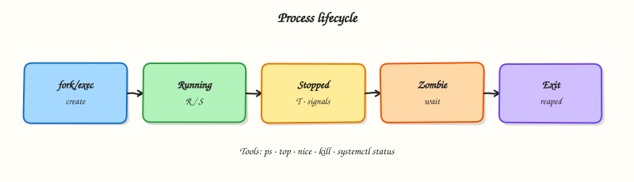

# Process Management

## Overview

Every command you run becomes a **process**: a running programme with a Process ID (PID), a parent, an environment, and resource use (CPU, memory, open files). On a busy cloud virtual machine (VM), knowing how to **see**, **stop**, and **prioritise** processes is basic Site Reliability Engineering (SRE) hygiene.

You inspect with `ps`, `top`, or `htop`. You send **signals** with `kill` and `pkill` (prefer a polite `TERM` before a forced `KILL`). Shell **job control** (`jobs`, `fg`, `bg`, `Ctrl-Z`) manages work tied to your terminal. **nice** / **renice** adjust CPU scheduling priority. **nohup** keeps a command alive after logout for ad-hoc work — but long-running production work should use **systemd** services (next tutorials), which add restart policy and journal logs.

Runaway processes burn CPU budget and money on cloud VMs. Stuck deploys and zombie parents block releases. Jumping straight to `kill -9` can leave locks and half-written data. In production you measure first (`ps`, load, memory), signal carefully, and move durable workloads under a supervisor. This tutorial builds that judgement on a practice VM.

This is **Tutorial 9** in **Module 6: Process Management** of the REBASH Academy **Linux for Cloud & DevOps Engineers** series. It is written for Linux administrators, DevOps engineers, SRE, and platform engineers. By the end, you will have started, inspected, reniced, and stopped lab processes with saved evidence.

## Prerequisites

- [Text Processing with grep, sed, and awk](text-processing-grep-sed-awk.md)
- A **practice Ubuntu 22.04/24.04 VM** with a normal user account
- Optional: `htop` (`sudo apt install htop`) — not required for the lab

## Learning Objectives

By the end of this tutorial, you will be able to:

- [ ] Explain PID, parent process, signals (`TERM` vs `KILL`), and niceness
- [ ] Inspect processes with `ps` and read useful columns
- [ ] Start background work, use job control, and stop processes cleanly
- [ ] Adjust priority with `nice` / `renice` and state when systemd is better than `nohup`
- [ ] Complete the lab under `~/rebash-linux/lab09` with evidence files

## Architecture

User commands and services become processes scheduled by the kernel. Operators observe them, send signals, and optionally adjust priority — or hand long-running work to systemd.



## Theory

### What it is

A **process** is an instance of a running programme. Important fields include PID, Parent PID (PPID), user, state (running, sleeping, zombie), and resource use.

| Tool | Role |
|------|------|
| `ps` | Point-in-time snapshot |
| `top` / `htop` | Live interactive view |
| `kill` / `pkill` | Send signals by PID or name |
| `jobs` / `fg` / `bg` | Shell job control |
| `nice` / `renice` | CPU scheduling priority |
| `nohup` | Survive terminal hangup (ad hoc) |
| systemd service | Supervised long-running work |

```bash
ps -eo pid,ppid,user,stat,pcpu,pmem,cmd --sort=-pcpu | head
```

### Why it matters

High CPU, memory leaks, and stuck batch jobs all show up as process problems. Knowing the difference between **TERM** (ask to exit cleanly) and **KILL** (force stop, no cleanup) prevents data corruption. Knowing the difference between an interactive shell job and a **systemd** unit prevents “I closed my laptop and the migration died”. On shared hosts, lowering the priority of heavy batch work with `nice` protects interactive control-plane tools.

### How it works

1. **Inspect** — `ps aux` or `ps -ef`; filter with `pgrep -a name` or `ps … | grep`.
2. **Signal** — `kill -TERM PID` (signal 15) first; wait; only then `kill -KILL PID` (signal 9) if needed. `pkill -f pattern` matches the command line — use narrow patterns.
3. **Jobs** — `command &` backgrounds; `jobs` lists; `Ctrl-Z` suspends; `bg` / `fg` resume.
4. **Priority** — niceness from about **-20** (more CPU favour) to **19** (less). Unprivileged users can usually only **increase** niceness (make themselves nicer / lower priority).
5. **Survive logout** — `nohup cmd &` ignores hangup and often writes `nohup.out`. Prefer a systemd unit for anything that must restart and log properly.

| Signal | Number | Meaning |
|--------|--------|---------|
| TERM | 15 | Graceful stop — try first |
| INT | 2 | Interrupt (like Ctrl-C) |
| HUP | 1 | Hangup; many daemons reload config |
| KILL | 9 | Force stop — cannot be caught |

### Key concepts and comparisons

| Pattern | Prefer when | Avoid when |
|---------|-------------|------------|
| `kill -TERM` then wait | App can flush and exit | You already know the process ignores TERM |
| `kill -KILL` | Process is hung after TERM | First reaction to every problem |
| `nohup` / `screen` / `tmux` | One-off admin task | Production API or always-on worker |
| systemd unit | Needs restart, deps, journal | Quick interactive experiment |
| Higher niceness (e.g. 10) | Batch / compile on shared VM | Latency-critical request path |

### Common pitfalls

- Jumping to `kill -9` and leaving locks or half-written files.
- Broad `pkill -f` patterns that kill the wrong processes (including your SSH session tooling).
- Relying on `nohup` for production workloads that need restart and logs.
- Misreading **load average** without checking run queue, I/O wait, and steal time on cloud VMs.
- Renicing critical daemons without understanding latency impact.

## Hands-on Lab

### Objective

On a practice Ubuntu VM, start lab worker processes, inspect them with `ps`, adjust niceness, stop them with `TERM` (and prove they exited), and save evidence under `~/rebash-linux/lab09`.

### Prerequisites

- Ubuntu 22.04/24.04 with bash
- Packages: `procps` (provides `ps`, `kill`, `pgrep` — already on Ubuntu)
- No sudo required unless you choose to install `htop`

### Lab environment

Workspace: `~/rebash-linux/lab09`

```bash
mkdir -p ~/rebash-linux/lab09 && cd ~/rebash-linux/lab09
set -euo pipefail
whoami | tee lab-user.txt
ps -p $$ -o pid,ppid,cmd | tee shell-ps.txt
```

**Expected output:** `lab-user.txt` and `shell-ps.txt` exist; your shell PID is listed.

### Real-world scenario

A batch “report” job was started in SSH and is still consuming CPU after the engineer disconnected. You need to find the process, confirm it is yours, lower its priority if it must finish, or stop it cleanly with `TERM` and keep proof for the ticket. You practise that path with disposable `sleep` workers (safe stand-ins for long jobs).

### Step-by-step tasks

#### Task 1 – Start workers and inspect with ps

```bash
cd ~/rebash-linux/lab09
set -euo pipefail

# Two disposable workers (sleep is safe and easy to spot)
sleep 3600 &
echo $! | tee worker1.pid
sleep 3600 &
echo $! | tee worker2.pid

W1=$(cat worker1.pid)
W2=$(cat worker2.pid)
ps -p "$W1","$W2" -o pid,ppid,user,ni,stat,cmd | tee workers-ps.txt
pgrep -af 'sleep 3600' | tee workers-pgrep.txt
grep -q "$W1" workers-ps.txt
grep -q "$W2" workers-ps.txt
```

**Expected output:** both PIDs appear in `workers-ps.txt` with command `sleep 3600`.

#### Task 2 – Renice and job-control style background proof

```bash
cd ~/rebash-linux/lab09
set -euo pipefail

W1=$(cat worker1.pid)

# Lower CPU priority (higher nice value) for worker1
renice +10 -p "$W1" | tee renice-out.txt
ps -p "$W1" -o pid,ni,cmd | tee worker1-nice.txt
awk 'NR==2 {exit !($2 == 10)}' worker1-nice.txt

# Start a third worker with nice from the beginning
nice -n 15 sleep 3600 &
echo $! | tee worker3.pid
W3=$(cat worker3.pid)
ps -p "$W3" -o pid,ni,cmd | tee worker3-nice.txt
awk 'NR==2 {exit !($2 == 15)}' worker3-nice.txt
```

**Expected output:** worker1 niceness is `10`; worker3 niceness is `15`.

#### Task 3 – Graceful stop with TERM and evidence pack

```bash
cd ~/rebash-linux/lab09
set -euo pipefail

W1=$(cat worker1.pid)
W2=$(cat worker2.pid)
W3=$(cat worker3.pid)

kill -TERM "$W1" "$W2" "$W3"
# Brief wait for exit
sleep 1

# These PIDs must be gone
if ps -p "$W1","$W2","$W3" >/dev/null 2>&1; then
  echo "ERROR: workers still running" >&2
  ps -p "$W1","$W2","$W3" -o pid,stat,cmd || true
  exit 1
fi
echo "all lab workers stopped" | tee stop-ok.txt

# Demonstrate KILL is last resort (start and force-stop one short worker)
sleep 3600 &
echo $! | tee worker-kill.pid
WK=$(cat worker-kill.pid)
kill -KILL "$WK"
sleep 0.5
if ps -p "$WK" >/dev/null 2>&1; then
  echo "ERROR: KILL failed" >&2
  exit 1
fi
echo "KILL demo ok" | tee kill-demo.txt

tar -czf process-evidence.tgz \
  lab-user.txt shell-ps.txt \
  worker1.pid worker2.pid worker3.pid worker-kill.pid \
  workers-ps.txt workers-pgrep.txt \
  renice-out.txt worker1-nice.txt worker3-nice.txt \
  stop-ok.txt kill-demo.txt
ls -l process-evidence.tgz | tee evidence-ls.txt
test -s process-evidence.tgz
```

**Expected output:** `stop-ok.txt` and `kill-demo.txt` exist; no lab `sleep 3600` workers remain; archive is non-empty.

### Validation steps

- [ ] You captured PIDs and `ps` output for lab workers
- [ ] `renice` / `nice` values show in `worker1-nice.txt` and `worker3-nice.txt`
- [ ] Workers were stopped with `TERM` and confirmed gone
- [ ] `process-evidence.tgz` exists under `~/rebash-linux/lab09`

### Common errors and fixes

| Error | Cause | Fix |
|-------|-------|-----|
| `renice: failed to set priority` | Trying to lower niceness (boost priority) without root | Use positive niceness (`+10`) as in the lab |
| `No such process` | Already exited / wrong PID | Re-read `worker*.pid`; do not reuse old PIDs |
| `pkill` killed unexpected processes | Pattern too broad | Match a unique command line; prefer exact PID from `pgrep -a` |
| Workers still listed after TERM | Slow exit / ignored signal | Wait briefly; then `kill -KILL` only for that PID |

### Challenge exercise

Write `~/rebash-linux/lab09/graceful-stop.sh` that: (1) starts `sleep 120` in the background, (2) writes its PID to `challenge.pid`, (3) sends `TERM`, (4) waits up to 5 seconds, (5) exits `0` only if the PID is gone (else sends `KILL` and exits `1`). Run it once and save stdout/stderr to `challenge-run.txt`.

### Learning outcomes

- Started and identified processes with `ps` / `pgrep`
- Adjusted niceness with `nice` / `renice`
- Stopped processes with `TERM` first and used `KILL` only as a demo last resort
- Saved process evidence for a ticket

### Cleanup

```bash
cd ~/rebash-linux/lab09
set -euo pipefail
# Stop any leftover lab sleeps matching our pattern
pkill -f 'sleep 3600' 2>/dev/null || true
pkill -f 'sleep 120' 2>/dev/null || true
# Keep evidence if you want; otherwise:
# rm -f *.pid *.txt process-evidence.tgz graceful-stop.sh
```

## Validation

- [ ] Lab finished under `~/rebash-linux/lab09/` with evidence files
- [ ] You can explain TERM vs KILL and why TERM comes first
- [ ] You can explain when to use systemd instead of `nohup`
- [ ] You know that unprivileged users usually cannot renice *down* (boost priority)

## Code Walkthrough

In real servers, process work usually follows this order:

1. **Measure** — `ps`, `top`/`htop`, load, memory — before killing anything  
2. **Identify owner and command** — confirm it is safe to stop  
3. **TERM, wait, verify** — then KILL only if needed  
4. **Narrow matches** — PID or careful `pkill -f`  
5. **Supervise durable work** — systemd units over `nohup` for production  

Keep the blast radius small: one PID, one service, one node — then widen if needed.

## Security Considerations

- Only kill processes you understand — wrong PID can stop SSH, databases, or agents  
- Restrict who has rights to signal other users’ processes  
- Do not run untrusted binaries with `nohup` and forget them  
- Audit unexpected persistent processes after incidents  
- Prefer service accounts and systemd for apps — not root shells left in `screen`  

## Common Mistakes

!!! warning "Using `kill -9` as the first step"
    The process cannot clean up. **Fix:** `kill -TERM PID`, wait and re-check with `ps`, then `KILL` only if still present.

!!! warning "Broad `pkill -f sleep`"
    You may kill unrelated work. **Fix:** use the exact PID from your pidfile or a unique command line.

!!! warning "Leaving production jobs on `nohup`"
    No restart policy, weak logging, easy to forget. **Fix:** create a systemd service (next tutorial).

!!! warning "Misreading high load as 'need more CPU'"
    Load can be I/O wait or cloud steal time. **Fix:** check `vmstat`/`iostat` and process states, not only the load number.

## Best Practices

- Capture `ps` / `pgrep` output before and after interventions  
- Prefer service restarts (`systemctl restart`) over killing random children of a supervised service  
- Use higher niceness for compile/batch jobs on shared bastions  
- Document PIDs and commands in the incident ticket  
- Practise graceful stop scripts before you need them in production  

## Troubleshooting

| Symptom | Likely cause | Fix |
|---------|--------------|-----|
| Process in `Z` state (zombie) | Parent not reaping | Fix/restart the parent; zombie itself holds almost no resources |
| `Operation not permitted` on kill | Not your process / privilege | Use sudo only when appropriate; check owner with `ps` |
| Process ignores TERM | Custom signal handling / stuck in uninterruptible I/O (`D`) | Investigate I/O; KILL if policy allows; check disks |
| CPU high after kill | Wrong process / respawn by supervisor | Check systemd/container runtime; stop the unit, not only one child |
| Job disappears after SSH logout | SIGHUP to session | Use systemd, or carefully `nohup`/`tmux` for one-off work |

## Summary

Process management is how you see, prioritise, and stop running work safely. Prefer `TERM` before `KILL`, use niceness for batch load, and move durable workloads to systemd. Next: [systemd Services and journalctl](systemd-services-and-journalctl.md).

## Interview Questions

**1. What is the difference between `kill -15` (TERM) and `kill -9` (KILL), and which should you try first?**

??? success "Reveal answer"
    **TERM** asks the process to exit so it can flush buffers and release locks. **KILL** forces immediate stop and cannot be caught — no cleanup. Always try TERM first, wait and verify with `ps`, then use KILL only if the process is hung and policy allows.

**2. A process keeps coming back after you kill it. What do you check next?**

??? success "Reveal answer"
    A **supervisor** is restarting it: systemd, a container runtime, Kubernetes, or a parent script. Find the unit or parent (`systemctl status`, `ps -ef` / PPID tree) and stop or fix the supervisor — do not only kill children in a loop.

**3. What does niceness mean, and can a normal user make their process higher priority?**

??? success "Reveal answer"
    Niceness influences CPU scheduling: **higher nice** means **lower** priority. Unprivileged users can usually only **increase** niceness (become “nicer”). Lowering niceness (boosting priority) typically needs root. Use higher nice for batch jobs on shared hosts.

**4. When is `nohup` acceptable, and when should you use a systemd service instead?**

??? success "Reveal answer"
    `nohup` is fine for a **one-off** admin command that must survive logout. Use **systemd** when you need start-at-boot, restart on failure, dependencies, and journal logging — i.e. almost all production long-running work.

**5. How do you find and stop a process safely when you only remember part of the command line?**

??? success "Reveal answer"
    List candidates with `pgrep -af 'unique-substring'` or `ps -ef | grep`, confirm the PID and user, then `kill -TERM` that PID. Avoid vague patterns like `pkill -f java` on a host that runs many Java apps.

**6. Load average is high but `top` shows low %CPU. What else might be going on?**

??? success "Reveal answer"
    Processes may be in **uninterruptible I/O** (`D`), or the host may have high **I/O wait** or cloud **steal** time. Check `vmstat`, `iostat`, disk health, and whether tasks are blocked on storage — not only user CPU %.

**7. How would you prove in a ticket that you stopped a runaway job cleanly?**

??? success "Reveal answer"
    Attach before/after `ps` or `pgrep` output, the PID, the signal used (`TERM`), and confirmation the PID is gone. If you had to use `KILL`, say why TERM failed. Evidence beats “I killed it”.

## Related Tutorials

- [Linux for Cloud & DevOps – Overview](index.md)
- [Text Processing with grep, sed, and awk](text-processing-grep-sed-awk.md) *(previous)*
- [systemd Services and journalctl](systemd-services-and-journalctl.md) *(next)*
- [Host Monitoring with vmstat, iostat, and sar](host-monitoring-vmstat-iostat-sar.md) *(related)*

## References

- [`ps(1)`](https://manpages.ubuntu.com/manpages/jammy/en/man1/ps.1.html) — Ubuntu man-pages  
- [`kill(1)`](https://manpages.ubuntu.com/manpages/jammy/en/man1/kill.1.html) — Ubuntu man-pages  
- [`signal(7)`](https://manpages.ubuntu.com/manpages/jammy/en/man7/signal.7.html) — signal overview  
- Track index: [Linux for Cloud & DevOps Engineers](index.md)
