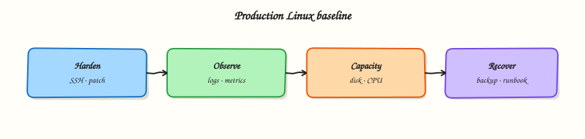

# Production Linux — Hardening and Performance

## Overview

Shipping a VM is easy; running it safely under load is the job.

This is **Tutorial 24** in **Module 16: Production Linux** of the REBASH Academy **Linux for Cloud & DevOps Engineers** series — written for administrators, DevOps engineers, SREs, and platform engineers operating production Linux.

## Prerequisites

- Troubleshooting Linux Systems
- Terminal access with a regular user account (sudo where noted)

## Learning Objectives

By the end of this tutorial, you will be able to:

- [ ] Apply the core ideas of “Production Linux — Hardening and Performance” on a real Linux host
- [ ] Use modern tools (`ip`/`ss`, `systemctl`/`journalctl`) where they apply
- [ ] Complete the lab under `~/rebash-linux/` with clear outputs
- [ ] Relate this topic to Cloud, DevOps, and production operations
- [ ] Explain the failure modes you would check first in an incident

## Architecture

Linux ops work sits between humans/automation and the kernel, services, and network. This topic’s control points are shown below.



## Theory

### What it is

**Production hardening** reduces attack surface and increases accountability: patch cadence, SSH and firewall baselines, minimal packages, Mandatory Access Control (MAC) enforcing, audit and central logs, time sync, and encrypted or separated data volumes. **Performance tuning** adjusts kernel and application settings only with evidence — sysctl values, instance sizing, and IOPS classes — recorded in configuration management. **Capacity planning** and operational excellence (golden images, change control, game days) keep systems reliable as load grows.

### Why it matters

Unpatched, snowflake hosts fail audits and fail at 3 a.m. Tuning without metrics creates mysterious regressions. Hardening and performance are not opposites: removing unused services often improves both security and noise. SRE and platform teams need a written baseline so every new image ships sane defaults.

### How it works

Patch on a schedule with reboot windows for kernels. Enforce key-only SSH, host firewalls aligned with cloud security groups, and SELinux/AppArmor in enforcing mode. Run chrony for clock sync — TLS and logs depend on it. Separate OS and data disks; encrypt when policy requires. For performance, measure first (`vmstat`, `iostat`, `sar`, app Service Level Indicators (SLIs)), then change one knob (for example `vm.swappiness` or connection pool size) and document rollback. Capacity tracks trends for CPU, memory, disk, inodes, and network; prefer horizontal scale for stateless tiers. Monitor with alerts that link to runbooks; practise restores and failure modes.

### Key concepts and comparisons

| Area | Baseline practise |
|------|-------------------|
| Patching | Cadence + reboot policy |
| Access | SSH hardened, least sudo |
| MAC / audit | Enforcing + central logs |
| Performance | Evidence-led sysctl/app tuning |
| Capacity | Trends + headroom alerts |
| Ops excellence | Images as code, blameless reviews |

| Tune when | Avoid when |
|-----------|------------|
| Clear saturation/error signal | “Folklore” values from blogs |
| Change is reversible and owned | One-off SSH edits on prod |

### Common pitfalls

- Copying sysctl stacks from the internet onto every fleet.
- Disabling MAC or audit “temporarily” and never re-enabling.
- Alerting on vanity metrics without runbooks or SLOs.
- Right-sizing once and never revisiting after traffic growth.
- Treating golden images as optional while snowflake hosts multiply.

## Hands-on Lab

Create a workspace for this tutorial.

```bash
mkdir -p ~/rebash-linux/lab24 && cd ~/rebash-linux/lab24
```

**Focus:** audit hardening checklist; capture baseline metrics; draft sysctl notes

### Step 1 – Production baseline

```bash
cat > harden-checklist.md << 'EOF'
- [ ] SSH keys only / PermitRootLogin no
- [ ] Host firewall + cloud SG aligned
- [ ] Automatic security updates policy
- [ ] MAC enforcing where supported
- [ ] Journal/syslog shipped
- [ ] Disk/inode alerts
- [ ] Documented reboot window
EOF
{
  uptime
  free -h
  df -h
  sysctl vm.swappiness net.ipv4.ip_forward 2>/dev/null || true
} | tee baseline.txt
```

### Final step – Cleanup note

```bash
# Keep ~/rebash-linux/ for later tutorials; destroy disposable cloud resources from this lab
```

## Validation

- [ ] Lab commands run under `~/rebash-linux/lab24/`
- [ ] You can explain each Theory bullet in your own words
- [ ] You used modern tooling where applicable (`ip`/`ss`, `systemctl`/`journalctl`)
- [ ] You can describe one production failure mode for this topic

## Code Walkthrough

Production Linux practice for **Production Linux — Hardening and Performance** always combines:

1. Inspect before you change (`status`, `df`, `ip`, logs)
2. Prefer reversible, documented changes (config management, drop-ins)
3. Capture evidence (command output, journal snippets) for handovers
4. Prefer `systemctl`/`journalctl` and `ip`/`ss` over legacy tools
5. Least privilege — escalate with `sudo` only when required

Keep runbooks short enough to follow at 03:00. Automate the boring checks; keep humans for judgement.

## Security Considerations

- Treat host access and sudo as privileged — audit who can do what
- Never paste secrets into shell history, tickets, or screenshots
- Validate device names and paths before destructive disk or `rm` operations
- Prefer key-based SSH and deny password auth on internet-facing hosts
- Collect logs centrally; restrict who can read authentication and audit trails

## Common Mistakes

!!! warning "Using legacy networking tools by default"
    `ifconfig`/`netstat` are missing or incomplete on modern images. **Fix:** use `ip` and `ss`.

!!! warning "Editing vendor unit files in place"
    Package upgrades overwrite `/lib/systemd/system`. **Fix:** `systemctl edit` drop-ins under `/etc`.

!!! warning "Trusting df without checking inodes and mounts"
    A full `/var` or exhausted inodes looks different from root. **Fix:** `df -h`, `df -i`, and `findmnt`.

## Best Practices

- Golden images + config as code over snowflake hosts
- Alert on symptoms (failed units, disk, load) with runbooks attached
- Time-sync (chrony) everywhere — logs and TLS depend on it
- Separate OS and data volumes on Cloud VMs
- Practise restore and rescue paths before you need them

## Troubleshooting

| Symptom | Likely cause | Fix |
|---------|--------------|-----|
| Permission denied | Mode/owner/ACL/MAC | `namei -l`, `id`, `getfacl`, SELinux/AppArmor logs |
| No route / timeout | Routing, DNS, firewall | `ip route`, `dig`, `ss`, security groups |
| Service won’t start | Unit/config/deps | `systemctl status`, `journalctl -u`, config `-t` |
| Disk full | Logs, containers, deleted-open | `df`/`du`, `lsof +L1`, rotate/expand |
| High load | CPU, I/O wait, thrash | `vmstat`, `iostat`, `ps` |

## Summary

**Production Linux — Hardening and Performance** is essential for Cloud and DevOps engineers operating Linux hosts. Practise the lab until the inspection path is muscle memory, then continue the track.

## Interview Questions

1. How does this topic show up when operating Cloud VMs or Kubernetes nodes?
2. What would you check first if this area misbehaves in production?
3. Which modern Linux tools replace older equivalents here?
4. What security control should accompany this capability?
5. How would you automate verification of this topic in CI or a cron/timer job?

!!! tip "Sample answer — question 2"
    Start with blast radius and recent changes, then gather host signals (`systemctl --failed`, `df`, `ip`/`ss`, `journalctl`) before making changes. Fix forward with evidence, not guesswork.

## Related Tutorials

- [Linux for Cloud & DevOps – Category Overview](index.md)
- [Troubleshooting Linux Systems](troubleshooting-linux-systems.md) *(previous)*
- [Backup, Disaster Recovery, and Capacity](backup-disaster-recovery-and-capacity.md) *(next)*
- [Learning Paths](../learning-paths/index.md)

## References

- [Linux man-pages project](https://www.kernel.org/doc/man-pages/)
- [systemd documentation](https://systemd.io/)
- [Filesystem Hierarchy Standard](https://refspecs.linuxfoundation.org/FHS_3.0/fhs-3.0.html)
- Track index: [Linux for Cloud & DevOps Engineers](index.md)
