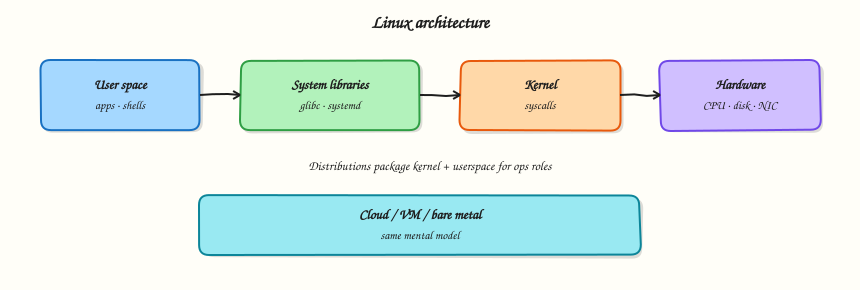

# Linux — Learning Roadmap

Follow the course in order:

1. **Course overview** — understand scope, prerequisites, and outcomes
2. **Modules** — work through tutorials module by module
3. **Labs** — hands-on practice after core lessons
4. **Quizzes** — check understanding before projects
5. **Projects** — portfolio builds that connect multiple skills
6. **Capstone** — end-to-end proof of production readiness
7. **Interview preparation** — role-specific questions and scenarios
8. **Certifications** — map lessons to industry exams

## Modules

### Module 1 · Fundamentals

- [Linux Fundamentals — Distributions and Architecture](../linux-fundamentals-distributions-and-architecture/)
- [Boot Process and Filesystem Hierarchy](../boot-process-and-filesystem-hierarchy/)

### Module 2 · Command Line

- [Essential Linux Commands](../essential-linux-commands/)

### Module 3 · Filesystem

- [Paths, Links, Mounts, and Inodes](../filesystem-paths-links-mounts-and-inodes/)
- [Disk Usage and File Attributes](../disk-usage-and-file-attributes/)

### Module 4 · Users & Permissions

- [Users, Groups, and sudo](../users-groups-and-sudo/)
- [Permissions, ACLs, and Special Bits](../permissions-acls-and-special-bits/)

### Module 5 · Text Processing

- [Text Processing with grep, sed, and awk](../text-processing-grep-sed-awk/)

### Module 6 · Processes

- [Process Management](../process-management/)

### Module 7 · Services & Boot

- [systemd Services and journalctl](../systemd-services-and-journalctl/)
- [systemd Targets, Timers, and Boot](../systemd-targets-timers-and-boot/)

### Module 8 · Storage

- [Disks, Partitions, and Filesystems](../storage-disks-partitions-and-filesystems/)
- [LVM, Swap, and Disk Monitoring](../lvm-swap-and-disk-monitoring/)

### Module 9 · Networking

- [Linux Networking Tools](../linux-networking-tools/)
- [SSH and Remote Access](../ssh-and-remote-access/)

### Module 10 · Packages

- [Package Management](../package-management/)

### Module 11 · Scheduling

- [Scheduling — cron, at, and Timers](../scheduling-cron-at-and-timers/)

### Module 12 · Logging & Monitoring

- [Logging — syslog, journald, logrotate](../logging-syslog-journald-logrotate/)
- [Host Monitoring — vmstat, iostat, sar](../host-monitoring-vmstat-iostat-sar/)

### Module 13 · Security

- [SSH Hardening and Firewalls](../ssh-hardening-and-firewalls/)
- [SELinux, AppArmor, Fail2Ban, Auditd, PAM](../selinux-apparmor-fail2ban-auditd-pam/)

### Module 14 · Containers & Cloud

- [Containers — Namespaces, cgroups, and OCI](../containers-namespaces-cgroups-and-oci/)

### Module 15 · Troubleshooting

- [Troubleshooting Linux Systems](../troubleshooting-linux-systems/)

### Module 16 · Production Linux

- [Production Hardening and Performance](../production-linux-hardening-and-performance/)
- [Backup, Disaster Recovery, and Capacity](../backup-disaster-recovery-and-capacity/)

