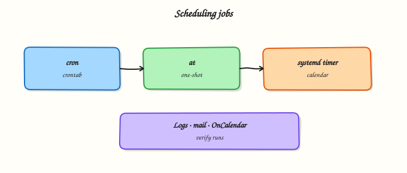

# Scheduling with cron, at, and Timers

## Overview

Linux schedules deferred and recurring work with **cron** (calendar tables), **at** (one-shot jobs), and **systemd timers** (unit-based schedules). Backups, certificate checks, report scrapes, and cleanup scripts all need a reliable schedule and **visible logs**. Silent failures are a common cause of “stale data” incidents.

Cron entries set minute, hour, day of month, month, and day of week, plus a command. The **`at`** command queues a job for a future time. **systemd timers** activate an associated `.service` unit using calendar or monotonic expressions and integrate with `journalctl` and dependencies such as `network-online.target`. In Cloud and DevOps work you will see all three: user crontabs on bastions, `/etc/cron.d/` jobs from packages, and timers for software managed by systemd.

Jobs often fail because the scheduler environment is not your interactive shell — especially **`PATH`** and working directory. Always use absolute paths, redirect output to a log file, and prove the next/last run time. Prefer timers when you need randomised delay, ordering, or unified failure logs; keep cron for simple per-user tasks.

This is **Tutorial 17** in **Module 11: Scheduling & Automation** of the REBASH Academy **Linux for Cloud & DevOps Engineers** series. It is written for Linux administrators, DevOps engineers, Site Reliability Engineering (SRE), and platform engineers.

## Prerequisites

- [Package Management](package-management.md)
- A **practice Ubuntu 22.04/24.04 VM** with `sudo`
- Comfort with basic `systemctl` (see Module 7 if needed)

## Learning Objectives

By the end of this tutorial, you will be able to:

- [ ] Explain when to use cron vs `at` vs systemd timers
- [ ] Install a user crontab job that writes a log with absolute paths
- [ ] Queue and verify a one-shot `at` job
- [ ] Create a systemd `.service` + `.timer`, enable it, and prove it with `list-timers` and journal logs
- [ ] Clean up lab schedules without leaving orphan jobs

## Architecture

Schedulers trigger work later. Cron and `at` run commands directly; systemd timers activate service units and log through the journal.



## Theory

### What it is

| Mechanism | Best for |
|-----------|----------|
| User `crontab` | Personal or per-account recurring jobs |
| `/etc/cron.d/` | Package- and system-shipped jobs |
| `at` | One-shot “run this once later” |
| systemd timer | Services already modelled as units; better journal integration |

```bash title="Terminal"
crontab -l
atq
systemctl list-timers --all
```

### Why it matters

Missed backups and stale caches often trace to a cron job that never ran, ran with empty `PATH`, or wrote errors nobody read. Timers give clearer “next/last” status for operations teams. Interviewers expect you to debug schedules with logs, not guesses.

### How it works

1. **User cron** — `crontab -e` edits your table; each line is schedule + command.
2. **System cron** — `/etc/crontab` and `/etc/cron.d/*` (include a user field).
3. **Environment** — set `PATH` in the crontab or use full paths (`/usr/bin/date`).
4. **Logging** — redirect `>> /path/log 2>&1`; do not rely only on local mail.
5. **`at`** — `echo command | at now + 1 minute`; manage with `atq` / `atrm`.
6. **Timers** — write `foo.service` (what to run) and `foo.timer` (when); `systemctl enable --now foo.timer`; check `systemctl list-timers` and `journalctl -u foo.service`.

```bash
# Example cron: every day at 02:15
# 15 2 * * * /usr/bin/date >> /var/tmp/date.log 2>&1
```

### Key concepts and comparisons

| Need | Prefer |
|------|--------|
| Simple user job | `crontab` |
| Run once tomorrow | `at` |
| App shipped as systemd unit | `.timer` |
| Randomised load across fleet | timer `RandomizedDelaySec=` |
| Catch-up after downtime | timer `Persistent=true` |

Cron schedule fields: `minute hour day-of-month month day-of-week`.

### Common pitfalls

- Relative commands without `PATH` (`date` works in your shell, fails in cron).
- Editing `/etc/crontab` with the wrong number of fields (system crontab includes username).
- No log redirection — failures are invisible.
- Creating a timer without enabling it (`enable --now`).
- Leaving lab cron entries on shared hosts.

## Hands-on Lab

### Objective

Create a user cron job, an `at` job, and a systemd user-space **system** timer that appends timestamps to lab log files. Prove each schedule with files and `list-timers`, then clean up. Workspace: `~/rebash-linux/lab17`.

### Prerequisites

- Ubuntu 22.04/24.04 with `sudo`
- Packages: `cron`, `at`, `systemd` (install if missing)

### Lab environment

Workspace: `~/rebash-linux/lab17`

```bash title="Terminal"
mkdir -p ~/rebash-linux/lab17 && cd ~/rebash-linux/lab17
set -euo pipefail
whoami | tee admin-user.txt
sudo -n true 2>/dev/null || sudo -v

sudo apt-get update -y
sudo DEBIAN_FRONTEND=noninteractive apt-get install -y cron at
sudo systemctl enable --now cron
sudo systemctl enable --now atd
sudo systemctl is-active cron | tee cron-active.txt
sudo systemctl is-active atd | tee atd-active.txt
```

!!! example "Expected output"
    `cron` and `atd` are `active`.


### Real-world scenario

Ops wants a small health stamp every minute for a practice app, a one-shot reminder job, and a systemd timer for a cleanup script that must show up in `list-timers` and the journal. You implement all three on a practice VM with clear log files for the change ticket.

### Step-by-step tasks

#### Task 1 – User crontab job with absolute paths

```bash title="Terminal"
cd ~/rebash-linux/lab17
set -euo pipefail

LAB="$HOME/rebash-linux/lab17"
LOG="$LAB/cron-heartbeat.log"
SCRIPT="$LAB/cron-heartbeat.sh"

cat > "$SCRIPT" << EOF
#!/bin/bash
set -euo pipefail
/usr/bin/date -Is >> "$LOG"
echo "cron-ok" >> "$LOG"
EOF
chmod 755 "$SCRIPT"

# Install crontab: every minute (lab only — remove in cleanup)
crontab -l 2>/dev/null | grep -v 'REBASH-LAB17' > "$LAB/crontab.prev" || true
{
  cat "$LAB/crontab.prev" 2>/dev/null || true
  echo "# REBASH-LAB17"
  echo "* * * * * $SCRIPT"
} | crontab -

crontab -l | tee crontab-installed.txt
grep -q REBASH-LAB17 crontab-installed.txt

echo "Waiting up to 75s for first cron run..."
for i in $(seq 1 15); do
  if [ -f "$LOG" ] && grep -q cron-ok "$LOG"; then
    break
  fi
  sleep 5
done
test -f "$LOG"
grep cron-ok "$LOG" | tee cron-heartbeat-proof.txt
```

!!! example "Expected output"
    `cron-heartbeat.log` contains a timestamp and `cron-ok` within about one minute.


#### Task 2 – One-shot `at` job

```bash title="Terminal"
cd ~/rebash-linux/lab17
set -euo pipefail

AT_LOG="$HOME/rebash-linux/lab17/at-job.log"
rm -f "$AT_LOG"

echo "/usr/bin/date -Is > $AT_LOG; echo at-ok >> $AT_LOG" | at now + 1 minute 2>&1 | tee at-submit.txt
atq | tee atq.txt
test -s atq.txt

echo "Waiting up to 90s for at job..."
for i in $(seq 1 18); do
  if [ -f "$AT_LOG" ] && grep -q at-ok "$AT_LOG"; then
    break
  fi
  sleep 5
done
test -f "$AT_LOG"
cat "$AT_LOG" | tee at-job-proof.txt
grep -q at-ok at-job-proof.txt
```

!!! example "Expected output"
    `atq` showed a job; `at-job.log` contains `at-ok`.


#### Task 3 – systemd service + timer

```bash title="Terminal"
cd ~/rebash-linux/lab17
set -euo pipefail

LAB="$HOME/rebash-linux/lab17"
TIMER_LOG="$LAB/timer-heartbeat.log"
UNIT_SCRIPT="$LAB/timer-heartbeat.sh"

cat > "$UNIT_SCRIPT" << EOF
#!/bin/bash
set -euo pipefail
/usr/bin/date -Is >> "$TIMER_LOG"
echo "timer-ok" >> "$TIMER_LOG"
EOF
chmod 755 "$UNIT_SCRIPT"

# System units (need sudo)
sudo tee /etc/systemd/system/rebash-lab17.service >/dev/null << EOF
[Unit]
Description=REBASH lab17 timer payload
[Service]
Type=oneshot
User=$USER
ExecStart=$UNIT_SCRIPT
EOF

sudo tee /etc/systemd/system/rebash-lab17.timer >/dev/null << 'EOF'
[Unit]
Description=REBASH lab17 periodic timer
[Timer]
OnBootSec=30s
OnUnitActiveSec=60s
AccuracySec=1s
Unit=rebash-lab17.service
[Install]
WantedBy=timers.target
EOF

sudo systemctl daemon-reload
sudo systemctl enable --now rebash-lab17.timer
systemctl list-timers --all | grep rebash-lab17 | tee list-timers.txt
test -s list-timers.txt

# Trigger once immediately for faster proof
sudo systemctl start rebash-lab17.service
sleep 1
test -f "$TIMER_LOG"
grep timer-ok "$TIMER_LOG" | tee timer-heartbeat-proof.txt
journalctl -u rebash-lab17.service -n 20 --no-pager | tee journal-timer.txt

tar -czf schedule-evidence.tgz \
  admin-user.txt cron-active.txt atd-active.txt \
  crontab-installed.txt cron-heartbeat.log cron-heartbeat-proof.txt \
  at-submit.txt atq.txt at-job.log at-job-proof.txt \
  list-timers.txt timer-heartbeat.log timer-heartbeat-proof.txt journal-timer.txt \
  cron-heartbeat.sh timer-heartbeat.sh
ls -l schedule-evidence.tgz | tee evidence-ls.txt
```

!!! example "Expected output"
    `list-timers.txt` shows `rebash-lab17.timer`; `timer-heartbeat.log` contains `timer-ok`; journal shows the service run.


### Validation steps

- [ ] User crontab contains the REBASH-LAB17 line and log updates
- [ ] `at` job wrote `at-job.log`
- [ ] `systemctl list-timers` shows `rebash-lab17.timer`
- [ ] `schedule-evidence.tgz` exists under `~/rebash-linux/lab17`

### Common errors and fixes

| Error | Cause | Fix |
|-------|-------|-----|
| Cron never writes log | Wrong path / cron not running | Use absolute paths; `systemctl status cron` |
| `at: command not found` | Package missing | `sudo apt-get install -y at` |
| `atd` inactive | Service not started | `sudo systemctl enable --now atd` |
| Timer not listed | Not enabled | `sudo systemctl enable --now name.timer` |
| Permission denied in script | Wrong owner / mode | `chmod 755` script; set `User=` in service |

### Challenge exercise

Add `Persistent=true` to the timer (or create `rebash-lab17-persist.timer`) and document in `challenge-persistent.txt` what Persistent means (run missed jobs after downtime). Trigger with `systemctl start rebash-lab17.service` and attach a new journal snippet. Remove any extra units in Cleanup.

### Learning outcomes

- Installed a proven user cron job with logging
- Queued and verified an `at` job
- Enabled a systemd timer with journal evidence
- Packed schedule proof for a change ticket

### Cleanup

```bash title="Terminal"
cd ~/rebash-linux/lab17
set -euo pipefail

# Remove lab cron lines
crontab -l 2>/dev/null | grep -v 'REBASH-LAB17' | grep -v 'cron-heartbeat.sh' | crontab - || crontab -r 2>/dev/null || true

# Remove pending at jobs owned by you (careful on shared hosts)
atq | awk '{print $1}' | while read -r id; do atrm "$id" 2>/dev/null || true; done

sudo systemctl disable --now rebash-lab17.timer 2>/dev/null || true
sudo rm -f /etc/systemd/system/rebash-lab17.service /etc/systemd/system/rebash-lab17.timer
sudo systemctl daemon-reload
```

## Validation

- [ ] Lab finished under `~/rebash-linux/lab17/`
- [ ] You can explain cron vs at vs timers
- [ ] You know why absolute paths matter in cron
- [ ] You can find next/last run for a timer

## Code Walkthrough

Production scheduling habits:

1. **Decide** mechanism (cron / at / timer)  
2. **Write** a small script with absolute paths  
3. **Log** stdout/stderr to a file or journal  
4. **Enable** and prove next/last run  
5. **Alert** on missing output (monitoring), not only on process start  

## Security Considerations

- Do not put secrets in world-readable cron scripts  
- Limit who can use `at` / crontab (`/etc/cron.allow`) on shared hosts  
- Run timers as the least-privileged user that still works  
- Review `/etc/cron.d` after package installs  
- Treat unexpected new scheduled jobs as a security signal  

## Common Mistakes

!!! warning "Relying on interactive PATH in cron"
    Commands “not found”. **Fix:** full paths or set `PATH=` at the top of the crontab.

!!! warning "No log file"
    Failures are invisible. **Fix:** `>> /path/log 2>&1` or use a timer + `journalctl`.

!!! warning "Creating a .timer but forgetting enable --now"
    Nothing runs. **Fix:** `systemctl enable --now name.timer` and check `list-timers`.

!!! warning "Every-minute cron left forever on production"
    Noise and load. **Fix:** use sane intervals; remove lab jobs in cleanup.

## Best Practices

- Prefer systemd timers for software you already ship as units  
- Use `RandomizedDelaySec` to avoid thundering herds  
- Keep scripts idempotent (safe if run twice)  
- Store system jobs in git / config management, not only on the host  
- Monitor “last success time”, not only “timer active”  

## Troubleshooting

| Symptom | Likely cause | Fix |
|---------|--------------|-----|
| Cron silent | Service down / bad schedule | `systemctl status cron`; `crontab -l` |
| `at` job stuck | `atd` down | Start `atd`; check `atq` |
| Timer inactive | Not enabled / wrong WantedBy | `enable --now`; `daemon-reload` |
| Script fails only in scheduler | Env / cwd / permissions | Log env; use absolute paths |
| Duplicate runs | Overlapping long jobs | Add locking (`flock`) in the script |

## Summary

Cron, `at`, and systemd timers all schedule work — choose based on one-shot vs recurring and how you want to observe failures. Use absolute paths, write logs, and prove schedules with crontab listings, `atq`, and `systemctl list-timers`. Next, follow those logs in [Logging — syslog, journald, and logrotate](logging-syslog-journald-logrotate.md).

## Interview Questions

**1. When do you choose a systemd timer instead of cron?**

??? success "Reveal answer"
    Prefer a **timer** when the work is modelled as a systemd service, when you need journal integration, dependencies (`After=network-online.target`), randomised delay, or `Persistent=` catch-up. Cron remains fine for simple per-user jobs and many classic admin scripts.

**2. Why do cron jobs fail with “command not found” even though the command works in your shell?**

??? success "Reveal answer"
    Cron uses a **minimal environment**, often a short `PATH`. Your interactive shell has more directories. Fix by using absolute paths (`/usr/bin/python3`) or setting `PATH=` in the crontab, and by logging stderr.

**3. What is the difference between user crontab and `/etc/cron.d/`?**

??? success "Reveal answer"
    A **user crontab** (`crontab -e`) runs as that user and has five schedule fields plus the command. Files in **`/etc/cron.d/`** are system drop-ins and usually include a **username** field (six fields before the command). Packages often install files under `/etc/cron.d/`.

**4. How do you prove a systemd timer is armed and actually running the work?**

??? success "Reveal answer"
    Use `systemctl list-timers` (next/last), `systemctl status name.timer`, and `journalctl -u name.service` for the payload. Optionally start the service once manually to prove the unit works independent of the schedule.

**5. What is `at` good for that cron is not?**

??? success "Reveal answer"
    **`at`** is for **one-shot** jobs at a future time (“run this once in 20 minutes”). Cron is for **recurring** calendar schedules. Use `atq`/`atrm` to list and remove pending `at` jobs.

**6. What does `Persistent=true` on a timer mean?**

??? success "Reveal answer"
    If the system was powered off when a calendar timer should have fired, systemd can run the missed job when the machine comes back (within limits). Useful for daily maintenance on machines that are not always on.

**7. How would you stop a runaway every-minute cron in production safely?**

??? success "Reveal answer"
    List with `crontab -l` or inspect `/etc/cron.d`, remove or comment the line, verify with `crontab -l`, and check logs for impact. For systemd, `systemctl disable --now name.timer`. Communicate in the incident channel; do not reboot as the first step.

## Related Tutorials

- [Linux for Cloud & DevOps – Overview](index.md)
- [Package Management](package-management.md) *(previous)*
- [Logging — syslog, journald, and logrotate](logging-syslog-journald-logrotate.md) *(next)*
- [systemd Targets, Timers, and Boot](systemd-targets-timers-and-boot.md) *(related)*
- [Lab — Services and Logs](../labs/linux-services-and-logs-lab.md) *(more practice)*

## References

- [`crontab(5)`](https://manpages.ubuntu.com/manpages/jammy/en/man5/crontab.5.html) — crontab format  
- [`at(1)`](https://manpages.ubuntu.com/manpages/jammy/en/man1/at.1.html) — one-shot jobs  
- [systemd.timer](https://www.freedesktop.org/software/systemd/man/latest/systemd.timer.html) — timer units  
- Track index: [Linux for Cloud & DevOps Engineers](index.md)
