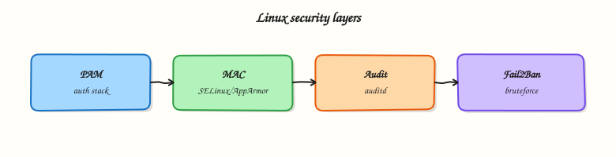

# SELinux, AppArmor, Fail2Ban, Auditd, and PAM

## Overview

File modes and sudo are **Discretionary Access Control (DAC)** — the owner decides. Production hosts also need **Mandatory Access Control (MAC)**, authentication policy, and an audit trail. On Ubuntu, **AppArmor** is the usual MAC. On RHEL-family systems, **SELinux** is common. **Fail2Ban** bans addresses after repeated login failures. **auditd** records security-relevant events. **Pluggable Authentication Modules (PAM)** define how login, sudo, and SSH authentication behave.

These tools look mysterious when something fails after a correct `chmod`. A MAC denial, a PAM typo, or a Fail2Ban jail that never matches your logs can waste hours. The safe engineering habit is: **detect what is installed, read status, collect evidence** — do not disable MAC “to make it work” on day one.

In regulated or enterprise environments, auditors ask whether MAC is enforcing, whether auth failures are logged, and whether PAM changes are controlled. Even on a small cloud virtual machine (VM), knowing which stack you have prevents copying RHEL SELinux advice onto an Ubuntu host (or the reverse).

This is **Tutorial 21** in **Module 13: Linux Security** of the REBASH Academy **Linux for Cloud & DevOps Engineers** series. It is written for Linux administrators, DevOps engineers, Site Reliability Engineering (SRE), and platform engineers. By the end, you will have a **security posture report** built from safe status commands — no MAC disable, no PAM rewrite.

## Prerequisites

- [SSH Hardening and Firewalls](ssh-hardening-and-firewalls.md)
- A **practice Ubuntu 22.04/24.04 VM** (AppArmor path) or RHEL-like VM (SELinux path) with sudo
- Do **not** edit PAM or set SELinux to Disabled on a shared production host for this lab

## Learning Objectives

By the end of this tutorial, you will be able to:

- [ ] Detect whether SELinux or AppArmor is present and report its mode/status
- [ ] Check auditd and Fail2Ban safely (installed vs active vs missing)
- [ ] Read a PAM stack file without editing it
- [ ] Explain how MAC, PAM, audit, and Fail2Ban layer on a host
- [ ] Produce a posture evidence pack under `~/rebash-linux/lab21`

## Architecture

Security layers sit around login and process execution. PAM authenticates. MAC confines what a process may do after it starts. auditd records. Fail2Ban reacts to repeated abuse in logs.



## Theory

### What it is

**SELinux** and **AppArmor** are MAC systems. They confine processes beyond `chmod`/`chown`. SELinux uses labels (`ls -Z`, `getenforce`). AppArmor uses path-based profiles (`aa-status`, `aa-enabled`).

**Fail2Ban** watches log lines (for example SSH failures) and adds temporary firewall bans for source Internet Protocol (IP) addresses.

**auditd** is the Linux audit daemon. Rules decide what to record; `ausearch` / `aureport` help you query.

**PAM** stacks under `/etc/pam.d/` chain modules for `auth`, `account`, `password`, and `session`. SSH, sudo, and login all use PAM.

```bash title="Terminal"
command -v getenforce >/dev/null && getenforce || echo 'no SELinux getenforce'
command -v aa-status >/dev/null && sudo aa-status --enabled; sudo aa-status 2>/dev/null | head || echo 'no AppArmor tools'
systemctl is-active auditd 2>/dev/null || true
systemctl is-active fail2ban 2>/dev/null || true
```

### Why it matters

MAC denials often look like random `Permission denied` after DAC looks correct. Disabling SELinux/AppArmor removes a major control — fix labels or profiles instead. Broken PAM can lock out every user. Fail2Ban that points at the wrong log path gives false comfort. Audit trails matter for incidents and compliance.

### How it works

1. **Detect MAC** — SELinux: `getenforce` / `sestatus`. AppArmor: `aa-enabled`, `aa-status`.
2. **Modes** — SELinux: Enforcing, Permissive, Disabled. AppArmor profiles: enforce or complain.
3. **Audit** — `systemctl status auditd`; recent boots in `journalctl -u auditd` (or audit logs).
4. **Fail2Ban** — `fail2ban-client status` when installed; check jails carefully.
5. **PAM** — read `/etc/pam.d/sshd` or `common-auth` (Ubuntu); never test by disconnecting all sessions after a blind edit.

These layers work together: PAM decides if you may authenticate; MAC confines the process; audit records; Fail2Ban slows attackers who hammer SSH.

### Key concepts and comparisons

| Control | Primary job |
|---------|-------------|
| SELinux / AppArmor | Confine processes (MAC) |
| DAC (`chmod` / ACL) | Owner-managed access |
| Fail2Ban | Reactive IP bans on abuse |
| auditd | Compliance / forensic trail |
| PAM | Auth stack behaviour |

| Distro tendency | MAC |
|-----------------|-----|
| RHEL, Rocky, Alma | SELinux |
| Ubuntu | AppArmor |
| Many containers | Often unconfined unless configured |

### Common pitfalls

- Setting SELinux to Disabled permanently instead of fixing contexts.
- Copying SELinux fix steps onto Ubuntu (or AppArmor steps onto RHEL) without detecting the stack.
- Editing PAM and testing only after all sessions disconnect — **lockout**.
- Fail2Ban jails that never match journald/syslog paths.
- Assuming guest MAC equals strong container isolation — runtime config matters.

## Hands-on Lab

### Objective

On a practice VM, **detect and report** MAC (AppArmor and/or SELinux), auditd, Fail2Ban, and one PAM stack — safely. Do not disable MAC. Do not edit PAM. Save a posture report under `~/rebash-linux/lab21`.

### Prerequisites

- Ubuntu 22.04/24.04 (typical) or RHEL-like practice VM with sudo
- Optional packages if missing: `apparmor-utils` (Ubuntu), `fail2ban` (optional install only if you choose), `auditd`
- Root/serial console available if you later experiment beyond this lab

### Lab environment

Workspace: `~/rebash-linux/lab21`

```bash title="Terminal"
mkdir -p ~/rebash-linux/lab21 && cd ~/rebash-linux/lab21
set -euo pipefail
whoami | tee admin-user.txt
id | tee admin-id.txt
test -n "$(command -v sudo)"
sudo -n true 2>/dev/null || sudo -v
cat /etc/os-release | tee os-release.txt
```

!!! example "Expected output"
    identity and OS files exist; sudo works.


!!! warning "Safe lab rules"
    Do **not** run `setenforce 0` as a “fix”.  
    Do **not** set `SELINUX=disabled` in config.  
    Do **not** edit files under `/etc/pam.d/` in this lab.  
    Read status; collect evidence; leave controls as you found them (unless you optionally install Fail2Ban for status only).

### Real-world scenario

A security questionnaire asks: “Is MAC enforcing? Is auditd running? Do you rate-limit SSH abuse? Where is PAM configured for SSH?” You must answer from a practice host with command evidence — without weakening the host to get screenshots.

### Step-by-step tasks

#### Task 1 – Detect MAC (AppArmor and SELinux) safely

```bash title="Terminal"
cd ~/rebash-linux/lab21
set -euo pipefail

{
  echo "=== SELinux ==="
  if command -v getenforce >/dev/null 2>&1; then
    getenforce | tee selinux-getenforce.txt
    command -v sestatus >/dev/null 2>&1 && sestatus | tee selinux-sestatus.txt || true
  else
    echo 'SELinux tools not present' | tee selinux-getenforce.txt
  fi

  echo "=== AppArmor ==="
  if command -v aa-enabled >/dev/null 2>&1; then
    aa-enabled 2>&1 | tee apparmor-enabled.txt || true
  else
    echo 'aa-enabled not present' | tee apparmor-enabled.txt
  fi
  if command -v aa-status >/dev/null 2>&1; then
    sudo aa-status 2>&1 | tee apparmor-status.txt
  else
    echo 'aa-status not present' | tee apparmor-status.txt
  fi

  # At least one MAC stack should be reported on a normal Ubuntu/RHEL server image
  if grep -Eqi 'Enforcing|Permissive|Disabled|Yes|enabled|apparmor' \
      selinux-getenforce.txt apparmor-enabled.txt apparmor-status.txt 2>/dev/null; then
    echo 'MAC detection captured' | tee mac-summary.txt
  else
    echo 'MAC tools missing — note for container/minimal images' | tee mac-summary.txt
  fi
} | tee mac-detect.log
```

!!! example "Expected output"
    `mac-detect.log` and status files exist; on Ubuntu you typically see AppArmor profiles; on RHEL-like hosts you see `getenforce` mode.


#### Task 2 – auditd and Fail2Ban status (detect only)

```bash title="Terminal"
cd ~/rebash-linux/lab21
set -euo pipefail

{
  echo "=== auditd ==="
  systemctl is-enabled auditd 2>&1 | tee auditd-enabled.txt || true
  systemctl is-active auditd 2>&1 | tee auditd-active.txt || true
  systemctl status auditd --no-pager 2>&1 | head -n 20 | tee auditd-status.txt || true
  if command -v ausearch >/dev/null 2>&1; then
    # Safe, small query — may be empty on quiet hosts
    sudo ausearch -m USER_LOGIN -ts recent 2>&1 | head -n 30 | tee ausearch-user-login.txt || \
      echo 'no recent USER_LOGIN matches' | tee ausearch-user-login.txt
  else
    echo 'ausearch not installed' | tee ausearch-user-login.txt
  fi

  echo "=== Fail2Ban ==="
  if command -v fail2ban-client >/dev/null 2>&1; then
    systemctl is-active fail2ban 2>&1 | tee fail2ban-active.txt || true
    sudo fail2ban-client status 2>&1 | tee fail2ban-status.txt || true
  else
    echo 'fail2ban not installed' | tee fail2ban-active.txt
    echo 'fail2ban not installed' | tee fail2ban-status.txt
  fi
} | tee audit-fail2ban.log

# Honest asserts: files exist (services may be inactive on minimal VMs)
test -s auditd-active.txt
test -s fail2ban-status.txt
```

!!! example "Expected output"
    status files for auditd and Fail2Ban; either real status or a clear “not installed / inactive” note.


#### Task 3 – Read PAM (no edits) and build posture report

```bash title="Terminal"
cd ~/rebash-linux/lab21
set -euo pipefail

# Ubuntu common files; fall back to sshd PAM stack
if [[ -f /etc/pam.d/common-auth ]]; then
  sudo sed -n '1,80p' /etc/pam.d/common-auth | tee pam-common-auth.txt
fi
if [[ -f /etc/pam.d/sshd ]]; then
  sudo sed -n '1,80p' /etc/pam.d/sshd | tee pam-sshd.txt
else
  echo 'no /etc/pam.d/sshd' | tee pam-sshd.txt
fi
ls -l /etc/pam.d | tee pam-d-ls.txt

# Machine-readable posture summary
{
  echo "host=$(hostname)"
  echo "user=$(whoami)"
  echo "date_utc=$(date -u +%Y-%m-%dT%H:%M:%SZ)"
  echo "selinux=$(cat selinux-getenforce.txt | tr '\n' ' ' | sed 's/ *$//')"
  echo "apparmor_enabled=$(head -n 1 apparmor-enabled.txt)"
  echo "auditd_active=$(cat auditd-active.txt)"
  echo "fail2ban=$(head -n 1 fail2ban-status.txt)"
  echo "pam_sshd_bytes=$(wc -c < pam-sshd.txt)"
} | tee posture.env

# Human report
{
  echo "# REBASH lab21 security posture"
  echo
  cat posture.env
  echo
  echo "## Notes"
  echo "- MAC: see mac-detect.log (do not disable to 'fix' apps)"
  echo "- PAM: read-only capture; edit only with console access and change control"
  echo "- Fail2Ban: install/configure only after SSH hardening and log path checks"
} | tee posture-report.md

tar -czf security-posture.tgz \
  admin-user.txt admin-id.txt os-release.txt \
  mac-detect.log mac-summary.txt \
  selinux-*.txt apparmor-*.txt \
  auditd-*.txt ausearch-user-login.txt audit-fail2ban.log \
  fail2ban-*.txt \
  pam-*.txt pam-d-ls.txt \
  posture.env posture-report.md

ls -l security-posture.tgz | tee evidence-ls.txt
test -s security-posture.tgz
```

!!! example "Expected output"
    `pam-sshd.txt` (or clear missing note), `posture-report.md`, and non-empty `security-posture.tgz`.


### Validation steps

- [ ] `mac-detect.log` shows SELinux and/or AppArmor detection results
- [ ] auditd active/enabled (or honest inactive) captured
- [ ] Fail2Ban status or “not installed” captured
- [ ] PAM files read without modification (`pam-sshd.txt` / `common-auth`)
- [ ] `security-posture.tgz` exists under `~/rebash-linux/lab21`

### Common errors and fixes

| Error | Cause | Fix |
|-------|-------|-----|
| `aa-status: command not found` | Minimal image | `sudo apt-get update && sudo apt-get install -y apparmor-utils` on Ubuntu |
| `getenforce: command not found` | Not a SELinux distro | Normal on Ubuntu — report AppArmor instead |
| `Unit auditd not found` | Package not installed | Note as gap; install `auditd` only on practice VMs if required |
| Empty `ausearch` | Quiet host / no rules | Acceptable — record “no matches” |
| Tempted to `setenforce 0` | App “fix” culture | Check denials in audit/journal; fix labels/profiles |

### Challenge exercise

Write `~/rebash-linux/lab21/posture-check.sh` that prints `PASS` or `FAIL` for each of: (1) AppArmor enabled **or** SELinux Enforcing/Permissive detected, (2) `pam-sshd.txt` or `pam-common-auth.txt` non-empty, (3) posture tarball exists. Exit non-zero if any required check fails on your distro. Run it and save output to `posture-check.out`.

### Learning outcomes

- Detected the correct MAC stack for the host
- Checked auditd and Fail2Ban without weakening controls
- Read PAM safely
- Built a posture evidence pack for tickets or questionnaires

### Cleanup

```bash title="Terminal"
cd ~/rebash-linux/lab21
set -euo pipefail
# This lab is read-only for MAC/PAM — nothing to revert
# Keep security-posture.tgz for your notes if you want
# rm -f *.txt *.log *.md *.env *.tgz   # only if you want a clean workspace
```

## Validation

- [ ] Lab finished under `~/rebash-linux/lab21/` with evidence files
- [ ] You can say which MAC your distro uses and how to check its mode
- [ ] You can explain why disabling MAC is the wrong first fix
- [ ] You know PAM edits need console access and change control

## Code Walkthrough

In real incidents and audits, host security work usually follows this order:

1. **Detect** — which MAC, is auditd up, is Fail2Ban installed  
2. **Read** — status, recent denials, PAM includes — before changing  
3. **Fix forward** — labels/profiles/jails, not “disable everything”  
4. **Evidence** — commands and outputs in the ticket  
5. **Least privilege** — change one control at a time with rollback  

Configuration management should own MAC mode, audit rules, and Fail2Ban jails.

## Security Considerations

- Never disable SELinux/AppArmor permanently to ship a feature  
- Treat PAM edits as break-glass level changes  
- Restrict who can read audit and auth logs  
- Fail2Ban is not a substitute for key-only SSH and tight security groups  
- Document emergency admin access when central auth (LDAP/IdM) is used  

## Common Mistakes

!!! warning "Disabling SELinux to fix a permission error"
    You remove a major control and hide the real label issue. **Fix:** check `ausearch` / audit denials, restore contexts (`restorecon`), or adjust policy properly.

!!! warning "Editing PAM over a single SSH session"
    A typo can lock out every login. **Fix:** keep a root console; change one line; test a new session before you disconnect.

!!! warning "Assuming Fail2Ban is protecting SSH"
    Wrong log path or inactive jail means no bans. **Fix:** `fail2ban-client status` and `status sshd`; confirm log source matches journald/syslog.

!!! warning "Applying the wrong MAC playbook for the distro"
    SELinux steps on Ubuntu (or the reverse) waste time. **Fix:** detect with `getenforce` / `aa-status` first.

## Best Practices

- Leave MAC in enforcing mode on production images  
- Manage audit rules and Fail2Ban jails as code  
- Pair Fail2Ban with SSH hardening from Tutorial 20  
- Review PAM changes in pull requests like sudoers changes  
- Collect posture evidence during image bake, not only during audits  

## Troubleshooting

| Symptom | Likely cause | Fix |
|---------|--------------|-----|
| App works after `chmod` still denied | MAC denial | AppArmor logs / SELinux AVC; fix profile or context |
| `sudo` or SSH rejects everyone | PAM mis-edit | Console recovery; restore PAM from package/backup |
| Fail2Ban never bans | Jail inactive / wrong log | `fail2ban-client status`; fix `backend`/`logpath` |
| auditd inactive after reboot | Not enabled | `systemctl enable --now auditd` on practice hosts |
| Container still “escapes” expectations | Weak runtime isolation | MAC + user namespaces + least privilege — not guest MAC alone |

## Summary

SELinux/AppArmor, Fail2Ban, auditd, and PAM are layered host controls. Learn to **detect and report** them safely before you change them. Do not disable MAC to pass a demo. Next, see how containers use kernel namespaces and cgroups in [Containers — Namespaces, cgroups, OverlayFS, and OCI](containers-namespaces-cgroups-and-oci.md).

## Interview Questions

**1. What is the difference between DAC and MAC on Linux, with one example of each?**

??? success "Reveal answer"
    **DAC** (Discretionary Access Control) is owner-managed access such as `chmod`/`chown` and Access Control Lists (ACLs). **MAC** (Mandatory Access Control) is system policy that can deny access even when DAC allows it — SELinux labels or AppArmor profiles. Example: a web daemon may own its files (DAC) but still be blocked from reading `/etc/shadow` by MAC.

**2. How do you check whether AppArmor or SELinux is active on an unknown VM?**

??? success "Reveal answer"
    Check both. SELinux: `getenforce` / `sestatus`. AppArmor: `aa-enabled` and `sudo aa-status`. Also read `/etc/os-release` so you know which distro family you are on. Do not assume Ubuntu has SELinux or that RHEL has AppArmor as the primary stack.

**3. A junior engineer wants to set SELinux to Disabled to fix a deployment. What do you recommend instead?**

??? success "Reveal answer"
    Keep Enforcing (or use Permissive briefly only for diagnosis on non-production). Read AVC denials, fix file contexts (`restorecon`) or policy, and retest. Permanent Disabled removes a major control and often fails audits. Explain the business risk in plain language.

**4. What does Fail2Ban actually do, and what does it not do?**

??? success "Reveal answer"
    Fail2Ban **reacts** to repeated matching log events by banning source IPs (usually via the firewall) for a time. It does **not** replace key-only SSH, security groups, patching, or MAC. Misconfigured jails can ban nobody — or ban legitimate networks — so status and log paths matter.

**5. Why are PAM changes considered high risk?**

??? success "Reveal answer"
    PAM sits on the authentication path for SSH, sudo, and local login. One bad line can lock out all users. Changes need a console/break-glass plan, small diffs, and a test login before you close your working session. Treat PAM like sudoers: validate carefully.

**6. How would you prove host security posture for an audit using only safe commands?**

??? success "Reveal answer"
    Capture OS release, MAC status (`getenforce` / `aa-status`), auditd active/enabled, Fail2Ban status or “not installed”, and a read-only excerpt of `/etc/pam.d/sshd`. Pack outputs with timestamps. Do not disable controls to get a “clean” screenshot.

**7. An application gets Permission denied but `ls -l` looks correct. What else do you check?**

??? success "Reveal answer"
    Check MAC: AppArmor denials in journal/logs, or SELinux `ausearch`/AVC messages and `ls -Z`. Also check ACLs (`getfacl`), mount options (`noexec`, `nosuid`), and whether the process user/group is what you think (`ps`, `id`). DAC success does not mean MAC allows the access.

## Related Tutorials

- [Linux for Cloud & DevOps – Overview](index.md)
- [SSH Hardening and Firewalls](ssh-hardening-and-firewalls.md) *(previous)*
- [Containers — Namespaces, cgroups, OverlayFS, and OCI](containers-namespaces-cgroups-and-oci.md) *(next)*
- [Users, Groups, and sudo](users-groups-and-sudo.md) *(identity layer)*

## References

- [AppArmor documentation (Ubuntu)](https://ubuntu.com/server/docs/security-apparmor) — AppArmor on Ubuntu  
- [SELinux User's and Administrator's Guide (Red Hat)](https://access.redhat.com/documentation/en-us/red_hat_enterprise_linux/9/html/using_selinux/index) — SELinux  
- [Fail2Ban wiki](https://github.com/fail2ban/fail2ban/wiki) — Fail2Ban  
- [`auditd(8)`](https://manpages.ubuntu.com/manpages/jammy/en/man8/auditd.8.html) — Linux audit daemon  
- [PAM Administrator's Guide](http://www.linux-pam.org/Linux-PAM-html/) — Linux-PAM  
- Track index: [Linux for Cloud & DevOps Engineers](index.md)
