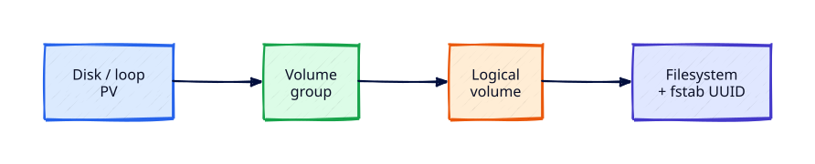

# Server Storage — LVM and fstab

## Overview

App servers outgrow their root disk. **LVM** (Logical Volume Manager) lets you pool disks, grow filesystems online, and keep mount configuration durable via **`/etc/fstab`**. Mistakes here cause boot failures — so labs use a **file-backed loop device** instead of risking the system disk.

This tutorial creates a PV/VG/LV, formats and mounts it, adds a UUID fstab entry, extends the volume, and cleans up safely.

This is **Tutorial 24** in **Module 7: Advanced Linux Servers**.

## Prerequisites

- Complete [Disk and Filesystem Management](disk-and-filesystem-management.md)
- `sudo` on Ubuntu with `lvm2` packages available
- ~1 GB free under `/var/tmp` for the loop file

## Learning Objectives

By the end of this tutorial, you will be able to:

- [ ] Explain PV, VG, and LV roles
- [ ] Create an LVM stack on a loop-backed disk for safe practice
- [ ] Mount by UUID and persist via `/etc/fstab`
- [ ] Extend a logical volume and filesystem
- [ ] Recover from a bad fstab entry without panic

## Architecture

Physical (or loop) disk → PV → VG → LV → filesystem → fstab UUID mount.



## Theory

### LVM layers

| Layer | Object | Tools |
|-------|--------|-------|
| Physical Volume | Disk/partition | `pvcreate`, `pvs` |
| Volume Group | Pool of PVs | `vgcreate`, `vgs` |
| Logical Volume | Allocated slice | `lvcreate`, `lvs` |

Extend by adding free extents to the LV, then growing the filesystem (`resize2fs` for ext4).

### fstab essentials

Columns: device, mount point, type, options, dump, pass.

Prefer **UUID=** over `/dev/sdX` names that can reorder. Use `nofail` or `x-systemd.device-timeout=` carefully on non-critical mounts so a missing disk does not block boot forever.

### Boot failure pattern

A typo in fstab can drop you to emergency mode. Fix from rescue with `mount -o remount,rw /` and edit fstab, or comment the bad line.


### Naming conventions

Use clear VG/LV names: `app_vg/data_lv`, `db_vg/pg_lv`. Avoid generic `vg0/lv0` in multi-tenant hosts. Tag cloud volumes with the same names as VGs so night operators can correlate console UI with `vgs`.

### Thin provisioning caution

Thin pools save space but add monitoring complexity (data/metadata full = write failures). Prefer thick LVs until you have alerting on thin pool usage.


## Hands-on Lab

### Step 1 – Install LVM tools and create loop file

```bash
sudo apt update
sudo apt install -y lvm2
sudo mkdir -p /var/tmp/rebash-lvm
sudo fallocate -l 1G /var/tmp/rebash-lvm/disk.img
sudo losetup -fP /var/tmp/rebash-lvm/disk.img
LOOP=$(losetup -j /var/tmp/rebash-lvm/disk.img | cut -d: -f1)
echo "LOOP=$LOOP"
```

**Expected output:** A `/dev/loopN` path printed.

### Step 2 – PV, VG, LV

```bash
LOOP=$(losetup -j /var/tmp/rebash-lvm/disk.img | cut -d: -f1)
sudo pvcreate "$LOOP"
sudo vgcreate rebash_vg "$LOOP"
sudo lvcreate -n data_lv -L 512M rebash_vg
sudo lvs
sudo vgs
```

**Expected output:** `data_lv` in `rebash_vg` with ~512 MiB.

### Step 3 – Filesystem and mount

```bash
sudo mkfs.ext4 /dev/rebash_vg/data_lv
sudo mkdir -p /mnt/rebash-data
sudo mount /dev/rebash_vg/data_lv /mnt/rebash-data
df -h /mnt/rebash-data
echo 'hello-lvm' | sudo tee /mnt/rebash-data/proof.txt
```

**Expected output:** Mount shows ~512 MB; proof file written.

### Step 4 – UUID fstab entry

```bash
UUID=$(sudo blkid -s UUID -o value /dev/rebash_vg/data_lv)
echo "UUID=$UUID"
echo "UUID=$UUID /mnt/rebash-data ext4 defaults,nofail 0 2" | sudo tee /etc/fstab.rebash-lab-line
# Append once
grep -q "$UUID" /etc/fstab || echo "UUID=$UUID /mnt/rebash-data ext4 defaults,nofail 0 2" | sudo tee -a /etc/fstab
sudo findmnt --verify
sudo umount /mnt/rebash-data
sudo mount -a
cat /mnt/rebash-data/proof.txt
```

**Expected output:** `findmnt --verify` clean (or warnings understood); proof file readable after `mount -a`.

### Step 5 – Extend LV

```bash
sudo lvextend -L +200M /dev/rebash_vg/data_lv
sudo resize2fs /dev/rebash_vg/data_lv
df -h /mnt/rebash-data
```

**Expected output:** Capacity increases (~700 MB class); filesystem grows online.

### Step 6 – Cleanup (important)

```bash
sudo umount /mnt/rebash-data || true
# Remove lab fstab line
UUID=$(sudo blkid -s UUID -o value /dev/rebash_vg/data_lv 2>/dev/null || true)
if [ -n "$UUID" ]; then
  sudo sed -i "\|UUID=$UUID /mnt/rebash-data|d" /etc/fstab
fi
sudo lvremove -y /dev/rebash_vg/data_lv || true
sudo vgremove -y rebash_vg || true
LOOP=$(losetup -j /var/tmp/rebash-lvm/disk.img | cut -d: -f1 || true)
[ -n "$LOOP" ] && sudo pvremove -y "$LOOP" || true
[ -n "$LOOP" ] && sudo losetup -d "$LOOP" || true
sudo rm -rf /var/tmp/rebash-lvm
sudo findmnt --verify || true
```

**Expected output:** Lab VG/LV gone; fstab lab line removed; system mounts healthy.

## Validation

| Check | Pass criteria |
|-------|----------------|
| LVM created | `lvs` showed data_lv during lab |
| fstab | UUID mount worked with `mount -a` |
| Extend | `df` grew after `lvextend` + `resize2fs` |
| Cleanup | No leftover rebash_vg; fstab clean |

## Code Walkthrough

| Command | Description |
|---------|-------------|
| `pvcreate` / `vgcreate` / `lvcreate` | Build LVM stack |
| `mkfs.ext4` | Create filesystem on LV |
| `blkid` | Read UUID for fstab |
| `lvextend` + `resize2fs` | Grow volume and ext4 |

## Code Examples

```bash
sudo pvs; sudo vgs; sudo lvs
lsblk -f
```

## Security Considerations

Encrypt sensitive data volumes (LUKS) in production; restrict who can `lvremove`; backup before destructive LVM ops; never experiment on the root PV without snapshots/backups.

## Common Mistakes

| Mistake | Why it hurts | Fix |
|---------|--------------|-----|
| fstab device `/dev/sdX` | Name changes on reboot | Use UUID/LABEL |
| Forgetting resize2fs | LV grows, FS does not | Always grow FS |
| Leaving bad fstab | Emergency mode | `nofail` for data disks; test `mount -a` |
| Skipping cleanup | Ghost loop devices | Detach losetup; remove fstab lines |

## Best Practices

1. Practise on loop devices before touching cloud data disks
2. Document VG naming (`app_vg`, `db_vg`)
3. Monitor thin pools / free VG space
4. Align backup jobs with volume layout
5. Test restore of data on a separate LV

## Troubleshooting

| Symptom | Likely cause | Resolution |
|---------|--------------|------------|
| Boot emergency | Bad fstab | Rescue, comment line, `systemctl default` |
| resize2fs fails | Unmounted ext needing different flow | Follow ext4 grow rules; check `man resize2fs` |
| PV not found | Loop detached | Recreate losetup before pv ops |
| Permission denied | Not root | Use sudo |

## Summary

You built, mounted, persisted, extended, and destroyed an LVM volume safely — the storage skill behind growing app servers.

## Interview Questions

**Q1 — Why LVM instead of a raw partition?**

*Sample answer:* Flexible growth, pooling multiple disks, snapshots (where used), and easier reorganisation.

**Q2 — Why UUID in fstab?**

*Sample answer:* Kernel device names can reorder; UUIDs stay stable.

**Q3 — Steps to grow an ext4 LV online?**

*Sample answer:* `lvextend` then `resize2fs` on the mounted filesystem (ext4 supports online growth).

**Q4 — How do you avoid boot hangs on optional data disks?**

*Sample answer:* `nofail` and systemd mount timeouts; keep root mounts strict.

**Q5 — What is a volume group?**

*Sample answer:* A pool of one or more PVs from which LVs are carved.

## Related Tutorials

- Previous: [TLS Certificates on Linux Servers](tls-certificates-on-linux-servers.md)
- Next: [Backup, Restore, and Recovery Drills](backup-restore-and-recovery-drills.md)
- [Disk and Filesystem Management](disk-and-filesystem-management.md)
- [Troubleshooting Linux Systems](troubleshooting-linux-systems.md)

## References

1. [LVM HOWTO](https://tldp.org/HOWTO/LVM-HOWTO/)
2. [fstab(5)](https://manpages.debian.org/fstab.5)
3. [Ubuntu LVM](https://ubuntu.com/server/docs/storage-lvm)
