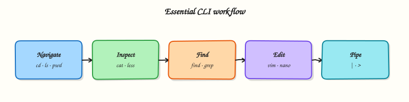

# Shell Scripting Fundamentals

## Overview

“Write a small script” sounds scary until you see it is mostly **saved commands** with safety rails. Good **Bash** habits surface errors early instead of hiding them on production hosts.

**Plain problem:** A midnight cron script fails silently — no `set -e`, errors swallowed, exit code always 0. Monitoring thinks all is well. Good scripts **fail loudly** and leave evidence.

This page teaches the **operations minimum**: shebang, **`set -euo pipefail`**, arguments, exit codes, and readable output. Full Bash curriculum lives in the [Shell Scripting](../shell/index.md) track.

This is a **Command Line** tutorial in the REBASH Academy **Linux for Cloud & DevOps Engineers** series.

## Prerequisites

- Ubuntu practice VM or WSL2
- [Essential Linux Commands](essential-linux-commands.md)
- Text editor (nano, vim, or VS Code)

## Learning Objectives

By the end of this tutorial, you will be able to:

- [ ] Explain what a shell script is in plain language
- [ ] Write a script with shebang and safe mode flags
- [ ] Use positional arguments (`$1`, `$#`) and exit codes
- [ ] Build a small **host-check** script that fails clearly
- [ ] Break a script on purpose and fix it
- [ ] Answer fresher interview questions on Bash scripting basics

## Architecture

You write a text file → mark executable → shell reads lines top to bottom → each command returns an exit code → caller (cron/systemd/human) sees success or failure.



## Theory

### The problem (before any jargon)

Team script:

```bash
grep ERROR /var/log/app.log
echo "check done"
```

Log missing → grep fails → without `set -e` script continues → “check done” anyway → false green status.

### What is a shell script? (simple words)

**Analogy:** A **recipe card** for the shell — step 1, step 2, same every time. **Bash** is the cook reading the card.

First line **shebang** picks the interpreter:

```bash
#!/usr/bin/env bash
```

**Interview line:** “I start ops scripts with `set -euo pipefail` so failures stop the script and unset variables error.”

### Safe mode — set -euo pipefail

| Flag | Meaning |
|------|---------|
| `-e` | Exit on first command failure |
| `-u` | Error on unset variables |
| `-o pipefail` | Pipeline fails if any command fails |

### Arguments and exit codes

``` {.bash .ra-terminal title="Terminal"}
echo "First arg: ${1:-none}"
exit 0   # success
exit 1   # generic failure
```

**`$?`** holds last exit code. Cron and systemd use it for success/failure.

### Common pitfalls

- No shebang → wrong shell on cron
- Unquoted variables breaking on spaces
- Parsing `ls` output (use `find` or globs)
- Missing `chmod +x`

## Hands-on Lab

### Objective

Build **`host-check.sh`** with safe modes, arguments, intentional **break**, **fix**, and evidence under `~/rebash-linux/lab-shell`.

### Prerequisites

| Item | Notes |
|------|--------|
| Ubuntu VM | bash |
| Lab only | Script checks local disk |

### Lab environment

``` {.bash .ra-terminal title="Terminal"}
mkdir -p ~/rebash-linux/lab-shell && cd ~/rebash-linux/lab-shell
```

### Real-world scenario

Mentor: “Give me a script I can run from cron that checks root disk usage and exits non-zero if above a threshold — must not hide errors.”

### Step-by-step tasks

#### Task 1 – host-check.sh (working version)

Create `host-check.sh`:

```bash title="host-check.sh"
#!/usr/bin/env bash
set -euo pipefail

THRESH="${1:-90}"
LOG="${HOME}/rebash-linux/lab-shell/host-check.log"
MOUNT="/"

usage="$(df -P "$MOUNT" | awk 'NR==2 {print $5}' | tr -d '%')"
{
  echo "=== $(date -Is) ==="
  echo "mount=$MOUNT usage_percent=$usage threshold=$THRESH"
} >> "$LOG"

if [[ "$usage" -ge "$THRESH" ]]; then
  echo "FAIL: disk usage ${usage}% >= ${THRESH}%" >&2
  exit 2
fi
echo "OK: disk usage ${usage}%"
exit 0
```

``` {.bash .ra-terminal title="Terminal"}
cd ~/rebash-linux/lab-shell
chmod +x host-check.sh
./host-check.sh 90 | tee run-ok.txt
grep -q '^OK:' run-ok.txt
tail -3 host-check.log | tee log-ok-tail.txt
echo $? | tee exit-code-ok.txt
```

!!! example "Expected output"
    `OK: disk usage …` printed; exit code 0; log appended.


#### Task 2 – Break (disable -e), observe silent failure

Create `host-check-broken.sh`:

```bash title="host-check-broken.sh"
#!/usr/bin/env bash
# intentionally missing set -e for lab break demo
THRESH="${1:-90}"
false
echo "This line should not run if -e were enabled"
exit 0
```

``` {.bash .ra-terminal title="Terminal"}
cd ~/rebash-linux/lab-shell
chmod +x host-check-broken.sh
./host-check-broken.sh; echo "exit=$?" | tee broken-exit.txt
grep -q 'exit=0' broken-exit.txt
echo "break: script reported success after false command" | tee break-notes.txt
```

!!! example "Expected output"
    Broken script prints misleading success line; `exit=0` despite `false` — demonstrates why `-e` matters.


#### Task 3 – Fix threshold test and prove non-zero exit

``` {.bash .ra-terminal title="Terminal"}
cd ~/rebash-linux/lab-shell
./host-check.sh 0; echo "exit=$?" | tee fail-threshold-exit.txt || true
grep -q 'exit=2' fail-threshold-exit.txt
./host-check.sh 90 | tee run-after-fix.txt
echo "lab-shell OK" | tee evidence.txt
```

!!! example "Expected output"
    Threshold 0 forces FAIL exit code 2 (disk always >= 0%). Normal threshold returns OK again.


### Validation steps

- [ ] `host-check.sh` uses shebang and `set -euo pipefail`
- [ ] Broken script demonstrates silent failure without `-e`
- [ ] Exit codes 0 vs 2 verified
- [ ] Log file receives timestamped entries

### Common errors and fixes

| Error | Cause | Fix |
|-------|-------|-----|
| `Permission denied` | Not executable | `chmod +x script.sh` |
| `bad interpreter` | Windows CRLF line endings | `dos2unix script.sh` |
| Unbound variable | `-u` and missing arg | `${1:-default}` |
| Pipeline wrong status | Missing pipefail | `set -o pipefail` |

### Challenge exercise

Add a second check: fail if `loadavg` first field > 10 (use `uptime` or `/proc/loadavg`) — keep script under 40 lines.

### Learning outcomes

- You wrote a production-shaped mini script
- You saw why safe modes matter
- You can discuss exit codes in interviews

### Cleanup

``` {.bash .ra-terminal title="Terminal"}
# Keep scripts and logs for revision
```

## Validation

- [ ] Evidence under `~/rebash-linux/lab-shell`
- [ ] Can explain `set -euo pipefail` in one sentence each
- [ ] Ready for environment variables tutorial next

## Code Walkthrough

1. **`#!/usr/bin/env bash`** — portable shebang finding bash on PATH.
2. **`${1:-90}`** — default threshold if no argument — avoids unset with `-u`.
3. **`df -P` + awk** — predictable parsing; avoid bare `df` locale surprises.
4. **`exit 2`** — distinct code for disk threshold vs generic 1.
5. **Broken script without `-e`** — intentional anti-pattern for learning.

## Security Considerations

- Quote variables: `"$LOG"` prevents word splitting/injection.
- Do not run curl|bash; review scripts before cron as root.
- Restrict script write permissions — attackers replace your script.
- Avoid secrets in scripts; use env files with tight permissions.
- Validate arguments (`[[ "$THRESH" =~ ^[0-9]+$ ]]`) before use.

## Common Mistakes

!!! warning "No set -e on ops scripts"
    Failures cascade silently — always use safe modes unless you handle each error.

!!! warning "Unquoted $variables"
    Filenames with spaces break scripts; quoting is mandatory.

!!! warning "Ignoring exit codes in cron"
    Cron only emails on failure if exit non-zero — return meaningful codes.

## Best Practices

- Log timestamp + result on every run
- Use meaningful exit codes (document in header comment)
- Absolute paths for cron-invoked scripts
- ShellCheck scripts in CI when possible
- Keep scripts small; complex logic → proper language + tests

## Troubleshooting

| Symptom | Likely cause | Fix |
|---------|--------------|-----|
| Script empty output | Redirected stderr | Check `>&2` for errors |
| Works manual, not cron | PATH/env | Full paths; see env tutorial |
| Syntax error near `fi` | Missing then/if | `bash -n script.sh` |
| Wrong disk reported | Wrong mount arg | Pass `$MOUNT` explicitly |

## Summary

A **shell script** is repeatable automation for Linux ops. Start with **shebang** and **`set -euo pipefail`**, use **arguments** and meaningful **exit codes**, log evidence, and never ship the broken “always exit 0” pattern from the lab break task.

## Interview Questions

**1. What is the shebang line for?**

??? success "Reveal answer"
    First line `#!/usr/bin/env bash` tells the OS which interpreter runs the file when executed directly. Ensures bash features and consistent behaviour in cron/systemd.

**2. What does set -euo pipefail do?**

??? success "Reveal answer"
    **-e** exit on command failure; **-u** treat unset variables as error; **-o pipefail** pipeline fails if any stage fails. Together they stop silent partial failures in ops scripts.

**3. Why do exit codes matter for cron and systemd?**

??? success "Reveal answer"
    Scheduler uses exit code to detect success/failure (alerts, unit state). Always returning 0 hides problems; use non-zero for real failures.

**4. How do you pass arguments to a script?**

??? success "Reveal answer"
    Positional parameters: `$1`, `$2`, … `$#` is count, `$@` all args. Use `"$1"` quoted. Defaults: `${1:-default}`.

**5. Script works interactively but not in cron — why?**

??? success "Reveal answer"
    Different **PATH**, working directory, and environment; cron may not load `.bashrc`. Use absolute paths, set env in crontab or unit, log to known file.

**6. What is pipefail and give an example?**

??? success "Reveal answer"
    Without **pipefail**, `false | true` exits 0 (last command). With **pipefail**, pipeline exits non-zero if `false` fails — critical when grepping logs: `grep pattern file | mail` should fail if grep finds nothing (depending on intent).

**7. How do you syntax-check a script without running it?**

??? success "Reveal answer"
    `bash -n script.sh` — parse only. Also **ShellCheck** static analyser. Run as non-root in staging before production cron.

## Related Tutorials

- Next: [Environment Variables and Shell Configuration](environment-variables-shell-config.md)
- Previous: [Essential Linux Commands](essential-linux-commands.md)
- Deeper: [Shell Scripting](../shell/index.md) course

## References

- [Bash manual](https://www.gnu.org/software/bash/manual/)
- [ShellCheck](https://www.shellcheck.net/)
- [Google shell style guide](https://google.github.io/styleguide/shellguide.html)
