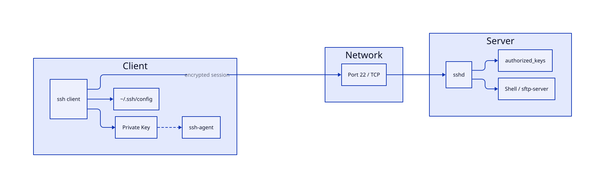

# SSH and Remote Administration

## Overview

SSH (Secure Shell) is the standard transport for remote Linux administration, file transfer, Git operations, and tunneling application ports. Password authentication is brittle and brute-forceable; **key-based authentication** with a hardened `sshd_config` is the production baseline.

This tutorial covers generating Ed25519 keys, organizing multi-host workflows with `~/.ssh/config`, transferring files with `scp` and `sftp`, hardening the SSH server, and understanding why **agent forwarding** is powerful but dangerous.

This is **Module 5, Tutorial 11** in the REBASH Academy Linux series.

## Prerequisites

- [Shell Scripting Fundamentals](shell-scripting-fundamentals.md) — environment variables and file permissions
- [User and Group Management](user-and-group-management.md) — users, home directories, `sudo`
- Two Linux systems (or one system connecting to `localhost`) for lab exercises
- OpenSSH client and server (`openssh-client`, `openssh-server`)

## Learning Objectives

By the end of this tutorial, you will be able to:

- [ ] Generate and deploy Ed25519 SSH key pairs with correct file permissions
- [ ] Configure `~/.ssh/config` for host aliases, identity files, and jump hosts
- [ ] Transfer files securely with `scp` and interactive `sftp`
- [ ] Harden `sshd_config` (disable root login, disable passwords, limit users)
- [ ] Diagnose connection failures with `ssh -v` and log files
- [ ] Explain the security trade-offs of SSH agent forwarding

## Architecture




## Theory

### How SSH authentication works

1. Client initiates TCP connection to port 22 (or custom port).
2. Server presents host key; client verifies against `~/.ssh/known_hosts`.
3. Client and server negotiate encryption (modern defaults: chacha20-poly1305, AES-GCM).
4. Client authenticates via:
   - **Public key** — server checks `~/.ssh/authorized_keys` on the server
   - **Password** — discouraged in production
   - **Keyboard-interactive / MFA** — often layered on top of keys

The private key never leaves the client. Only the public key is copied to the server.

### Key types and generation

| Algorithm | Key size | Recommendation |
|-----------|----------|----------------|
| Ed25519 | 256-bit | **Preferred** — fast, secure, short keys |
| RSA | 4096-bit | Legacy compatibility |
| ECDSA | 256-bit | Acceptable; prefer Ed25519 for new keys |

Never reuse personal keys for production servers. Use separate keys per environment (lab, staging, prod) with descriptive comments.

### File permissions — non-negotiable

SSH refuses keys with loose permissions:

| Path | Permission |
|------|------------|
| `~/.ssh/` | `700` |
| `~/.ssh/id_ed25519` (private) | `600` |
| `~/.ssh/id_ed25519.pub` (public) | `644` |
| `~/.ssh/config` | `600` |
| `~/.ssh/authorized_keys` | `600` |

### Client configuration (`~/.ssh/config`)

Host blocks simplify daily workflows:

```text
Host prod-web
    HostName 10.0.1.50
    User deploy
    IdentityFile ~/.ssh/prod_ed25519
    Port 2222
```

Supports **ProxyJump** for bastion access: `ProxyJump bastion.example.com`.

### scp vs sftp

Both run over SSH:

- **scp** — fast one-off copies; syntax mirrors `cp`. Being deprecated in favour of `sftp` in some OpenSSH versions; use `scp -O` for legacy protocol if needed.
- **sftp** — interactive session, resumable transfers, scripting with `sftp -b batchfile`.

For automation, consider `rsync -avz -e ssh` for incremental sync.

### Server hardening essentials

Production `sshd_config` baseline:

```text
PermitRootLogin no
PasswordAuthentication no
PubkeyAuthentication yes
AllowUsers deploy admin
MaxAuthTries 3
ClientAliveInterval 300
ClientAliveCountMax 2
```

After changes: `sudo sshd -t && sudo systemctl reload sshd` (or `sshd` on RHEL).

### SSH agent and agent forwarding

**ssh-agent** holds decrypted private keys in memory so you enter the passphrase once.

**Agent forwarding** (`ssh -A` or `ForwardAgent yes`) lets a remote server use your local agent to authenticate further SSH hops (e.g., laptop → bastion → internal server).

!!! danger "Agent forwarding warning"
    If an attacker gains code execution on the intermediate server, they can use your forwarded agent to authenticate as **you** to any server that trusts your key — for the lifetime of the connection. Only enable forwarding to hosts you fully trust, prefer `ProxyJump` over `-A`, and use `AllowAgentForwarding no` on bastions when possible. Consider `ProxyCommand` with `ssh -W` instead.

## Hands-on Lab

### Step 1 – Generate an Ed25519 key pair

```bash
mkdir -p ~/.ssh && chmod 700 ~/.ssh
ssh-keygen -t ed25519 -C "rebash-lab-$(whoami)@$(hostname -s)" \
  -f ~/.ssh/rebash_ed25519 -N ""
ls -la ~/.ssh/rebash_ed25519*
```

**Expected output:** `-rw-------` private key and `-rw-r--r--` public key.

View the public key:

```bash
cat ~/.ssh/rebash_ed25519.pub
```

**Expected output:** single line starting with `ssh-ed25519 AAAA...`.

### Step 2 – Install public key for local login

```bash
cat ~/.ssh/rebash_ed25519.pub >> ~/.ssh/authorized_keys
chmod 600 ~/.ssh/authorized_keys
```

Test key-based login to localhost:

```bash
ssh -i ~/.ssh/rebash_ed25519 -o BatchMode=yes localhost 'echo SSH key auth OK'
```

**Expected output:** `SSH key auth OK`

### Step 3 – Configure SSH client

```bash
cat >> ~/.ssh/config << 'EOF'

Host lab-local
    HostName localhost
    User YOUR_USER
    IdentityFile ~/.ssh/rebash_ed25519
    StrictHostKeyChecking accept-new
EOF
chmod 600 ~/.ssh/config
```

Replace `YOUR_USER` with your username, then:

```bash
ssh lab-local 'hostname && whoami'
```

**Expected output:** localhost hostname and your username.

### Step 4 – Verbose debugging

Simulate a failed connection to see diagnostics:

```bash
ssh -vvv -i ~/.ssh/nonexistent_key localhost 2>&1 | tail -15
```

**Expected output:** debug lines showing key load failure and authentication methods tried.

Successful verbose tail:

```bash
ssh -v lab-local true 2>&1 | grep -E 'Authenticated|Offering'
```

**Expected output:** lines mentioning `Offering public key` and `Authenticated`.

### Step 5 – scp file transfer

```bash
echo "deploy artifact v1" > /tmp/rebash_deploy.txt
scp -i ~/.ssh/rebash_ed25519 /tmp/rebash_deploy.txt lab-local:/tmp/
ssh lab-local 'cat /tmp/rebash_deploy.txt'
```

**Expected output:** `deploy artifact v1` printed from remote `/tmp/`.

Copy directory recursively:

```bash
mkdir -p /tmp/rebash_dir && echo "nested" > /tmp/rebash_dir/nested.txt
scp -r -i ~/.ssh/rebash_ed25519 /tmp/rebash_dir lab-local:/tmp/
ssh lab-local 'find /tmp/rebash_dir -type f'
```

**Expected output:** `/tmp/rebash_dir/nested.txt`

### Step 6 – sftp interactive session

```bash
sftp -i ~/.ssh/rebash_ed25519 lab-local << 'EOF'
pwd
ls /tmp/rebash_deploy.txt
get /tmp/rebash_deploy.txt /tmp/downloaded_deploy.txt
bye
EOF
cat /tmp/downloaded_deploy.txt
```

**Expected output:** remote working directory, file listing, then `deploy artifact v1` from downloaded copy.

### Step 7 – Inspect and harden sshd (requires sudo)

Review current effective settings:

```bash
sudo sshd -T | grep -E 'permitrootlogin|passwordauthentication|pubkeyauthentication|allowusers'
```

**Expected output:** current server values (varies by distro).

Recommended hardening snippet (review before applying):

```bash
sudo cp /etc/ssh/sshd_config /etc/ssh/sshd_config.bak.$(date +%F)
sudo sed -i 's/^#*PermitRootLogin.*/PermitRootLogin no/' /etc/ssh/sshd_config
sudo sed -i 's/^#*PasswordAuthentication.*/PasswordAuthentication no/' /etc/ssh/sshd_config
sudo sshd -t && sudo systemctl reload ssh 2>/dev/null || sudo systemctl reload sshd
```

Verify syntax test passes (no output = success).

!!! warning "Keep an active session open"
    When hardening SSH, keep your current terminal connected. Test a **new** session before closing the old one to avoid lockout.

### Step 8 – Agent forwarding demonstration and risk

Start agent and add key:

```bash
eval "$(ssh-agent -s)"
ssh-add ~/.ssh/rebash_ed25519 2>/dev/null
ssh-add -l
```

**Expected output:** key fingerprint listed.

Connect with forwarding and check remote socket:

```bash
ssh -A lab-local 'echo AGENT=$SSH_AUTH_SOCK; ssh-add -l 2>&1 | head -1'
```

**Expected output:** non-empty `AGENT=` path and your key fingerprint visible on the **remote** side — demonstrating why a compromised remote host can abuse your agent.

Disable forwarding in config for untrusted hosts:

```text
Host untrusted-*
    ForwardAgent no
    IdentityFile ~/.ssh/rebash_ed25519
```

## Validation

Confirm the lab before moving on:

1. Re-run the critical commands from the Hands-on Lab and compare them to the expected output in each step.
2. Check that you can explain *why* each successful result matters (not only that it printed).
3. Note any warnings or unexpected output — resolve them using Troubleshooting before continuing.

| Check | Pass criteria |
|-------|----------------|
| Key auth | SSH login with key succeeds to the lab host |
| Config | `sshd_config` hardening settings match the lab (password off if required) |
| Agent | Agent/`ssh-add` behaviour matches steps |
| Cleanup | Lab-only keys and config snippets removed or documented |

## Code Walkthrough

| Command | Description |
|---------|-------------|
| `ssh-keygen -t ed25519` | Generate Ed25519 key pair |
| `ssh-keygen -lf FILE.pub` | Show fingerprint of public key |
| `ssh-copy-id -i KEY.pub user@host` | Install public key on remote server |
| `ssh user@host 'command'` | Run remote command non-interactively |
| `ssh -i KEY user@host` | Specify identity (private key) file |
| `ssh -p PORT user@host` | Connect to non-default port |
| `ssh -v / -vv / -vvv` | Verbose debug output (more v = more detail) |
| `ssh -A user@host` | Enable agent forwarding (use cautiously) |
| `ssh -J bastion user@host` | Jump through bastion (ProxyJump) |
| `scp FILE user@host:/path` | Copy file to remote |
| `scp -r DIR user@host:/path` | Copy directory recursively |
| `sftp user@host` | Interactive SFTP session |
| `ssh-add KEY` | Add private key to ssh-agent |
| `ssh-add -l` | List keys loaded in agent |
| `sshd -T` | Dump effective server configuration |

## Code

### SSH config template for multi-environment ops

```bash
# ~/.ssh/config

Host *
    AddKeysToAgent yes
    IdentitiesOnly yes
    ServerAliveInterval 60

Host bastion
    HostName bastion.example.com
    User jump
    IdentityFile ~/.ssh/corp_ed25519

Host prod-*
    User deploy
    IdentityFile ~/.ssh/prod_ed25519
    ProxyJump bastion
    ForwardAgent no

Host staging-*
    User deploy
    IdentityFile ~/.ssh/staging_ed25519
    ForwardAgent no
```

### Batch sftp upload script

```bash
#!/bin/bash
set -euo pipefail

HOST="${1:?usage: sftp_upload.sh HOST LOCAL_FILE REMOTE_PATH}"
LOCAL="${2:?}"
REMOTE="${3:?}"

sftp -b - "$HOST" <<EOF
put $LOCAL $REMOTE
ls -l $REMOTE
EOF
```

## Security Considerations

- Disable password authentication and root login once key-based access works (`PasswordAuthentication no`, `PermitRootLogin no`)
- Use ed25519 keys with passphrases; store private keys outside shared filesystems
- Restrict `AllowUsers` / `AllowGroups` and use `Match` blocks for jump hosts
- Prefer short-lived certificates or hardware-backed keys for production bastions
- Log and alert on failed SSH attempts; fail2ban or equivalent rate-limits reduce brute force noise

## Common Mistakes

!!! warning "Private key permissions too open"
    SSH ignores keys with group/world read. Fix with `chmod 600 ~/.ssh/id_ed25519`.

!!! warning "Enabling agent forwarding globally"
    `ForwardAgent yes` in `Host *` exposes your agent on every server you touch. Enable per trusted host only.

!!! warning "Editing sshd_config without syntax test"
    A typo locks everyone out. Always run `sudo sshd -t` before reload.

!!! warning "Copying the private key to the server"
    Only the **public** key goes in `authorized_keys`. Never upload, email, or store private keys on shared drives unencrypted.

## Best Practices

!!! tip "Use Ed25519 keys with per-environment separation"
    Comment keys clearly: `ssh-keygen -C "shaik@laptop-prod-2026"`.

!!! tip "Prefer ProxyJump over agent forwarding"
    `ssh -J bastion internal` authenticates hop-by-hop without exposing your agent socket on the bastion.

!!! tip "Audit authorized_keys regularly"
    Remove keys for departed team members. Each line is one trusted key — no comments needed for identification if you use key comments.

!!! tip "Use fail2ban or cloud firewall rules"
    Rate-limit port 22 at the network edge; combine with key-only auth for defense in depth.

## Troubleshooting

| Issue | Cause | Solution |
|-------|-------|----------|
| `Permission denied (publickey)` | Key not in `authorized_keys`, wrong permissions, wrong user | Verify pubkey on server; check `~/.ssh` perms; use `-i` correct key |
| `WARNING: REMOTE HOST IDENTIFICATION HAS CHANGED` | Server rebuilt or MITM | Verify out-of-band; remove old entry from `known_hosts` |
| `Connection refused` | sshd not running or firewall | `sudo systemctl status ssh`; check security groups / `ufw` |
| `Too many authentication failures` | Client offers too many keys | Use `IdentitiesOnly yes` and `-i` specific key |
| `ssh: connect to host port 22: Connection timed out` | Network ACL, wrong IP, sshd on different port | Verify IP, route, and `-p` port |
| Agent forwarding not working | `AllowAgentForwarding no` on server | Enable only if justified; prefer ProxyJump |
| scp fails on special files | scp protocol limitations | Use `rsync -e ssh` or tar over ssh |

## Summary

- SSH encrypts remote administration and file transfer; **Ed25519 key pairs** replace password auth in production.
- Correct permissions on `~/.ssh` and keys are enforced by OpenSSH — not optional.
- `~/.ssh/config` scales multi-host workflows with aliases, identity files, and ProxyJump for bastions.
- `scp` and `sftp` move files over the same encrypted channel; choose based on interactive vs scripted needs.
- Harden `sshd`: no root login, no passwords, limit `AllowUsers`, test with `sshd -t` before reload.
- **Agent forwarding** (`-A`) is convenient but dangerous on untrusted hosts — an attacker can pivot using your credentials.

## Interview Questions

1. Why is Ed25519 preferred over RSA 2048 for new SSH keys?
2. What permissions must `~/.ssh/authorized_keys` and the private key file have?
3. Explain the difference between `scp` and `sftp`. When would you use each?
4. What does `PermitRootLogin no` accomplish, and what is the safer alternative for admin tasks?
5. What is `ProxyJump`, and how does it differ from agent forwarding?
6. Why is agent forwarding considered a security risk? Describe an attack scenario.
7. How would you debug a `Permission denied (publickey)` error?
8. What happens when a server's host key changes and you reconnect?
9. What is the purpose of `IdentitiesOnly yes` in SSH config?
10. How do you validate `sshd_config` changes before applying them to avoid lockout?

## Related Tutorials

- [Linux – Category Overview](index.md)
- [Shell Scripting Fundamentals](shell-scripting-fundamentals.md) *(previous)*
- [Remote systemd Service Control](remote-systemd-services.md) *(next)*
- [Linux Security Hardening Basics](linux-security-hardening-basics.md)
- [Learning Paths – DevOps Engineer](../learning-paths/index.md)
- Cheat sheet: [Linux Cheat Sheet](../cheatsheets/linux.md)
- Interview prep: [Linux Interview Prep](../interview/linux.md)
- Learning path: [DevOps Engineer](../learning-paths/devops-engineer.md)

## References

- [OpenSSH manual pages](https://man.openbsd.org/ssh.1)
- [OpenSSH sshd_config documentation](https://man.openbsd.org/sshd_config)
- [NIST SP 800-63B — authentication guidance](https://pages.nist.gov/800-63-3/sp800-63b.html)
- [Mozilla OpenSSH security guidelines](https://infosec.mozilla.org/guidelines/openssh)
- [REBASH Academy – Linux Overview](index.md)
