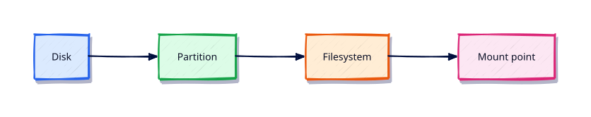

# Storage — Disks, Partitions, and Filesystems

## Overview

Attaching an EBS/Azure disk is useless until you partition, format, mount, and persist it.

This is **Tutorial 12** in **Module 8: Storage Management** of the REBASH Academy **Linux for Cloud & DevOps Engineers** series — written for administrators, DevOps engineers, SREs, and platform engineers operating production Linux.

## Prerequisites

- systemd Targets, Timers, and Boot
- Terminal access with a regular user account (sudo where noted)

## Learning Objectives

By the end of this tutorial, you will be able to:

- [ ] Apply the core ideas of “Storage — Disks, Partitions, and Filesystems” on a real Linux host
- [ ] Use modern tools (`ip`/`ss`, `systemctl`/`journalctl`) where they apply
- [ ] Complete the lab under `~/rebash-linux/` with clear outputs
- [ ] Relate this topic to Cloud, DevOps, and production operations
- [ ] Explain the failure modes you would check first in an incident

## Architecture

Linux ops work sits between humans/automation and the kernel, services, and network. This topic’s control points are shown below.



## Theory

### Discover — lsblk

```bash
lsblk -f
lsblk -o NAME,SIZE,TYPE,FSTYPE,MOUNTPOINT,UUID
```

### Partition — fdisk and parted

```bash
sudo fdisk -l
# sudo fdisk /dev/sdX     # interactive — lab VMs only
# sudo parted /dev/sdX print
```

GPT is standard for modern cloud disks. Always confirm the device name — wrong disk destroys data.

### Filesystems — mkfs

```bash
# sudo mkfs.ext4 /dev/sdX1
# sudo mkfs.xfs /dev/sdX1
```

Choose ext4 (ubiquitous) or XFS (common on RHEL large volumes). Record UUID from `blkid`.

### mount and umount

```bash
sudo mount UUID=... /mnt/data
findmnt /mnt/data
sudo umount /mnt/data
```

Persist via `/etc/fstab` or systemd `.mount` units. Use `nofail` for secondary data disks on cloud images so boot continues if the volume is detached.

## Hands-on Lab

Create a workspace for this tutorial.

```bash
mkdir -p ~/rebash-linux/lab12 && cd ~/rebash-linux/lab12
```

**Focus:** map lsblk; practise mount options on a loop file; draft fstab line

### Step 1 – Skeleton

```bash
cat > lab.sh << 'EOF'
#!/usr/bin/env bash
set -euo pipefail
echo "lab12 storage-disks-partitions-and-filesystems on $(hostname -s)"
EOF
chmod +x lab.sh
./lab.sh
```

### Step 2 – Loopback filesystem drill

```bash
lsblk -f | tee lsblk.txt
dd if=/dev/zero of=disk.img bs=1M count=64 status=none
mkfs.ext4 -F disk.img
mkdir -p mnt
sudo mount -o loop disk.img mnt
echo hello | sudo tee mnt/hello.txt
findmnt mnt | tee mount.txt
sudo umount mnt
blkid disk.img | tee blkid.txt || true
```

### Final step – Cleanup note

```bash
./lab.sh
# keep ~/rebash-linux for later labs
```

## Validation

- [ ] Lab commands run under `~/rebash-linux/lab12/`
- [ ] You can explain each Theory bullet in your own words
- [ ] You used modern tooling where applicable (`ip`/`ss`, `systemctl`/`journalctl`)
- [ ] You can describe one production failure mode for this topic

## Code Walkthrough

Production Linux practice for **Storage — Disks, Partitions, and Filesystems** always combines:

1. Inspect before you change (`status`, `df`, `ip`, logs)
2. Prefer reversible, documented changes (config management, drop-ins)
3. Capture evidence (command output, journal snippets) for handovers
4. Prefer `systemctl`/`journalctl` and `ip`/`ss` over legacy tools
5. Least privilege — escalate with `sudo` only when required

Keep runbooks short enough to follow at 03:00. Automate the boring checks; keep humans for judgement.

## Security Considerations

- Treat host access and sudo as privileged — audit who can do what
- Never paste secrets into shell history, tickets, or screenshots
- Validate device names and paths before destructive disk or `rm` operations
- Prefer key-based SSH and deny password auth on internet-facing hosts
- Collect logs centrally; restrict who can read authentication and audit trails

## Common Mistakes

!!! warning "Using legacy networking tools by default"
    `ifconfig`/`netstat` are missing or incomplete on modern images. **Fix:** use `ip` and `ss`.

!!! warning "Editing vendor unit files in place"
    Package upgrades overwrite `/lib/systemd/system`. **Fix:** `systemctl edit` drop-ins under `/etc`.

!!! warning "Trusting df without checking inodes and mounts"
    A full `/var` or exhausted inodes looks different from root. **Fix:** `df -h`, `df -i`, and `findmnt`.

## Best Practices

- Golden images + config as code over snowflake hosts
- Alert on symptoms (failed units, disk, load) with runbooks attached
- Time-sync (chrony) everywhere — logs and TLS depend on it
- Separate OS and data volumes on Cloud VMs
- Practise restore and rescue paths before you need them

## Troubleshooting

| Symptom | Likely cause | Fix |
|---------|--------------|-----|
| Permission denied | Mode/owner/ACL/MAC | `namei -l`, `id`, `getfacl`, SELinux/AppArmor logs |
| No route / timeout | Routing, DNS, firewall | `ip route`, `dig`, `ss`, security groups |
| Service won’t start | Unit/config/deps | `systemctl status`, `journalctl -u`, config `-t` |
| Disk full | Logs, containers, deleted-open | `df`/`du`, `lsof +L1`, rotate/expand |
| High load | CPU, I/O wait, thrash | `vmstat`, `iostat`, `ps` |

## Summary

**Storage — Disks, Partitions, and Filesystems** is essential for Cloud and DevOps engineers operating Linux hosts. Practise the lab until the inspection path is muscle memory, then continue the track.

## Interview Questions

1. How does this topic show up when operating Cloud VMs or Kubernetes nodes?
2. What would you check first if this area misbehaves in production?
3. Which modern Linux tools replace older equivalents here?
4. What security control should accompany this capability?
5. How would you automate verification of this topic in CI or a cron/timer job?

!!! tip "Sample answer — question 2"
    Start with blast radius and recent changes, then gather host signals (`systemctl --failed`, `df`, `ip`/`ss`, `journalctl`) before making changes. Fix forward with evidence, not guesswork.

## Related Tutorials

- [Linux for Cloud & DevOps – Category Overview](index.md)
- [systemd Targets, Timers, and Boot](systemd-targets-timers-and-boot.md) *(previous)*
- [LVM, Swap, and Disk Monitoring](lvm-swap-and-disk-monitoring.md) *(next)*
- [Learning Paths](../learning-paths/index.md)

## References

- [Linux man-pages project](https://www.kernel.org/doc/man-pages/)
- [systemd documentation](https://systemd.io/)
- [Filesystem Hierarchy Standard](https://refspecs.linuxfoundation.org/FHS_3.0/fhs-3.0.html)
- Track index: [Linux for Cloud & DevOps Engineers](index.md)
