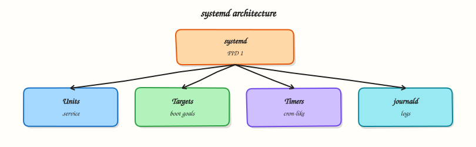

# systemd Services and journalctl

## Overview

Almost every Linux Cloud image uses systemd as PID 1. Service control and journal queries are daily ops.

This is **Tutorial 10** in **Module 7: Services & Boot** of the REBASH Academy **Linux for Cloud & DevOps Engineers** series — written for administrators, DevOps engineers, SREs, and platform engineers operating production Linux.

## Prerequisites

- Process Management
- Terminal access with a regular user account (sudo where noted)

## Learning Objectives

By the end of this tutorial, you will be able to:

- [ ] Apply the core ideas of “systemd Services and journalctl” on a real Linux host
- [ ] Use modern tools (`ip`/`ss`, `systemctl`/`journalctl`) where they apply
- [ ] Complete the lab under `~/rebash-linux/` with clear outputs
- [ ] Relate this topic to Cloud, DevOps, and production operations
- [ ] Explain the failure modes you would check first in an incident

## Architecture

Linux ops work sits between humans/automation and the kernel, services, and network. This topic’s control points are shown below.



## Theory

### What it is

**systemd** is the init system and service manager on most modern Linux distributions. It starts **units** (`.service`, `.socket`, `.timer`, `.mount`, and others), tracks dependencies, places processes in control groups (cgroups), and records structured logs via **journald**. **systemctl** is the primary control interface; **journalctl** queries the journal by unit, boot, priority, and time range.

### Why it matters

If a service will not start after a deploy, or vanished after reboot because it was never enabled, systemd is the control plane you debug. Editing vendor unit files in place loses changes on package upgrade; drop-ins under `/etc` are the supported override path. The journal is often the fastest evidence source during incidents — richer than grepping flat files alone — especially when you filter with `-u` and `--since`.

### How it works

Unit files declare how to start a process (`ExecStart`), user, restart policy, and ordering (`After=`, `Requires=`). Vendor units live under `/lib/systemd/system` (or `/usr/lib`); local units and drop-ins under `/etc/systemd/system`. `systemctl start/stop/restart/reload` affect the running system; `enable`/`disable` control whether the unit is pulled in at boot; `--now` combines enable and start. `systemctl cat` shows the effective unit; `systemctl edit` creates drop-ins safely. journald indexes fields such as `_PID` and `_UID`; persist journals under `/var/log/journal` if you need post-reboot forensics. Harden services with directives such as `ProtectSystem=` and `NoNewPrivileges=` where applicable.

### Key concepts and comparisons

| Action | Effect |
|--------|--------|
| start / stop | Runtime only |
| enable / disable | Boot persistence |
| reload | Re-read config if supported |
| restart | Stop then start |
| edit (drop-in) | Override without touching vendor file |
| mask | Make start impossible (stronger than disable) |

| Query | journalctl example |
|-------|-------------------|
| Unit | `journalctl -u nginx -e` |
| Since | `journalctl --since '1 hour ago'` |
| Priority | `journalctl -p err..alert -b` |
| Follow | `journalctl -f` |

### Common pitfalls

- Editing `/lib/systemd/system` units and losing changes on upgrade.
- Forgetting `daemon-reload` after adding or changing unit files.
- Enabling a unit but never noticing it failed (`systemctl --failed`).
- Assuming the journal is persistent when the host only keeps a volatile journal.
- Using `restart` when `reload` would drain connections more gently.

## Hands-on Lab

Create a workspace for this tutorial.

```bash
mkdir -p ~/rebash-linux/lab10 && cd ~/rebash-linux/lab10
```

**Focus:** inspect units; read journal; create a simple user service

### Step 1 – systemd and journal

```bash
systemctl list-units --type=service --state=running | head | tee services.txt
systemctl status ssh 2>/dev/null || systemctl status sshd 2>/dev/null || true
journalctl -b -p err -n 20 --no-pager 2>/dev/null | tee journal-err.txt || true
mkdir -p ~/.config/systemd/user
cat > ~/.config/systemd/user/rebash-lab.service << 'EOF'
[Unit]
Description=REBASH lab oneshot
[Service]
Type=oneshot
ExecStart=/bin/echo rebash-lab-ok
EOF
systemctl --user daemon-reload 2>/dev/null || true
systemctl --user start rebash-lab.service 2>/dev/null || true
```

### Final step – Cleanup note

```bash
# Keep ~/rebash-linux/ for later tutorials; destroy disposable cloud resources from this lab
```

## Validation

- [ ] Lab commands run under `~/rebash-linux/lab10/`
- [ ] You can explain each Theory bullet in your own words
- [ ] You used modern tooling where applicable (`ip`/`ss`, `systemctl`/`journalctl`)
- [ ] You can describe one production failure mode for this topic

## Code Walkthrough

Production Linux practice for **systemd Services and journalctl** always combines:

1. Inspect before you change (`status`, `df`, `ip`, logs)
2. Prefer reversible, documented changes (config management, drop-ins)
3. Capture evidence (command output, journal snippets) for handovers
4. Prefer `systemctl`/`journalctl` and `ip`/`ss` over legacy tools
5. Least privilege — escalate with `sudo` only when required

Keep runbooks short enough to follow at 03:00. Automate the boring checks; keep humans for judgement.

## Security Considerations

- Treat host access and sudo as privileged — audit who can do what
- Never paste secrets into shell history, tickets, or screenshots
- Validate device names and paths before destructive disk or `rm` operations
- Prefer key-based SSH and deny password auth on internet-facing hosts
- Collect logs centrally; restrict who can read authentication and audit trails

## Common Mistakes

!!! warning "Using legacy networking tools by default"
    `ifconfig`/`netstat` are missing or incomplete on modern images. **Fix:** use `ip` and `ss`.

!!! warning "Editing vendor unit files in place"
    Package upgrades overwrite `/lib/systemd/system`. **Fix:** `systemctl edit` drop-ins under `/etc`.

!!! warning "Trusting df without checking inodes and mounts"
    A full `/var` or exhausted inodes looks different from root. **Fix:** `df -h`, `df -i`, and `findmnt`.

## Best Practices

- Golden images + config as code over snowflake hosts
- Alert on symptoms (failed units, disk, load) with runbooks attached
- Time-sync (chrony) everywhere — logs and TLS depend on it
- Separate OS and data volumes on Cloud VMs
- Practise restore and rescue paths before you need them

## Troubleshooting

| Symptom | Likely cause | Fix |
|---------|--------------|-----|
| Permission denied | Mode/owner/ACL/MAC | `namei -l`, `id`, `getfacl`, SELinux/AppArmor logs |
| No route / timeout | Routing, DNS, firewall | `ip route`, `dig`, `ss`, security groups |
| Service won’t start | Unit/config/deps | `systemctl status`, `journalctl -u`, config `-t` |
| Disk full | Logs, containers, deleted-open | `df`/`du`, `lsof +L1`, rotate/expand |
| High load | CPU, I/O wait, thrash | `vmstat`, `iostat`, `ps` |

## Summary

**systemd Services and journalctl** is essential for Cloud and DevOps engineers operating Linux hosts. Practise the lab until the inspection path is muscle memory, then continue the track.

## Interview Questions

1. How does this topic show up when operating Cloud VMs or Kubernetes nodes?
2. What would you check first if this area misbehaves in production?
3. Which modern Linux tools replace older equivalents here?
4. What security control should accompany this capability?
5. How would you automate verification of this topic in CI or a cron/timer job?

!!! tip "Sample answer — question 2"
    Start with blast radius and recent changes, then gather host signals (`systemctl --failed`, `df`, `ip`/`ss`, `journalctl`) before making changes. Fix forward with evidence, not guesswork.

## Related Tutorials

- [Linux for Cloud & DevOps – Category Overview](index.md)
- [Process Management](process-management.md) *(previous)*
- [systemd Targets, Timers, and Boot](systemd-targets-timers-and-boot.md) *(next)*
- [Learning Paths](../learning-paths/index.md)

## References

- [Linux man-pages project](https://www.kernel.org/doc/man-pages/)
- [systemd documentation](https://systemd.io/)
- [Filesystem Hierarchy Standard](https://refspecs.linuxfoundation.org/FHS_3.0/fhs-3.0.html)
- Track index: [Linux for Cloud & DevOps Engineers](index.md)
