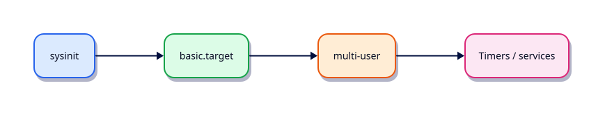

# systemd Targets, Timers, and Boot

## Overview

Targets replace runlevels; timers replace many cron jobs with better logging and dependencies.

This is **Tutorial 11** in **Module 7: Services & Boot** of the REBASH Academy **Linux for Cloud & DevOps Engineers** series — written for administrators, DevOps engineers, SREs, and platform engineers operating production Linux.

## Prerequisites

- systemd Services and journalctl
- Terminal access with a regular user account (sudo where noted)

## Learning Objectives

By the end of this tutorial, you will be able to:

- [ ] Apply the core ideas of “systemd Targets, Timers, and Boot” on a real Linux host
- [ ] Use modern tools (`ip`/`ss`, `systemctl`/`journalctl`) where they apply
- [ ] Complete the lab under `~/rebash-linux/` with clear outputs
- [ ] Relate this topic to Cloud, DevOps, and production operations
- [ ] Explain the failure modes you would check first in an incident

## Architecture

Linux ops work sits between humans/automation and the kernel, services, and network. This topic’s control points are shown below.



## Theory

### Targets

**Targets** group units (like runlevels):

| Target | Role |
|--------|------|
| `rescue.target` | Single-user recovery |
| `multi-user.target` | Standard server (no GUI) |
| `graphical.target` | Desktop |
| `network-online.target` | Network is configured |

```bash
systemctl get-default
systemctl set-default multi-user.target
systemctl isolate rescue.target   # disruptive — know before using
```

### Timers

`.timer` units activate `.service` units on calendar or monotonic schedules.

```bash
systemctl list-timers --all
systemctl status logrotate.timer
```

Example calendar: `OnCalendar=*-*-* 02:30:00`. Prefer timers when you need dependency ordering, jitter, or unified journals.

### Boot process (service side)

After the kernel starts PID 1:

1. systemd loads units
2. `sysinit` / local-fs / network targets activate
3. Default target pulls in enabled services
4. `cloud-init` stages may still be running on first boot

```bash
systemd-analyze critical-chain
systemctl list-dependencies multi-user.target
```

## Hands-on Lab

Create a workspace for this tutorial.

```bash
mkdir -p ~/rebash-linux/lab11 && cd ~/rebash-linux/lab11
```

**Focus:** list timers/targets; write a oneshot+timer pair; analyse boot chain

### Step 1 – Skeleton

```bash
cat > lab.sh << 'EOF'
#!/usr/bin/env bash
set -euo pipefail
echo "lab11 systemd-targets-timers-and-boot on $(hostname -s)"
EOF
chmod +x lab.sh
./lab.sh
```

### Step 2 – Targets and timers

```bash
systemctl get-default | tee default-target.txt
systemctl list-timers --all | head | tee timers.txt
systemd-analyze critical-chain 2>/dev/null | head | tee boot-chain.txt || true
cat > ~/.config/systemd/user/rebash-tick.service << 'EOF'
[Unit]
Description=REBASH tick
[Service]
Type=oneshot
ExecStart=/bin/date
EOF
cat > ~/.config/systemd/user/rebash-tick.timer << 'EOF'
[Unit]
Description=REBASH tick timer
[Timer]
OnCalendar=*:0/30
Persistent=true
[Install]
WantedBy=timers.target
EOF
systemctl --user daemon-reload 2>/dev/null || true
systemctl --user list-timers 2>/dev/null | head || true
```

### Final step – Cleanup note

```bash
./lab.sh
# keep ~/rebash-linux for later labs
```

## Validation

- [ ] Lab commands run under `~/rebash-linux/lab11/`
- [ ] You can explain each Theory bullet in your own words
- [ ] You used modern tooling where applicable (`ip`/`ss`, `systemctl`/`journalctl`)
- [ ] You can describe one production failure mode for this topic

## Code Walkthrough

Production Linux practice for **systemd Targets, Timers, and Boot** always combines:

1. Inspect before you change (`status`, `df`, `ip`, logs)
2. Prefer reversible, documented changes (config management, drop-ins)
3. Capture evidence (command output, journal snippets) for handovers
4. Prefer `systemctl`/`journalctl` and `ip`/`ss` over legacy tools
5. Least privilege — escalate with `sudo` only when required

Keep runbooks short enough to follow at 03:00. Automate the boring checks; keep humans for judgement.

## Security Considerations

- Treat host access and sudo as privileged — audit who can do what
- Never paste secrets into shell history, tickets, or screenshots
- Validate device names and paths before destructive disk or `rm` operations
- Prefer key-based SSH and deny password auth on internet-facing hosts
- Collect logs centrally; restrict who can read authentication and audit trails

## Common Mistakes

!!! warning "Using legacy networking tools by default"
    `ifconfig`/`netstat` are missing or incomplete on modern images. **Fix:** use `ip` and `ss`.

!!! warning "Editing vendor unit files in place"
    Package upgrades overwrite `/lib/systemd/system`. **Fix:** `systemctl edit` drop-ins under `/etc`.

!!! warning "Trusting df without checking inodes and mounts"
    A full `/var` or exhausted inodes looks different from root. **Fix:** `df -h`, `df -i`, and `findmnt`.

## Best Practices

- Golden images + config as code over snowflake hosts
- Alert on symptoms (failed units, disk, load) with runbooks attached
- Time-sync (chrony) everywhere — logs and TLS depend on it
- Separate OS and data volumes on Cloud VMs
- Practise restore and rescue paths before you need them

## Troubleshooting

| Symptom | Likely cause | Fix |
|---------|--------------|-----|
| Permission denied | Mode/owner/ACL/MAC | `namei -l`, `id`, `getfacl`, SELinux/AppArmor logs |
| No route / timeout | Routing, DNS, firewall | `ip route`, `dig`, `ss`, security groups |
| Service won’t start | Unit/config/deps | `systemctl status`, `journalctl -u`, config `-t` |
| Disk full | Logs, containers, deleted-open | `df`/`du`, `lsof +L1`, rotate/expand |
| High load | CPU, I/O wait, thrash | `vmstat`, `iostat`, `ps` |

## Summary

**systemd Targets, Timers, and Boot** is essential for Cloud and DevOps engineers operating Linux hosts. Practise the lab until the inspection path is muscle memory, then continue the track.

## Interview Questions

1. How does this topic show up when operating Cloud VMs or Kubernetes nodes?
2. What would you check first if this area misbehaves in production?
3. Which modern Linux tools replace older equivalents here?
4. What security control should accompany this capability?
5. How would you automate verification of this topic in CI or a cron/timer job?

!!! tip "Sample answer — question 2"
    Start with blast radius and recent changes, then gather host signals (`systemctl --failed`, `df`, `ip`/`ss`, `journalctl`) before making changes. Fix forward with evidence, not guesswork.

## Related Tutorials

- [Linux for Cloud & DevOps – Category Overview](index.md)
- [systemd Services and journalctl](systemd-services-and-journalctl.md) *(previous)*
- [Storage — Disks, Partitions, and Filesystems](storage-disks-partitions-and-filesystems.md) *(next)*
- [Learning Paths](../learning-paths/index.md)

## References

- [Linux man-pages project](https://www.kernel.org/doc/man-pages/)
- [systemd documentation](https://systemd.io/)
- [Filesystem Hierarchy Standard](https://refspecs.linuxfoundation.org/FHS_3.0/fhs-3.0.html)
- Track index: [Linux for Cloud & DevOps Engineers](index.md)
