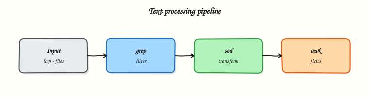

# Text Processing with grep, sed, and awk

## Overview

Log files and config dumps are large. **grep**, **sed**, and **awk** let you find lines, edit streams, and report columns without opening everything in an editor.

Most evidence you will touch at work is **text**: application logs, web server access lines, Continuous Integration (CI) output, and configuration files. You rarely open a spreadsheet on a server. You **search**, **edit**, and **summarise** lines with classic Unix tools. This tutorial teaches that skill from zero.

**Plain problem:** A mentor says “find every `ERROR` in `app.log` and tell me which host appears most.” Without text tools, you scroll for an hour. With `grep`, `awk`, and `sort | uniq -c`, you answer in minutes.

This is **Tutorial 8** in **Module 5: Text Processing** of the REBASH Academy **Linux for Cloud & DevOps Engineers** series — practical Linux for Cloud and DevOps work.

## Prerequisites

- Basic shell skills: run commands, use `|` pipes and `>` redirects (from earlier tutorials)
- A practice Linux host: Ubuntu 22.04/24.04 VM, cloud Free Tier VM, or Windows Subsystem for Linux (WSL2)
- A normal user account; no `sudo` required for this lab

You do **not** need regular expressions mastery yet — we build them step by step.

## Learning Objectives

By the end of this tutorial, you will be able to:

- [ ] Explain when to use grep, sed, or awk in plain words
- [ ] Filter log lines with `grep` (including `-E`, `-v`, `-n`)
- [ ] Edit text safely with `sed` (with a backup before in-place change)
- [ ] Build a small report with `awk` and rank counts with `sort | uniq -c`
- [ ] Complete an incident-style pipeline under `~/rebash-linux/lab08` with evidence files
- [ ] Answer common fresher interview questions on text processing

## Architecture

Text tools sit between raw files or command output and the answer you need: **filter** → **transform** → **summarise** → feed the next command.



## Theory

### The problem (before any jargon)

It is 03:00. A ticket says “payments API is failing.” You have a 200 MB log file. Opening it in an editor is slow and you cannot see patterns. You need to **pull out error lines**, **count how many times each message appears**, and **save proof** for the ticket.

That is **text processing** — working on line-oriented data from the terminal.

### What grep, sed, and awk are (simple words)

**Analogy:** Imagine a stack of printed receipts.

- **grep** is a highlighter — “show me every line that contains `ERROR`.”
- **sed** is a stamp — “on every line, replace `DEBUG` with `INFO`” or “delete lines matching a pattern.”
- **awk** is a small spreadsheet on each line — split columns, add counts, print field 3.

| Tool | Plain meaning | Typical job |
|------|---------------|-------------|
| `grep` | Find (or exclude) matching lines | `grep ERROR app.log` |
| `sed` | Stream editor — substitute, delete, print ranges | Change a config value |
| `awk` | Field processor and mini-report writer | Count errors per host |
| `cut` / `tr` | Slice columns or change characters | Fixed-width data |
| `sort` / `uniq` / `wc` | Order, unique, count lines | Top-N errors |
| `xargs` | Turn lines into command arguments | Run a command on many files |

**What you can say in an interview:** “grep finds lines; sed edits streams; awk splits fields and reports. I chain them with pipes for log triage.”

### grep — find lines

**Tiny example:**

``` {.bash .ra-terminal title="Terminal"}
grep -n ERROR sample.log
grep -v DEBUG sample.log          # exclude DEBUG lines
grep -E 'ERROR|WARN' sample.log   # extended regex (either word)
grep -i error sample.log          # case-insensitive
grep -I ERROR .                   # skip binary files when searching a tree
```

Useful flags:

| Flag | Meaning |
|------|---------|
| `-n` | Show line numbers |
| `-v` | Invert — show lines that do **not** match |
| `-E` | Extended regex (`|`, `+`, `?`) |
| `-i` | Ignore case |
| `-c` | Count matching lines only |
| `-I` | Skip binary files |

**Interview line:** “I use `grep -E` for OR patterns and `grep -v` to remove noise before awk.”

### sed — edit a stream

**Analogy:** sed reads input line by line, applies an edit rule, and prints the result. Think “find and replace on a conveyor belt.”

**Tiny example (print only — safe):**

``` {.bash .ra-terminal title="Terminal"}
sed 's/DEBUG/INFO/g' sample.log
sed -n '10,20p' sample.log        # print lines 10–20 only
sed '/^#/d' config.txt            # delete comment lines starting with #
```

**In-place edit (`-i`)** changes the file on disk. Always keep a backup in production:

``` {.bash .ra-terminal title="Terminal"}
cp config.txt config.txt.bak
sed -i 's/old_host/new_host/g' config.txt
diff config.txt.bak config.txt
```

**Interview line:** “I never `sed -i` without a backup or version control — one typo can break a service.”

### awk — fields and reports

**Analogy:** Each log line is a row. awk splits the row into **fields** (columns) and can count, sum, or print selected columns.

Default field separator is whitespace. Use `-F` for other delimiters (colon, comma).

**Tiny example:**

``` {.bash .ra-terminal title="Terminal"}
awk '{print $1}' sample.log              # first field
awk -F: '{print $1}' /etc/passwd | head    # usernames (colon-separated)
awk '/ERROR/ {count++} END {print count}' sample.log
```

**Interview line:** “awk is my go-to for ‘third column of matching lines’ and simple counts without opening Python.”

### Pipelines — glue tools together

Data flows left to right through `|`:

``` {.bash .ra-terminal title="Terminal"}
grep ERROR app.log | awk '{print $4}' | sort | uniq -c | sort -nr | head
```

Read this as: find ERROR lines → take field 4 → sort → count duplicates → show top counts.

### Why Cloud / DevOps teams care

- Incident response starts in logs, not dashboards alone.
- CI failures dump thousands of lines — grep finds the first real error.
- Config drift checks often use `grep`/`diff` on expected values.
- Automation scripts use the same tools you use manually — learn them once, reuse everywhere.

### Common pitfalls

- Running `grep -r` on `/` without `-I` — hits binary files and slows the host
- `sed -i` without backup on production configs
- Forgetting `awk` field numbers start at `$1`, not `$0` (`$0` is the whole line)
- Piping to `sort` before `uniq` — `uniq` only collapses **adjacent** duplicate lines

## Hands-on Lab

### Objective

Triage a synthetic application log like an on-call engineer: extract errors, rank messages, fix one bad config line with sed, and save an evidence pack.

### Prerequisites

| Item | Notes |
|------|--------|
| Linux practice host | Ubuntu preferred |
| Terminal access | Local, SSH, or WSL2 |
| `sudo` | Not required for this lab |

### Lab environment

``` {.bash .ra-terminal title="Terminal"}
mkdir -p ~/rebash-linux/lab08 && cd ~/rebash-linux/lab08
```

### Real-world scenario

Your team deploys a payments service. Support forwards `app.log` with hundreds of lines. Your mentor asks: “How many distinct ERROR messages, what is the top one, and did anyone leave `DEBUG=true` in the config?” You answer with commands and saved files — not by scrolling.

### Step-by-step tasks

#### Task 1 – Create sample log and config

Create `app.log`:

```text title="app.log"
2026-08-04T10:01:01 host=web01 level=INFO msg=started listener port=8080
2026-08-04T10:01:02 host=web01 level=ERROR msg=db_timeout user=api
2026-08-04T10:01:03 host=web02 level=WARN msg=slow_query ms=1200
2026-08-04T10:01:04 host=web01 level=ERROR msg=db_timeout user=api
2026-08-04T10:01:05 host=web03 level=ERROR msg=auth_failed user=guest
2026-08-04T10:01:06 host=web02 level=INFO msg=health_ok
2026-08-04T10:01:07 host=web01 level=ERROR msg=db_timeout user=api
2026-08-04T10:01:08 host=web03 level=DEBUG msg=trace_id=abc
2026-08-04T10:01:09 host=web02 level=ERROR msg=auth_failed user=guest
2026-08-04T10:01:10 host=web01 level=INFO msg=retry_scheduled
```

Create `app.env`:

```text title="app.env"
APP_NAME=payments
LOG_LEVEL=DEBUG
DB_HOST=127.0.0.1
```

``` {.bash .ra-terminal title="Terminal"}
cd ~/rebash-linux/lab08
test -s app.log && test -s app.env
wc -l app.log
```

!!! example "Expected output"
    `app.log` has 10 lines. Both files exist under `~/rebash-linux/lab08`.


#### Task 2 – grep errors and save evidence

``` {.bash .ra-terminal title="Terminal"}
cd ~/rebash-linux/lab08
grep -n 'level=ERROR' app.log | tee errors-raw.txt
grep -c 'level=ERROR' app.log | tee error-count.txt
grep -v 'level=DEBUG' app.log | wc -l | tee non-debug-lines.txt
test -s errors-raw.txt && test -s error-count.txt
cat error-count.txt
```

!!! example "Expected output"
    `errors-raw.txt` lists five ERROR lines with line numbers. `error-count.txt` shows `5`.


#### Task 3 – awk report: top ERROR messages

``` {.bash .ra-terminal title="Terminal"}
cd ~/rebash-linux/lab08
grep 'level=ERROR' app.log \
  | awk '{for(i=1;i<=NF;i++) if($i ~ /^msg=/) print $i}' \
  | sed 's/^msg=//' \
  | sort | uniq -c | sort -nr | tee top-errors.txt
head -1 top-errors.txt | tee top-error-line.txt
grep -q 'db_timeout' top-errors.txt
```

!!! example "Expected output"
    `top-errors.txt` ranks messages; the top line is `3 db_timeout` (three occurrences).


#### Task 4 – sed fix config (with backup)

``` {.bash .ra-terminal title="Terminal"}
cd ~/rebash-linux/lab08
cp app.env app.env.bak
sed -i 's/LOG_LEVEL=DEBUG/LOG_LEVEL=INFO/' app.env
grep 'LOG_LEVEL=INFO' app.env | tee config-fixed.txt
diff app.env.bak app.env | tee config-diff.txt
test -s config-fixed.txt
```

!!! example "Expected output"
    `app.env` now has `LOG_LEVEL=INFO`. `config-diff.txt` shows the one-line change.


### Validation steps

- [ ] `errors-raw.txt` and `top-errors.txt` exist and match the sample log
- [ ] You can explain grep vs sed vs awk without reading notes
- [ ] `app.env.bak` exists — you did not edit in place without backup
- [ ] Top error message is `db_timeout` with count 3

### Common errors and fixes

| Error | Cause | Fix |
|-------|-------|-----|
| `awk: cmd. line:1: unexpected` | Unclosed quote or brace | Copy the full awk command; check quotes |
| Empty `top-errors.txt` | Wrong field pattern | Run `grep ERROR app.log` first; inspect one line manually |
| `sed: can't read` | Wrong path | `cd ~/rebash-linux/lab08` and `ls` |
| `uniq` shows wrong counts | Forgot `sort` before `uniq` | Always `sort \| uniq -c` |

### Challenge exercise

Create `triage.sh` that prints ERROR count and the top message from any log file passed as argument `$1`.

Create `triage.sh`:

```bash title="triage.sh"
#!/usr/bin/env bash
set -euo pipefail
log="${1:?usage: triage.sh app.log}"
grep -c 'level=ERROR' "$log" || true
grep 'level=ERROR' "$log" \
  | awk '{for(i=1;i<=NF;i++) if($i ~ /^msg=/) print $i}' \
  | sed 's/^msg=//' \
  | sort | uniq -c | sort -nr | head -1
```

``` {.bash .ra-terminal title="Terminal"}
cd ~/rebash-linux/lab08
chmod +x triage.sh
./triage.sh app.log | tee triage-output.txt
grep -q 'db_timeout' triage-output.txt
```

### Learning outcomes

- You filtered and ranked real log lines with grep, awk, and sort/uniq
- You changed a config safely with sed and kept a backup
- You have ticket-ready evidence files for interviews

### Cleanup

``` {.bash .ra-terminal title="Terminal"}
cd ~/rebash-linux/lab08
# Keep evidence for revision; optional remove generated copies:
# rm -f *.txt triage-output.txt
# Keep triage.sh, app.log, app.env for practice
```

## Validation

- [ ] Lab completed under `~/rebash-linux/lab08`
- [ ] Can draw a pipeline on paper: grep → awk → sort → uniq
- [ ] Ready for process management next

## Code Walkthrough

1. **`grep` first** — reduce noise before heavier tools.
2. **`tee`** — see output and save to a file at the same time (great for tickets).
3. **`awk` field loops** — when columns are `key=value`, scan fields instead of guessing `$3`.
4. **`sort | uniq -c | sort -nr`** — classic top-N pattern for ops.
5. **Backup before `sed -i`** — production configs live in Git too, but local backup saves you during labs.

## Security Considerations

- Log files may contain passwords, tokens, or personal data — redact before sharing externally.
- Avoid `grep -r` on `/` as root — exposes secrets in `/etc` and hammers disk I/O.
- Do not paste production logs into public paste sites without scrubbing.
- Scripts that process untrusted input should quote variables (`"$log"`) to avoid injection.
- Prefer read-only triage before editing configs on shared servers.

## Common Mistakes

!!! warning "Scrolling a huge log in vim"
    Use `grep ERROR huge.log | less` or save filtered output to a file. Fix: filter first, read second.

!!! warning "sed -i without backup"
    One wrong substitution breaks a service. Fix: `cp file file.bak` or use version control; diff after edit.

!!! warning "uniq without sort"
    `uniq` only removes **consecutive** duplicates. Fix: always pipe through `sort` first.

!!! warning "Grepping binary trees"
    Searching `/` or `/var` without `-I` prints “Binary file matches”. Fix: narrow the path; add `grep -I`.

## Best Practices

- Name evidence files clearly (`errors-raw.txt`, `top-errors.txt`) for tickets
- Use `grep -E` for OR patterns; use `-F` for fixed strings (faster, no regex surprises)
- Keep one-liner pipelines in runbooks — future you at 03:00 will thank you
- Test awk/sed on a copy before applying to production configs
- Learn `rg` (ripgrep) later for faster recursive search — grep remains the interview baseline

## Troubleshooting

| Symptom | Likely cause | Fix |
|---------|--------------|-----|
| No matches but errors visible in editor | Wrong pattern (case, spacing) | `grep -i`; print one line with `sed -n '1p'` and match exactly |
| awk prints blank | Wrong field number or separator | `echo line \| awk '{print NF; print $0}'`; try `-F:` |
| sed changed too much | Missing anchors | Use `s/^LOG_LEVEL=DEBUG/LOG_LEVEL=INFO/` not bare `DEBUG` |
| Pipeline hangs | Waiting for input | Check for open quote; ensure input file exists |

## Summary

**grep** finds lines, **sed** edits streams, **awk** reports on fields — chained with pipes they turn noisy logs into answers. You practised incident-style triage on a safe sample log. Next you will learn how those commands become **processes** the kernel manages.

## Interview Questions

**1. When do you use grep vs sed vs awk?**

??? success "Reveal answer"
    **grep** when you only need to find or exclude matching lines. **sed** when you need to transform or delete lines in a stream (substitutions, stripping comments). **awk** when you need column/field logic, counts, or small reports. In practice you combine them: `grep ERROR log | awk '{print $3}' | sort | uniq -c`.

**2. What does `grep -v` do?**

??? success "Reveal answer"
    It inverts the match — prints lines that do **not** match the pattern. Useful to remove DEBUG noise: `grep -v DEBUG app.log` before further processing.

**3. Why is `sort` required before `uniq -c`?**

??? success "Reveal answer"
    `uniq` only collapses **adjacent** duplicate lines. Without sorting, identical lines separated by other lines are not counted together. The idiom `sort | uniq -c | sort -nr` gives accurate frequency counts and ranks them.

**4. How do you safely edit a file with sed in production?**

??? success "Reveal answer"
    Take a backup (`cp file file.bak`) or rely on Git, run sed on a copy first, `diff` the result, then apply. Avoid blind `sed -i` on live configs; prefer configuration management or templating for fleet-wide changes.

**5. What is `$1` and `$0` in awk?**

??? success "Reveal answer"
    **`$0`** is the entire input line. **`$1`**, **`$2`**, … are the first, second, … fields after splitting by the field separator (whitespace by default, or `-F` for custom). Field numbers start at 1, not 0.

**6. How would you find the top 5 IP addresses in an access log?**

??? success "Reveal answer"
    Extract the IP field (often `$1` in Apache/Nginx logs), then rank: `awk '{print $1}' access.log | sort | uniq -c | sort -nr | head -5`. Adjust the field number after inspecting one sample line.

**7. What is wrong with running `grep -r PASSWORD /` as root?**

??? success "Reveal answer"
    It scans the entire filesystem including binary files, secrets in `/etc`, and application data — slow, noisy, and a data-leak risk if output is shared. Narrow the path, use `grep -I`, run as a user with least privilege, and redact secrets in ticket attachments.

## Related Tutorials

- Prior: [Permissions, ACLs, and Special Bits](permissions-acls-and-special-bits.md)
- Next: [Process Management](process-management.md)
- Related: [Shell Scripting Fundamentals](shell-scripting-fundamentals.md)

## References

- [GNU grep manual](https://www.gnu.org/software/grep/manual/grep.html)
- [GNU sed manual](https://www.gnu.org/software/sed/manual/sed.html)
- [GNU awk manual](https://www.gnu.org/software/gawk/manual/gawk.html)
- [REBASH Linux course index](index.md)
