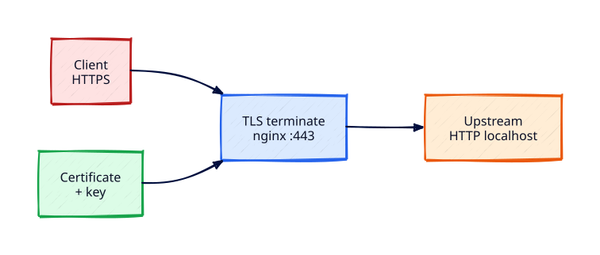

# TLS Certificates on Linux Servers

## Overview

HTTP on port 80 is insufficient for credentials and modern browsers. **TLS** wraps HTTP so clients authenticate the server and encrypt the session. On Linux app servers, nginx typically **terminates TLS** and talks HTTP to localhost upstreams.

This tutorial builds a self-signed certificate for lab use, configures nginx on 443, verifies expiry with OpenSSL, and contrasts the Let’s Encrypt/certbot path used in production.

This is **Tutorial 23** in **Module 7: Advanced Linux Servers**.

## Prerequisites

- Complete [nginx Web Server and Reverse Proxy](nginx-web-server-and-reverse-proxy.md)
- nginx installed and running
- `openssl` available

## Learning Objectives

By the end of this tutorial, you will be able to:

- [ ] Explain certificate, private key, and trust chain roles
- [ ] Generate a self-signed cert/key pair for lab HTTPS
- [ ] Configure nginx `ssl_certificate` / `ssl_certificate_key`
- [ ] Check notAfter expiry dates and diagnose common TLS failures
- [ ] Describe how certbot/Let’s Encrypt differs from self-signed labs

## Architecture

Clients connect with HTTPS to nginx; certificate and key stay on the edge; upstream remains HTTP on localhost.



## Theory

### Trust model

1. Server presents an X.509 certificate during the TLS handshake
2. Client checks signature chain to a trusted CA
3. Client verifies hostname (SAN/CN) and validity dates
4. Encrypted application data follows

**Self-signed** certificates trigger browser warnings — fine for labs; not for public production trust.

### Files on disk

| Artefact | Permissions | Notes |
|----------|-------------|-------|
| Private key | `640`/`600` | Never commit; never world-readable |
| Certificate | `644` | Public |
| Full chain | Cert + intermediates | Required for public CAs |

### Let’s Encrypt / certbot

Production hosts with public DNS use ACME challenges. Pure localhost VMs cannot complete HTTP-01 — use self-signed or an internal CA for labs.

### Expiry monitoring

Track `notAfter` and alert before expiry. Clock skew causes “not yet valid” failures.


### Cipher and protocol notes

Modern nginx builds default to reasonable TLS versions. In production, generate a config from the Mozilla SSL Configuration Generator (intermediate profile), disable TLS 1.0/1.1, and prefer ECDHE ciphers. After changes, verify with `openssl s_client` and an external scanner when the host is public.

### Redirect and HSTS

Redirecting HTTP→HTTPS is step one. HSTS (`Strict-Transport-Security`) should wait until HTTPS is stable on all hostnames — a mistaken HSTS on a broken cert locks browsers out of your lab domain until max-age expires.


## Hands-on Lab

### Step 1 – Create key and certificate

```bash
sudo mkdir -p /etc/nginx/ssl
sudo openssl req -x509 -nodes -newkey rsa:2048 -days 30 \
  -keyout /etc/nginx/ssl/lab.key \
  -out /etc/nginx/ssl/lab.crt \
  -subj "/CN=lab.rebash.local"
sudo chmod 640 /etc/nginx/ssl/lab.key
sudo chmod 644 /etc/nginx/ssl/lab.crt
sudo openssl x509 -in /etc/nginx/ssl/lab.crt -noout -subject -dates
```

**Expected output:** CN=`lab.rebash.local`; validity dates spanning ~30 days.

### Step 2 – HTTPS server block

```bash
sudo mkdir -p /var/www/rebash-static
echo '<h1>REBASH TLS</h1>' | sudo tee /var/www/rebash-static/index.html
sudo tee /etc/nginx/sites-available/rebash-tls << 'EOF'
server {
    listen 80 default_server;
    listen [::]:80 default_server;
    server_name _;
    return 301 https://$host$request_uri;
}

server {
    listen 443 ssl default_server;
    listen [::]:443 ssl default_server;
    server_name _;
    ssl_certificate     /etc/nginx/ssl/lab.crt;
    ssl_certificate_key /etc/nginx/ssl/lab.key;
    root /var/www/rebash-static;
    index index.html;
    location / {
        try_files $uri $uri/ =404;
    }
}
EOF
sudo ln -sf /etc/nginx/sites-available/rebash-tls /etc/nginx/sites-enabled/rebash-tls
sudo rm -f /etc/nginx/sites-enabled/rebash-static /etc/nginx/sites-enabled/default
sudo nginx -t && sudo systemctl reload nginx
```

**Expected output:** `nginx -t` OK; reload succeeds.

### Step 3 – Curl HTTPS

```bash
curl -k -sS https://127.0.0.1/ | head -5
curl -k -sS -o /dev/null -w "%{http_code}\n" https://127.0.0.1/
echo | openssl s_client -connect 127.0.0.1:443 -servername lab.rebash.local 2>/dev/null \
  | openssl x509 -noout -dates
```

**Expected output:** HTML content; HTTP 200; certificate dates printed.

### Step 4 – Redirect check

```bash
curl -k -sS -o /dev/null -w "%{http_code}\n" http://127.0.0.1/
```

**Expected output:** `301` redirect to HTTPS.

### Step 5 – Certbot awareness

```bash
cat << 'EOF'
Production sketch (needs public DNS):
  sudo apt install -y certbot python3-certbot-nginx
  sudo certbot --nginx -d example.com
  sudo certbot renew --dry-run
EOF
```

**Expected output:** Reminder text only — do not force ACME on localhost.

## Validation

| Check | Pass criteria |
|-------|----------------|
| Key perms | Private key not world-readable |
| HTTPS | `curl -k https://127.0.0.1/` → 200 |
| Dates | Future notAfter |
| Config | `nginx -t` clean |

## Code Walkthrough

| Command | Description |
|---------|-------------|
| `openssl req -x509` | Create self-signed certificate |
| `openssl x509 -dates` | Show validity window |
| `openssl s_client` | Inspect live handshake |
| `ssl_certificate` | nginx public cert path |

## Code Examples

```bash
openssl x509 -in /etc/nginx/ssl/lab.crt -noout -enddate
openssl x509 -in /etc/nginx/ssl/lab.crt -noout -fingerprint -sha256
```

## Security Considerations

Protect private keys; prefer automated public CA issuance in production; never email keys; rotate on compromise; enable HSTS only when HTTPS is stable.

## Common Mistakes

| Mistake | Why it hurts | Fix |
|---------|--------------|-----|
| World-readable key | Trivial theft | Restrict mode/ownership |
| Hostname mismatch | Client errors | Match SAN/CN to URL |
| Expired cert | Outage | Monitor and renew |
| Missing chain | Mobile clients fail | Install fullchain |

## Best Practices

1. Automate renewal and alert on failure
2. Separate lab and production certificates
3. Keep TLS config in version control without private keys
4. Test with real clients, not only `curl -k`
5. Fix clock sync before chasing TLS ghosts

## Troubleshooting

| Symptom | Likely cause | Resolution |
|---------|--------------|------------|
| CERT_AUTHORITY_INVALID | Self-signed | Expected in lab |
| certificate has expired | notAfter passed | Reissue |
| key values mismatch | Mixed pair | Regenerate matching pair |
| Mixed content | HTTP assets | Serve via HTTPS |

## Summary

You terminated TLS on nginx with a lab certificate and learned how production ACME differs. Next: durable storage with LVM.

## Interview Questions

**Q1 — Where should TLS terminate on a typical Linux app VM?**

*Sample answer:* At the reverse proxy (nginx); keep upstream HTTP on localhost.

**Q2 — What does a self-signed certificate prove?**

*Sample answer:* Encryption yes; public trust no.

**Q3 — How do you check certificate expiry on disk?**

*Sample answer:* `openssl x509 -in file -noout -enddate`.

**Q4 — Why might TLS fail after a correct cert install?**

*Sample answer:* Clock skew, wrong key pair, missing chain, firewall, or hostname mismatch.

**Q5 — What is `certbot renew --dry-run` for?**

*Sample answer:* Prove renewal still works before expiry.

## Related Tutorials

- Previous: [nginx Web Server and Reverse Proxy](nginx-web-server-and-reverse-proxy.md)
- Next: [Server Storage — LVM and fstab](server-storage-lvm-and-fstab.md)
- [Linux Server Baseline and Lifecycle](linux-server-baseline-and-lifecycle.md)
- [Linux Security Hardening Basics](linux-security-hardening-basics.md)

## References

1. [Mozilla SSL Configuration Generator](https://ssl-config.mozilla.org/)
2. [OpenSSL x509(1)](https://www.openssl.org/docs/manmaster/man1/openssl-x509.html)
3. [Certbot documentation](https://certbot.eff.org/)
