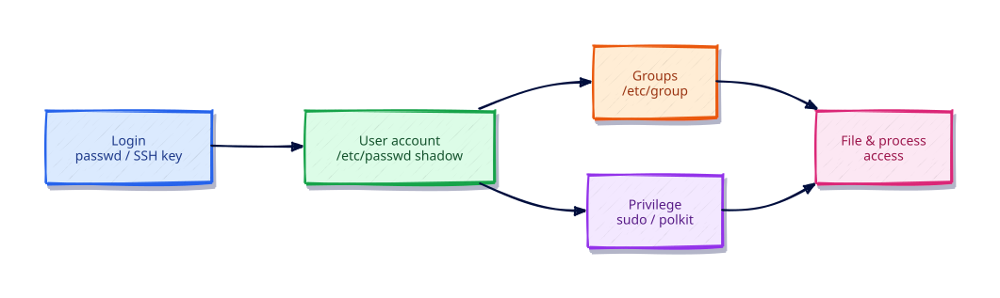

# User and Group Management

## Overview

Linux is a multi-user operating system. Every process runs as a specific user identity (uid), and access to files, services, and administrative commands depends on that identity and its group memberships. Production administration requires confident use of account lifecycle tools — creating service accounts, locking compromised users, granting least-privilege sudo, and understanding how `/etc/passwd` and `/etc/shadow` store credentials.

This tutorial is part of **Module 2: Users, Groups & Permissions** in the REBASH Academy Linux series. You will create and modify users with `useradd` and `usermod`, manage groups, inspect identity databases, and configure sudo access safely with `visudo`.

## Prerequisites

- Complete [File Permissions and Ownership](file-permissions-and-ownership.md) or equivalent experience
- A Linux VM, cloud instance, or local machine (Ubuntu 20.04+, RHEL 8+, or Debian 11+)
- `sudo` privileges for all lab exercises involving user creation
- Understanding that lab users should be deleted after practice

## Learning Objectives

By the end of this tutorial, you will be able to:

- [ ] Create, modify, and delete user accounts with `useradd`, `usermod`, and `userdel`
- [ ] Explain the fields in `/etc/passwd`, `/etc/shadow`, and `/etc/group`
- [ ] Manage primary and supplementary group membership
- [ ] Grant controlled elevated access through `/etc/sudoers` and `/etc/sudoers.d/`
- [ ] Differentiate human accounts, system accounts, and service accounts
- [ ] Troubleshoot login failures, locked accounts, and sudo permission errors

## Architecture

Identity on Linux is UID/GID membership: authentication maps a login to a user, then groups grant shared access.



## Theory

### User identifiers

Each user has a numeric **UID** (User ID). UID 0 is root. System accounts typically use UIDs below 1000 (or 999 on some distros); human users start at 1000.

| Account type | UID range | Shell | Home | Purpose |
|--------------|-----------|-------|------|---------|
| root | 0 | /bin/bash | /root | Full administrative access |
| system | 1–999 | /usr/sbin/nologin | /nonexistent | Daemons (nginx, postgres) |
| human | 1000+ | /bin/bash | /home/user | Interactive login |

### /etc/passwd

Colon-separated fields (7 total):

```text
username:x:UID:GID:comment:home_directory:login_shell
```

Example:

```text
alice:x:1001:1001:Alice DevOps:/home/alice:/bin/bash
www-data:x:33:33:www-data:/var/www:/usr/sbin/nologin
```

The `x` in the password field means the hash lives in `/etc/shadow` (shadow passwords enabled).

### /etc/shadow

Stores password hashes and aging policy (readable by root only):

```text
username:$6$salt$hash:18000:0:99999:7:::
```

| Field | Meaning |
|-------|---------|
| 1 | Hashed password (`!` or `*` = locked) |
| 2 | Days since epoch of last change |
| 3 | Minimum days between changes |
| 4 | Maximum password age |
| 5 | Warning days before expiry |
| 6 | Inactivity lockout days |
| 7 | Account expiry date |

Lock an account instantly: `sudo passwd -l username` or replace the hash with `!`.

### /etc/group

```text
groupname:password:GID:user_list
```

Users listed after the GID are **supplementary** members. Each user also has exactly one **primary group** (GID in `/etc/passwd`).

### Primary vs supplementary groups

- **Primary group**: Default group for new files; stored in `/etc/passwd`
- **Supplementary groups**: Additional memberships in `/etc/group`; required for access to `docker`, `sudo`, `wheel`, etc.

Changes to group membership require the user to **log out and back in** (or run `newgrp`) for sessions to pick up new groups.

### sudo and the principle of least privilege

`sudo` executes commands as another user (usually root) based on rules in:

- `/etc/sudoers` (edited only with `visudo`)
- `/etc/sudoers.d/*.conf` (drop-in fragments)

Prefer granular rules:

```bash
# Bad: full passwordless root
alice ALL=(ALL) NOPASSWD: ALL

# Better: specific command only
deploy ALL=(root) NOPASSWD: /bin/systemctl restart myapp
```

Always validate with `visudo -c` after edits.

### Distribution differences

| Item | Debian/Ubuntu | RHEL/Fedora |
|------|---------------|-------------|
| Admin group | `sudo` | `wheel` |
| Default useradd config | `/etc/default/useradd` | `/etc/login.defs` |
| Skeleton files | `/etc/skel/` | `/etc/skel/` |

## Hands-on Lab

All lab users are prefixed with `lab` for easy cleanup. Run exercises on a non-production system.

### Step 1 – Inspect your current identity

```bash
id
whoami
getent passwd $USER
getent group $(id -gn)
```

**Expected output:**

```text
uid=1000(ubuntu) gid=1000(ubuntu) groups=1000(ubuntu),4(adm),27(sudo),...
ubuntu
ubuntu:x:1000:1000:Ubuntu:/home/ubuntu:/bin/bash
ubuntu:x:1000:
```

### Step 2 – Create a human user with home directory

```bash
sudo useradd -m -s /bin/bash -c "Lab User One" labuser1
sudo passwd labuser1
getent passwd labuser1
ls -ld /home/labuser1
```

**Expected output:**

```text
labuser1:x:1001:1001:Lab User One:/home/labuser1:/bin/bash
drwxr-x--- 2 labuser1 labuser1 4096 Jul 27 11:00 /home/labuser1
```

Home directory is created from `/etc/skel/` with default permissions.

### Step 3 – Create a system (service) account

```bash
sudo useradd -r -s /usr/sbin/nologin -d /var/lib/labapp labapp
getent passwd labapp
id labapp
```

**Expected output:**

```text
labapp:x:999:987::/var/lib/labapp:/usr/sbin/nologin
uid=999(labapp) gid=987(labapp) groups=987(labapp)
```

System accounts get low UIDs and cannot log in interactively.

### Step 4 – Manage group membership

```bash
sudo groupadd labdev
sudo usermod -aG labdev labuser1
getent group labdev
groups labuser1
id labuser1
```

**Expected output:**

```text
labdev:x:1002:labuser1
labuser1 : labuser1 labdev
uid=1001(labuser1) gid=1001(labuser1) groups=1001(labuser1),1002(labdev)
```

Use `-aG` (append) — `-G` alone **replaces** all supplementary groups.

### Step 5 – Modify user properties

```bash
sudo usermod -c "Renamed Lab User" -s /bin/sh labuser1
getent passwd labuser1 | cut -d: -f5,7
sudo usermod -L labuser1          # lock account
sudo passwd -S labuser1
sudo usermod -U labuser1          # unlock
```

**Expected output:**

```text
Renamed Lab User:/bin/sh
labuser1 L 07/27/2026 0 99999 7 -1   # L = locked
labuser1 P 07/27/2026 0 99999 7 -1   # P = password set, unlocked
```

### Step 6 – Configure sudo access safely

Create a drop-in sudoers file:

```bash
echo 'labuser1 ALL=(root) NOPASSWD: /bin/systemctl status *' \
  | sudo tee /etc/sudoers.d/labuser1
sudo chmod 440 /etc/sudoers.d/labuser1
sudo visudo -c
```

**Expected output:**

```text
labuser1 ALL=(root) NOPASSWD: /bin/systemctl status *
/etc/sudoers.d/labuser1: parsed OK
```

Test (as labuser1 if you can switch users):

```bash
sudo -u labuser1 sudo systemctl status ssh 2>/dev/null \
  || sudo -u labuser1 sudo systemctl status sshd
```

### Step 7 – Inspect shadow entries (root only)

```bash
sudo getent shadow labuser1
sudo chage -l labuser1
```

**Expected output:**

```text
labuser1:$6$...:20300:0:99999:7:::
Last password change                    : Jul 27, 2026
Password expires                        : never
Password inactive                       : never
Account expires                         : never
Minimum number of days between changes  : 0
Maximum number of days between changes  : 99999
```

### Step 8 – Delete lab users and group

```bash
sudo userdel -r labuser1
sudo userdel -r labapp 2>/dev/null || sudo userdel labapp
sudo groupdel labdev
sudo rm -f /etc/sudoers.d/labuser1
getent passwd labuser1 || echo "labuser1 removed"
```

**Expected output:**

```text
labuser1 removed
```

`-r` removes the home directory and mail spool. Always verify before deleting production accounts.

## Validation

Confirm the lab before moving on:

1. Re-run the critical commands from the Hands-on Lab and compare them to the expected output in each step.
2. Check that you can explain *why* each successful result matters (not only that it printed).
3. Note any warnings or unexpected output — resolve them using Troubleshooting before continuing.

| Check | Pass criteria |
|-------|----------------|
| Account create | `id labuser` (or named lab account) shows UID/GID/groups |
| Group membership | Secondary group membership visible in `id` or `/etc/group` |
| sudo/login | Documented sudo or login test behaves as expected |
| Cleanup | Lab accounts locked or deleted per tutorial |

## Code Walkthrough

| Command | Description |
|---------|-------------|
| `id [USER]` | Show uid, gid, and all groups |
| `whoami` | Print effective username |
| `getent passwd [USER]` | Query passwd database (includes LDAP/NIS) |
| `getent group [GROUP]` | Query group database |
| `getent shadow USER` | View shadow entry (root only) |
| `useradd -m -s /bin/bash USER` | Create user with home and bash shell |
| `useradd -r -s /usr/sbin/nologin USER` | Create system account |
| `usermod -aG GROUP USER` | Append supplementary group (non-destructive) |
| `usermod -L USER` | Lock account (password prefix `!`) |
| `usermod -U USER` | Unlock account |
| `usermod -s /bin/sh USER` | Change login shell |
| `userdel -r USER` | Delete user and home directory |
| `groupadd GROUP` | Create a new group |
| `groupdel GROUP` | Delete an empty group |
| `passwd USER` | Set or change password |
| `passwd -S USER` | Show password status (L/P/NP) |
| `chage -l USER` | List password aging policy |
| `chage -M 90 USER` | Set 90-day max password age |
| `visudo` | Safely edit `/etc/sudoers` |
| `visudo -c` | Validate sudoers syntax |
| `sudo -l -U USER` | List sudo privileges for a user |

## Code Examples

### Bulk create users from a CSV

```bash
#!/bin/bash
# bulk-users.sh — create users from username,comment CSV
set -euo pipefail

CSV="${1:?Usage: $0 users.csv}"

while IFS=, read -r username comment; do
  [[ "$username" == "username" ]] && continue  # skip header
  if ! id "$username" &>/dev/null; then
    useradd -m -s /bin/bash -c "$comment" "$username"
    echo "Created $username"
  else
    echo "Skip existing: $username"
  fi
done < "$CSV"
```

### Service account with locked-down home

```bash
#!/bin/bash
# create-svc-user.sh — non-login service account for an application
set -euo pipefail

USER="${1:?Usage: $0 <service-name>}"
HOME="/var/lib/${USER}"

useradd -r -d "$HOME" -s /usr/sbin/nologin "$USER"
mkdir -p "$HOME"
chown "$USER:$USER" "$HOME"
chmod 750 "$HOME"
echo "Service account $USER ready at $HOME"
```

### Sudoers drop-in for deploy automation

```ini
# /etc/sudoers.d/deploy — managed by configuration management
Defaults:deploy !requiretty
deploy ALL=(root) NOPASSWD: /bin/systemctl restart myapp.service, \
                              /bin/systemctl status myapp.service
```

Validate after deployment: `visudo -c -f /etc/sudoers.d/deploy`.

## Security Considerations

- Create one account per human or service; never share interactive root or shared `admin` passwords
- Grant `sudo` via named groups with explicit commands where possible — avoid blanket `ALL=(ALL) NOPASSWD:ALL` in production
- Disable or lock unused accounts (`usermod -L`, expire dates) and remove leftover home directories carefully
- Prefer SSH keys over passwords; disable password authentication once keys work
- Separate administrative groups from application groups so deploy users cannot become root by accident

## Common Mistakes

!!! warning "Using usermod -G without -a"
    `usermod -G docker alice` **replaces** all supplementary groups with only `docker`. Always use `-aG` to append.

!!! warning "Editing /etc/sudoers with a regular editor"
    A syntax error can lock out all sudo access. Always use `visudo`, which validates before saving.

!!! warning "Granting NOPASSWD: ALL"
    Passwordless full root access defeats audit trails and enables instant privilege escalation if the account is compromised.

!!! warning "Deleting users without archiving home directories"
    `userdel user` without `-r` leaves orphaned files owned by the old UID — new users assigned that UID may inherit access.

## Best Practices

!!! tip "Use dedicated service accounts"
    Run each application as its own user with `/usr/sbin/nologin` and a minimal home under `/var/lib/`.

!!! tip "Centralize identity when possible"
    Integrate with LDAP, Active Directory (SSSD), or cloud IAM for fleets larger than a handful of servers.

!!! tip "Enforce password aging on human accounts"
    Set `PASS_MAX_DAYS` in `/etc/login.defs` or per-user with `chage -M 90`.

!!! tip "Prefer sudoers.d fragments"
    One file per role or team in `/etc/sudoers.d/` is easier to audit than a monolithic sudoers file.

!!! tip "Disable unused accounts, don't delete immediately"
    Lock with `usermod -L` first; delete after a retention period if no longer needed for forensics.

## Troubleshooting

| Issue | Cause | Solution |
|-------|-------|----------|
| User cannot log in | Account locked or shell is nologin | Check `passwd -S USER`; verify shell in `/etc/passwd` |
| Permission denied with sudo | User not in sudoers | Add rule via `visudo` or membership in `sudo`/`wheel` group |
| Group membership not effective | Session started before change | Log out/in, or `newgrp groupname` |
| `useradd: UID already in use` | Duplicate UID | Choose unused UID or delete conflicting account |
| `visudo: syntax error` | Malformed sudoers line | Run `visudo -c`; fix line numbers reported |
| Home directory not created | Missing `-m` flag | `mkhomedir_helper USER` or recreate with `useradd -m` |
| LDAP user not visible | NSS misconfiguration | Verify `/etc/nsswitch.conf` has `passwd: files systemd ldap` |

## Summary

- Linux identity is defined by UID/GID stored in `/etc/passwd`, `/etc/shadow`, and `/etc/group`.
- Use `useradd -m` for interactive users and `useradd -r` for system/service accounts.
- Append groups with `usermod -aG`; never replace supplementary groups accidentally.
- Configure sudo through `visudo` and `/etc/sudoers.d/` with least-privilege command lists.
- Lock, audit, and eventually remove accounts with documented procedures — orphaned UIDs cause security gaps.

## Interview Questions

**1. What is the difference between `/etc/passwd` and `/etc/shadow`?**

*Sample answer:* `/etc/passwd` stores account metadata (UID, GID, home, shell) and is world-readable. `/etc/shadow` stores password hashes and aging policy, readable only by root. The `x` in passwd indicates shadow is in use.

**2. How do you create a user with a home directory and bash shell?**

*Sample answer:* `useradd -m -s /bin/bash username`, then `passwd username` to set the password. The `-m` flag creates `/home/username` from `/etc/skel/`.

**3. What happens if you run `usermod -G docker alice` without `-a`?**

*Sample answer:* Alice's supplementary groups are **replaced** with only `docker`. She loses membership in `sudo`, `adm`, or any other groups she previously had.

**4. How do you lock an account without deleting it?**

*Sample answer:* `sudo usermod -L username` or `sudo passwd -l username`. This prefixes the shadow hash with `!`, preventing password authentication. Unlock with `-U` or `passwd -u`.

**5. What is UID 0, and why is it special?**

*Sample answer:* UID 0 is root — the superuser. Root bypasses most permission checks and can read `/etc/shadow`, change ownership, and modify any file. Minimize direct root login; use sudo for auditable elevation.

**6. How do you grant a user permission to restart one service without full root?**

*Sample answer:* Add a sudoers rule: `deploy ALL=(root) NOPASSWD: /bin/systemctl restart myapp.service` via `visudo` or a file in `/etc/sudoers.d/`.

**7. What is the difference between a primary group and supplementary groups?**

*Sample answer:* The primary group (GID in `/etc/passwd`) is the default owner of new files. Supplementary groups are listed in `/etc/group` and grant additional access — e.g., membership in `docker` for socket access.

**8. Why might a new group membership not work until re-login?**

*Sample answer:* Group memberships are loaded at login into the process credential. Existing sessions retain old groups until the user logs out/in or starts a new session with `newgrp`.

**9. What does `/usr/sbin/nologin` as a shell accomplish?**

*Sample answer:* It prevents interactive login while allowing the account to own files and run processes (via systemd or cron). Used for service accounts like `nginx` or `postgres`.

**10. How do you safely verify sudoers configuration before closing your admin session?**

*Sample answer:* Run `visudo -c` to validate syntax. Keep a root session open while testing a new rule with `sudo -l -U username` and a trial command in a second terminal.

1. How would you explain user and group management to a junior engineer in two minutes?
2. What production failure mode appears when teams ignore user and group management?
3. Which metrics or logs would you check first when user and group management misbehaves?
4. What is a secure default related to user and group management?
5. How would you validate a change involving user and group management in CI or a staging environment?
6. What trade-off would you accept to simplify operations around user and group management?
7. Describe a common anti-pattern with user and group management and how you fix it.
8. How does user and group management interact with networking, identity, or storage in a real system?
9. What would you put on a runbook checklist for user and group management?
10. When would you intentionally not follow the default approach taught here?

## Related Tutorials

- [Linux – Category Overview](index.md)
- [File Permissions and Ownership](file-permissions-and-ownership.md) *(previous)*
- [Process Management](process-management.md) *(next)*
- [SSH Remote Administration](ssh-remote-administration.md)
- [Linux Security Hardening Basics](linux-security-hardening-basics.md)
- [Learning Paths – DevOps Engineer](../learning-paths/index.md)
- Cheat sheet: [Linux Cheat Sheet](../cheatsheets/linux.md)
- Interview prep: [Linux Interview Prep](../interview/linux.md)
- Learning path: [DevOps Engineer](../learning-paths/devops-engineer.md)

## References

- [useradd man page](https://man7.org/linux/man-pages/man8/useradd.8.html)
- [sudoers man page](https://man7.org/linux/man-pages/man5/sudoers.5.html)
- [Shadow password suite](https://man7.org/linux/man-pages/man5/shadow.5.html)
- [Red Hat – Managing users and groups](https://docs.redhat.com/en/documentation/red_hat_enterprise_linux/9/html/configuring_basic_system_settings/managing-users-and-groups_configuring-basic-system-settings)
- [REBASH Academy – Linux Overview](index.md)
