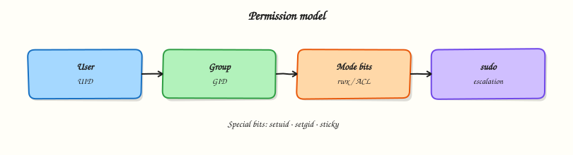

# Users, Groups, and sudo

## Overview

When you log in to a Linux server, the system must know three things: **who you are**, **which team groups you belong to**, and **which admin commands you are allowed to run**. These three ideas are **users**, **groups**, and **sudo**.

A **user** is an account with a name, a number called a user ID (UID), a home folder, and a shell (the program that reads your commands). A **group** is a team name with a group ID (GID). Groups help many people share the same folder access without giving “open to everyone” permission. **sudo** means “superuser do”. It lets a normal user run selected commands as root (the full admin user), so you do not stay logged in as root all day. In this tutorial you will create accounts, check them with `id`, and see your rights with `sudo -l`.

File permissions, services, containers, and cloud tools all depend on this identity layer. On cloud virtual machines (VMs), jump servers (bastions), Continuous Integration (CI) build machines, and Kubernetes nodes, wrong users or groups cause failed deployments, `Permission denied` errors, or scripts that have more power than they should. Cloud VM images often add the first login user to a sudo or admin group. In real work you should keep **human login accounts** separate from **service accounts** (accounts for apps, usually with a `nologin` shell), add people to the correct groups with `usermod -aG`, and give only small, clear sudo rules under `/etc/sudoers.d/` instead of one rule that allows everything.

In production, a bad sudo rule can affect the whole server. If you give `NOPASSWD:ALL`, any program running as that user can become root without asking for a password. If you edit `/etc/sudoers` with a normal editor and make a typing mistake, you may lose sudo access. Good practice is: role-based groups, small sudo files checked with `visudo`, and proof using `sudo -l` plus one command that must fail. Big companies may use a central login system such as Lightweight Directory Access Protocol (LDAP), FreeIPA, or a cloud directory. Even then, keep a few local emergency admin accounts for when the central system is down.

This is **Tutorial 6** in **Module 4: Users & Permissions** of the REBASH Academy **Linux for Cloud & DevOps Engineers** series. It is written for Linux administrators, DevOps engineers, Site Reliability Engineering (SRE), and platform engineers. By the end, you will have a small working setup you can explain in an interview or in a change ticket.

## Prerequisites

- [Disk Usage and File Attributes](disk-usage-and-file-attributes.md)
- A **practice Ubuntu 22.04/24.04 VM** (or similar) where you already have `sudo`
- You are ready to create and delete lab users (do **not** run this lab on a shared production server)

## Learning Objectives

By the end of this tutorial, you will be able to:

- [ ] Explain how users, groups, and sudo map to `/etc/passwd`, `/etc/group`, and `/etc/sudoers.d/`
- [ ] Create a normal login user and a system (app) account with the correct shell
- [ ] Add a user to a group with `usermod -aG` without removing other groups
- [ ] Create a limited sudoers file with `visudo` and check it with `sudo -l`
- [ ] Remove lab accounts safely and explain one common production problem with identity

## Architecture

Linux identity sits between people or automation and the kernel. Account files decide the UID and GID. sudo decides which privileged commands are allowed. Files and processes then use those identities.



## Theory

### What it is

A **user** has a UID, a home directory, a login shell, and a primary group. A **group** has a GID and a list of members. User details are stored in `/etc/passwd`. Password hashes are stored in `/etc/shadow`. Group membership is stored in `/etc/group`.

**sudo** lets an allowed user run a command as another user (usually root), based on rules in `/etc/sudoers` and extra files in `/etc/sudoers.d/`. App or service accounts often use `/usr/sbin/nologin` (or `/bin/false`) so they can own files but nobody can log in interactively as that account.

```bash
id
getent passwd "$USER"
getent group sudo   # Ubuntu; on RHEL-like systems the group is often 'wheel'
```

### Why it matters

Who can become root is one of the most important security decisions on a server. If sudo is too open (`ALL=(ALL) NOPASSWD:ALL`), a compromised CI user or app user becomes full root. If a required group is missing, deployment jobs fail when they cannot write to a shared folder. Cloud images usually put the default user in a sudo/admin group. You need to understand that default so you can harden jump servers and check who can become root.

### How it works

1. **Check** — `id`, `getent passwd name`, `getent group name`.
2. **Create** — `useradd` / `adduser`, `groupadd`. Use `--system` for app/daemon accounts.
3. **Add to group** — `usermod -aG group user` (**`-a` means add**; `-G` alone can replace the whole secondary group list).
4. **Use sudo** — `sudo -l` shows your rules; `sudo -u otheruser command` runs a command as another user.
5. **Edit sudo rules** — use only `visudo` (or `visudo -f /etc/sudoers.d/file`) so a syntax error does not lock you out.

```bash
sudo useradd -m -s /bin/bash appuser
sudo usermod -aG sudo appuser          # Ubuntu example — the lab uses a tighter rule
sudo visudo -f /etc/sudoers.d/99-lab   # always check syntax
```

In large companies, LDAP, FreeIPA, or a cloud directory may provide user data to `getent`. Local files still matter for **emergency admin accounts** when the central directory is unavailable.

### Key concepts and comparisons

| Object | Important fields | Files |
|--------|------------------|-------|
| User | UID, home, shell, primary GID | `/etc/passwd`, `/etc/shadow` |
| Group | GID, members | `/etc/group` |
| sudo rule | Who, as whom, which commands | `/etc/sudoers`, `/etc/sudoers.d/*` |

| Pattern | Prefer when | Avoid when |
|---------|-------------|------------|
| Login user + limited sudo | People on jump servers | Putting passwords or secrets in sudoers |
| System user + `nologin` | Application services | Giving services a normal login shell |
| Group-based sudo | One team sharing the same allow-list | A unique full-root rule for every person |
| `NOPASSWD` for one script | Narrow automation only | Server-wide `NOPASSWD:ALL` |

### Common pitfalls

- Using `usermod -G` **without** `-a`, which can remove the user from other groups.
- Editing `/etc/sudoers` with nano/vim and creating a syntax error (you may lose sudo).
- Giving broad `NOPASSWD` “for CI” on the same server that people use for daily login.
- Running `userdel -r` without checking running processes, cron jobs, and file ownership.
- Assuming UIDs are the same on every server — Network File System (NFS) and shared storage use **numbers**, not names.

## Hands-on Lab

### Objective

On a practice Ubuntu VM, create a team group, one human lab user, one system service account, and a **limited** sudoers file. Then prove group membership and sudo rights, and save command output under `~/rebash-linux/lab06`.

### Prerequisites

- Ubuntu 22.04/24.04 (or Debian) with an admin user that already has sudo
- Packages: `sudo`, `passwd` (already present on Ubuntu)
- Take a VM snapshot before you start, if your hypervisor supports it

### Lab environment

Workspace: `~/rebash-linux/lab06`

```bash
mkdir -p ~/rebash-linux/lab06 && cd ~/rebash-linux/lab06
set -euo pipefail
whoami | tee admin-user.txt
id | tee admin-id.txt
test -n "$(command -v sudo)"
sudo -n true 2>/dev/null || sudo -v
```

**Expected output:** `admin-user.txt` and `admin-id.txt` exist; `sudo` works (you may enter your password once).

### Real-world scenario

Your team is setting up a new Ubuntu VM for a small application. Security asks for: (1) a shared group for deployers, (2) a non-login service account that will own app files later, and (3) a human engineer who can restart one named service with sudo — **not** full unrestricted root. You set up the accounts and sudo rules, and keep proof for the change ticket.

### Step-by-step tasks

#### Task 1 – Create group, human user, and service account

Create the accounts first. Add sudo rules only after that.

```bash
cd ~/rebash-linux/lab06
set -euo pipefail

sudo groupadd rebash-lab || true

# Human engineer (login shell + home)
if ! id rebash-alice >/dev/null 2>&1; then
  sudo useradd -m -s /bin/bash -G rebash-lab rebash-alice
fi

# System service account (no interactive login)
if ! id rebash-svc >/dev/null 2>&1; then
  sudo useradd --system --home /opt/rebash-lab-svc --shell /usr/sbin/nologin \
    --gid rebash-lab rebash-svc
fi

# Make sure alice is in the lab group (add — do not remove other groups)
sudo usermod -aG rebash-lab rebash-alice

id rebash-alice | tee id-alice.txt
id rebash-svc | tee id-svc.txt
getent group rebash-lab | tee group-rebash-lab.txt

grep -E 'rebash-alice|rebash-svc' /etc/passwd | tee passwd-snippet.txt
```

**Expected output:** `id-alice.txt` shows group `rebash-lab`; `id-svc.txt` shows a `nologin` shell (or similar) and the lab group; `group-rebash-lab.txt` lists the members (exact format can vary a little).

#### Task 2 – Limited sudoers file

Allow `rebash-alice` to run **only** `systemctl status` and `systemctl restart` for a sample service name. We check syntax and `sudo -l`. The service does not need to exist yet.

```bash
cd ~/rebash-linux/lab06
set -euo pipefail

# Write a file, check it with visudo, then install it
TMP="$(mktemp)"
cat > "$TMP" << 'EOF'
# REBASH lab — limited sudo for rebash-alice
Defaults:rebash-alice !requiretty
rebash-alice ALL=(root) NOPASSWD: /bin/systemctl status rebash-lab.service, /bin/systemctl restart rebash-lab.service
EOF

sudo visudo -c -f "$TMP"
sudo install -m 0440 "$TMP" /etc/sudoers.d/99-rebash-lab-alice
rm -f "$TMP"
sudo visudo -c

# Show what alice is allowed to run
sudo -u rebash-alice sudo -l | tee sudo-l-alice.txt
grep -F 'systemctl' sudo-l-alice.txt
```

**Expected output:** `visudo -c` says the file is OK; `sudo-l-alice.txt` lists the two `systemctl` paths (and not `ALL`).

#### Task 3 – Negative test and evidence pack

Prove that alice is **not** full root, then pack the proof files.

```bash
cd ~/rebash-linux/lab06
set -euo pipefail

# This must fail (command is not in the allow-list)
if sudo -u rebash-alice sudo -n /bin/true 2>sudo-denied.txt; then
  echo "ERROR: unrestricted sudo — abort" >&2
  exit 1
fi
grep -Ei 'not allowed|sorry|denied|password' sudo-denied.txt || test -s sudo-denied.txt

tar -czf identity-evidence.tgz \
  admin-user.txt admin-id.txt \
  id-alice.txt id-svc.txt group-rebash-lab.txt passwd-snippet.txt \
  sudo-l-alice.txt sudo-denied.txt
ls -l identity-evidence.tgz | tee evidence-ls.txt
```

**Expected output:** `/bin/true` with sudo is denied; `identity-evidence.tgz` is not empty.

### Validation steps

- [ ] `id rebash-alice` shows group `rebash-lab`
- [ ] `id rebash-svc` uses a non-login shell
- [ ] `/etc/sudoers.d/99-rebash-lab-alice` mode is `0440` (`ls -l`)
- [ ] `sudo -u rebash-alice sudo -l` shows only the intended `systemctl` commands
- [ ] `identity-evidence.tgz` exists under `~/rebash-linux/lab06`

### Common errors and fixes

| Error | Cause | Fix |
|-------|-------|-----|
| `useradd: user already exists` | Lab run again | Safe — the script checks with `id`; continue |
| `visudo: parse error` | Wrong sudoers syntax | Fix the temp file; never copy a broken file into `/etc/sudoers.d/` |
| `sudo: a password is required` for alice | NOPASSWD rule missing | Check the drop-in path and run `visudo -c` |
| `usermod: group 'rebash-lab' does not exist` | `groupadd` was skipped | Run Task 1 from the start |
| Locked out after bad sudoers | Edited without `visudo` | Use root console / recovery; remove the bad file |

### Challenge exercise

Create user `rebash-bob`, add him to `rebash-lab`, and add a **second** sudoers file that allows **only** `sudo -u rebash-svc /usr/bin/id` (so bob can check the service account without becoming root). Prove with `sudo -u rebash-bob sudo -l` and save `sudo-l-bob.txt`. Remove bob and his sudoers file in Cleanup if you create them.

### Learning outcomes

- Created human and system accounts with the right shells
- Used `usermod -aG` safely
- Installed a checked sudoers file and proved both allow and deny
- Saved identity proof suitable for a change ticket

### Cleanup

```bash
cd ~/rebash-linux/lab06
set -euo pipefail

sudo rm -f /etc/sudoers.d/99-rebash-lab-alice
sudo rm -f /etc/sudoers.d/99-rebash-lab-bob 2>/dev/null || true
sudo visudo -c

sudo userdel -r rebash-alice 2>/dev/null || sudo userdel rebash-alice || true
sudo userdel -r rebash-bob 2>/dev/null || sudo userdel rebash-bob || true
sudo userdel rebash-svc 2>/dev/null || true
sudo groupdel rebash-lab 2>/dev/null || true

# Keep the evidence archive if you want it; otherwise:
# rm -f identity-evidence.tgz *.txt
```

## Validation

- [ ] Lab finished under `~/rebash-linux/lab06/` with evidence files
- [ ] You can explain UID, GID, sudoers drop-in files, and why `-aG` matters
- [ ] You can explain the risk of server-wide `NOPASSWD:ALL`
- [ ] You know when to use a system user with `nologin` instead of a login shell

## Code Walkthrough

In real servers, identity work for **Users, Groups, and sudo** usually follows this order:

1. **Check before you change** — `id`, `getent`, `sudo -l` for the current admin  
2. **Prefer small files** — rules under `/etc/sudoers.d/` with mode `0440`; avoid one-off edits to `/etc/sudoers` without review  
3. **Check syntax** — `visudo -c` before and after  
4. **Prove allow and deny** — `sudo -l` for success, plus one command that must fail  
5. **Least privilege** — list exact commands; avoid `ALL`  

Later you can create accounts with Ansible or similar tools. People still review the design and keep emergency admin access.

## Security Considerations

- Treat sudo access as critical — review it in CI or configuration management  
- Never store passwords or API tokens in sudoers or in world-readable home files  
- Prefer key-based Secure Shell (SSH) for people; turn off password login on internet-facing servers (covered in later security modules)  
- Keep human accounts separate from service accounts (`nologin`)  
- Log privileged use (`/var/log/auth.log` or `journalctl`) and limit who can read those logs  

## Common Mistakes

!!! warning "Using `usermod -G` without `-a`"
    Secondary groups are replaced, not added. **Fix:** always use `usermod -aG group user`, then check with `id user`.

!!! warning "Editing sudoers with nano/vim directly"
    One typing mistake can remove your sudo access. **Fix:** use `sudo visudo` or `sudo visudo -f /etc/sudoers.d/…`, and keep a root console open while you change rules.

!!! warning "Giving `NOPASSWD:ALL` for convenience"
    Any process running as that user becomes root. **Fix:** allow only exact commands; use separate automation users with narrow rules.

!!! warning "Deleting users without checking ownership"
    Old files can keep the old UID under `/var` or app folders. **Fix:** search carefully with `find / -user name`, fix ownership, then run `userdel`.

## Best Practices

- One sudoers file per team or role, managed by configuration management  
- System users for services; login users for people  
- Name groups by purpose (`deploy`, `logs-read`), not by person name  
- Review `sudo -l` output in pull requests when you change jump-server images  
- Document emergency admin accounts and test recovery every few months  

## Troubleshooting

| Symptom | Likely cause | Fix |
|---------|--------------|-----|
| `user is not in the sudoers file` | No rule / wrong user | Check `/etc/sudoers.d/*` and group membership |
| `sudo: parse error` / sudo fails for all | Broken sudoers syntax | Root console; `visudo -c`; remove the bad file |
| Group missing in `id` after `usermod` | New group not loaded in this session | Log out and log in again, or use `newgrp`, or reconnect with SSH |
| Service cannot write files | Wrong UID/GID on folders | Set ownership to the service account |
| CI job suddenly has root | sudo rule is too open | Narrow the rule; rotate secrets; audit |

## Summary

Users, groups, and sudo decide **who can do what** on Linux. Create accounts with a clear purpose (login vs service), add groups safely, and give sudo as a short allow-list — then prove both success and failure with command output. Next, learn file modes and Access Control Lists (ACLs) in [Permissions, ACLs, and Special Bits](permissions-acls-and-special-bits.md).

## Interview Questions

**1. What is the difference between a user’s primary group and secondary groups, and how do you add a secondary group without removing others?**

??? success "Reveal answer"
    The **primary group** is the default group ID (GID) used when the user creates new files. **Secondary groups** give extra shared access (for example a `deploy` group on a shared folder). To add a secondary group without removing others, use `usermod -aG groupname username`, then check with `id username`. If you forget `-a`, the secondary group list can be replaced and access can break.

**2. A junior engineer edited `/etc/sudoers` with vim and now `sudo` fails for everyone. How do you recover, and how do you prevent it next time?**

??? success "Reveal answer"
    Recover using a **root console**, single-user mode, or the cloud **serial console**. Fix or remove the broken sudoers file, then run `visudo -c`. To prevent this, edit only with `visudo` (or `visudo -f /etc/sudoers.d/…`), prefer small drop-in files, and test on a practice VM first. Interviewers look for a clear recovery plan and a syntax check — not “reboot and hope”.

**3. When should an application use a system account with `/usr/sbin/nologin` instead of a normal login user?**

??? success "Reveal answer"
    Use a **system account** with `nologin` (or `/bin/false`) when a service needs a UID to own files and processes but **must not** allow interactive login. Login shells are for people. Service accounts reduce risk if a password or SSH key is stolen, and make app folder ownership clearer in audits.

**4. Why is `ALL=(ALL) NOPASSWD:ALL` dangerous on a shared jump server, and what would you grant instead for “restart this one service”?**

??? success "Reveal answer"
    Server-wide `NOPASSWD:ALL` means any code running as that user becomes **full root** with no password prompt. Prefer a narrow rule with full command paths, for example  
    `user ALL=(root) NOPASSWD: /bin/systemctl restart myapp.service`.  
    Prove with `sudo -l` and a negative test that a blocked command is rejected. Keep sudo use in auth logs.

**5. How would you prove in an interview (or ticket) that a sudo change is least privilege?**

??? success "Reveal answer"
    Show the drop-in file, a successful `visudo -c`, `sudo -l` for that user listing **only** the intended commands, and a **deny** test (`sudo /bin/true` or similar) that fails. Attach that proof to the change ticket. Least privilege is shown by what is *not* allowed, as well as by what is allowed.

**6. UIDs differ between two servers that mount the same NFS share — what breaks, and how do teams usually avoid that?**

??? success "Reveal answer"
    Network File System (NFS) and similar shared storage check **numeric UID/GID**, not the login name. The same username with different UIDs on two servers can see wrong ownership or `Permission denied`. Teams avoid this with a central directory (LDAP/FreeIPA/IdM), fixed UID ranges, or by not sharing POSIX folders across unmanaged servers.

**7. How does cloud “admin” group membership on the default image relate to local sudo configuration?**

??? success "Reveal answer"
    Most cloud images put the first login user in a group such as `sudo` (Ubuntu) or `wheel` (RHEL-like systems). That group is already mapped to broad sudo in `/etc/sudoers`. This is useful for first setup, but production hardening often reduces that access, adds role-based files under `/etc/sudoers.d/`, and keeps separate emergency admin accounts. Always check with `id` and `sudo -l` on a new image before you trust the default.

## Related Tutorials

- [Linux for Cloud & DevOps – Overview](index.md)
- [Disk Usage and File Attributes](disk-usage-and-file-attributes.md) *(previous)*
- [Permissions, ACLs, and Special Bits](permissions-acls-and-special-bits.md) *(next)*
- [Lab — Users, Groups, and Permissions](../labs/linux-users-permissions-lab.md) *(more practice)*

## References

- [`useradd(8)`](https://manpages.ubuntu.com/manpages/jammy/en/man8/useradd.8.html) — Ubuntu man-pages  
- [`sudoers(5)`](https://www.sudo.ws/docs/man/sudoers.man/) — sudoers manual  
- [`visudo(8)`](https://www.sudo.ws/docs/man/visudo.man/) — safe sudoers editing  
- Track index: [Linux for Cloud & DevOps Engineers](index.md)
