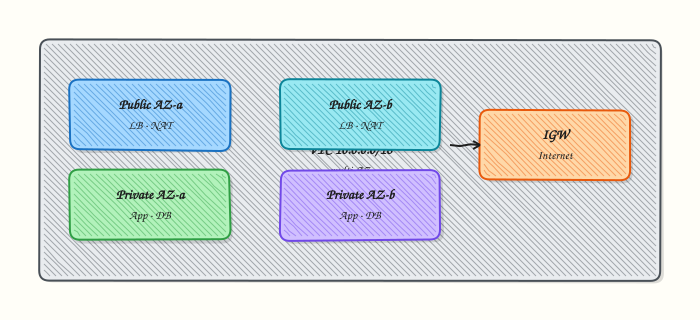

# Cloud Networking — VPCs and Subnets

## Overview

A **Virtual Private Cloud (VPC)** is your private Layer-3 network inside a cloud account. You choose a Classless Inter-Domain Routing (CIDR) block, carve it into **subnets**, attach **route tables**, and decide which subnets can reach the internet through an **Internet Gateway (IGW)** or only outbound through a **NAT Gateway**. Azure calls the same idea a **Virtual Network (VNet)**; Google Cloud still uses the name VPC. Wrong CIDRs, missing routes, or putting a database in a public subnet cause outages that look like “the app is down.”

In daily Cloud and DevOps work you design public edge subnets (load balancers, bastions, NAT) and private app/data subnets across at least two Availability Zones (AZs). You compare the same pattern across AWS, Azure, and Google Cloud using different product names. Security Groups (SGs), Network Security Groups (NSGs), and Network Access Control Lists (NACLs) filter traffic after routing is correct.

In production, overlapping CIDRs break peering and hybrid links. A single NAT in one AZ creates a single point of failure and cross-AZ data charges. Teams encode VPC layouts in Infrastructure as Code (IaC) and prove routes with read-only CLI checks before any paid create.

This is **Tutorial 19** in **Module 15: Cloud Networking** of the REBASH Academy **Networking for Cloud & DevOps Engineers** series. It is written for Cloud, DevOps, Platform, and Site Reliability Engineering (SRE) engineers. By the end you will have evidence of a real VPC layout (cloud read-only) or a local public/private subnet simulation you can explain in a design review.

## Prerequisites

- [Kubernetes Networking Fundamentals](kubernetes-networking-fundamentals.md)
- [Routing Fundamentals](routing-fundamentals.md)
- [NAT and Port Forwarding](nat-and-port-forwarding.md)
- Comfort with CIDR notation
- A **practice Ubuntu 22.04/24.04 VM** with `sudo` (for the local simulation path)
- Optional: AWS CLI configured with **read-only** permissions (no create/delete in this lab)

## Learning Objectives

By the end of this tutorial, you will be able to:

- [ ] Explain VPC isolation, CIDR planning, and public vs private subnet roles
- [ ] Map IGW, NAT Gateway, and route tables to outbound and inbound paths
- [ ] Compare AWS / Azure / Google Cloud names for the same building blocks
- [ ] Collect read-only VPC evidence with AWS CLI when credentials exist
- [ ] Build a local namespace simulation of public and private tiers when cloud access is unavailable
- [ ] Avoid overlapping CIDRs for peering and hybrid designs

## Architecture

A multi-AZ VPC keeps the internet edge in public subnets and apps/data in private subnets. Route tables decide the default path (IGW vs NAT).




## Theory

### What it is

A VPC (or VNet) is an isolated IP network you own inside a cloud region. You pick a CIDR (for example `10.0.0.0/16`), create **subnets** (often `/24` per tier per AZ), attach **route tables**, and control access with stateful filters (Security Groups / NSGs / VPC firewall rules) plus optional stateless NACLs.

``` {.bash .ra-terminal title="Terminal"}
# Read-only AWS example (never create paid resources in this tutorial)
aws ec2 describe-vpcs --query 'Vpcs[].{Id:VpcId,Cidr:CidrBlock}' --output table
```

### Why it matters

Every cloud workload sits in a subnet with a route table. If the private subnet has no route to NAT, package installs and outbound APIs fail. If the database subnet has a route to the IGW and an open SG, you have an internet-facing data store. Hybrid and peering designs fail when CIDRs overlap. Platform teams treat the VPC as the foundation for Kubernetes nodes, load balancers, and private service endpoints.

### How it works

1. **Choose CIDR** — non-overlapping with on-prem and other VPCs; leave headroom.
2. **Carve subnets** — public for LB/NAT/bastion; private for app and data; repeat per AZ.
3. **Attach gateways** — IGW for internet; NAT Gateway (or Cloud NAT) for private outbound.
4. **Wire route tables** — public default `0.0.0.0/0` → IGW; private default → NAT.
5. **Filter** — SG/NSG allow least privilege; NACLs only when you need subnet-level guards.
6. **Validate** — describe routes and reachability before blaming the application.

### Key concepts and comparisons

| Subnet | Default route | Typical workloads |
|--------|---------------|-------------------|
| Public | `0.0.0.0/0` → IGW | Load balancers, bastion, NAT Gateway |
| Private | `0.0.0.0/0` → NAT / Cloud NAT | Apps, databases, internal APIs |

| Concept | AWS | Azure | Google Cloud |
|---------|-----|-------|--------------|
| Network | VPC | Virtual Network | VPC |
| Internet edge | Internet Gateway | Public IP + system routes | Routes + internet gateway pattern |
| Outbound NAT | NAT Gateway | NAT Gateway | Cloud NAT |
| Stateful host filter | Security Group | NSG | VPC firewall rules |
| Stateless subnet filter | NACL | (NSG primary) | Hierarchical firewall policies |

### Common pitfalls

- Overlapping `10.0.0.0/8` or `/16` with on-prem — peering and VPN routes break.
- Putting app/data in public subnets “for convenience.”
- One NAT Gateway for all AZs — SPOF and surprise cross-AZ charges.
- Fixing Security Groups when the route table is wrong (or the reverse).
- Creating paid gateways in a learning account without a budget alarm.

## Hands-on Lab

### Objective

Collect **read-only** VPC / subnet / route-table evidence with AWS CLI if configured; otherwise simulate public and private tiers with Linux network namespaces under `~/rebash-networking/lab19`. Do **not** create paid cloud resources.

### Prerequisites

- Ubuntu practice VM with `sudo`, `iproute2`, `ping`
- Optional: `aws` CLI + credentials that can call `ec2:Describe*`
- Do **not** run create/delete VPC APIs in this lab

### Lab environment

Workspace: `~/rebash-networking/lab19`

``` {.bash .ra-terminal title="Terminal"}
mkdir -p ~/rebash-networking/lab19 && cd ~/rebash-networking/lab19
set -euo pipefail
whoami | tee admin-user.txt
ip -br a | tee host-addrs.txt
command -v aws >/dev/null 2>&1 && aws --version | tee aws-version.txt || echo "aws-cli: not installed" | tee aws-version.txt
```

!!! example "Expected output"
    workspace exists; `admin-user.txt` and `host-addrs.txt` are non-empty.


### Real-world scenario

Security asks for proof of your VPC layout before a peer review: which CIDRs, which subnets are public vs private, and what the default routes are. You gather read-only evidence from AWS if you have access. If not, you build a local namespace model that shows the same public/private idea for the change ticket.

### Step-by-step tasks

#### Task 1 – Choose path: AWS read-only or local simulation

``` {.bash .ra-terminal title="Terminal"}
cd ~/rebash-networking/lab19
set -euo pipefail

PATH_CHOICE=local
if command -v aws >/dev/null 2>&1; then
  if aws sts get-caller-identity >/dev/null 2>&1; then
    PATH_CHOICE=aws
  fi
fi
echo "lab19-path=${PATH_CHOICE}" | tee lab-path.txt
```

!!! example "Expected output"
    `lab-path.txt` contains `aws` or `local`.


#### Task 2A – AWS path (read-only describe only)

Skip this task if `lab-path.txt` says `local`.

``` {.bash .ra-terminal title="Terminal"}
cd ~/rebash-networking/lab19
set -euo pipefail
grep -q '=aws$' lab-path.txt

aws ec2 describe-vpcs \
  --query 'Vpcs[].{VpcId:VpcId,Cidr:CidrBlock,IsDefault:IsDefault}' \
  --output table | tee vpcs.txt

aws ec2 describe-subnets \
  --query 'Subnets[].{SubnetId:SubnetId,VpcId:VpcId,Cidr:CidrBlock,Az:AvailabilityZone,MapPublicIp:MapPublicIpOnLaunch}' \
  --output table | tee subnets.txt

aws ec2 describe-route-tables \
  --query 'RouteTables[].{Rtb:RouteTableId,VpcId:VpcId,Routes:Routes}' \
  --output json | tee route-tables.json

python3 - <<'PY' | tee aws-summary.txt
import json
from pathlib import Path
rts = json.loads(Path("route-tables.json").read_text())
print(f"route_tables={len(rts)}")
igw = nat = 0
for rt in rts:
    for r in rt.get("Routes") or []:
        t = str(r.get("GatewayId") or r.get("NatGatewayId") or "")
        if t.startswith("igw-"):
            igw += 1
        if t.startswith("nat-") or r.get("NatGatewayId"):
            nat += 1
print(f"routes_mentioning_igw={igw}")
print(f"routes_mentioning_nat={nat}")
PY

test -s vpcs.txt && test -s subnets.txt && test -s route-tables.json
```

!!! example "Expected output"
    tables/JSON files exist; summary counts route tables and IGW/NAT mentions. No resources are created.


#### Task 2B – Local path (namespace public/private simulation)

Skip this task if `lab-path.txt` says `aws`.

``` {.bash .ra-terminal title="Terminal"}
cd ~/rebash-networking/lab19
set -euo pipefail
grep -q '=local$' lab-path.txt

# Cleanup any previous lab namespaces
for ns in lab19-public lab19-private lab19-router; do
  sudo ip netns del "$ns" 2>/dev/null || true
done

sudo ip netns add lab19-public
sudo ip netns add lab19-private
sudo ip netns add lab19-router

# Router <-> public (simulates IGW side of public subnet)
sudo ip link add veth-pub type veth peer name veth-rpub
sudo ip link set veth-pub netns lab19-public
sudo ip link set veth-rpub netns lab19-router

# Router <-> private (simulates private subnet behind NAT-like router)
sudo ip link add veth-priv type veth peer name veth-rpriv
sudo ip link set veth-priv netns lab19-private
sudo ip link set veth-rpriv netns lab19-router

sudo ip -n lab19-public addr add 10.19.1.10/24 dev veth-pub
sudo ip -n lab19-private addr add 10.19.2.10/24 dev veth-priv
sudo ip -n lab19-router addr add 10.19.1.1/24 dev veth-rpub
sudo ip -n lab19-router addr add 10.19.2.1/24 dev veth-rpriv

sudo ip -n lab19-public link set lo up
sudo ip -n lab19-private link set lo up
sudo ip -n lab19-router link set lo up
sudo ip -n lab19-public link set veth-pub up
sudo ip -n lab19-private link set veth-priv up
sudo ip -n lab19-router link set veth-rpub up
sudo ip -n lab19-router link set veth-rpriv up

sudo ip -n lab19-public route add default via 10.19.1.1
sudo ip -n lab19-private route add default via 10.19.2.1
sudo ip netns exec lab19-router sysctl -w net.ipv4.ip_forward=1 >/dev/null

{
  echo "=== public ==="
  sudo ip -n lab19-public addr show
  sudo ip -n lab19-public route
  echo "=== private ==="
  sudo ip -n lab19-private addr show
  sudo ip -n lab19-private route
  echo "=== router ==="
  sudo ip -n lab19-router addr show
} | tee local-vpc-sim.txt

# Reachability: private can ping public via router (same VPC)
sudo ip netns exec lab19-private ping -c 2 -W 2 10.19.1.10 | tee ping-private-to-public.txt
```

!!! example "Expected output"
    `local-vpc-sim.txt` shows `10.19.1.0/24` public and `10.19.2.0/24` private with defaults via the router; ping succeeds.


#### Task 3 – Evidence pack

``` {.bash .ra-terminal title="Terminal"}
cd ~/rebash-networking/lab19
set -euo pipefail

{
  echo "path=$(cat lab-path.txt)"
  date -u +"collected_at=%Y-%m-%dT%H:%M:%SZ"
} | tee evidence-meta.txt

tar -czf vpc-evidence.tgz \
  admin-user.txt host-addrs.txt aws-version.txt lab-path.txt evidence-meta.txt \
  $(ls vpcs.txt subnets.txt route-tables.json aws-summary.txt 2>/dev/null || true) \
  $(ls local-vpc-sim.txt ping-private-to-public.txt 2>/dev/null || true)
ls -l vpc-evidence.tgz | tee evidence-ls.txt
test -s vpc-evidence.tgz
```

!!! example "Expected output"
    `vpc-evidence.tgz` is non-empty.


### Validation steps

- [ ] `lab-path.txt` is `aws` or `local`
- [ ] AWS path: `vpcs.txt`, `subnets.txt`, and `route-tables.json` exist **or** local path: ping private→public succeeded
- [ ] You can point to which tier is public vs private in your evidence
- [ ] `vpc-evidence.tgz` exists under `~/rebash-networking/lab19`

### Common errors and fixes

| Error | Cause | Fix |
|-------|-------|-----|
| `Unable to locate credentials` | AWS CLI not configured | Use Task 2B local path |
| `AccessDenied` on describe | IAM too tight or wrong | Ask for read-only `ec2:Describe*`; do not create resources |
| `Cannot open network namespace` | Missing `sudo` / capabilities | Run on Ubuntu VM with sudo |
| Ping fails private→public | Router forwarding off or wrong IPs | Re-run Task 2B; confirm `ip_forward=1` |
| Accidental `create-vpc` | Wrong command | Stop; delete only if you created it; this lab is describe/sim only |

### Challenge exercise

Extend the local simulation (or document from AWS evidence) with a short script `classify-subnets.sh` that prints each subnet CIDR and labels it `public-like` or `private-like` based on default route target (IGW vs NAT, or in the sim: presence of a path to the “internet” router interface). Save output as `subnet-classification.txt`. Do not create cloud resources.

### Learning outcomes

- Mapped VPC building blocks across clouds
- Collected read-only cloud evidence or a local public/private model
- Packed proof suitable for a design review ticket

### Cleanup

``` {.bash .ra-terminal title="Terminal"}
cd ~/rebash-networking/lab19
set -euo pipefail

for ns in lab19-public lab19-private lab19-router; do
  sudo ip netns del "$ns" 2>/dev/null || true
done

# Keep evidence archive if you want it; otherwise:
# rm -f vpc-evidence.tgz *.txt *.json
```

## Validation

- [ ] Lab finished under `~/rebash-networking/lab19/` with evidence
- [ ] You can explain public vs private routes (IGW vs NAT)
- [ ] You can map AWS / Azure / GCP names for the same pattern
- [ ] You know why overlapping CIDRs break hybrid and peering

## Code Walkthrough

In real cloud accounts, VPC work usually follows this order:

1. **Inspect before you change** — `describe-vpcs`, `describe-subnets`, `describe-route-tables` (or Terraform plan)
2. **Prefer small, reviewed IaC** — one module per environment; no console-only drifts
3. **Prove routes** — default route target, AZ coverage, NAT placement
4. **Least privilege filters** — SG/NSG after routing is correct
5. **Never create paid gateways** in a lab without budget controls

Humans still decide CIDR strategy and blast radius; automation applies the approved design.

## Security Considerations

- Prefer private subnets for compute and data; expose only load balancers publicly
- Treat VPC modify permissions as privileged — separate read roles for audits
- Avoid `0.0.0.0/0` on data-plane ports in Security Groups
- Tag resources with owner and environment for cost and incident response
- Log flow decisions (VPC Flow Logs) when debugging deny paths

## Common Mistakes

!!! warning "Creating NAT Gateways or VPCs in a learning lab"
    Paid resources can surprise your bill. **Fix:** use read-only `describe-*` or a local namespace simulation only.

!!! warning "Assuming MapPublicIpOnLaunch means the subnet is correctly routed"
    A subnet also needs a route to an IGW. **Fix:** always check the route table association.

!!! warning "One NAT for all AZs"
    Failures and cross-AZ charges follow. **Fix:** NAT Gateway (or equivalent) per AZ for production.

!!! warning "Overlapping CIDRs with on-prem"
    VPN and peering cannot route the same prefixes both ways. **Fix:** plan non-overlapping ranges before build.

## Best Practices

- Design multi-AZ from day one; document reserved CIDRs
- Public for edge only; private for app and data
- Encode VPC layout in IaC with pull-request review
- Use Flow Logs / equivalent when connectivity tickets appear
- Keep a read-only “network inventory” script for audits

## Troubleshooting

| Symptom | Likely cause | Fix |
|---------|--------------|-----|
| No outbound from private instance | Missing NAT route | Point private RT `0.0.0.0/0` to NAT |
| No inbound to app | Wrong subnet or SG | Prefer private app + public LB |
| Peering fails | Overlapping CIDR | Re-IP or redesign |
| Cross-AZ cost spike | Central NAT | NAT per AZ |
| DNS works, TCP fails | SG/NACL deny | Check filters after routes |

## Summary

A VPC is your cloud Layer-3 boundary: CIDRs, subnets, route tables, and gateways. Keep the internet edge public and workloads private, plan non-overlapping ranges, and prove layout with read-only evidence. Next, connect hybrid networks safely in [VPN and Tunneling Basics](vpn-and-tunneling-basics.md).

## Interview Questions

**1. What is the difference between a public and a private subnet in a VPC?**

??? success "Reveal answer"
    A **public** subnet has a default route to an **Internet Gateway**, so instances (with public IPs or through an LB) can be reached from or initiate to the internet according to filters. A **private** subnet has no direct IGW route; outbound usually goes through a **NAT Gateway** (or Cloud NAT). Apps and databases belong in private subnets; load balancers and bastions sit at the edge.

**2. An app in a private subnet cannot reach the internet for package updates. What do you check first?**

??? success "Reveal answer"
    Check the **route table** association for that subnet: `0.0.0.0/0` should point to a healthy NAT Gateway (or equivalent). Then check Security Group **egress**, NACL rules, and that the NAT itself sits in a public subnet with an IGW route. Do not start by recreating the instance.

**3. Why is a single NAT Gateway for three AZs a production risk?**

??? success "Reveal answer"
    If that AZ or NAT fails, **all private outbound** can fail. Traffic from other AZs also crosses AZ boundaries and can raise cost. Production designs place NAT (or equivalent) **per AZ** and watch bytes and errors per NAT.

**4. How do AWS Security Groups and NACLs differ at a high level?**

??? success "Reveal answer"
    **Security Groups** are stateful, usually attached to instances/ENIs, and allow-list based. **NACLs** are stateless subnet-level filters (allow and deny) and evaluate rules in order. Most teams rely on SGs first and add NACLs only for specific subnet guards.

**5. How would you prove a VPC design is multi-AZ without creating new resources?**

??? success "Reveal answer"
    Use read-only `describe-subnets` (or portal/IaC state) and show the same tier present in **two or more AZs**, with route tables and NAT/LB coverage per AZ. Attach the table output to the design ticket.

**6. Azure VNet vs AWS VPC — what stays the same for an interview answer?**

??? success "Reveal answer"
    The **pattern** stays the same: isolated CIDR, subnets, routes, public edge vs private compute, outbound NAT, and host/subnet filters (NSG vs SG). Product names and defaults differ (Azure system routes, Google Cloud NAT). Interviewers want the pattern, then correct names.

**7. Why do overlapping CIDRs break hybrid connectivity even if the VPN tunnel is up?**

??? success "Reveal answer"
    Routing needs **unique prefixes**. If on-prem and cloud both use `10.0.0.0/16`, neither side knows which way to send return traffic for that range. The tunnel can show “up” while applications time out. Fix by re-addressing or carefully translating (NAT), preferably by planning non-overlap first.

## Related Tutorials

- [Networking for Cloud & DevOps – Overview](index.md)
- [Kubernetes Networking Fundamentals](kubernetes-networking-fundamentals.md) *(previous)*
- [VPN and Tunneling Basics](vpn-and-tunneling-basics.md) *(next)*
- [Routing Fundamentals](routing-fundamentals.md)
- [NAT and Port Forwarding](nat-and-port-forwarding.md)

## References

- [Amazon VPC User Guide](https://docs.aws.amazon.com/vpc/latest/userguide/)
- [Azure Virtual Network documentation](https://learn.microsoft.com/azure/virtual-network/)
- [Google Cloud VPC documentation](https://cloud.google.com/vpc/docs)
- Track index: [Networking for Cloud & DevOps Engineers](index.md)
