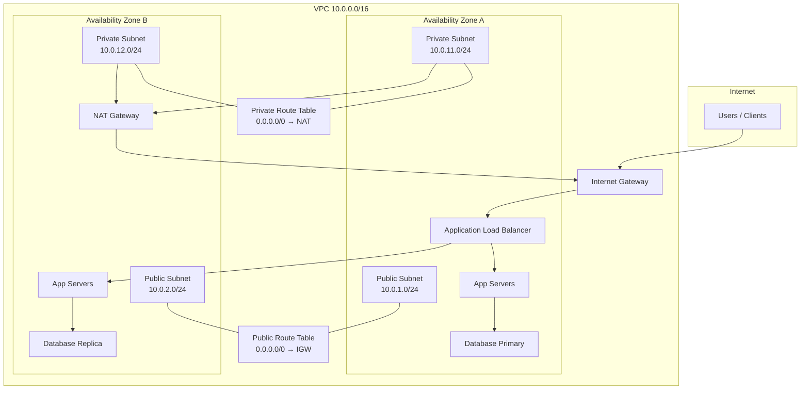

# Cloud Networking — VPCs and Subnets

## Overview

A **Virtual Private Cloud (VPC)** is the foundational network boundary in every major cloud provider. It is your isolated slice of the provider's shared infrastructure — a logically segmented network where you define IP ranges, subnets, routing, and access controls. Every EC2 instance, GKE cluster, and Azure VM lives inside a VPC (or its provider-specific equivalent). Misconfigured VPCs cause more production outages than application bugs: a wrong route table, a subnet without internet access, or overlapping CIDR blocks with an on-premises network can block deployments for hours.

This tutorial teaches you to design production-grade VPC architectures: **public subnets** for load balancers and bastion hosts, **private subnets** for databases and application tiers, **internet gateways (IGW)** for north-south traffic, and **route tables** that control every packet's path. You will learn **multi-AZ** placement for high availability and compare how AWS, GCP, and Azure implement the same concepts with different names.

This is **Tutorial 16** in **Module 6: Cloud & Advanced** of the REBASH Academy Networking series. It follows our [documentation standards](../about.md#documentation-standards) with theory, hands-on labs, and interview preparation.

## Prerequisites

- Completed tutorials on [IP addressing](ip-addressing-and-subnetting.md), [routing](routing-fundamentals.md), and [firewalls](firewalls-and-access-control.md)
- A cloud account with permissions to create VPCs (AWS free tier, GCP trial, or Azure free account)
- AWS CLI v2, `gcloud`, or Azure CLI installed and authenticated (labs include examples for all three)
- Basic comfort with CIDR notation (e.g., `10.0.0.0/16`, `/24` subnets)
- Optional: Terraform or OpenTofu for the infrastructure-as-code lab section

## Learning Objectives

By the end of this tutorial, you will be able to:

- [ ] Explain what a VPC is and how it isolates workloads at Layer 3
- [ ] Design a three-tier VPC with public and private subnets across multiple availability zones
- [ ] Configure internet gateways, route tables, and subnet associations correctly
- [ ] Choose non-overlapping CIDR blocks for VPC peering and hybrid connectivity
- [ ] Compare VPC implementations across AWS, GCP, and Azure
- [ ] Validate VPC connectivity using CLI tools and route table inspection
- [ ] Apply multi-AZ design patterns for high availability

## Architecture Diagram

The diagram below shows a standard **multi-AZ VPC** with two public subnets (for NAT gateways and load balancers) and two private subnets (for application and database tiers). Each AZ has its own subnet pair; route tables differ between public and private tiers.



## Theory

### What Is a VPC?

A **Virtual Private Cloud** is a software-defined network that runs inside a cloud provider's physical data centers. You control:

- **IP address space** — typically a `/16` (65,536 addresses) like `10.0.0.0/16`
- **Subnets** — smaller divisions within the VPC, each bound to one availability zone
- **Routing** — route tables that direct traffic locally, to the internet, or to peered networks
- **Gateways** — internet gateways, NAT gateways, VPN gateways, and transit gateways
- **Security policies** — security groups (stateful) and network ACLs (stateless) on AWS; firewall rules on GCP/Azure

Unlike a traditional data center VLAN, a VPC is created in seconds via API. The cloud provider manages the underlying switches, routers, and hypervisor networking — you define the logical topology.

### Public vs Private Subnets

The terms **public** and **private** refer to routing, not encryption or security groups:

| Subnet type | Route to internet | Typical workloads | Public IP |
|-------------|-------------------|-------------------|-----------|
| **Public** | Direct via IGW (`0.0.0.0/0 → igw-xxx`) | Load balancers, NAT gateways, bastion hosts | Often yes |
| **Private** | Indirect via NAT gateway, or no internet route | App servers, databases, internal APIs | No (RFC 1918 only) |

A subnet is **public** only if its route table sends `0.0.0.0/0` to an internet gateway **and** instances can receive public IPs. A private subnet may still reach the internet outbound through a NAT gateway — but inbound connections from the internet cannot reach private instances directly.

!!! warning "Security groups are not subnet boundaries"
    Placing a database in a "private" subnet does not automatically secure it. You must also restrict security groups / firewall rules to allow traffic only from application tier subnets on port 5432 (PostgreSQL) or 3306 (MySQL).

### Internet Gateway (IGW)

An **Internet Gateway** is a horizontally scaled, redundant component attached to your VPC. It performs two functions:

1. **NAT for instances with public IPs** — translates between private VPC addresses and public internet addresses
2. **Target for default routes** — the destination in `0.0.0.0/0 → igw-xxx` route table entries

One IGW per VPC is typical. It is not a single VM you SSH into — it is managed infrastructure. Detaching or deleting an IGW breaks all public internet connectivity for associated subnets.

### Route Tables

**Route tables** are the control plane of VPC networking. Every subnet must be associated with exactly one route table. Common routes:

| Destination | Target | Purpose |
|-------------|--------|---------|
| `10.0.0.0/16` | `local` | Traffic within the VPC stays internal |
| `0.0.0.0/0` | `igw-xxx` | Public internet (public subnets) |
| `0.0.0.0/0` | `nat-xxx` | Outbound internet only (private subnets) |
| `172.16.0.0/12` | `pcx-xxx` / VPN | Peered VPC or on-premises via VPN |

Route tables are **stateless at the routing layer** — return traffic must have a valid route in the opposite direction. This is why NAT gateways sit in public subnets: private instances send outbound traffic to NAT; NAT uses its public IP via the IGW.

### Multi-AZ Design

**Availability Zones (AZs)** are isolated data centers within a region. A production VPC spans at least two AZs so that failure of one data center does not take down your service.

Multi-AZ patterns:

- **Load balancer** — spans AZs; health checks route around failed targets
- **NAT gateway** — one per AZ (recommended) to avoid cross-AZ NAT traffic charges and single-AZ failure
- **Database** — primary in AZ-A, synchronous or async replica in AZ-B (RDS Multi-AZ, Cloud SQL HA)
- **Subnets** — never span AZs; each subnet belongs to exactly one AZ

### CIDR Planning

Before creating a VPC, plan address space to avoid painful migrations:

- Use **RFC 1918** private ranges: `10.0.0.0/8`, `172.16.0.0/12`, `192.168.0.0/16`
- Standard production pattern: `/16` VPC with `/24` subnets (256 addresses each; AWS reserves 5 per subnet)
- Leave room for growth: unused `/24` blocks for future tiers (cache, batch, analytics)
- **Never overlap** with on-premises, other VPCs you will peer, or corporate VPN ranges
- Document your IP plan in a shared runbook — Terraform modules should reference variables, not hard-coded CIDRs scattered across repos

Example allocation for `10.0.0.0/16`:

| Subnet | CIDR | AZ | Tier |
|--------|------|-----|------|
| public-a | 10.0.1.0/24 | us-east-1a | LB, NAT |
| public-b | 10.0.2.0/24 | us-east-1b | LB, NAT |
| private-app-a | 10.0.11.0/24 | us-east-1a | Application |
| private-app-b | 10.0.12.0/24 | us-east-1b | Application |
| private-db-a | 10.0.21.0/24 | us-east-1a | Database |
| private-db-b | 10.0.22.0/24 | us-east-1b | Database |

### AWS vs GCP vs Azure Comparison

| Concept | AWS | GCP | Azure |
|---------|-----|-----|-------|
| Virtual network | VPC | VPC Network | Virtual Network (VNet) |
| Subnet scope | Regional (AZ-specific) | Regional (subnet spans region*) | Regional (AZ optional) |
| Internet access | Internet Gateway | Default internet gateway route | Implicit via public IP |
| Instance firewall | Security Groups + NACLs | VPC firewall rules + tags | NSGs + ASGs |
| NAT | NAT Gateway (managed) | Cloud NAT | NAT Gateway |
| Peering | VPC Peering / Transit Gateway | VPC Network Peering | VNet Peering |
| DNS | Route 53 Resolver | Cloud DNS | Azure DNS |

*GCP subnets are regional resources; primary and secondary IP ranges can be defined per subnet. Azure and AWS subnets are tied to a single AZ for high-availability placement.

### VPC Endpoints and Private Connectivity

For private subnets that need AWS/GCP/Azure API access without traversing the public internet, use **VPC endpoints** (AWS), **Private Google Access** (GCP), or **Private Link** (Azure). These keep management traffic off the IGW path — covered further in [NAT and Port Forwarding](nat-and-port-forwarding.md) and [VPN and Tunneling Basics](vpn-and-tunneling-basics.md).

## Hands-on Lab

These labs use AWS CLI as the primary example. Adapt commands to `gcloud` or `az` using the comparison table above.

### Step 1 – Inspect your default VPC (AWS)

**Command:**

```bash
aws ec2 describe-vpcs --query 'Vpcs[*].[VpcId,CidrBlock,IsDefault]' --output table
aws ec2 describe-subnets --filters "Name=default-for-az,Values=true" \
  --query 'Subnets[*].[SubnetId,CidrBlock,AvailabilityZone,MapPublicIpOnLaunch]' --output table
```

**Explanation:** Every AWS account includes a default VPC with a public subnet per AZ. Understanding the default layout helps you recognize why `launch-wizard-1` security groups allow SSH from anywhere — default VPCs are designed for quick starts, not production.

**Expected output:**

```text
-------------------------------------------------------
|                    DescribeVpcs                     |
+------------------------+---------------+----------+
|  vpc-0a1b2c3d4e5f6g7h8 |  172.31.0.0/16|  True    |
+------------------------+---------------+----------+

Public subnets with MapPublicIpOnLaunch = True
```

### Step 2 – Create a custom VPC with public and private subnets

**Command:**

```bash
# Create VPC
VPC_ID=$(aws ec2 create-vpc --cidr-block 10.0.0.0/16 \
  --tag-specifications 'ResourceType=vpc,Tags=[{Key=Name,Value=lab-vpc}]' \
  --query 'Vpc.VpcId' --output text)
echo "VPC: $VPC_ID"

# Enable DNS hostnames (required for many services)
aws ec2 modify-vpc-attribute --vpc-id "$VPC_ID" --enable-dns-hostnames '{"Value":true}'

# Create Internet Gateway and attach
IGW_ID=$(aws ec2 create-internet-gateway \
  --tag-specifications 'ResourceType=internet-gateway,Tags=[{Key=Name,Value=lab-igw}]' \
  --query 'InternetGateway.InternetGatewayId' --output text)
aws ec2 attach-internet-gateway --internet-gateway-id "$IGW_ID" --vpc-id "$VPC_ID"
echo "IGW: $IGW_ID"
```

**Explanation:** DNS hostnames allow instances to receive public DNS names (`ec2-xx-xx-xx-xx.compute-1.amazonaws.com`). The IGW must be attached before public routing works.

### Step 3 – Create subnets in two availability zones

**Command:**

```bash
AZ1=$(aws ec2 describe-availability-zones --query 'AvailabilityZones[0].ZoneName' --output text)
AZ2=$(aws ec2 describe-availability-zones --query 'AvailabilityZones[1].ZoneName' --output text)

PUB_SUBNET=$(aws ec2 create-subnet --vpc-id "$VPC_ID" --cidr-block 10.0.1.0/24 \
  --availability-zone "$AZ1" \
  --tag-specifications 'ResourceType=subnet,Tags=[{Key=Name,Value=lab-public-a}]' \
  --query 'Subnet.SubnetId' --output text)

PRIV_SUBNET=$(aws ec2 create-subnet --vpc-id "$VPC_ID" --cidr-block 10.0.11.0/24 \
  --availability-zone "$AZ1" \
  --tag-specifications 'ResourceType=subnet,Tags=[{Key=Name,Value=lab-private-a}]' \
  --query 'Subnet.SubnetId' --output text)

aws ec2 modify-subnet-attribute --subnet-id "$PUB_SUBNET" \
  --map-public-ip-on-launch '{"Value":true}'
echo "Public: $PUB_SUBNET | Private: $PRIV_SUBNET"
```

**Explanation:** Public subnets auto-assign public IPs at launch. Private subnets do not — instances there are reachable only from within the VPC unless you add a load balancer or bastion.

### Step 4 – Configure route tables

**Command:**

```bash
# Public route table: default route to IGW
PUB_RT=$(aws ec2 create-route-table --vpc-id "$VPC_ID" \
  --tag-specifications 'ResourceType=route-table,Tags=[{Key=Name,Value=lab-public-rt}]' \
  --query 'RouteTable.RouteTableId' --output text)
aws ec2 create-route --route-table-id "$PUB_RT" --destination-cidr-block 0.0.0.0/0 \
  --gateway-id "$IGW_ID"
aws ec2 associate-route-table --route-table-id "$PUB_RT" --subnet-id "$PUB_SUBNET"

# Private route table: local only (no internet yet)
PRIV_RT=$(aws ec2 create-route-table --vpc-id "$VPC_ID" \
  --tag-specifications 'ResourceType=route-table,Tags=[{Key=Name,Value=lab-private-rt}]' \
  --query 'RouteTable.RouteTableId' --output text)
aws ec2 associate-route-table --route-table-id "$PRIV_RT" --subnet-id "$PRIV_SUBNET"

aws ec2 describe-route-tables --route-table-ids "$PUB_RT" "$PRIV_RT" \
  --query 'RouteTables[*].[RouteTableId,Routes]' --output json
```

**Explanation:** The public route table sends all non-local traffic to the IGW. The private route table has only the implicit `local` route — instances in the private subnet cannot reach the internet until you add a NAT gateway (Tutorial 17).

**Expected output:** Public RT includes `{ "Destination": "0.0.0.0/0", "GatewayId": "igw-..." }`. Private RT has only the local VPC route.

### Step 5 – Validate routing from a test instance

Launch a t3.micro in the public subnet (if your account allows), SSH in, and compare with a private instance:

```bash
# From public instance
curl -s --max-time 5 ifconfig.me && echo
ip route show default

# From private instance (no public IP — use SSM Session Manager or bastion)
curl -s --max-time 5 ifconfig.me   # Should fail or timeout without NAT
ip route show
```

**Explanation:** Public instances reach the internet directly. Private instances without a NAT route cannot resolve external endpoints — this is expected and desirable for database tiers.

### Step 6 – Clean up lab resources

**Command:**

```bash
# Terminate instances first, then delete subnets, IGW, VPC
aws ec2 delete-internet-gateway --internet-gateway-id "$IGW_ID"  # detach first
aws ec2 detach-internet-gateway --internet-gateway-id "$IGW_ID" --vpc-id "$VPC_ID"
aws ec2 delete-internet-gateway --internet-gateway-id "$IGW_ID"
# Delete subnets, route tables, then VPC
```

**Explanation:** AWS enforces dependency order on deletion. Always destroy in reverse creation order to avoid orphaned resources and billing surprises.

## Commands

| Command | Description | Example |
|---------|-------------|---------|
| `aws ec2 describe-vpcs` | List VPCs and CIDR blocks | `aws ec2 describe-vpcs --output table` |
| `aws ec2 describe-subnets` | List subnets with AZ and CIDR | `aws ec2 describe-subnets --filters Name=vpc-id,Values=vpc-xxx` |
| `aws ec2 describe-route-tables` | Show routes and associations | `aws ec2 describe-route-tables --route-table-ids rtb-xxx` |
| `aws ec2 create-vpc` | Create new VPC | `aws ec2 create-vpc --cidr-block 10.0.0.0/16` |
| `aws ec2 create-subnet` | Create subnet in VPC/AZ | `aws ec2 create-subnet --vpc-id vpc-xxx --cidr-block 10.0.1.0/24` |
| `aws ec2 create-route` | Add route to route table | `aws ec2 create-route --route-table-id rtb-xxx --destination-cidr-block 0.0.0.0/0 --gateway-id igw-xxx` |
| `gcloud compute networks list` | List GCP VPC networks | `gcloud compute networks list` |
| `gcloud compute networks subnets list` | List GCP subnets | `gcloud compute networks subnets list --network=lab-vpc` |
| `az network vnet list` | List Azure VNets | `az network vnet list -o table` |
| `ip route show` | Instance-level routing table | `ip route show` (on Linux VM) |

## Code

### Terraform module — multi-AZ VPC skeleton

Save as `modules/vpc/main.tf`. This is a starting point for production modules — add NAT, endpoints, and flow logs before deploying to prod.

```hcl
variable "name" { type = string }
variable "cidr" { type = string default = "10.0.0.0/16" }
variable "azs" { type = list(string) }

resource "aws_vpc" "this" {
  cidr_block           = var.cidr
  enable_dns_hostnames = true
  enable_dns_support   = true
  tags                 = { Name = var.name }
}

resource "aws_internet_gateway" "this" {
  vpc_id = aws_vpc.this.id
  tags   = { Name = "${var.name}-igw" }
}

resource "aws_subnet" "public" {
  count                   = length(var.azs)
  vpc_id                  = aws_vpc.this.id
  cidr_block              = cidrsubnet(var.cidr, 8, count.index + 1)
  availability_zone       = var.azs[count.index]
  map_public_ip_on_launch = true
  tags                    = { Name = "${var.name}-public-${var.azs[count.index]}" }
}

resource "aws_subnet" "private" {
  count             = length(var.azs)
  vpc_id            = aws_vpc.this.id
  cidr_block        = cidrsubnet(var.cidr, 8, count.index + 11)
  availability_zone = var.azs[count.index]
  tags              = { Name = "${var.name}-private-${var.azs[count.index]}" }
}

resource "aws_route_table" "public" {
  vpc_id = aws_vpc.this.id
  route {
    cidr_block = "0.0.0.0/0"
    gateway_id = aws_internet_gateway.this.id
  }
  tags = { Name = "${var.name}-public-rt" }
}

resource "aws_route_table_association" "public" {
  count          = length(aws_subnet.public)
  subnet_id      = aws_subnet.public[count.index].id
  route_table_id = aws_route_table.public.id
}
```

## Common Mistakes

!!! warning "Using the default VPC for production"
    Default VPCs have permissive settings and predictable CIDR ranges (`172.31.0.0/16`) that often overlap with other accounts. Always create a custom VPC with documented CIDR planning for production workloads.

!!! warning "Single NAT gateway for all AZs"
    One NAT gateway saves cost but creates a single point of failure and cross-AZ data charges. Production architectures deploy one NAT gateway per AZ in public subnets.

!!! warning "Assuming 'private subnet' means encrypted or secure"
    Private subnets only control routing. Without restrictive security groups, an compromised instance in a public subnet can still reach your database if rules allow it.

!!! warning "Subnet CIDR too small"
    AWS reserves 5 IP addresses per subnet. A `/28` (16 addresses) leaves only 11 usable — insufficient for an auto-scaling group. Use `/24` minimum for instance subnets; `/28` only for tiny purpose-built networks.

!!! warning "Forgetting to enable DNS hostnames"
    Many AWS services (ALB, RDS, EKS) require `enableDnsHostnames`. Create this habit in Terraform modules and CloudFormation templates from day one.

## Best Practices

!!! tip "Use infrastructure as code for all VPC changes"
    Hand-crafted VPCs drift from documentation within weeks. Terraform, CloudFormation, or Pulumi modules with code review enforce consistent tagging, flow logs, and CIDR allocation.

!!! tip "Enable VPC Flow Logs from the start"
    Flow logs capture accepted/rejected traffic metadata to CloudWatch or S3. They are essential for security audits and troubleshooting — enable them before an incident, not after.

!!! tip "Tag everything with Environment, Owner, and CostCenter"
    Untagged VPC resources are the #1 source of cloud billing surprises. Enforce tagging policies via AWS Organizations SCPs or GCP organization constraints.

!!! tip "Plan hybrid connectivity CIDR before first VPC"
    If you will connect on-premises via VPN or Direct Connect, coordinate IP ranges with your network team before allocating `10.0.0.0/16`. Overlapping CIDR blocks cannot be peered without NAT tricks that break end-to-end connectivity.

!!! tip "Separate prod and non-prod at the account or VPC level"
    Never run staging and production in the same VPC with only security group separation. Use separate VPCs or, better, separate AWS accounts under Organizations.

## Troubleshooting

| Issue | Cause | Solution |
|-------|-------|----------|
| Instance in public subnet cannot reach internet | Missing IGW route or IGW not attached | Verify route table has `0.0.0.0/0 → igw-xxx`; confirm IGW attached to VPC |
| Instance has no public IP | Subnet `MapPublicIpOnLaunch` false; no Elastic IP | Enable auto-assign public IP or attach EIP |
| Private instance cannot pull packages | No NAT gateway or missing private route | Add NAT in public subnet; route `0.0.0.0/0 → nat-xxx` on private RT |
| VPC peering connection fails | Overlapping CIDR blocks | Redesign CIDR ranges; peering requires non-overlapping address space |
| DNS resolution fails inside VPC | `enableDnsSupport` or `enableDnsHostnames` disabled | Enable both VPC DNS attributes |
| Cross-AZ latency spikes | Traffic hairpinning through single NAT in different AZ | Deploy per-AZ NAT gateways; keep traffic within AZ |
| Cannot delete VPC | Dependent ENIs, NAT gateways, or subnets remain | Delete instances, LB, NAT, endpoints, then subnets, IGW, VPC |

## Summary

- A **VPC** is your isolated Layer 3 network in the cloud — you define CIDR, subnets, routes, and gateways
- **Public subnets** route `0.0.0.0/0` to an **Internet Gateway**; **private subnets** use **NAT gateways** for outbound-only internet
- **Route tables** control packet paths — every subnet associates with exactly one route table
- **Multi-AZ** design places redundant subnets, NAT gateways, and load balancers across isolated data centers
- **CIDR planning** must avoid overlaps with peered VPCs, VPN, and on-premises networks
- AWS, GCP, and Azure use different names but the same concepts: virtual network, subnet, IGW/NAT, firewall rules
- Production VPCs are created via **IaC**, tagged consistently, and instrumented with **flow logs**

## Interview Questions

1. What is a VPC, and how does it differ from a traditional on-premises VLAN?
2. Explain the difference between a public subnet and a private subnet. What makes a subnet "public"?
3. What is the role of an Internet Gateway in AWS VPC architecture?
4. Why do private subnets need a NAT gateway to reach the internet?
5. How would you design a VPC for a three-tier web application with high availability?
6. What happens if two VPCs you want to peer have overlapping CIDR blocks?
7. Compare security groups and network ACLs in AWS. When would you use each?
8. Why deploy one NAT gateway per availability zone instead of one for the entire VPC?
9. How do GCP VPC networks differ from AWS VPCs in terms of subnet scope?
10. What steps would you take to troubleshoot an EC2 instance that cannot reach the internet?

??? tip "Sample Answers (Questions 2, 4, and 6)"

    **Q2 — Public vs private subnet:** A subnet is public when its route table contains a route sending `0.0.0.0/0` to an internet gateway, and instances can obtain public IP addresses. "Public" describes routing behavior, not security level. A private subnet lacks a direct IGW route — instances use private RFC 1918 addresses only. Private subnets may still reach the internet outbound via NAT, but the internet cannot initiate connections to them.

    **Q4 — NAT gateway purpose:** Private instances have no public IP, so return traffic from internet destinations would have nowhere to route back. A NAT gateway in a public subnet translates outbound connections from private IPs to its own public IP (SNAT). Responses return to NAT, which forwards to the original private instance. Inbound-initiated connections still cannot reach private instances — that is the security property.

    **Q6 — Overlapping CIDR:** VPC peering requires non-overlapping CIDR blocks because routing uses longest-prefix match — if both VPCs use `10.0.0.0/16`, the router cannot distinguish which VPC owns `10.0.1.50`. Peering creation fails or routes conflict. Fix by redesigning one VPC's CIDR (painful migration) or using NAT-based connectivity (breaks end-to-end IP visibility). Prevention via IP address management (IPAM) before the first VPC is the only clean solution.

## Related Tutorials

- [Networking – Category Overview](index.md)
- [Packet Analysis with tcpdump and Wireshark](packet-analysis-tcpdump-wireshark.md) *(previous in Module 6)*
- [NAT and Port Forwarding](nat-and-port-forwarding.md) *(next in Module 6)*
- [Linux – Category Overview](../linux/index.md)
- [Docker – Category Overview](../docker/index.md)
- [Learning Paths – DevOps Engineer](../learning-paths/index.md)

## References

- [AWS VPC User Guide](https://docs.aws.amazon.com/vpc/latest/userguide/) — official VPC documentation
- [GCP VPC Network Overview](https://cloud.google.com/vpc/docs/vpc) — Google Cloud networking
- [Azure Virtual Network Documentation](https://learn.microsoft.com/en-us/azure/virtual-network/) — Microsoft VNet guide
- [RFC 1918 — Private Address Space](https://www.rfc-editor.org/rfc/rfc1918) — private IP allocation
- [AWS IP Addressing Guide](https://docs.aws.amazon.com/vpc/latest/userguide/vpc-ip-addressing.html) — CIDR and subnet sizing
- [Terraform AWS VPC Module](https://registry.terraform.io/modules/terraform-aws-modules/vpc/aws/latest) — production VPC module reference
