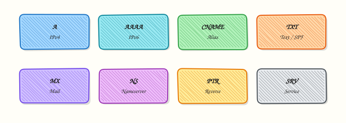

# DNS Records and Troubleshooting

## Overview

Resolution knowledge is half the job. Production breaks on bad **CNAME** choices at the zone apex, stale **TXT** verification records, wrong **MX** for mail, dangling aliases after a load balancer delete, and **split-horizon** mismatches between internal and public Domain Name System (DNS).

This tutorial focuses on the record types you will query every week and a **repeatable dig checklist** implemented as a script that prints evidence — not a markdown notes file as the main artefact.

This is **Tutorial 11** in **Module 9: DNS** of the REBASH Academy **Networking for Cloud & DevOps Engineers** series. It is written for Cloud, DevOps, Site Reliability Engineering (SRE), and platform engineers. Lab workspace: `~/rebash-networking/lab11`.

## Prerequisites

- [DNS Fundamentals](dns-fundamentals.md)
- Ubuntu host with `dig` (`dnsutils`)
- Comfort with UDP/TCP 53 from [TCP and UDP Deep Dive](tcp-and-udp-deep-dive.md)

## Learning Objectives

By the end of this tutorial, you will be able to:

- [ ] Explain A, AAAA, CNAME, MX, TXT, NS, and SOA at a practical level
- [ ] Query each common type with `dig` and read the answer section
- [ ] Recognise NXDOMAIN vs SERVFAIL vs NOERROR empty answers
- [ ] Run a scripted troubleshooting checklist that prints evidence
- [ ] Describe TTL and dangling CNAME risks in cutovers

## Architecture

Clients ask for record types. Aliases (CNAME) point to other names; address records (A/AAAA) end at IPs; MX/TXT serve mail and verification use cases.



## Theory

### What it is

| Type | Meaning |
|------|---------|
| A | Name → IPv4 |
| AAAA | Name → IPv6 |
| CNAME | Name → another name (alias) |
| MX | Mail exchangers (priority + host) |
| TXT | Free-form text (SPF, verification, ACME) |
| NS | Authoritative name servers for a zone |
| SOA | Zone apex metadata (serial, timers) |
| PTR | Reverse DNS (IP → name) — optional deep dive |

```bash
dig example.com A +short
dig example.com MX +short
dig example.com TXT +short
```

### Why it matters

Certificate automation often depends on **TXT**. Mail routing depends on **MX**. Content delivery network (CDN) and load balancer onboarding often use **CNAME**. A dangling CNAME (alias to a deleted cloud resource) is a security and availability risk. Wrong record type troubleshooting wastes hours.

### How it works

1. Ask for the type you need (`dig name TYPE`).
2. Follow CNAMEs until you reach A/AAAA (dig often shows the chain).
3. Read **status**: `NOERROR`, `NXDOMAIN`, `SERVFAIL`.
4. Check **TTL** and **authority** (NS/SOA) when answers look stale or wrong.

```bash
dig this-name-should-not-exist-rebash-lab.example.com A
# Expect status: NXDOMAIN (for a name that truly does not exist)
```

### Key concepts and comparisons

| Status | Meaning |
|--------|---------|
| NOERROR | Query processed; answer may still be empty |
| NXDOMAIN | Name does not exist |
| SERVFAIL | Resolver/server failed to get a valid answer |

| Pitfall | Why it hurts |
|---------|----------------|
| CNAME at apex | Breaks other apex records (MX/NS) in classic DNS |
| Low/high TTL | Slow cutover vs excessive query load |
| Split-horizon | Internal vs public answers disagree |

### Common pitfalls

- Querying only A when the app uses another name (CNAME chain).
- Treating NXDOMAIN as “resolver broken” (it may be a typo).
- Leaving TXT verification records forever without review.
- Using a markdown runbook as the only lab output — automate the checklist.

## Hands-on Lab

### Objective

Query A/AAAA/MX/TXT/CNAME-related data for public names, deliberately observe **NXDOMAIN**, and produce a **shell script** whose stdout is a troubleshooting checklist with dig evidence under `~/rebash-networking/lab11`.

### Prerequisites

- `dig` installed
- Outbound DNS allowed

### Lab environment

Workspace: `~/rebash-networking/lab11`

```bash
mkdir -p ~/rebash-networking/lab11 && cd ~/rebash-networking/lab11
set -euo pipefail
whoami | tee admin-user.txt
command -v dig >/dev/null || { sudo apt-get update && sudo apt-get install -y dnsutils; }
```

**Expected output:** workspace ready; `dig` present.

### Real-world scenario

Marketing added a TXT verification record and mail still fails; someone else reports NXDOMAIN for a microsite. You run a typed dig sweep and a scripted checklist so the incident channel sees facts, not guesses.

### Step-by-step tasks

#### Task 1 – Record type sweep for example.com

```bash
cd ~/rebash-networking/lab11
set -euo pipefail

for t in A AAAA MX TXT NS SOA; do
  echo "===== $t ====="
  dig example.com "$t" +noall +answer +authority | tee "dig-example-${t}.txt"
done

dig www.example.com A +noall +answer | tee dig-www-a.txt
# www may be CNAME or A depending on operator — record what you get
dig www.example.com CNAME +noall +answer | tee dig-www-cname.txt || true

test -s dig-example-A.txt
grep -E 'IN[[:space:]]+A|IN[[:space:]]+AAAA|IN[[:space:]]+MX|IN[[:space:]]+TXT|IN[[:space:]]+NS|IN[[:space:]]+SOA' \
  dig-example-A.txt dig-example-MX.txt dig-example-NS.txt
```

**Expected output:** A, MX, NS, SOA answers present for `example.com`; TXT often present; AAAA optional.

#### Task 2 – Deliberate NXDOMAIN

```bash
cd ~/rebash-networking/lab11
set -euo pipefail

MISSING="rebash-no-such-host-$(date +%s).example.com"
echo "$MISSING" | tee nxdomain-name.txt

dig "$MISSING" A | tee dig-nxdomain.txt
grep -E 'status: NXDOMAIN|NXDOMAIN' dig-nxdomain.txt

# Contrast with a NOERROR name
dig example.com A | tee dig-noerror.txt
grep -E 'status: NOERROR' dig-noerror.txt
```

**Expected output:** missing name shows `NXDOMAIN`; `example.com` shows `NOERROR`.

#### Task 3 – Troubleshooting checklist script (working artefact)

```bash
cd ~/rebash-networking/lab11
set -euo pipefail
```

Create `dns-troubleshoot.sh`:

```bash
#!/usr/bin/env bash
# DNS troubleshooting checklist — prints evidence (not a markdown notes file)
set -euo pipefail
NAME="${1:-example.com}"
MISS="${2:-rebash-no-such-host.example.com}"

section() { printf '\n==== %s ====\n' "$1"; }

section "1) Resolver stub"
cat /etc/resolv.conf

section "2) A / AAAA"
dig "$NAME" A +short
dig "$NAME" AAAA +short

section "3) MX / TXT"
dig "$NAME" MX +short
dig "$NAME" TXT +short | head -n 20

section "4) NS / SOA"
dig "$NAME" NS +short
dig "$NAME" SOA +short

section "5) Status samples"
dig "$NAME" A | awk '/status:/ {print}'
dig "$MISS" A | awk '/status:/ {print}'

section "6) SERVER used"
dig "$NAME" A | awk '/^;; SERVER/ {print}'

section "7) Quick decisions"
echo "If NXDOMAIN: check spelling and zone delegation"
echo "If SERVFAIL: check recursive resolver and upstream"
echo "If wrong IP: check TTL, CNAME chain, split-horizon"
echo "If mail issue: verify MX priorities and related TXT (SPF)"
```

```bash
chmod +x dns-troubleshoot.sh

./dns-troubleshoot.sh example.com "$(cat nxdomain-name.txt)" | tee checklist-output.txt
grep -E 'NXDOMAIN|NOERROR|SERVER|====' checklist-output.txt
test -s checklist-output.txt

tar -czf dns-records-evidence.tgz \
  admin-user.txt dig-example-*.txt dig-www-a.txt dig-www-cname.txt \
  nxdomain-name.txt dig-nxdomain.txt dig-noerror.txt \
  dns-troubleshoot.sh checklist-output.txt
ls -l dns-records-evidence.tgz | tee evidence-ls.txt
```

**Expected output:** `dns-troubleshoot.sh` prints numbered sections to `checklist-output.txt`; archive exists.

### Validation steps

- [ ] A/MX/NS/SOA dig files exist for `example.com`
- [ ] NXDOMAIN demonstrated for a missing name
- [ ] `dns-troubleshoot.sh` ran and produced `checklist-output.txt`
- [ ] Evidence archive under `~/rebash-networking/lab11`

### Common errors and fixes

| Error | Cause | Fix |
|-------|-------|-----|
| Empty TXT | None published | Note absence; not a lab failure |
| www has no CNAME | Apex/www is flat A | Record A answer; still valid |
| Grep misses NXDOMAIN | Locale/format | Search `status:` line in full dig output |
| Script not executable | chmod skipped | `chmod +x dns-troubleshoot.sh` |
| Corporate DNS blocks example.com | Policy | Use an allowed name; keep the same record types |

### Challenge exercise

Add a `CNAME` follow mode to `dns-troubleshoot.sh`: if `dig www.example.com CNAME +short` returns a target, also `dig` A on that target and append section `8) CNAME follow`. Re-run and save `checklist-cname.txt`.

### Learning outcomes

- Queried the common record types used in Cloud/DevOps
- Distinguished NXDOMAIN from NOERROR with evidence
- Shipped a scripted checklist artefact for incidents

### Cleanup

```bash
cd ~/rebash-networking/lab11
# Optional: rm -f dns-records-evidence.tgz *.txt
# Keep dns-troubleshoot.sh if you want it in your toolkit
```

## Validation

- [ ] Lab finished under `~/rebash-networking/lab11/`
- [ ] You can explain A vs CNAME vs MX vs TXT
- [ ] You can say when NXDOMAIN is “expected”
- [ ] You prefer a scripted checklist over ad-hoc dig history

## Code Walkthrough

DNS record troubleshooting usually follows:

1. **Confirm the exact name** — typo and search-domain concatenation  
2. **Query the right types** — A/AAAA/CNAME/MX/TXT as relevant  
3. **Read status** — NXDOMAIN vs SERVFAIL vs NOERROR  
4. **Follow aliases** — CNAME chain to final A/AAAA  
5. **Check authority and TTL** — NS/SOA and cache lifetime  

Automate steps 2–4; keep humans for split-horizon judgement.

## Security Considerations

- Dangling CNAMEs can be claimed by attackers on some clouds — delete unused aliases  
- TXT records can leak environment details — publish only what you need  
- MX changes affect mail security (SPF/DKIM/DMARC via TXT) — change with review  
- Do not paste full internal zone dumps into public chats  
- Prefer signed/managed DNS APIs with least-privilege credentials  

## Common Mistakes

!!! warning "Putting a CNAME on the zone apex next to MX"
    Classic DNS forbids other data next to a CNAME at the same name. **Fix:** use A/AAAA/ALIAS/ANAME features your DNS vendor documents, or redesign.

!!! warning "Assuming NXDOMAIN means DNS is down"
    NXDOMAIN means the name does not exist. **Fix:** verify spelling and delegation; compare SERVFAIL separately.

!!! warning "Leaving stale TXT forever"
    Old verification strings confuse audits. **Fix:** track TXT purpose and expiry in change tickets.

!!! warning "Writing only a markdown checklist as the lab output"
    Checklists rot when not executed. **Fix:** keep a script that prints live dig evidence.

## Best Practices

- Lower TTL before planned cutovers  
- Document CNAME targets and owners  
- Pair MX changes with TXT (SPF) review  
- Store `dns-troubleshoot.sh` in your team’s ops scripts repo  
- Test public and private views for split-horizon zones  

## Troubleshooting

| Symptom | Likely cause | Fix |
|---------|--------------|-----|
| NXDOMAIN | Typo / missing record / bad delegation | Fix zone; verify NS |
| SERVFAIL | Broken resolver or DNSSEC issues | Try another resolver; check DNSSEC |
| Wrong site after change | TTL cache | Wait or flush controlled caches |
| Mail bounce | MX/TXT mismatch | Fix MX priority and SPF |
| Intermittent answers | Multiple resolvers / anycast lag | Compare SERVER lines over time |

## Summary

Record types tell DNS what kind of answer you need. Query them deliberately, read status codes carefully, and keep a script that prints a live checklist. Next: [HTTP, HTTPS, and the Application Layer](http-https-and-application-layer.md).

## Interview Questions

**1. What is the difference between an A record and a CNAME?**

??? success "Reveal answer"
    An **A** record maps a name directly to an **IPv4 address**. A **CNAME** maps a name to **another name**. Clients (or resolvers) must continue lookup until they reach address records. CNAMEs are useful for aliases to load balancers or CDNs but are constrained at the zone apex in classic DNS.

**2. How do MX records work with priorities?**

??? success "Reveal answer"
    An **MX** record lists a mail server name and a **priority** number. Lower numbers are preferred. Senders try the best available MX. MX targets should resolve to A/AAAA (not typically to a CNAME in strict setups). Mis-ordered priorities cause unexpected mail routing.

**3. Give two common uses of TXT records in Cloud/DevOps.**

??? success "Reveal answer"
    **Domain verification** (prove you own a domain to a cloud or software as a service vendor) and **email authentication** such as SPF (and related DMARC policies). Let’s Encrypt DNS-01 challenges also use TXT. TXT is powerful and easy to leave stale — track ownership.

**4. How do you distinguish NXDOMAIN from SERVFAIL in dig?**

??? success "Reveal answer"
    Read the **`status:`** field. **NXDOMAIN** means the name does not exist according to authority. **SERVFAIL** means the resolver could not complete a valid answer (upstream failure, timeout, DNSSEC validation failure, and similar). Fixes differ: create/fix the name vs repair the resolver path.

**5. What is a dangling CNAME and why is it dangerous?**

??? success "Reveal answer"
    A **dangling CNAME** points to a target that no longer exists (for example a deleted cloud load balancer hostname). Attackers may register or claim that target in some platforms and receive your traffic. Delete unused aliases and monitor for NXDOMAIN on CNAME targets.

**6. Why is a scripted dig checklist better than pasting random dig commands in chat?**

??? success "Reveal answer"
    A script ensures the **same fields** every time — resolver config, A/AAAA, MX/TXT, NS/SOA, status lines, and SERVER. That makes diffs between “before” and “after” possible and speeds handovers. Interviewers like operational discipline, not only protocol trivia.

**7. What does SOA help you check during a zone change?**

??? success "Reveal answer"
    The **SOA** (Start of Authority) includes the **serial** and timing fields. Operators bump the serial when the zone changes. Comparing SOA serials across secondaries helps confirm propagation. It does not replace checking the specific record you care about, but it is a useful authority-side signal.

## Related Tutorials

- [Networking for Cloud & DevOps – Overview](index.md)
- [DNS Fundamentals](dns-fundamentals.md) *(previous)*
- [HTTP, HTTPS, and the Application Layer](http-https-and-application-layer.md) *(next)*
- [Production DNS Operations](production-dns-operations.md)

## References

- [IANA — DNS Resource Record Types](https://www.iana.org/assignments/dns-parameters/dns-parameters.xhtml)  
- [`dig(1)`](https://manpages.ubuntu.com/manpages/jammy/en/man1/dig.1.html)  
- [RFC 1035 — DNS](https://www.rfc-editor.org/rfc/rfc1035)  
- Track index: [Networking for Cloud & DevOps Engineers](index.md)
