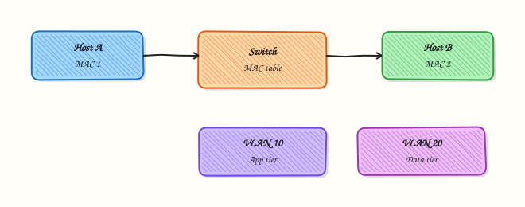

# Ethernet, Switching, and VLANs

## Overview

Before an Internet Protocol (IP) packet can leave your subnet, it travels as an **Ethernet frame** on a local segment. Switches forward those frames using **Media Access Control (MAC)** addresses. **Virtual Local Area Networks (VLANs)** split one physical fabric into separate broadcast domains so app, data, and management traffic do not share the same Layer 2 space.

On cloud virtual machines (VMs), Docker bridges, and Kubernetes nodes you still meet the same ideas: a host MAC, a virtual switch or bridge, and isolation boundaries that map to subnets or security groups. Wrong VLAN or bridge membership looks like “the IP is fine but neighbours never answer.”

This is **Tutorial 7** in **Module 7: Switching** of the REBASH Academy **Networking for Cloud & DevOps Engineers** series. It is written for Cloud, DevOps, Site Reliability Engineering (SRE), and platform engineers. By the end, you will inspect real Layer 2 state on Ubuntu and (when safe) simulate two hosts on a Linux bridge with network namespaces — with evidence under `~/rebash-networking/lab07`.

## Prerequisites

- [Routing Fundamentals](routing-fundamentals.md)
- A **practice Ubuntu 22.04/24.04 VM** (or similar) with `sudo`
- Packages: `iproute2` (provides `ip`); optional `bridge-utils` is not required — modern `ip link` is enough
- Do **not** run namespace or bridge experiments on a shared production jump server

## Learning Objectives

By the end of this tutorial, you will be able to:

- [ ] Explain MAC vs IP and how a switch learns, forwards, and floods frames
- [ ] Define a VLAN, access port, and trunk (802.1Q) in plain language
- [ ] Inspect interface MACs, bridge devices, and link state with `ip`
- [ ] Simulate two Layer 2 hosts with network namespaces and a Linux bridge (or document why bridge is unavailable)
- [ ] State how VLAN IDs map to isolation in cloud and container networks

## Architecture

Layer 2 sits under routing. Hosts share a broadcast domain (often one VLAN ≈ one subnet). A Layer 3 device routes between VLANs.



## Theory

### What it is

A **MAC address** is a 48-bit Layer 2 identifier (six hex octets, for example `02:42:ac:11:00:02`). An **Ethernet II** frame carries destination MAC, source MAC, an **EtherType** (for example `0x0800` for IPv4), and a payload. A **switch** (or Linux bridge) forwards frames inside one broadcast domain. A **VLAN** is a logical segment tagged with a numeric **VLAN ID** (1–4094). Access ports carry one VLAN untagged toward a host; **trunk** ports carry many VLANs with **IEEE 802.1Q** tags.

``` {.bash .ra-terminal title="Terminal"}
ip -br link
ip link show
```

### Why it matters

Cloud VPC subnets, Docker `bridge` networks, and Kubernetes node fabrics are virtual switches. If two apps share the same Layer 2 domain without need, a broadcast or ARP storm can affect both. Mis-matched VLAN IDs between a hypervisor uplink and a guest are a classic “no neighbour, no ping” outage. Platform engineers who understand MAC learning and VLAN isolation debug faster than those who only look at IP routes.

### How it works

1. **Learn** — the switch records source MAC → ingress port.
2. **Forward** — if the destination MAC is known, send only to that port.
3. **Flood** — unknown unicast or broadcast goes to all ports in the VLAN except the ingress port.
4. **Isolate** — different VLAN IDs do not share that flood domain; routing is required between them.

On Linux, a **bridge** (`ip link add type bridge`) behaves like a small software switch. **Network namespaces** give you isolated network stacks so you can attach virtual Ethernet (`veth`) pairs to a bridge and prove Layer 2 connectivity without buying hardware.

``` {.bash .ra-terminal title="Terminal"}
# Conceptual — lab uses safer scripted steps
sudo ip link add br-lab type bridge
sudo ip netns add ns-a
```

### Key concepts and comparisons

| Object | Layer | Job |
|--------|-------|-----|
| MAC | 2 | Identity on a segment |
| Switch / bridge | 2 | Forward frames in one VLAN |
| VLAN ID | 2 | Split broadcast domains |
| IP / route | 3 | Reach other subnets / VLANs |

| Port type | Carries | Tagging |
|-----------|---------|---------|
| Access | One VLAN | Untagged to the host |
| Trunk | Many VLANs | 802.1Q tags on the wire |

| Classic L2 | Cloud / container map |
|------------|------------------------|
| Access VLAN + subnet | VPC subnet |
| Physical switch | Hypervisor / cloud fabric / Linux bridge |
| Host NIC | ENI, `veth`, `docker0`, `cni0` |

### Common pitfalls

- Thinking MAC addresses route across the Internet — routers rewrite MACs each hop.
- Using the same VLAN ID for “prod” and “test” on a shared trunk by mistake.
- Creating real `eth0.VLAN` sub-interfaces on a laptop Wi‑Fi path and breaking the default route.
- Assuming cloud always exposes 802.1Q to the guest — often isolation is only at the subnet / security-group layer.

## Hands-on Lab

### Objective

On a practice Ubuntu VM, inspect Layer 2 state (MAC, link, optional bridge), then either use an existing bridge **or** build a disposable namespace + bridge lab that proves two virtual hosts can see each other at Layer 2. Save evidence under `~/rebash-networking/lab07`. Document VLAN ID concepts in a small script output (no production VLAN tagging on your uplink).

### Prerequisites

- Ubuntu 22.04/24.04 with sudo
- `iproute2` installed
- Ability to create network namespaces (usual on local/practice VMs)

### Lab environment

Workspace: `~/rebash-networking/lab07`

``` {.bash .ra-terminal title="Terminal"}
mkdir -p ~/rebash-networking/lab07 && cd ~/rebash-networking/lab07
set -euo pipefail
whoami | tee admin-user.txt
ip -br link | tee host-links.txt
test -n "$(command -v ip)"
sudo -n true 2>/dev/null || sudo -v
```

!!! example "Expected output"
    `admin-user.txt` and `host-links.txt` exist; `sudo` works.


### Real-world scenario

A new microservice will sit on an internal segment. Platform asks you to prove you understand Layer 2 isolation before they allocate a VLAN or cloud subnet. You capture host MAC evidence, show how a software bridge connects two namespaces (like two VMs on one virtual switch), and write a short VLAN ID concept note for the change ticket — without tagging the production uplink.

### Step-by-step tasks

#### Task 1 – Inspect host Layer 2 state

Record MACs and any existing bridges. Prefer read-only inspection.

``` {.bash .ra-terminal title="Terminal"}
cd ~/rebash-networking/lab07
set -euo pipefail

ip -br link | tee host-links.txt
ip -details link | tee host-link-details.txt

# List bridge devices if any (empty is OK)
{ bridge link 2>/dev/null || ip -d link show type bridge; } | tee bridges.txt || true

# Primary MACs (skip loopback)
ip -o link show | awk -F': ' '$2 != "lo" {print}' | tee macs.txt
grep -E 'link/ether|^[0-9]+:' macs.txt || test -s macs.txt
```

!!! example "Expected output"
    `macs.txt` shows at least one `link/ether` line (or interface entries); bridge list may be empty.


#### Task 2 – Namespace + bridge Layer 2 simulation (safe lab)

Create a disposable bridge and two namespaces connected by `veth` pairs. Assign IPs only inside the lab bridge — do not change your default route.

``` {.bash .ra-terminal title="Terminal"}
cd ~/rebash-networking/lab07
set -euo pipefail

# Cleanup leftovers from a previous run
sudo ip netns del rebash-ns-a 2>/dev/null || true
sudo ip netns del rebash-ns-b 2>/dev/null || true
sudo ip link del rebash-br0 2>/dev/null || true

sudo ip link add rebash-br0 type bridge
sudo ip link set rebash-br0 up

sudo ip netns add rebash-ns-a
sudo ip netns add rebash-ns-b

sudo ip link add veth-a type veth peer name veth-a-br
sudo ip link add veth-b type veth peer name veth-b-br

sudo ip link set veth-a netns rebash-ns-a
sudo ip link set veth-b netns rebash-ns-b
sudo ip link set veth-a-br master rebash-br0
sudo ip link set veth-b-br master rebash-br0
sudo ip link set veth-a-br up
sudo ip link set veth-b-br up

sudo ip -n rebash-ns-a link set lo up
sudo ip -n rebash-ns-b link set lo up
sudo ip -n rebash-ns-a link set veth-a up
sudo ip -n rebash-ns-b link set veth-b up

sudo ip -n rebash-ns-a addr add 10.255.77.1/24 dev veth-a
sudo ip -n rebash-ns-b addr add 10.255.77.2/24 dev veth-b

# Prove Layer 2 / L3 on the lab segment only
sudo ip -n rebash-ns-a ping -c 2 10.255.77.2 | tee ns-ping.txt
sudo ip -n rebash-ns-a ip neigh | tee ns-neigh.txt
bridge link | tee bridge-ports.txt 2>/dev/null || ip link show master rebash-br0 | tee bridge-ports.txt

grep -E '1 received|2 received|bytes from' ns-ping.txt
```

!!! example "Expected output"
    ping between namespaces succeeds; `ns-neigh.txt` shows a neighbour; bridge ports list both `veth-*-br` sides.


#### Task 3 – VLAN ID concepts (document + evidence pack)

Do **not** create `eth0.100` on your uplink. Record VLAN ideas as a checklist script output for the ticket.

``` {.bash .ra-terminal title="Terminal"}
cd ~/rebash-networking/lab07
set -euo pipefail
```

Create `vlan-concepts.sh`:

```bash title="vlan-concepts.sh"
#!/usr/bin/env bash
set -euo pipefail
echo "=== VLAN concept checklist (lab07) ==="
echo "VLAN ID range: 1-4094 (0 and 4095 reserved in 802.1Q)"
echo "Access port: one VLAN, untagged toward the host"
echo "Trunk port: many VLANs, 802.1Q tagged on the wire"
echo "One VLAN ~= one broadcast domain ~= usually one IP subnet"
echo "Between VLANs you need a router (L3), not only a switch"
echo "Cloud note: providers often hide tags; isolation appears as separate subnets"
echo "Lab bridge rebash-br0 used private 10.255.77.0/24 — not your uplink"
```

``` {.bash .ra-terminal title="Terminal"}
chmod +x vlan-concepts.sh
./vlan-concepts.sh | tee vlan-concepts.txt

tar -czf l2-evidence.tgz \
  admin-user.txt host-links.txt macs.txt \
  ns-ping.txt ns-neigh.txt bridge-ports.txt vlan-concepts.txt \
  bridges.txt host-link-details.txt 2>/dev/null || \
tar -czf l2-evidence.tgz \
  admin-user.txt host-links.txt macs.txt \
  ns-ping.txt ns-neigh.txt vlan-concepts.txt
ls -l l2-evidence.tgz | tee evidence-ls.txt
```

!!! example "Expected output"
    `vlan-concepts.txt` lists access vs trunk and VLAN ID range; `l2-evidence.tgz` is non-empty.


### Validation steps

- [ ] `macs.txt` shows host interface MAC data
- [ ] Namespace ping `10.255.77.1` ↔ `10.255.77.2` succeeded
- [ ] `ns-neigh.txt` has a neighbour entry after ping
- [ ] `vlan-concepts.txt` explains access vs trunk
- [ ] `l2-evidence.tgz` exists under `~/rebash-networking/lab07`

### Common errors and fixes

| Error | Cause | Fix |
|-------|-------|-----|
| `Cannot create namespace` | Nested container without privileges | Use a full Ubuntu VM, not a restricted container |
| `RTNETLINK answers: File exists` | Leftover lab devices | Run the cleanup block, then Task 2 again |
| Ping fails between namespaces | Peer not enslaved / not UP | Check `bridge link` and `ip -n … link` |
| No `bridge` command | Optional package missing | Use `ip link show master rebash-br0` instead |
| Tempted to add `eth0.VLAN` | Trying “real” VLAN on Wi‑Fi | Stay on the disposable `rebash-br0` lab only |

### Challenge exercise

Write `bridge-fdb-dump.sh` that runs `bridge fdb show rebash-br0 2>/dev/null || bridge fdb show | grep rebash || ip neigh show` and saves `fdb.txt`. Explain in one line (comment in the script) that FDB/MAC table is how a switch remembers ports — same idea as Task 2 learning after ping.

### Learning outcomes

- Inspected real host MACs and link state
- Built a safe two-namespace bridge that proves Layer 2 adjacency
- Documented VLAN ID / access / trunk concepts without tagging production

### Cleanup

``` {.bash .ra-terminal title="Terminal"}
cd ~/rebash-networking/lab07
set -euo pipefail

sudo ip netns del rebash-ns-a 2>/dev/null || true
sudo ip netns del rebash-ns-b 2>/dev/null || true
sudo ip link del rebash-br0 2>/dev/null || true

# Keep evidence if you want it; otherwise:
# rm -f l2-evidence.tgz *.txt
```

## Validation

- [ ] Lab finished under `~/rebash-networking/lab07/` with evidence files
- [ ] You can explain learn / forward / flood in your own words
- [ ] You can explain why different VLAN IDs need a router between them
- [ ] You know not to create production VLAN sub-interfaces on a shared laptop uplink for practice

## Code Walkthrough

In real networks, Layer 2 work for switching and VLANs usually follows this order:

1. **Inspect before you change** — `ip -br link`, bridge list, neighbour table  
2. **Prefer disposable labs** — namespaces and lab bridges, not the default route interface  
3. **Prove adjacency** — ping + neighbour entry on the lab segment  
4. **Document VLAN intent** — ID, access vs trunk, which subnet maps to which VLAN  
5. **Least surprise** — never retag a production uplink during a learning exercise  

Cloud and Kubernetes still use the same mental model even when 802.1Q is hidden.

## Security Considerations

- Treat VLAN hopping and mis-trunked ports as isolation failures — review trunk allow-lists  
- Do not put management and user workloads on the same flat Layer 2 domain without need  
- Lab namespaces are root-capable; run them only on practice VMs  
- MAC spoofing is possible on shared L2 — combine with port security or cloud ENI controls where required  
- Keep evidence free of secrets; MAC and IP of a lab segment are fine to attach to a ticket  

## Common Mistakes

!!! warning "Blaming DNS when neighbours never appear"
    If ARP/neighbour fails, Layer 2 or VLAN membership is wrong. **Fix:** check VLAN/subnet placement and `ip neigh` before changing DNS.

!!! warning "Creating VLAN sub-interfaces on the wrong NIC"
    A bad `eth0.100` can drop you off the network. **Fix:** practise only on disposable bridges/namespaces; use console/serial access if you must touch real VLANs.

!!! warning "Assuming one big flat L2 is simpler"
    Large broadcast domains amplify storms and make blast radius (how much breaks at once) worse. **Fix:** segment with VLANs or cloud subnets.

!!! warning "Forgetting cleanup after namespace labs"
    Leftover `veth` and bridges confuse the next change. **Fix:** always delete lab netns and `rebash-br0`.

## Best Practices

- One subnet per VLAN (or cloud subnet) unless you have a strong design reason  
- Name VLANs by purpose (`app`, `db`, `mgmt`), not only by number  
- Prefer inspection (`ip`, `bridge`) over packet capture first  
- Map every VLAN to a documented gateway and security boundary  
- In containers, know which bridge/CNI owns the MAC — it is still Layer 2  

## Troubleshooting

| Symptom | Likely cause | Fix |
|---------|--------------|-----|
| Ping works to gateway IP but not to same-subnet host | Wrong VLAN / ACL / isolation | Confirm same L2 domain and security groups |
| Neighbour stuck `FAILED` | Host down or filtered ARP | Check peer link/`ip link`; clear stale neigh if needed |
| Namespace ping fails | veth not in bridge or DOWN | Re-run Task 2; verify `bridge link` |
| `Operation not permitted` | Missing CAP_NET_ADMIN | Use a privileged practice VM |
| Cloud “VLAN” confusion | Provider hides tags | Design with subnets + routes instead of guest 802.1Q |

## Summary

Ethernet, switches, and VLANs decide **who shares a broadcast domain**. Learn MAC forwarding, keep VLAN IDs intentional, and practise safely with Linux bridges and namespaces. Next, deepen control-plane helpers in [ICMP, ARP, DHCP, and Network Services](icmp-arp-dhcp-and-network-services.md).

## Interview Questions

**1. How does a switch decide where to send a unicast Ethernet frame?**

??? success "Reveal answer"
    It looks up the **destination MAC** in its MAC/forwarding table. If the MAC was learned on a port, the frame goes only there. If unknown, the switch **floods** within the VLAN (except the ingress port). Source MACs are learned from frames that arrive, so the table builds over time.

**2. What is the difference between an access port and a trunk port?**

??? success "Reveal answer"
    An **access** port carries **one** VLAN and typically sends traffic **untagged** toward the host. A **trunk** carries **multiple** VLANs and uses **802.1Q tags** on the wire so the far end knows which VLAN each frame belongs to. Mismatched access/trunk config is a common “no connectivity” cause.

**3. Why do different VLANs usually need a router between them?**

??? success "Reveal answer"
    A VLAN is a **Layer 2 broadcast domain**. Hosts in different VLANs do not share that domain, so ARP and Ethernet flooding do not cross. A **Layer 3** device (router or Layer 3 switch / cloud router) forwards IP between the subnets that map to those VLANs.

**4. How do Docker bridges or cloud VPC subnets relate to classic switching?**

??? success "Reveal answer"
    A Docker **bridge** is a software switch for container `veth` pairs — same learn/forward idea. A cloud **subnet** is usually one isolation domain backed by the provider fabric (virtual switching). You may never see 802.1Q tags, but you still design **who shares L2** and **who must route**.

**5. You can ping 8.8.8.8 but not a host on the same /24. What Layer 2 checks do you run first?**

??? success "Reveal answer"
    Check same VLAN/subnet membership, `ip neigh` for the target, MAC/link state (`ip -br link`), and security groups or port ACLs that block ARP or local traffic. Same-subnet failure is often L2/isolation, not default-route failure — because Internet ping already proved a working gateway path.

**6. What is a VLAN ID, and why is tagging production uplinks risky in a learning lab?**

??? success "Reveal answer"
    A **VLAN ID** is the numeric tag (1–4094) that marks which broadcast domain a frame belongs to on a trunk. Creating real tagged sub-interfaces on your only uplink can cut management access if the ID or trunk allow-list is wrong. Labs should use disposable bridges/namespaces first.

**7. What does “flood” mean on a switch, and when is it normal?**

??? success "Reveal answer"
    **Flood** means sending a frame out all ports in the VLAN except the one it arrived on. It is normal for **broadcasts** (including ARP requests) and for **unknown unicast** until the destination MAC is learned. Constant flooding of the same unicast can mean flapping MACs or a learning problem — worth investigating.

## Related Tutorials

- [Networking for Cloud & DevOps – Overview](index.md)
- [Routing Fundamentals](routing-fundamentals.md) *(previous)*
- [ICMP, ARP, DHCP, and Network Services](icmp-arp-dhcp-and-network-services.md) *(next)*
- [Linux Networking Tools](../linux/linux-networking-tools.md)

## References

- [IEEE 802.1Q — Virtual Bridged LANs](https://1.ieee802.org/vlan-802-1q/) — VLAN tagging overview  
- [`ip-link(8)`](https://manpages.ubuntu.com/manpages/jammy/en/man8/ip-link.8.html) — Ubuntu man-pages  
- [`ip-netns(8)`](https://manpages.ubuntu.com/manpages/jammy/en/man8/ip-netns.8.html) — network namespaces  
- Track index: [Networking for Cloud & DevOps Engineers](index.md)
