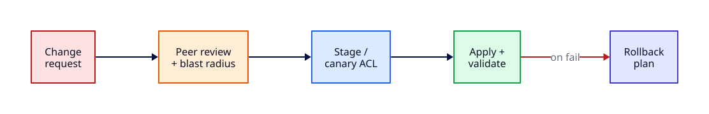

# Firewall Change Control and Production ACLs

## Overview

Firewall rules look simple — allow TCP 443 from the load balancer — until a typo locks out SSH, drops database replication, or opens admin ports to the internet. **Production ACL operations** require the same discipline as schema migrations: **change request**, **blast-radius review**, **canary application**, **validation with ss and curl**, and a **documented rollback**.

This tutorial teaches safe host firewall workflows with **ufw** or **nftables** on a dedicated lab port. Cloud security group IaC patterns appear in [Network Automation and Monitoring](network-automation-and-monitoring.md). Per-host nginx and TLS listener setup stays in [Linux Module 7](../linux/nginx-web-server-and-reverse-proxy.md).

This is **Tutorial 24** in **Module 7: Production Network Operations** of the REBASH Academy Networking series.

## Prerequisites

- Completed [Load Balancer Operations and Health Checks](load-balancer-operations-and-health-checks.md)
- [Firewalls and Access Control](firewalls-and-access-control.md) and [Network Segmentation and Trust Boundaries](network-segmentation-and-trust-boundaries.md)
- Ubuntu/Debian with `sudo`, **console or serial access** before enabling restrictive rules
- `ufw` and/or `nftables`, `ss`, `curl`

## Learning Objectives

By the end of this tutorial, you will be able to:

- [ ] Write a firewall change request with scope, rollback, and validation steps
- [ ] Assess blast radius before applying ACL changes
- [ ] Apply a canary rule to a single lab port before wider rollout
- [ ] Validate rules with `ss`, `curl`, and rule listing commands
- [ ] Roll back a bad rule without losing console access
- [ ] Explain why emergency SSH allow rules precede default-deny changes

## Architecture

Change control gates every ACL modification: request → review → canary → validate → promote or rollback — with console access as the safety net.



## Theory

### Change request template

| Field | Example |
|-------|---------|
| **Ticket** | NET-4521 |
| **Scope** | App tier SG / host ufw |
| **Action** | Allow TCP 8080 from LB SG only |
| **Rollback** | Delete rule `#5`; restore previous ruleset export |
| **Validation** | `ss -tln`; `curl -sI http://127.0.0.1:8080`; flow log sample |
| **Window** | Tue 14:00 UTC, low traffic |
| **Approver** | Network ops lead |

Never apply "quick fixes" without rollback values captured **before** the change.

### Blast radius

Ask before every ACL change:

- Who loses access if this rule is wrong?
- Does default-deny block **return traffic** or **established** sessions?
- Are **management** paths (SSH, SSM, serial) still reachable?
- Does cloud **NACL** conflict with **SG** or host firewall?

Smallest blast radius: **canary one host or one port**, observe, then fleet rollout via Ansible/Terraform.

### Canary ACL pattern

1. Export current rules: `sudo nft list ruleset > /tmp/pre-change.nft` or `ufw status numbered`
2. Add **new allow** before **new deny** on canary host
3. Validate application and monitoring for 15–30 minutes
4. Promote to IaC; remove temporary manual rule if duplicated

For **deny** changes, canary on non-production host first — denies are harder to test without impact.

### Validate with ss and curl

| Tool | Confirms |
|------|----------|
| `ss -tlnp` | Process still listening (rule ≠ service down) |
| `curl -sI URL` | Application responds through allowed path |
| `nc -zv host port` | TCP reachability from source perspective |
| `nft list ruleset` / `ufw status` | Intended rule present and ordered |

Test from **client perspective** matching the rule source — loopback tests alone miss ENI-bound rules.

### Rollback

Rollback is restoring **known-good state**, not guessing:

```bash
# nftables
sudo nft -f /tmp/pre-change.nft

# ufw
sudo ufw delete <rule-number>
# or disable if lockout risk: sudo ufw disable
```

Keep pre-change exports in the ticket. If locked out, use **cloud console serial**, **IPMI**, or **provider SSM** — document these before changes.

### Console access warning

!!! warning "Always confirm console access before restrictive firewall changes"
    SSH sessions can survive while **new** connections fail after a bad deny rule. Maintain an open console session or provider serial access until validation completes. Insert explicit **allow SSH from mgmt CIDR** before enabling default-deny.

## Hands-on Lab

**£0 local lab:** Python HTTP on port 9099, add ufw/nft allow, validate, add deny, rollback.

### Step 1 – Pre-change export and listener

```bash
mkdir -p /tmp/fw-lab
sudo ufw status verbose 2>/dev/null | tee /tmp/fw-lab/pre-ufw.txt || true
sudo nft list ruleset 2>/dev/null | tee /tmp/fw-lab/pre-nft.txt || true

mkdir -p /tmp/fw-lab/www
echo "FW lab service" > /tmp/fw-lab/www/index.html
cd /tmp/fw-lab/www && python3 -m http.server 9099 &
sleep 1
ss -tln | grep 9099
curl -s http://127.0.0.1:9099/
```

**Expected output:** Listener on 9099; curl returns `FW lab service`; pre-change firewall state saved.

### Step 2 – Write change request

```bash
cat <<'EOF' | tee /tmp/fw-lab/change-request.txt
TICKET: LAB-NET-001
SCOPE: localhost lab port 9099
CHANGE: Add ufw allow 9099/tcp (canary)
ROLLBACK: ufw delete allow 9099; stop python listener
VALIDATION: ss -tln | grep 9099; curl http://127.0.0.1:9099/
CONSOLE: confirmed — terminal session open
EOF
cat /tmp/fw-lab/change-request.txt
```

**Expected output:** Completed change template with rollback line.

### Step 3 – Canary allow rule (ufw)

```bash
sudo ufw allow 9099/tcp comment 'LAB canary 9099'
sudo ufw status numbered | grep 9099
curl -s -o /dev/null -w "HTTP %{http_code}\n" http://127.0.0.1:9099/
```

**Expected output:** Rule listed; HTTP 200 from curl.

### Step 3 (alternative) – Canary allow (nftables)

```bash
sudo nft add table inet fwlab 2>/dev/null || true
sudo nft add chain inet fwlab input '{ type filter hook input priority 0; policy accept; }' 2>/dev/null || true
sudo nft add rule inet fwlab input tcp dport 9099 accept comment \"LAB-canary-9099\"
sudo nft list chain inet fwlab input
```

**Expected output:** Explicit accept rule for 9099 visible in chain.

### Step 4 – Simulate mistaken deny (lab only)

```bash
sudo ufw deny 9099/tcp comment 'LAB mistake simulate' 2>/dev/null || true
sudo ufw status numbered | tail -5
# Note: rule order matters — if deny wins, curl may fail from remote clients
curl -s -o /dev/null -w "after deny rule: %{http_code}\n" http://127.0.0.1:9099/ || echo "connect failed — rollback next"
```

**Expected output:** Document whether deny affected connectivity — teaches rule ordering and rollback urgency.

### Step 5 – Rollback to pre-change intent

```bash
# Remove lab rules by comment/port (adjust numbers from 'ufw status numbered')
sudo ufw delete allow 9099/tcp 2>/dev/null || true
sudo ufw delete deny 9099/tcp 2>/dev/null || true
sudo nft delete rule inet fwlab input handle $(sudo nft -a list chain inet fwlab input 2>/dev/null | awk '/9099/{print $NF}' | head -1) 2>/dev/null || true
curl -s http://127.0.0.1:9099/
sudo ufw status numbered | grep 9099 || echo "9099 rules removed"
```

**Expected output:** Service responds again; lab ufw rules for 9099 gone.

### Step 6 – Validation checklist execution

```bash
cat <<'EOF' | tee /tmp/fw-lab/validation.txt
[ ] ss shows listener 9099
[ ] curl returns 200
[ ] ufw/nft lists expected rules only
[ ] rollback tested
[ ] change ticket updated CLOSED
EOF
ss -tln | grep 9099 && curl -s -o /dev/null -w "%{http_code}\n" http://127.0.0.1:9099/
```

**Expected output:** Checklist file; listener up; HTTP 200.

### Step 7 – Cleanup

```bash
kill $(lsof -t -i:9099) 2>/dev/null || true
rm -rf /tmp/fw-lab
```

**Expected output:** Lab listener stopped; artefacts removed (keep ticket pattern in your wiki).

## Validation

Confirm the lab before moving on:

1. Pre-change export exists in `/tmp/fw-lab/` (or your ticket attachment).
2. Allow and rollback steps both succeed.
3. You can articulate console-access requirement before production denies.

| Check | Pass criteria |
|-------|----------------|
| Change request | Ticket fields complete with rollback |
| Canary allow | Rule applied and listed |
| ss/curl validation | Listener and HTTP verified |
| Rollback | Deny/allow lab rules removed |
| Cleanup | Port 9099 freed |

## Code Walkthrough

| Command | Description |
|---------|-------------|
| `sudo ufw status numbered` | Ordered rules for precise delete |
| `sudo nft list ruleset` | Full nftables state for export |
| `sudo nft -f file.nft` | Atomic ruleset restore (rollback) |
| `ss -tlnp` | Listening sockets inventory |
| `curl -sI URL` | Application-level path test |
| `nc -zv 127.0.0.1 PORT` | TCP connect probe |

## Security Considerations

- **Allow mgmt before deny-all** — SSH, SSM, serial console
- Store ruleset exports encrypted; they reveal network topology
- Separate **emergency break-glass** ACL from routine deploy role
- Cloud SG changes need **flow log** confirmation — deny may be silent
- Never open `0.0.0.0/0` on admin ports "temporarily" without expiry ticket

## Common Mistakes

!!! warning "Enabling default-deny without allow SSH"
    Classic lockout. Always insert mgmt allow, validate new session, then tighten.

!!! warning "Rule order inversion in ufw/nft"
    First match wins in many chains — deny before allow blocks intended traffic.

!!! warning "No pre-change export"
    Rollback becomes guesswork; incident extends hours.

!!! warning "Testing only from the firewall host"
    Validate from representative client subnets or jump host matching SG source.

## Best Practices

!!! tip "IaC with plan/apply"
    Terraform security groups and Ansible ufw modules — manual console changes backported within 24h.

!!! tip "Time-boxed temporary rules"
    Comment `expires 2026-08-01` and calendar reminder — remove or promote to permanent.

!!! tip "Pair ACL change with LB/DNS checks"
    New allow useless if DNS still points elsewhere — coordinate Module 7 tutorials.

!!! tip "Automated ss baseline diff"
    Nightly compare listeners to expected matrix from segmentation doc.

## Troubleshooting

| Symptom | Likely cause | Resolution |
|---------|--------------|------------|
| SSH hangs then fails | Deny rule added above allow | Console in; delete deny; fix order |
| curl works, remote fails | Source CIDR mismatch | Match SG/ufw source to real client IP |
| Rule present, no effect | Wrong table/chain hook | `nft list ruleset`; verify inet vs ip |
| Intermittent drops | Stateful tracking missing | Add `ct state established,related accept` |
| ufw delete wrong number | Numbered list shifted | Re-list; delete by exact rule spec |

## Summary

- **Change requests** must include scope, validation, approver, and **rollback values**
- **Blast radius** review precedes every ACL — canary on one host/port when possible
- Validate with **ss** (listening) and **curl** (serving), from realistic client paths
- **Rollback** restores exported ruleset — capture state before change
- **Console access** is mandatory insurance before restrictive production denies
- Host nginx/TLS listeners are configured in **Linux Module 7** — ACLs protect them

## Interview Questions

1. What fields belong in a firewall change request?
2. How do you assess blast radius for a new deny rule?
3. What is a canary ACL rollout?
4. Why validate with ss AND curl?
5. How would you roll back an nftables change?
6. Why keep console access open during firewall changes?
7. How do security groups and host firewalls differ in change workflow?
8. What is rule ordering and why does it matter in ufw/nft?
9. How would you explain firewall change control to a junior engineer in two minutes?
10. What production failure mode appears when teams skip rollback planning?

??? tip "Sample Answers (Questions 1 and 3)"

    **Q1 — Change request fields:** Ticket ID, scope (host/SG), exact rule action, business justification, change window, approver, validation commands (ss/curl/flow logs), and rollback steps with pre-change ruleset export.

    **Q3 — Canary ACL:** Apply the new rule to one non-critical host or port first, monitor metrics and connectivity, then promote via IaC to the fleet after stability — limiting blast radius of mistakes.

## Related Tutorials

- [Networking – Category Overview](index.md)
- [Load Balancer Operations and Health Checks](load-balancer-operations-and-health-checks.md) *(Module 7 — previous)*
- Next: [Network Incident Response and Observability](network-incident-response-and-observability.md) *(Module 7 capstone)*
- [Firewalls and Access Control](firewalls-and-access-control.md)
- [Network Segmentation and Trust Boundaries](network-segmentation-and-trust-boundaries.md)
- [Network Automation and Monitoring](network-automation-and-monitoring.md)
- [nginx Web Server and Reverse Proxy](../linux/nginx-web-server-and-reverse-proxy.md) *(Linux Module 7)*
- Cheat sheet: [Networking Cheat Sheet](../cheatsheets/networking.md)
- Interview prep: [Networking Interview Prep](../interview/networking.md)
- Learning path: [DevOps Engineer](../learning-paths/devops-engineer.md)

## References

- [nftables wiki](https://wiki.nftables.org/wiki-nftables/index.php/Main_Page)
- [Ubuntu ufw guide](https://help.ubuntu.com/community/UFW)
- [AWS Security Group rules](https://docs.aws.amazon.com/vpc/latest/userguide/working-with-security-group-rules.html)
- [NIST SP 800-128 — Security Configuration Management](https://csrc.nist.gov/publications/detail/sp/800-128/final)
