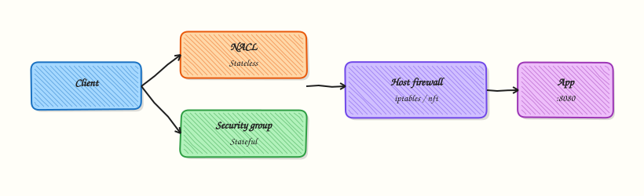

# Firewall Change Control and Production ACLs

## Overview

**Firewall change control** turns “please open port 443” into a reviewed, validated, reversible Access Control List (ACL) or Security Group change. Production ACLs include cloud security groups, network ACLs, host firewalls (`nftables`, `iptables`, Uncomplicated Firewall (UFW)), and perimeter rules. The artefact is a **change package**: intent, exact rule, risk, validation, rollback, and expiry for temporary allows.

In Cloud and DevOps work most “security” outages are change outages — a blocked health check or a forgotten `0.0.0.0/0`. Treat SG/NSG/nft/UFW edits like production code: pull request, plan, canary, verify, rollback.

In production, a single wrong deny can lock out SSH and monitoring. Never practise lockout rules on a shared jump server. This lab applies only a **temporary localhost** rule you can remove safely.

This is **Tutorial 26** in **Module 16: Production Networking** of the REBASH Academy **Networking for Cloud & DevOps Engineers** series. It is written for Cloud, DevOps, Platform, SRE, and DevSecOps engineers. By the end you will have a proposed rule file, a validation script, and cleanup proof under `~/rebash-networking/lab26`. Next you enter **Module 17: Troubleshooting**.

## Prerequisites

- [Firewalls and Access Control](firewalls-and-access-control.md)
- [Load Balancer Operations and Health Checks](load-balancer-operations-and-health-checks.md)
- Practice Ubuntu VM with `sudo` (not a shared production bastion)

## Learning Objectives

By the end of this tutorial, you will be able to:

- [ ] Write a change request with source, destination, port, justification, and expiry
- [ ] Author a proposed `nft`/`ufw` rule file with rollback notes in comments
- [ ] Validate syntax and rule order before apply
- [ ] Apply only a temporary localhost rule and prove it
- [ ] Roll back quickly without production lockout
- [ ] Prefer temporary break-glass allows with automatic expiry planning

## Architecture

Change control wraps every ACL edit: request → review → validate → limited apply → prove → rollback/expiry.



## Theory

### What it is

An ACL or firewall rule decides whether a packet is accepted or denied. **Change control** is the process around editing those rules so the team can answer: who approved it, what exactly changed, how you proved it, and how you undo it.

```bash
# Example intent (do not paste into production blindly)
# allow tcp 127.0.0.1:18090 from 127.0.0.1 for lab expiry 2h
```

### Why it matters

Untracked firewall edits cause outages and breaches. Auditors ask who approved the rule and when it expires. Dual control and Infrastructure as Code (IaC) exist because a single typing mistake can expose a database or block every health check.

### How it works

1. Capture **intent** and ticket (who needs what, for how long).
2. Specify the **exact rule**: source, protocol, port, direction, destination.
3. State **blast radius** (which apps break if wrong) — plain meaning: how wide the damage can be.
4. List **validation** commands for before/after.
5. Prepare **rollback** (previous IaC commit or explicit delete).
6. Set **expiry** for temporary allows and calendar a removal.
7. Apply in a **small window**; prove allow and deny; keep evidence.

| Field | Example |
|-------|---------|
| Source | `127.0.0.1/32` or `sg-app` |
| Destination | `127.0.0.1:18090` |
| Protocol/port | TCP 18090 |
| Justification | Lab health-check listener |
| Expiry | Delete before end of change window |
| Rollback | Delete lab chain / previous IaC commit |

### Common pitfalls

- Applying broad `0.0.0.0/0` “just for now”
- No rollback tested
- Rule order mistakes (first match wins on many systems)
- Blocking the health-check path
- Editing production SSH filters from your only SSH session with no console

## Hands-on Lab

### Objective

Write a proposed nft/ufw rule file with rollback comments, build a validation script (syntax/order checks), and apply **only** a temporary localhost rule that you remove in Cleanup. Never lock out remote SSH. Workspace: `~/rebash-networking/lab26`.

### Prerequisites

- Ubuntu with `sudo`
- Prefer `nft` if available; otherwise `iptables`
- Optional: `ufw` for proposal text only

### Lab environment

Workspace: `~/rebash-networking/lab26`

```bash
mkdir -p ~/rebash-networking/lab26 && cd ~/rebash-networking/lab26
set -euo pipefail
whoami | tee admin-user.txt
command -v nft >/dev/null 2>&1 && nft --version | tee nft-version.txt || echo "nft: not installed" | tee nft-version.txt
command -v iptables >/dev/null 2>&1 && iptables --version | tee iptables-version.txt || true
command -v ufw >/dev/null 2>&1 && ufw version | tee ufw-version.txt || echo "ufw: not installed" | tee ufw-version.txt
```

**Expected output:** tool versions recorded.

### Real-world scenario

A developer asks to open a temporary port for a local diagnostic listener. You refuse a vague “open 18090 to the world,” write a precise localhost-only proposal with expiry and rollback, validate it, apply a short-lived host rule that cannot strand remote SSH, and attach evidence to the change ticket.

### Step-by-step tasks

#### Task 1 – Proposed rule file with rollback notes

```bash
cd ~/rebash-networking/lab26
set -euo pipefail
```

Create `proposed-lab26.nft`:

```nft
# CHANGE REQUEST (lab26)
# Ticket: LAB-26-LOCALHOST
# Intent: Allow TCP 18090 only on loopback for a temporary diagnostic listener
# Source: 127.0.0.1
# Destination: 127.0.0.1:18090
# Direction: ingress on lo
# Expiry: delete before end of lab (see Cleanup)
# Blast radius: localhost only — must NOT touch remote SSH access or the host default input policy
# Validation: nft -c -f this file; curl 127.0.0.1:18090 after listener up
# ROLLBACK:
#   nft delete table inet rebash_lab26
#   # If using iptables fallback instead:
#   # iptables -D INPUT -i lo -p tcp --dport 18090 -s 127.0.0.1 -j ACCEPT
# ORDER NOTES:
#   - Lab table is isolated (inet rebash_lab26)
#   - Do not insert broad drops into the host's main SSH path
#   - First-match systems: keep specific allows before wide denies

table inet rebash_lab26 {
  chain input {
    type filter hook input priority 0; policy accept;
    iifname "lo" tcp dport 18090 accept
  }
}
```

Create `proposed-lab26.ufw.txt`:

```text
# UFW-style proposal (documentation artefact — not auto-applied in this lab)
# ufw allow from 127.0.0.1 to 127.0.0.1 port 18090 proto tcp
# ROLLBACK: ufw delete allow from 127.0.0.1 to 127.0.0.1 port 18090 proto tcp
# NEVER in this lab: ufw deny 22 / ufw --force reset / default deny without console access
```

```bash
test -s proposed-lab26.nft && test -s proposed-lab26.ufw.txt
```

**Expected output:** proposal files exist with rollback comments.

#### Task 2 – Validation script (syntax and safety checks)

```bash
cd ~/rebash-networking/lab26
set -euo pipefail
```

Create `validate-firewall-change.sh`:

```bash
#!/usr/bin/env bash
set -euo pipefail
FILE="${1:-proposed-lab26.nft}"
report=validation-report.txt
: > "$report"

pass() { echo "PASS: $*" | tee -a "$report"; }
fail() { echo "FAIL: $*" | tee -a "$report"; exit 1; }

[[ -f "$FILE" ]] || fail "missing $FILE"
grep -qi 'ROLLBACK' "$FILE" || fail "proposal missing ROLLBACK notes"
grep -qi 'expiry' "$FILE" || fail "proposal missing expiry notes"

if grep -E '0\.0\.0\.0/0|anywhere' "$FILE" >/dev/null 2>&1; then
  fail "proposal contains wide open source"
else
  pass "no 0.0.0.0/0 in proposal"
fi

if grep -Ei 'dport 22|--dport 22|deny 22|drop.*22' "$FILE" >/dev/null 2>&1; then
  fail "proposal appears to change SSH port 22"
else
  pass "no SSH port 22 deny/drop in proposal"
fi

if command -v nft >/dev/null 2>&1; then
  if nft -c -f "$FILE" 2>nft-check.err; then
    pass "nft -c syntax OK"
  else
    cat nft-check.err | tee -a "$report"
    fail "nft -c syntax error"
  fi
else
  pass "nft not installed — skipped nft -c (iptables fallback path allowed)"
fi

grep -q 'table inet rebash_lab26' "$FILE" || fail "expected isolated lab table name"
pass "isolated lab table present"
echo "validation_ok=1" | tee -a "$report"
```

```bash
chmod +x validate-firewall-change.sh
./validate-firewall-change.sh proposed-lab26.nft
grep -q 'validation_ok=1' validation-report.txt
```

**Expected output:** `validation-report.txt` shows PASS lines and `validation_ok=1`.

#### Task 3 – Temporary localhost apply, prove, evidence

```bash
cd ~/rebash-networking/lab26
set -euo pipefail

# Start a tiny localhost listener on 18090
python3 - << 'PY' >listener-18090.log 2>&1 &
from http.server import BaseHTTPRequestHandler, HTTPServer
class H(BaseHTTPRequestHandler):
    def log_message(self, *a): return
    def do_GET(self):
        b = b"lab26-ok\n"
        self.send_response(200)
        self.send_header("Content-Length", str(len(b)))
        self.end_headers()
        self.wfile.write(b)
HTTPServer(("127.0.0.1", 18090), H).serve_forever()
PY
echo $! > listener-18090.pid
sleep 1

APPLY_MODE=none
if command -v nft >/dev/null 2>&1; then
  sudo nft delete table inet rebash_lab26 2>/dev/null || true
  sudo nft -f proposed-lab26.nft
  sudo nft list table inet rebash_lab26 | tee nft-applied.txt
  APPLY_MODE=nft
else
  # iptables localhost-only allow (idempotent-ish)
  sudo iptables -C INPUT -i lo -p tcp --dport 18090 -s 127.0.0.1 -j ACCEPT 2>/dev/null \
    || sudo iptables -I INPUT -i lo -p tcp --dport 18090 -s 127.0.0.1 -j ACCEPT
  sudo iptables -L INPUT -n -v | head -n 20 | tee iptables-applied.txt
  APPLY_MODE=iptables
fi
echo "apply_mode=${APPLY_MODE}" | tee apply-mode.txt

curl -sS --max-time 2 http://127.0.0.1:18090/ | tee curl-localhost.txt
grep -q 'lab26-ok' curl-localhost.txt

# Negative note: we did not open 18090 on non-loopback interfaces
ss -lnt | grep 18090 | tee ss-18090.txt
grep -E '127\.0\.0\.1:18090|::1:18090' ss-18090.txt

tar -czf firewall-change-evidence.tgz \
  admin-user.txt nft-version.txt proposed-lab26.nft proposed-lab26.ufw.txt \
  validate-firewall-change.sh validation-report.txt apply-mode.txt \
  curl-localhost.txt ss-18090.txt \
  $(ls nft-applied.txt iptables-applied.txt iptables-version.txt ufw-version.txt nft-check.err 2>/dev/null || true)
ls -l firewall-change-evidence.tgz | tee evidence-ls.txt
```

**Expected output:** localhost curl succeeds; listener bound to loopback; evidence archive created. Remote SSH path untouched.

### Validation steps

- [ ] Proposal includes ROLLBACK and expiry notes
- [ ] `validate-firewall-change.sh` exits 0
- [ ] Temporary rule applied with `apply_mode` nft or iptables
- [ ] Cleanup removes lab table/rule and stops the listener

### Common errors and fixes

| Error | Cause | Fix |
|-------|-------|-----|
| `nft: command not found` | nftables tools missing | Use iptables fallback in Task 3 |
| `nft -c` fails on `iif "lo"` | Older nft / different syntax | Adjust to `iifname "lo"` if required on your distro |
| Port in use | 18090 busy | Change port in proposal + listener consistently |
| Tempted to `ufw default deny` | High lockout risk | Do not — lab forbids remote lockout experiments |

### Challenge exercise

Extend `validate-firewall-change.sh` to require these comment headers: `Ticket:`, `Intent:`, `Expiry:`, `ROLLBACK:`. Fail with a clear message if any are missing. Save a failing run against a broken proposal as `validation-fail-demo.txt`, then keep the good proposal passing.

### Learning outcomes

- Wrote a change-ready firewall proposal with rollback notes
- Validated syntax and safety heuristics before apply
- Applied and removed a localhost-only temporary rule

### Cleanup

```bash
cd ~/rebash-networking/lab26
set -euo pipefail

if [[ -f listener-18090.pid ]]; then
  kill "$(cat listener-18090.pid)" 2>/dev/null || true
fi
pkill -f 'HTTPServer\(\(\"127.0.0.1\", 18090\)' 2>/dev/null || true
# Fallback kill by port if needed
if command -v fuser >/dev/null 2>&1; then
  fuser -k 18090/tcp 2>/dev/null || true
fi

if command -v nft >/dev/null 2>&1; then
  sudo nft delete table inet rebash_lab26 2>/dev/null || true
fi
sudo iptables -D INPUT -i lo -p tcp --dport 18090 -s 127.0.0.1 -j ACCEPT 2>/dev/null || true

echo "cleanup_done=1" | tee cleanup.txt
```

## Validation

- [ ] Lab finished under `~/rebash-networking/lab26/`
- [ ] You can list the fields of a firewall change package
- [ ] You know why localhost-only was required in this lab
- [ ] You can explain rollback before apply

## Code Walkthrough

Production firewall changes usually follow:

1. **Write the package** — intent, exact rule, expiry, rollback
2. **Validate** — syntax, policy-as-code, peer review
3. **Apply narrowly** — canary host or single SG first
4. **Prove** — positive and negative tests
5. **Expire temporary allows** — calendar + automation

## Security Considerations

- Never open data ports to `0.0.0.0/0` without executive-level justification
- Prefer SG-to-SG references over CIDR soup in cloud
- Keep console/serial access before hardening SSH filters
- Log who approved and who applied
- Treat break-glass rules as incidents — short TTL, mandatory removal

## Common Mistakes

!!! warning "Applying deny rules that include SSH without console access"
    You can lock everyone out. **Fix:** practise on a disposable VM; keep serial console; change from a second session.

!!! warning "Wide temporary opens without expiry"
    Forgotten `0.0.0.0/0` becomes a breach. **Fix:** expiry in the ticket and automated drift alerts.

!!! warning "No negative test"
    You proved allow but not that others stay denied. **Fix:** include a deny probe in the change package.

!!! warning "Editing live rules with no IaC copy"
    Drift and unknown rollback. **Fix:** manage production ACLs as code whenever possible.

## Best Practices

- One change ticket → one rule set → one evidence pack
- Peer review for production ACL modules
- Prefer temporary allows with calendar removal
- Validate health-check paths after every edge deny
- Keep rollback commands in the same file as the proposal

## Troubleshooting

| Symptom | Likely cause | Fix |
|---------|--------------|-----|
| App down after ACL change | Blocked dependency/health | Roll back; add least allow |
| Rule present but no effect | Wrong table/chain/order | List rules; check first match |
| `nft -c` OK, apply fails | Permissions / conflicting table | Use sudo; delete old lab table |
| Locked out | Over-broad deny | Cloud serial console; remove bad rule |

## Summary

Firewall change control is a package: intent, exact rule, validation, proof, and rollback. Practise with localhost-only temporary rules — never production lockout experiments. Next, systematise failures in [Network Troubleshooting Methodology](network-troubleshooting-methodology.md).

## Interview Questions

**1. What belongs in a firewall change request?**

??? success "Reveal answer"
    Source, destination, protocol/port, direction, justification, blast radius, validation steps, rollback steps, and **expiry** for temporary allows. “Open 443” without those fields is incomplete.

**2. Why prefer temporary allows with expiry?**

??? success "Reveal answer"
    Debugging opens are forgotten and become permanent exposure. Expiry forces removal or a renewed reviewed request. Automation should alert when expired rules still exist.

**3. How do you validate a host firewall change before apply?**

??? success "Reveal answer"
    Use `nft -c -f file` (or equivalent dry-run), peer review, and safety checks (no accidental SSH deny, no `0.0.0.0/0` on data ports). Then apply on a canary and run positive/negative tests.

**4. What is a safe rollback strategy?**

??? success "Reveal answer"
    Know the exact delete/revert command **before** apply (previous IaC commit, `nft delete table …`, or SG rule removal). Test rollback on a practice host. Keep console access for emergencies.

**5. Why was this lab limited to localhost?**

??? success "Reveal answer"
    To teach change discipline without risking **remote lockout** or exposing a service on the network. Production changes still need the same package, but with peer review and canaries.

**6. How do cloud Security Group changes fit the same model?**

??? success "Reveal answer"
    Same package in IaC: precise SG rules, plan/diff in a pull request, policy checks, apply, prove with `curl`/`nc`/flow logs, and revert the previous commit if wrong.

**7. An engineer wants `ufw default deny` on a live bastion during your call. What do you say?**

??? success "Reveal answer"
    Not without **console access**, a tested allow for SSH from the admin path, and a rollback window. Default deny on a bastion is a classic lockout. Practise on a disposable VM first.

## Related Tutorials

- [Networking for Cloud & DevOps – Overview](index.md)
- [Load Balancer Operations and Health Checks](load-balancer-operations-and-health-checks.md) *(previous)*
- [Network Troubleshooting Methodology](network-troubleshooting-methodology.md) *(next · Module 17)*
- [Firewalls and Access Control](firewalls-and-access-control.md)
- [Network Security Hardening](network-security-hardening.md)

## References

- [`nft(8)`](https://manpages.ubuntu.com/manpages/jammy/en/man8/nft.8.html)
- [UFW community documentation](https://help.ubuntu.com/community/UFW)
- [AWS Security Group rules](https://docs.aws.amazon.com/vpc/latest/userguide/security-group-rules.html)
- Track index: [Networking for Cloud & DevOps Engineers](index.md)
