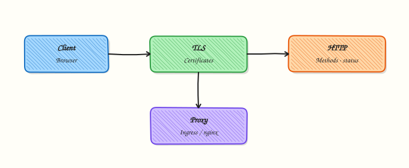

# HTTP, HTTPS, and the Application Layer

## Overview

**Hypertext Transfer Protocol (HTTP)** is how browsers, Application Programming Interfaces (APIs), health probes, and webhooks talk. **HTTPS** is HTTP over **Transport Layer Security (TLS)**. DevOps work is full of 502/503/504 responses, redirect loops, expired certificates, and `Host` header routing mistakes that sit above Transmission Control Protocol (TCP) and Domain Name System (DNS).

You will use `curl -vI` against a public HTTPS site, capture TLS protocol/cipher lines, and optionally run a local `python3 -m http.server` for clear HTTP evidence on localhost.

This is **Tutorial 12** in **Module 10: HTTP & HTTPS** of the REBASH Academy **Networking for Cloud & DevOps Engineers** series. It is written for Cloud, DevOps, Site Reliability Engineering (SRE), and platform engineers. Evidence goes under `~/rebash-networking/lab12`. Next in the path is [NAT and Port Forwarding](nat-and-port-forwarding.md).

## Prerequisites

- [DNS Records and Troubleshooting](dns-records-and-troubleshooting.md)
- [TCP and UDP Deep Dive](tcp-and-udp-deep-dive.md) — ports 80/443
- Ubuntu host with `curl` and `python3`
- Outbound HTTPS allowed for `example.com`

## Learning Objectives

By the end of this tutorial, you will be able to:

- [ ] Explain HTTP methods, status code classes, and common headers
- [ ] Describe what TLS adds for HTTPS (encryption, identity, integrity)
- [ ] Use `curl -vI` to capture response headers and TLS details
- [ ] Optionally run a local HTTP server and prove a 200 from localhost
- [ ] Separate DNS, TCP, TLS, and HTTP failure modes in triage

## Architecture

Client → DNS → TCP connect → TLS handshake (HTTPS) → HTTP request/response. Reverse proxies and load balancers often terminate TLS and forward HTTP inland.



## Theory

### What it is

An HTTP **request** has a method (`GET`, `POST`, `PUT`, `DELETE`, `HEAD`, …), a path, headers (`Host`, `User-Agent`, `Authorization`, …), and an optional body. A **response** has a **status code** (1xx–5xx), headers, and an optional body. **HTTPS** wraps that exchange in TLS so the path is encrypted and the server presents a **certificate** the client can verify.

```bash title="Terminal"
curl -sI https://example.com | head
```

### Why it matters

A **502 Bad Gateway** usually means the proxy could not get a valid response from an upstream. **401/403** are authZ problems. **404** is routing/content. **TLS handshake failures** never reach HTTP status codes. If you mix these up, you restart the wrong tier. Platform engineers who read `curl -v` save hours.

### How it works

1. Resolve name → connect TCP 443 (HTTPS) or 80 (HTTP).
2. For HTTPS: TLS version/cipher negotiation + certificate check.
3. Send HTTP request (HTTP/1.1, HTTP/2, or HTTP/3 depending on stack).
4. Read status + headers; then body if requested.

```bash title="Terminal"
curl -vI https://example.com
# Look for lines like: SSL connection using TLSv1.3 / … cipher …
```

### Key concepts and comparisons

| Code class | Meaning | Ops hint |
|------------|---------|----------|
| 2xx | Success | Probe OK |
| 3xx | Redirect | Check Location loops |
| 4xx | Client/error in request | Auth, path, Host |
| 5xx | Server/gateway failure | Upstream, overload |

| Cleartext HTTP | HTTPS |
|----------------|-------|
| No TLS | TLS + certificates |
| Easy to inspect | Need curl -v / proxy logs |
| Avoid for credentials | Default for production |

### Common pitfalls

- Forgetting `-k` is a lab escape hatch — do not make it production default.
- Ignoring `Host` headers behind virtual hosts and Ingress.
- Calling every failure “SSL error” when DNS or TCP already failed.
- Leaving `python3 -m http.server` bound to `0.0.0.0` on a shared network.

## Hands-on Lab

### Objective

Capture verbose HTTPS headers and TLS lines from `https://example.com`, optionally serve a local HTTP directory with Python, and pack evidence under `~/rebash-networking/lab12`.

### Prerequisites

- `curl`, `python3`
- Outbound 443 to example.com (or record failure honestly)

### Lab environment

Workspace: `~/rebash-networking/lab12`

```bash title="Terminal"
mkdir -p ~/rebash-networking/lab12 && cd ~/rebash-networking/lab12
set -euo pipefail
whoami | tee admin-user.txt
command -v curl | tee tools-curl.txt
command -v python3 | tee tools-python.txt
mkdir -p site
echo 'rebash lab12 http ok' > site/index.html
```

!!! example "Expected output"
    tools recorded; `site/index.html` exists.


### Real-world scenario

Users report “the website is down.” You must show whether DNS works, whether TLS negotiates, which HTTP status returns, and whether a simple local server on the same VM still works — so you know if the problem is local or remote.

### Step-by-step tasks

#### Task 1 – curl verbose HTTPS headers and TLS

```bash title="Terminal"
cd ~/rebash-networking/lab12
set -euo pipefail

# -I = HEAD-like headers; -v = TLS and request trace on stderr
curl -vI https://example.com 2>curl-example.verbose.txt | tee curl-example.headers.txt

grep -Ei 'HTTP/|location:|server:|content-type:' curl-example.headers.txt || test -s curl-example.headers.txt
grep -Ei 'SSL connection using|TLS|SSL-Session|subject:|issuer:|expire' curl-example.verbose.txt \
  | tee curl-example.tls.txt

# Timings for connect vs TLS vs first byte
curl -sS -o /dev/null -w 'http_code=%{http_code}\nnamelookup=%{time_namelookup}\nconnect=%{time_connect}\nappconnect=%{time_appconnect}\nstarttransfer=%{time_starttransfer}\ntotal=%{time_total}\n' \
  https://example.com | tee curl-example.timings.txt

grep -E 'http_code=|appconnect=' curl-example.timings.txt
test -s curl-example.tls.txt
```

!!! example "Expected output"
    headers show an HTTP status line; `curl-example.tls.txt` has TLS/cipher or certificate-related lines; timings include `appconnect` (TLS).


#### Task 2 – Optional local python http.server

```bash title="Terminal"
cd ~/rebash-networking/lab12
set -euo pipefail

# Bind localhost only
python3 -m http.server 18080 --bind 127.0.0.1 --directory ./site \
  >http-server.out 2>http-server.err &
echo $! > http-server.pid
sleep 0.4

curl -sS -D curl-local.headers.txt -o curl-local.body.txt http://127.0.0.1:18080/
grep -E 'HTTP/|200' curl-local.headers.txt
grep -q 'rebash lab12 http ok' curl-local.body.txt

kill "$(cat http-server.pid)" 2>/dev/null || true
wait "$(cat http-server.pid)" 2>/dev/null || true
```

!!! example "Expected output"
    local response is HTTP 200 with body `rebash lab12 http ok`.


#### Task 3 – Evidence pack + tiny compare script

```bash title="Terminal"
cd ~/rebash-networking/lab12
set -euo pipefail
```

Create `http-evidence.sh`:

```bash title="http-evidence.sh"
#!/usr/bin/env bash
set -euo pipefail
echo "=== HTTPS example.com status ==="
curl -sS -o /dev/null -w '%{http_code}\n' https://example.com || echo FAIL
echo "=== TLS hint lines (from prior verbose capture if present) ==="
if [ -f curl-example.tls.txt ]; then
  head -n 20 curl-example.tls.txt
else
  curl -vI https://example.com 2>&1 | grep -Ei 'SSL connection using|TLS' | head -n 10
fi
```

```bash title="Terminal"
chmod +x http-evidence.sh
./http-evidence.sh | tee http-evidence-run.txt

tar -czf http-https-evidence.tgz \
  admin-user.txt \
  curl-example.headers.txt curl-example.verbose.txt curl-example.tls.txt curl-example.timings.txt \
  curl-local.headers.txt curl-local.body.txt \
  http-evidence.sh http-evidence-run.txt site/index.html
ls -l http-https-evidence.tgz | tee evidence-ls.txt
```

!!! example "Expected output"
    `http-evidence-run.txt` shows a status code; archive is non-empty.


### Validation steps

- [ ] `curl-example.tls.txt` contains TLS/cipher or certificate lines
- [ ] `curl-example.timings.txt` includes `appconnect`
- [ ] Local python server returned 200 with the expected body
- [ ] `http-https-evidence.tgz` exists under `~/rebash-networking/lab12`

### Common errors and fixes

| Error | Cause | Fix |
|-------|-------|-----|
| TLS lines missing in headers file | TLS is on stderr with `-v` | Use `2>verbose.txt` as in Task 1 |
| `Connection refused` on 18080 | Server not started / wrong bind | Check `http-server.err`; retry Task 2 |
| Certificate error to example.com | Clock skew / intercept proxy | Check `timedatectl`; corporate proxy docs |
| Port 18080 busy | Leftover server | `kill` old pid; choose another port |
| Empty timings | curl failed early | Read verbose error; fix DNS/TCP first |

### Challenge exercise

Write `tls-summary.sh` that runs `curl -vI https://example.com` and prints only lines matching `SSL connection using`, `subject:`, `issuer:`, and the HTTP status line into `tls-summary.txt`. That script is the stretch artefact.

### Learning outcomes

- Captured real HTTPS header and TLS negotiation evidence
- Proved a local HTTP 200 with python’s http.server
- Separated TLS (`appconnect`) time from total request time

### Cleanup

```bash title="Terminal"
cd ~/rebash-networking/lab12
set -euo pipefail
kill "$(cat http-server.pid 2>/dev/null)" 2>/dev/null || true
pkill -f 'http.server 18080' 2>/dev/null || true
# Optional: rm -f http-https-evidence.tgz *.txt *.out *.err *.pid
```

## Validation

- [ ] Lab finished under `~/rebash-networking/lab12/`
- [ ] You can explain 2xx/3xx/4xx/5xx in one sentence each
- [ ] You know HTTPS = HTTP + TLS
- [ ] You can point to NAT/firewall next when the problem is path, not HTTP

## Code Walkthrough

Application-layer triage usually follows:

1. **DNS** — does the name resolve?  
2. **TCP** — does connect to 443/80 succeed?  
3. **TLS** — does handshake finish (`appconnect`, cert errors)?  
4. **HTTP** — status, `Host`, redirects, upstream 502/503/504  
5. **Least exposure** — local demos on `127.0.0.1` only  

Reverse proxies and Ingress add another hop — still use the same layers.

## Security Considerations

- Never ship `curl -k` as a default in production automation  
- Prefer modern TLS versions; disable broken ciphers at the edge  
- Do not put secrets in query strings; prefer headers or body over HTTPS  
- Bind practice HTTP servers to localhost  
- Treat verbose curl output as sensitive if it includes `Authorization` headers  

## Common Mistakes

!!! warning "Calling every outage an SSL problem"
    DNS and TCP fail first often. **Fix:** check resolve + connect times before certificate deep dives.

!!! warning "Following redirects blindly"
    Loops between http↔https or hostnames hide the real origin error. **Fix:** use `curl -vI` and inspect `Location`.

!!! warning "Ignoring the Host header"
    Many servers and Ingress rules key off `Host`. **Fix:** `curl -H 'Host: …'` when testing virtual hosts.

!!! warning "Leaving python http.server on 0.0.0.0"
    Anyone on the network may fetch your files. **Fix:** `--bind 127.0.0.1` and stop the process after the lab.

## Best Practices

- Standardise on `curl -vI` + timing format in runbooks  
- Map status codes to owning tier (edge vs app vs upstream)  
- Monitor certificate expiry separately from HTTP 200 checks  
- Prefer HTTPS everywhere credentials or personal data travel  
- Document HTTP/2 or HTTP/3 only when your edge actually supports them  

## Troubleshooting

| Symptom | Likely cause | Fix |
|---------|--------------|-----|
| TLS handshake fails | Cert/clock/proxy/MITM | Check clock, chain, SNI/Host |
| HTTP 502/504 | Upstream bad/slow | Check app and proxy timeouts |
| HTTP 301/302 loop | Wrong redirect rules | Inspect Location chain |
| Works with IP, fails with name | Host/SNI/cert CN mismatch | Fix certificate or virtual host |
| Local curl OK, users fail | Different path/DNS/WAF | Compare resolvers and edge rules |

## Summary

HTTP carries methods, headers, and status codes; HTTPS adds TLS identity and encryption. Prove both with `curl -vI`, timings, and a safe local server — then move on to how addresses are rewritten in [NAT and Port Forwarding](nat-and-port-forwarding.md).

## Interview Questions

**1. What does HTTPS add on top of HTTP?**

??? success "Reveal answer"
    **TLS** provides **encryption**, **integrity**, and **server authentication** via certificates (and optionally client certificates). The HTTP semantics (methods, status codes, headers) stay conceptually the same, but the bytes on the wire are protected and the client verifies it is talking to the intended server name (SNI / certificate subject).

**2. How do you triage 502 vs 504 behind a reverse proxy?**

??? success "Reveal answer"
    **502 Bad Gateway** usually means the proxy got an invalid or no proper HTTP response from upstream (connection failed, empty reply). **504 Gateway Timeout** means the proxy waited too long for upstream. Check upstream health, timeouts, and whether TLS to upstream is required. Do not only restart the public edge.

**3. Why does `curl -vI` put TLS details on stderr?**

??? success "Reveal answer"
    Verbose protocol tracing is diagnostic noise separate from the response body/headers stream. With `-I`, headers go to stdout; TLS and request trace go to **stderr**. Capture both (`2>file`) or you will “lose” cipher lines when redirecting only stdout.

**4. What is the Host header and why do Ingress controllers care?**

??? success "Reveal answer"
    **Host** tells the server which virtual host or rule set to use when many sites share one IP. Kubernetes Ingress and many reverse proxies route by Host (and path). Testing with the wrong Host returns 404 or a default backend even when the Service is healthy.

**5. How do curl `time_connect` and `time_appconnect` help separate failures?**

??? success "Reveal answer"
    **`time_connect`** measures TCP connect. **`time_appconnect`** includes TLS handshake completion. If connect is fine but appconnect is huge or fails, focus on TLS/certificates. If connect itself is slow or fails, focus on network, security groups, or the listener.

**6. When is cleartext HTTP still acceptable in a lab, and when is it not in production?**

??? success "Reveal answer"
    Localhost demos (`python3 -m http.server` on `127.0.0.1`) are fine for learning. In production, credentials, cookies, and personal data must use **HTTPS**. Even “internal” paths increasingly use TLS mesh or HTTPS to stop lateral snooping.

**7. A certificate error appears only in the morning — what non-HTTP cause do you check?**

??? success "Reveal answer"
    **Clock skew** from broken Network Time Protocol (NTP). Certificate validity is time-based. Check `timedatectl` / chrony early. This links back to earlier network services content and often looks like a mysterious “TLS outage.”

## Related Tutorials

- [Networking for Cloud & DevOps – Overview](index.md)
- [DNS Records and Troubleshooting](dns-records-and-troubleshooting.md) *(previous)*
- [NAT and Port Forwarding](nat-and-port-forwarding.md) *(next)*
- [Reverse Proxy and Ingress Basics](reverse-proxy-and-ingress-basics.md)

## References

- [RFC 9110 — HTTP Semantics](https://www.rfc-editor.org/rfc/rfc9110)  
- [RFC 8446 — TLS 1.3](https://www.rfc-editor.org/rfc/rfc8446)  
- [`curl` man page — timing variables](https://curl.se/docs/manpage.html)  
- Track index: [Networking for Cloud & DevOps Engineers](index.md)
