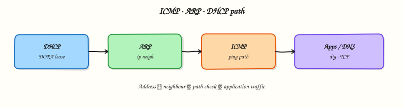

# ICMP, ARP, DHCP, and Network Services

## Overview

TCP and HTTP only work after quieter protocols do their jobs. **Dynamic Host Configuration Protocol (DHCP)** often assigns addressing. **Address Resolution Protocol (ARP)** (and the Linux neighbour table) finds the next-hop Media Access Control (MAC) address. **Internet Control Message Protocol (ICMP)** reports path problems when firewalls allow it. **Network Time Protocol (NTP)** keeps clocks honest for logs and certificates.

Failed `ping` is the most misread alert in operations — ICMP is often filtered while HTTPS still works. Stale neighbours cause “same IP, wrong MAC” black holes after failover. Wrong DHCP options hand out a bad gateway or Domain Name System (DNS) server.

This is **Tutorial 8** in **Module 7: Switching** of the REBASH Academy **Networking for Cloud & DevOps Engineers** series. It is written for Cloud, DevOps, Site Reliability Engineering (SRE), and platform engineers. By the end, you will collect ping, neighbour, DNS, and lease evidence under `~/rebash-networking/lab08`.

## Prerequisites

- [Ethernet, Switching, and VLANs](ethernet-switching-and-vlans.md)
- A practice Ubuntu 22.04/24.04 VM with outbound network access
- Tools: `ip`, `ping`, `dig` (`dnsutils` on Ubuntu), optional `curl`
- Read-only access to DHCP/NetworkManager lease files when present

## Learning Objectives

By the end of this tutorial, you will be able to:

- [ ] Explain key ICMP types and why ping can fail while TCP works
- [ ] Read `ip neigh` states after a successful gateway ping
- [ ] Describe the DHCP DORA flow and inspect a lease file read-only
- [ ] Use `dig` as a simple name-resolution check during triage
- [ ] Separate “no route / no ARP / filtered ICMP / bad lease” symptoms

## Architecture

A new host typically: get address (DHCP or cloud metadata) → resolve gateway MAC (ARP) → optional ICMP check → use DNS and apps. Time sync runs in parallel.



## Theory

### What it is

**ICMP** is a Layer 3 control protocol carried in IP. Echo Request/Reply power `ping`. **ARP** answers “Who has this IPv4 address?” on the local Ethernet segment; Linux stores answers in the **neighbour table** (`ip neigh`). **DHCP** uses **DORA** — Discover, Offer, Request, Ack — to lease an address plus options (mask, gateway, DNS, lease time). Cloud metadata often replaces classic DHCP, but you still ask “who gave me this address?”

```bash
ping -c 2 127.0.0.1
ip neigh show
```

### Why it matters

If you equate ping failure with “host down,” you will open wrong tickets. Security groups often drop ICMP. If you ignore `FAILED` neighbours after a virtual IP (VIP) move, traffic goes to a dead MAC until the cache expires. If DHCP gives the wrong default gateway, “Internet is down” is really “lease is wrong.” Clock skew (NTP) breaks Transport Layer Security (TLS) and signed cloud Application Programming Interface (API) calls — check `timedatectl` when certificates “suddenly” fail.

### How it works

1. **Address** — DHCP (or static / cloud) configures IP, mask, gateway, DNS.
2. **On-link next hop** — for a remote destination, ARP targets the **gateway** IP; for a same-subnet host, ARP targets that host.
3. **ICMP** — optional reachability and path messages (filtered often).
4. **Apps** — TCP/UDP use the resolved path; DNS uses UDP/TCP 53.

``` {.bash .ra-terminal title="Terminal"}
ip route | awk '/default/ {print; exit}'
# Then ping that gateway and re-check neighbours
```

### Key concepts and comparisons

| ICMP type | Common use |
|-----------|------------|
| 8 / 0 | Echo Request / Reply (`ping`) |
| 3 | Destination Unreachable |
| 11 | Time Exceeded (traceroute) |

| DHCP step | Role |
|-----------|------|
| Discover / Offer | Find server; propose lease |
| Request / Ack | Accept offer; confirm |

| Neighbour state (examples) | Meaning |
|----------------------------|---------|
| REACHABLE | Recently confirmed |
| STALE | May still work; needs refresh |
| FAILED | Resolution failed |

### Common pitfalls

- Equating ping failure with host failure.
- Ignoring neighbour `FAILED` after IP moves or VIP failover.
- Editing lease files instead of reading them.
- Assuming every host uses `/var/lib/dhcp` — NetworkManager and cloud-init paths differ.
- Disabling all ICMP and wondering why traceroute is blank.

## Hands-on Lab

### Objective

On a practice Ubuntu VM, prove ICMP and ARP/neighbour behaviour with `ping` and `ip neigh`, run a simple `dig` check, and collect **read-only** DHCP or NetworkManager lease evidence. Pack outputs under `~/rebash-networking/lab08`.

### Prerequisites

- Ubuntu with `ip`, `ping`, `dig`
- Outbound ICMP may be filtered to the Internet — localhost and gateway tests still count
- Sudo only if needed to read lease directories (prefer readable paths first)

### Lab environment

Workspace: `~/rebash-networking/lab08`

``` {.bash .ra-terminal title="Terminal"}
mkdir -p ~/rebash-networking/lab08 && cd ~/rebash-networking/lab08
set -euo pipefail
whoami | tee admin-user.txt
ip -br a | tee addrs.txt
ip route | tee routes.txt
test -n "$(command -v ping)"
command -v dig >/dev/null || { sudo apt-get update && sudo apt-get install -y dnsutils; }
```

!!! example "Expected output"
    address and route files exist; `dig` is available.


### Real-world scenario

Users say “the server is down” because ping failed. You must prove whether ICMP is filtered, whether the gateway neighbour is healthy, whether DNS resolves, and how the host got its address — then attach evidence to the incident ticket.

### Step-by-step tasks

#### Task 1 – ICMP: localhost and gateway

``` {.bash .ra-terminal title="Terminal"}
cd ~/rebash-networking/lab08
set -euo pipefail

ping -c 2 127.0.0.1 | tee ping-localhost.txt
grep -E 'bytes from|1 received|2 received' ping-localhost.txt

GW="$(ip route | awk '/default/ {print $3; exit}')"
echo "gateway=${GW:-none}" | tee gateway.txt

if [ -n "${GW:-}" ]; then
  ping -c 3 "$GW" | tee ping-gateway.txt || true
  # Internet ICMP often filtered — record attempt without failing the lab
  ping -c 2 1.1.1.1 | tee ping-internet.txt || echo "internet ICMP failed or filtered" | tee ping-internet.txt
else
  echo "No default gateway — skip remote ping" | tee ping-gateway.txt
  echo "No default gateway" | tee ping-internet.txt
fi
```

!!! example "Expected output"
    localhost ping succeeds; gateway ping recorded when a default route exists.


#### Task 2 – ARP / neighbour table evidence

``` {.bash .ra-terminal title="Terminal"}
cd ~/rebash-networking/lab08
set -euo pipefail

ip neigh show | tee neigh-before.txt || true

GW="$(awk -F= '/gateway=/ {print $2}' gateway.txt)"
if [ -n "$GW" ] && [ "$GW" != "none" ]; then
  ping -c 1 "$GW" >/dev/null 2>&1 || true
  ip neigh show "$GW" | tee neigh-gateway.txt
  ip neigh show | tee neigh-after.txt
  grep -E 'REACHABLE|STALE|DELAY|PROBE|FAILED' neigh-after.txt || test -s neigh-after.txt
else
  echo "No gateway to resolve" | tee neigh-gateway.txt
  ip neigh show | tee neigh-after.txt
fi
```

!!! example "Expected output"
    after gateway ping, `neigh-gateway.txt` or `neigh-after.txt` shows a neighbour entry when L2 works.


#### Task 3 – dig check + read-only DHCP / NM leases

``` {.bash .ra-terminal title="Terminal"}
cd ~/rebash-networking/lab08
set -euo pipefail

dig +short example.com A | tee dig-example.txt
test -s dig-example.txt

# Read-only lease hunt (do not edit these files)
{
  echo "=== resolv.conf ==="
  cat /etc/resolv.conf 2>/dev/null || true
  echo "=== DHCP / NetworkManager lease clues ==="
  ls -la /var/lib/dhcp/ 2>/dev/null || echo "no /var/lib/dhcp"
  ls -la /var/lib/NetworkManager/ 2>/dev/null || echo "no NetworkManager dir"
  for f in /var/lib/dhcp/dhclient*.leases \
           /var/lib/dhcpcd5/dhcpcd.leases \
           /var/lib/NetworkManager/*.lease \
           /run/systemd/netif/leases/*; do
    if [ -r "$f" ]; then
      echo "---- $f ----"
      # shellcheck disable=SC2002
      cat "$f" | head -n 40
    fi
  done
  if command -v nmcli >/dev/null 2>&1; then
    echo "=== nmcli device show (IP4) ==="
    nmcli -f GENERAL,IP4 device show 2>/dev/null | head -n 80 || true
  fi
  if command -v timedatectl >/dev/null 2>&1; then
    echo "=== timedatectl ==="
    timedatectl | head -n 20
  fi
} | tee lease-and-time.txt

tar -czf services-evidence.tgz \
  admin-user.txt addrs.txt routes.txt gateway.txt \
  ping-localhost.txt ping-gateway.txt ping-internet.txt \
  neigh-before.txt neigh-gateway.txt neigh-after.txt \
  dig-example.txt lease-and-time.txt
ls -l services-evidence.tgz | tee evidence-ls.txt
```

!!! example "Expected output"
    `dig-example.txt` has an IPv4 address; `lease-and-time.txt` shows resolv.conf and whatever lease paths exist; archive is non-empty.


### Validation steps

- [ ] Localhost ping succeeded
- [ ] Gateway (if present) was recorded and neighbour table inspected
- [ ] `dig-example.txt` is non-empty
- [ ] `lease-and-time.txt` captured resolv.conf and lease/NM clues
- [ ] `services-evidence.tgz` exists under `~/rebash-networking/lab08`

### Common errors and fixes

| Error | Cause | Fix |
|-------|-------|-----|
| Internet ping fails | ICMP filtered | Normal — use TCP/`curl` for app proof |
| Empty neighbour table | No recent traffic / no gateway | Ping gateway; check L2 |
| `dig: command not found` | `dnsutils` missing | `sudo apt-get install -y dnsutils` |
| Cannot read lease file | Permissions | Note the path; use `sudo cat` read-only if policy allows |
| No `/var/lib/dhcp` | NM / cloud-init / static IP | Document how address was assigned instead |

### Challenge exercise

Write `triage-services.sh` that prints: default gateway, `ping -c1` exit code to gateway, `ip neigh` line for gateway, and `dig +short example.com`. Save stdout to `triage-out.txt`. This script is the working artefact — not a markdown notes file.

### Learning outcomes

- Separated ICMP filter from true host failure
- Proved neighbour resolution after gateway ping
- Collected dig + read-only lease evidence for tickets

### Cleanup

``` {.bash .ra-terminal title="Terminal"}
cd ~/rebash-networking/lab08
set -euo pipefail
# Inspection-only lab — optional:
# rm -f services-evidence.tgz *.txt
```

## Validation

- [ ] Lab finished under `~/rebash-networking/lab08/` with evidence
- [ ] You can list DORA in order
- [ ] You can explain when ARP targets the gateway vs the destination
- [ ] You know ICMP filter ≠ application down

## Code Walkthrough

Production triage for these services usually follows:

1. **Confirm local stack** — localhost ping, interface UP, default route  
2. **Prove next hop** — ping gateway (if allowed) + `ip neigh`  
3. **Prove name resolution** — `dig` / `getent` before blaming the app  
4. **Ask who configured the host** — DHCP lease, NetworkManager, cloud-init, static  
5. **Check time** — `timedatectl` when TLS or API signatures fail  

Automate the checklist; keep humans for “is ICMP filtered here?” judgement.

## Security Considerations

- Treat rogue DHCP as a real risk on flat networks — prefer authenticated / managed pools  
- Do not paste full lease files with customer hostnames into public tickets without redaction  
- ICMP can aid reconnaissance; filtering edge ICMP is common — document exceptions for ops  
- Neighbour spoofing (ARP spoof) is possible on shared L2 — combine with port security or cloud controls  
- Read lease files read-only; never hand-edit them to “fix” production  

## Common Mistakes

!!! warning "Declaring the host down because ping failed"
    Many clouds drop ICMP. **Fix:** test the real TCP/UDP port (`curl`, `nc`) and check security groups.

!!! warning "Clearing the whole neighbour table during an incident"
    You may remove good entries and add churn. **Fix:** inspect the one IP you care about; delete selectively if stale.

!!! warning "Editing dhclient leases by hand"
    Leases are rewritten by the client. **Fix:** fix DHCP server/options or static config properly; reboot/renew.

!!! warning "Ignoring clock skew"
    TLS and Kerberos fail in confusing ways. **Fix:** check `timedatectl` / chrony early in the runbook.

## Best Practices

- Always record gateway + neighbour + dig in the first evidence pack  
- Prefer `ip neigh` over legacy `arp -a`  
- Document whether Internet ICMP is allowed in each environment  
- Renew DHCP cleanly (`dhclient` / NM) instead of editing lease files  
- Correlate NTP status with certificate and API signature failures  

## Troubleshooting

| Symptom | Likely cause | Fix |
|---------|--------------|-----|
| Ping fails, HTTPS works | ICMP filtered | Use app-port tests; adjust monitoring |
| Same-subnet unreachable | ARP/neigh FAILED | Check peer, VLAN, security groups |
| Wrong DNS after reboot | Bad DHCP option | Fix server options; verify lease |
| No default route | DHCP failed / static misconfig | Inspect leases and `ip route` |
| TLS handshake fails randomly | Clock skew | Fix NTP; verify `timedatectl` |

## Summary

ICMP, ARP/neighbour, DHCP, and time sync are the quiet services under every app path. Prove them with ping, `ip neigh`, `dig`, and read-only lease inspection — then decide what is filtered versus broken. Next: [TCP and UDP Deep Dive](tcp-and-udp-deep-dive.md).

## Interview Questions

**1. Why can `ping` fail while `curl https://service` works?**

??? success "Reveal answer"
    **ICMP Echo** is a different protocol from TCP 443. Firewalls and cloud security groups often **drop ICMP** while allowing HTTPS. Ping is a hint, not proof the host or application is down. Interviewers want you to test the real port and read security-group rules.

**2. When does ARP resolve the gateway instead of the destination host?**

??? success "Reveal answer"
    If the destination IP is **off-link** (not in a connected route), the host sends frames to the **default gateway** MAC. ARP therefore asks for the gateway’s IP. If the destination is **on-link** (same subnet), ARP asks for that host’s IP directly.

**3. Explain DHCP DORA in order and what a lease contains.**

??? success "Reveal answer"
    **Discover → Offer → Request → Ack**. The lease typically includes IPv4 address, subnet mask, default gateway, DNS servers, and lease lifetime. On Linux you may see this in dhclient/NetworkManager lease files or via `nmcli` — cloud VMs may get the same ideas from metadata instead of classic DHCP.

**4. What does a neighbour state of FAILED usually mean?**

??? success "Reveal answer"
    Linux tried to resolve the IP to a MAC and **did not get a usable reply**. Causes include host down, wrong VLAN, filtered ARP, or a stale VIP. Fix the Layer 2 path; clearing one stale entry can help after failover, but do not blindly flush everything.

**5. How would you prove in a ticket that DHCP handed out the wrong DNS servers?**

??? success "Reveal answer"
    Attach `/etc/resolv.conf`, the readable lease or `nmcli` IP4 DNS fields, and `dig` output showing which resolver was queried. Compare with the intended DHCP option or cloud DNS setting. Evidence beats “DNS feels wrong.”

**6. How does NTP relate to “network” incidents?**

??? success "Reveal answer"
    Large **clock skew** breaks TLS certificate validity windows, Kerberos, and signed cloud API requests. The network path may be fine. Include `timedatectl` (or chrony) in early triage when errors mention certificates or authentication timestamps.

**7. What is the difference between ICMP Destination Unreachable and a TCP connection timeout?**

??? success "Reveal answer"
    **Destination Unreachable** is an ICMP message saying a hop or host actively reported a problem (for example port unreachable, or administratively prohibited). A **TCP timeout** often means probes were **dropped silently** (filter) or the path is black-holed — you get no RST and no useful ICMP. Different signals, different fixes.

## Related Tutorials

- [Networking for Cloud & DevOps – Overview](index.md)
- [Ethernet, Switching, and VLANs](ethernet-switching-and-vlans.md) *(previous)*
- [TCP and UDP Deep Dive](tcp-and-udp-deep-dive.md) *(next)*
- [Lab — DNS / firewall triage](../labs/networking-dns-firewall-triage.md)

## References

- [RFC 792 — ICMP](https://www.rfc-editor.org/rfc/rfc792)  
- [RFC 826 — ARP](https://www.rfc-editor.org/rfc/rfc826)  
- [RFC 2131 — DHCP](https://www.rfc-editor.org/rfc/rfc2131)  
- [`ip-neighbour(8)`](https://manpages.ubuntu.com/manpages/jammy/en/man8/ip-neighbour.8.html)  
- Track index: [Networking for Cloud & DevOps Engineers](index.md)
