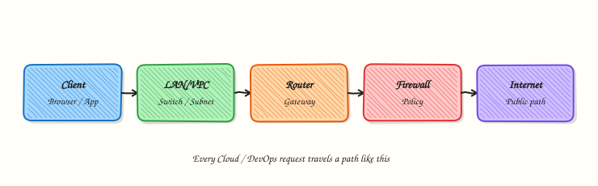
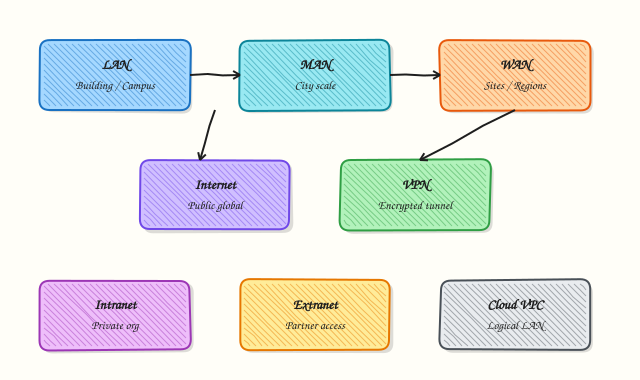
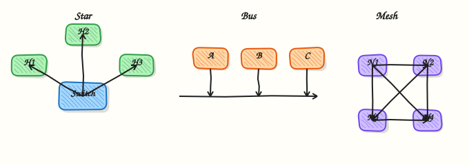

# What is Networking?

## Overview

A **network** is a set of computers and other devices that exchange data. When you open a website, pull a container image, or deploy to Kubernetes, packets travel across one or more networks. Without a working path, the application fails — even if the code is perfect.

At the simplest level, two machines need a shared link (a cable, Wi‑Fi, or a virtual link in the cloud), an address so they can find each other, and a way to carry application data. In Cloud and DevOps work you meet many network **types**: a Local Area Network (LAN) inside one office or data centre, a Wide Area Network (WAN) between sites, a Virtual Private Network (VPN) that encrypts traffic over the public Internet, and the public Internet itself. You also meet **shapes** called topologies — star, mesh, bus, and hybrid designs that cloud providers hide behind Virtual Private Clouds (VPCs) and load balancers.

On a Linux practice virtual machine (VM), you can already see the real path: network interfaces (`ip -br a`), the routing table (`ip route`), and Domain Name System (DNS) resolvers that turn names into Internet Protocol (IP) addresses. Cloud VMs, Continuous Integration (CI) runners, and Kubernetes nodes all use the same ideas. Wrong routes, wrong DNS, or a missing interface cause `Connection refused`, timeouts, and failed deployments. Production teams document the path before they change firewalls or peerings, so incidents start with facts instead of guesses.

This is **Tutorial 1** in **Module 1: Networking Fundamentals** of the REBASH Academy **Networking for Cloud & DevOps Engineers** series. It is written for Cloud, DevOps, Site Reliability Engineering (SRE), and platform engineers. By the end, you will classify your host’s interfaces, record topology facts, and pack evidence you can attach to a change ticket.

## Prerequisites

- Basic Linux terminal use ([Linux Fundamentals](../linux/linux-fundamentals-distributions-and-architecture.md) helps)
- A **practice Ubuntu 22.04/24.04 VM** (or similar) with outbound Internet access
- Packages available on Ubuntu: `iproute2`, `iputils-ping`, `curl` (usually preinstalled)

## Learning Objectives

By the end of this tutorial, you will be able to:

- [ ] Explain what a network is and why Cloud/DevOps work depends on it
- [ ] Compare LAN, WAN, MAN, VPN, Internet, Intranet, and Extranet in plain language
- [ ] Recognise common topologies and where you see them in cloud designs
- [ ] Capture interface, route, and DNS facts with modern Linux tools (`ip`, `ss`, resolvers)
- [ ] Build a small evidence pack that proves how your lab host reaches the network

## Architecture

Traffic leaves an application, crosses a host interface, follows a route, and may pass switches, routers, firewalls, and the public Internet before it reaches another service. The diagrams below show the idea of networking, common network types, and topology shapes.







## Theory

### What it is

A network connects endpoints so they can send and receive data. Endpoints can be physical servers, laptops, containers, load balancers, or managed cloud services. Each endpoint uses at least one **network interface** (a Network Interface Card — NIC — or a virtual NIC) with an address.

| Term | Plain meaning | Example |
|------|---------------|---------|
| LAN | Local network, short distance | Office floor, one VPC subnet |
| WAN | Long-distance links between sites | Office to data centre, Direct Connect / ExpressRoute style links |
| MAN | City-scale network | Campus or metro fibre between buildings |
| Internet | Public global network of networks | Reach `example.com` from your VM |
| Intranet | Private company network | Internal wiki, HR apps |
| Extranet | Controlled access for partners | Vendor portal with VPN or allow-lists |
| VPN | Encrypted tunnel over another network | Work-from-home into a private VPC |

A **topology** describes how devices are linked: star (hub/switch in the middle), mesh (many paths), bus (shared backbone — rare in modern LANs), and hybrid (common in cloud: VPC + peering + Internet gateway).

### Why it matters

Every deploy, health check, and on-call page assumes a working path. If DNS is wrong, you never reach the right IP. If the default route is missing, the host cannot leave its subnet. If you confuse LAN and WAN latency, you design chatty microservices that fail across regions. Cloud consoles talk about “public subnets”, “private subnets”, and “VPN gateways” — those labels are network types applied to Virtual Private Cloud (VPC) design. Learning the vocabulary here makes later modules (OSI, IP, routing, Kubernetes networking) much easier.

### How it works

1. **Interfaces** — the host attaches to a network through `eth0`, `ens5`, `wlan0`, or a bridge (`docker0`, `cni0`).
2. **Addresses** — Internet Protocol version 4 (IPv4) or version 6 (IPv6) identifies the interface on that network.
3. **Routes** — the kernel picks the next hop for each destination (`ip route`).
4. **Name resolution** — applications ask DNS for names; the host uses resolvers listed under `/etc/resolv.conf` or `systemd-resolved`.
5. **Path** — packets leave the NIC, cross switches/routers, and arrive at another host or service.

```bash
ip -br a
ip route
resolvectl status 2>/dev/null || cat /etc/resolv.conf
```

### Key concepts and comparisons

| Network type | Typical scope | Trust | Cloud / DevOps example |
|--------------|---------------|-------|------------------------|
| LAN | One site / one subnet | Often trusted more | App subnet in a VPC |
| WAN | Between sites / regions | Mixed | Site-to-site VPN, interconnect |
| Internet | Global | Untrusted | Pull images from a public registry |
| VPN | Overlay on Internet or WAN | Encrypted path | Engineer access to private APIs |
| Intranet | Organisation only | Internal | CI talking to internal Artifactory |

| Topology | Prefer when | Avoid when |
|----------|-------------|------------|
| Star / hub-and-spoke | Simple ops, clear centre | Single centre becomes a bottleneck with no backup |
| Partial mesh | Need alternate paths between key sites | You cannot afford the extra links or routes |
| Full mesh | Tiny number of critical peers | Large N — link count grows fast |
| Hybrid (cloud) | Mix private + public + peering | You skip documenting which path is primary |

### Common pitfalls

- Treating “the network” as one magic cloud — always name the interface, subnet, and next hop.
- Using obsolete tools (`ifconfig`, `netstat`) when `ip` and `ss` are available and clearer.
- Ignoring DNS while debugging “connectivity” — many failures are name resolution, not routing.
- Assuming every interface is “up” because the VM is running — check `ip -br a` for `DOWN` or missing addresses.
- Documenting topology from memory instead of from live `ip` / route output before a change.

## Hands-on Lab

### Objective

On a practice Ubuntu VM, classify host interfaces, capture route and DNS resolver facts, and build an evidence pack under `~/rebash-networking/lab01` that describes how this host attaches to the network.

### Prerequisites

- Ubuntu 22.04/24.04 with `sudo` for your login user
- Tools: `ip`, `ss`, `ping`, `curl` (install with `sudo apt-get update && sudo apt-get install -y iproute2 iputils-ping curl` if needed)
- Outbound Internet allowed for a short connectivity check (safe read-only probes)

### Lab environment

Workspace: `~/rebash-networking/lab01`

```bash
mkdir -p ~/rebash-networking/lab01 && cd ~/rebash-networking/lab01
set -euo pipefail
hostname | tee hostname.txt
whoami | tee admin-user.txt
uname -a | tee uname.txt
test -n "$(command -v ip)"
test -n "$(command -v ss)"
```

**Expected output:** `hostname.txt`, `admin-user.txt`, and `uname.txt` exist; `ip` and `ss` are on `PATH`.

### Real-world scenario

Your team receives a new Ubuntu jump server (bastion) in a cloud account. Before anyone opens firewall tickets, you must document: which interfaces exist, which addresses they hold, what the default route is, and which DNS resolvers the host uses. That baseline becomes the attachment for the change ticket and the starting point for later troubleshooting.

### Step-by-step tasks

#### Task 1 – Classify interfaces and link state

List every interface in brief form, then save a richer dump. Classify each non-`lo` interface as roughly LAN-facing (has a private IPv4) or special (docker/bridge/tunnel) in a short table file.

```bash
cd ~/rebash-networking/lab01
set -euo pipefail

ip -br a | tee ip-br-a.txt
ip -br link | tee ip-br-link.txt
ip -4 addr show | tee ip4-addr.txt
ip -6 addr show | tee ip6-addr.txt

# Build a simple classification (loopback vs others)
{
  echo "interface|state|ipv4_or_note|class"
  while read -r iface state rest; do
    [ -z "${iface:-}" ] && continue
    case "$iface" in
      lo) cls="loopback" ;;
      docker*|br-*|cni*|veth*|virbr*|tun*|tap*|wg*) cls="virtual-or-overlay" ;;
      *) cls="host-nic-or-lan" ;;
    esac
    echo "${iface}|${state}|${rest}|${cls}"
  done < <(ip -br a)
} | tee interface-classification.txt

grep -E 'host-nic-or-lan|loopback|virtual' interface-classification.txt
```

**Expected output:** `ip-br-a.txt` lists `lo` and at least one other interface; `interface-classification.txt` has a header and rows with a `class` column.

#### Task 2 – Document routes and DNS resolvers

Capture the routing table and resolver configuration. Optionally prove basic reachability with a short ping and a DNS query tool if available.

```bash
cd ~/rebash-networking/lab01
set -euo pipefail

ip route show | tee ip-route.txt
ip -6 route show 2>/dev/null | tee ip6-route.txt || true

if command -v resolvectl >/dev/null 2>&1; then
  resolvectl status | tee resolvers.txt
else
  cat /etc/resolv.conf | tee resolvers.txt
fi

# Safe connectivity checks (may fail offline — record the result either way)
ping -c 2 -W 2 1.1.1.1 2>&1 | tee ping-1.1.1.1.txt || true
if command -v dig >/dev/null 2>&1; then
  dig +time=2 +tries=1 example.com A 2>&1 | tee dig-example.txt || true
elif command -v getent >/dev/null 2>&1; then
  getent ahosts example.com | tee dig-example.txt || true
fi

# Listening sockets snapshot (who is bound on this host)
ss -tuln | tee ss-tuln.txt
```

**Expected output:** `ip-route.txt` shows a `default` route or local subnet routes; `resolvers.txt` is non-empty; `ss-tuln.txt` lists listening sockets (may be few on a fresh VM).

#### Task 3 – Topology facts file and evidence pack

Write a short topology facts document from the live data, then pack everything into a tarball for the ticket.

```bash
cd ~/rebash-networking/lab01
set -euo pipefail

DEFAULT_VIA="$(ip route show default 2>/dev/null | awk '/default/ {print; exit}')"
PRIMARY_IF="$(ip -br a | awk '$1!="lo" && $2 ~ /UP/ {print $1; exit}')"
PRIMARY_ADDR="$(ip -4 -o addr show dev "${PRIMARY_IF:-}" 2>/dev/null | awk '{print $4; exit}')"

cat > topology-facts.txt << EOF
REBASH Networking Lab01 — topology facts
hostname: $(hostname)
primary_interface: ${PRIMARY_IF:-unknown}
primary_ipv4_cidr: ${PRIMARY_ADDR:-none}
default_route_line: ${DEFAULT_VIA:-none}
notes:
- Compare primary_interface class in interface-classification.txt
- DNS resolvers are in resolvers.txt
- This is a star/hub-style edge from the host's view: one uplink toward the gateway
EOF

cat topology-facts.txt

tar -czf networking-baseline.tgz \
  hostname.txt admin-user.txt uname.txt \
  ip-br-a.txt ip-br-link.txt ip4-addr.txt ip6-addr.txt \
  interface-classification.txt ip-route.txt ip6-route.txt \
  resolvers.txt ping-1.1.1.1.txt dig-example.txt ss-tuln.txt \
  topology-facts.txt
ls -l networking-baseline.tgz | tee evidence-ls.txt
test -s networking-baseline.tgz
```

**Expected output:** `topology-facts.txt` names a primary interface when one exists; `networking-baseline.tgz` is non-empty.

### Validation steps

- [ ] `ip -br a` output saved and includes `lo`
- [ ] `interface-classification.txt` classifies at least loopback and one other interface
- [ ] `ip-route.txt` and `resolvers.txt` exist
- [ ] `topology-facts.txt` documents primary interface and default route line (or honest `none`)
- [ ] `networking-baseline.tgz` exists under `~/rebash-networking/lab01`

### Common errors and fixes

| Error | Cause | Fix |
|-------|-------|-----|
| `ip: command not found` | Minimal image | `sudo apt-get install -y iproute2` |
| No `default` in `ip route` | Isolated lab / no gateway | Document `none`; still keep interface and DNS facts |
| `ping: Operation not permitted` | ICMP blocked in cloud security group | Keep the failure log; use `curl -I --max-time 5 https://example.com` instead |
| Empty `/etc/resolv.conf` | `systemd-resolved` stub only | Prefer `resolvectl status` |
| `dig: not found` | Package missing | Use `getent ahosts` or `sudo apt-get install -y dnsutils` |

### Challenge exercise

Write an executable script `~/rebash-networking/lab01/collect-baseline.sh` that re-runs Tasks 1–3 into a timestamped subdirectory (for example `run-$(date +%Y%m%d-%H%M%S)/`) and creates `networking-baseline.tgz` inside that directory. Make it executable with `chmod +x`, run it once, and keep the new evidence directory. Do **not** replace the challenge with a notes-only runbook.

### Learning outcomes

- Classified host interfaces with modern `ip` output
- Recorded routes and DNS resolvers as operational facts
- Linked host view to LAN / uplink topology language
- Packed a baseline suitable for a change ticket

### Cleanup

```bash
cd ~/rebash-networking/lab01
set -euo pipefail
# Keep evidence archives if you want them; otherwise remove working text files:
# rm -f *.txt
# Optional full wipe of this lab workspace:
# cd ~ && rm -rf ~/rebash-networking/lab01
ls -la
```

No persistent routes, users, or firewall rules were added in the main tasks, so cleanup is file-only.

## Validation

- [ ] Lab finished under `~/rebash-networking/lab01/` with `networking-baseline.tgz`
- [ ] You can explain LAN vs WAN vs VPN vs Internet in one sentence each
- [ ] You can read `ip -br a` and `ip route` and name the uplink interface
- [ ] You know why DNS belongs in a connectivity baseline

## Code Walkthrough

In real operations, a host network baseline usually follows this order:

1. **Identity of the host** — hostname, OS, who is running the check  
2. **Interfaces** — `ip -br a` / `ip link` for names and state  
3. **Addresses** — IPv4/IPv6 CIDR on each NIC  
4. **Routes** — especially the default gateway  
5. **Resolvers** — `resolvectl` or `/etc/resolv.conf`  
6. **Proof** — short ping/curl/dig, then an evidence archive  

Later modules deepen OSI layers, IP addressing, and routing. The baseline habit stays the same on jump servers, CI runners, and Kubernetes nodes.

## Security Considerations

- Treat interface and route dumps as sensitive in some environments — they reveal internal addressing  
- Prefer practice VMs; do not paste production topologies into public tickets without review  
- Use read-only checks (`ip`, `ss`, `ping`, `dig`) before any change commands  
- Limit who can run privileged network changes (`ip route add`, firewall edits)  
- Remember that VPN and Extranet paths change trust boundaries — document them explicitly  

## Common Mistakes

!!! warning "Debugging apps before checking the host path"
    Many “application” failures are missing routes or DNS. **Fix:** capture `ip -br a`, `ip route`, and resolvers first.

!!! warning "Relying on `ifconfig` / `netstat` only"
    Those tools are obsolete on modern Ubuntu. **Fix:** use `ip` and `ss`.

!!! warning "Calling every private network a LAN without context"
    Cloud private subnets, VPNs, and partner extranets behave differently. **Fix:** name the network type and trust model.

!!! warning "Skipping evidence"
    Verbal topology claims do not survive handovers. **Fix:** keep a tarball of command output with the change ticket.

## Best Practices

- Standardise a baseline script for every new VM image  
- Prefer `ip -br` for quick human reading in incidents  
- Document primary interface and default gateway in runbooks that accompany diagrams  
- Separate Internet-facing paths from private-only paths in design reviews  
- Re-run the baseline after major cloud network changes (new route tables, DNS, VPN)  

## Troubleshooting

| Symptom | Likely cause | Fix |
|---------|--------------|-----|
| No addresses on NIC | DHCP failed / wrong VPC | Check cloud NIC attachment; `ip link`; renew DHCP if used |
| Host cannot leave subnet | Missing default route | Inspect `ip route`; fix cloud route table / gateway |
| Names fail, IPs work | DNS resolvers wrong | Fix `resolvectl` / DHCP DNS options |
| `ping` fails, `curl` works | ICMP blocked | Use TCP/HTTP checks; do not assume the path is down |
| Extra docker/cni interfaces | Container runtime installed | Classify as virtual; do not treat as the uplink |

## Summary

Networking is how systems exchange data across interfaces, routes, and name resolution. Learn the common network types and topologies, then prove your host’s place in that picture with `ip`, routes, and DNS facts. Next, use the seven-layer Open Systems Interconnection (OSI) model in [OSI Model](osi-model.md) as a shared troubleshooting language.

## Interview Questions

**1. What is a network, and why do DevOps engineers care beyond “cables and switches”?**

??? success "Reveal answer"
    A **network** is a set of systems that exchange data. DevOps care because deploys, health checks, image pulls, and API calls all need a working path. Failures often appear as application errors but start as interface, route, DNS, or firewall problems. Good engineers prove the host path with tools such as `ip` and resolver checks before blaming the app.

**2. How would you explain LAN, WAN, VPN, and the Internet to a junior engineer in one minute?**

??? success "Reveal answer"
    A **LAN** is a local network (one site or subnet). A **WAN** links distant sites. The **Internet** is the public global network of networks. A **VPN** is an encrypted tunnel that often carries private traffic over the Internet or another network. In cloud work, a VPC subnet behaves like a LAN; site-to-site VPN or interconnects behave like WAN overlays.

**3. What does a star topology look like from a single Linux host’s point of view?**

??? success "Reveal answer"
    The host usually has one main uplink interface and a **default route** toward a gateway (router or cloud internet/NAT gateway). That is a star/hub view: many hosts speak through a central next hop. Cloud designs add peering and secondary paths, but the first diagnostic still asks: which NIC, which gateway?

**4. Which three commands would you run first on Ubuntu to baseline connectivity, and why?**

??? success "Reveal answer"
    Typical first three: `ip -br a` (interfaces and addresses), `ip route` (default and local routes), and `resolvectl status` or `cat /etc/resolv.conf` (DNS). Together they answer: am I attached, where do packets go next, and can names resolve? Add `ss -tuln` when you need to see listening services.

**5. A teammate says “the network is down” because `ping 8.8.8.8` fails. What else would you check?**

??? success "Reveal answer"
    ICMP may be blocked by a cloud security group even when TCP works. Check `ip route`, try `curl -I --max-time 5 https://example.com`, and test DNS separately (`dig` / `getent`). Also confirm the NIC is `UP` with an address. “Ping failed” is a symptom, not a full diagnosis.

**6. Why should a change ticket include interface classification (LAN NIC vs docker bridge)?**

??? success "Reveal answer"
    Virtual bridges and Container Network Interface (CNI) devices look like extra interfaces but are not the host uplink. Misreading them leads to wrong firewall rules or wrong “primary IP” documentation. Classification keeps audits and handovers accurate.

**7. What is the difference between Intranet and Extranet in production access design?**

??? success "Reveal answer"
    An **Intranet** is for the organisation’s internal users and systems. An **Extranet** gives controlled access to external partners (vendors, customers) with tighter allow-lists, VPN, or identity controls. Mixing them without clear trust boundaries is a common security mistake.

**8. How does this Module 1 baseline help later when you study Kubernetes or cloud VPCs?**

??? success "Reveal answer"
    Pods, nodes, and VPC subnets still rest on interfaces, routes, and DNS. The same baseline habit — name the interface, next hop, and resolver — applies inside nodes and across cloud route tables. Module 1 builds the operational reflex before deeper models (OSI, TCP/IP, subnetting).

## Related Tutorials

- [Networking for Cloud & DevOps – Overview](index.md)
- [Linux Fundamentals](../linux/linux-fundamentals-distributions-and-architecture.md) *(helpful background)*
- [OSI Model](osi-model.md) *(next)*
- [Linux Networking Toolkit](linux-networking-toolkit.md) *(later module)*

## References

- [iproute2 documentation](https://wiki.linuxfoundation.org/networking/iproute2) — modern Linux networking tools  
- [`ip(8)`](https://manpages.ubuntu.com/manpages/jammy/en/man8/ip.8.html) — Ubuntu man-page  
- [`ss(8)`](https://manpages.ubuntu.com/manpages/jammy/en/man8/ss.8.html) — socket statistics  
- IETF / Internet architecture overview: [RFC 1122](https://www.rfc-editor.org/rfc/rfc1122) (host requirements, classic reference)  
- Track index: [Networking for Cloud & DevOps Engineers](index.md)
