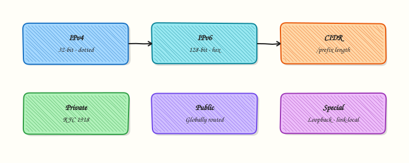

# IP Addressing

## Overview

Every host that speaks Internet Protocol (IP) needs an **address** — a number that identifies an interface on a network. Most Cloud and DevOps work still centres on **IPv4** addresses such as `192.168.1.10`, often written with a prefix length as Classless Inter-Domain Routing (CIDR) — for example `192.168.1.10/24`. The `/24` means the first 24 bits are the **network** part; the rest identify the host on that network.

Addresses fall into important groups. **Private** ranges (documented in RFC 1918) are used inside Local Area Networks (LANs) and Virtual Private Clouds (VPCs) and are not routed on the public Internet. **Public** addresses are globally routable. **Loopback** (`127.0.0.0/8`, commonly `127.0.0.1`) talks to the same host. **Link-local** addresses (`169.254.0.0/16` for IPv4) appear when Automatic Private IP Addressing (APIPA) or certain cloud metadata paths are involved. Mixing these up causes broken peering, leaked routes, and security findings.

On Ubuntu you inspect addresses with `ip -4 addr` and `ip -br a`, not the obsolete `ifconfig`. You will also ping **safe** targets: localhost and link-local behaviour — not random Internet hosts for destructive tests. Later, subnetting (next tutorial) shows how to split a CIDR into smaller networks. Here the goal is to read and classify addresses correctly.

This is **Tutorial 4** in **Module 4: IP Addressing** of the REBASH Academy **Networking for Cloud & DevOps Engineers** series. It is written for Cloud, DevOps, Site Reliability Engineering (SRE), and platform engineers. By the end, you will show IPv4 CIDR on interfaces, classify private versus public addresses with a script, and keep evidence under the lab folder.

## Prerequisites

- [TCP/IP Model](tcp-ip-model.md)
- A **practice Ubuntu 22.04/24.04 VM**
- Tools: `ip`, `ping`, `python3` (for the classification script)

## Learning Objectives

By the end of this tutorial, you will be able to:

- [ ] Explain what an IPv4 address and CIDR prefix length mean
- [ ] Identify private (RFC 1918), loopback, link-local, and public addresses
- [ ] Read interface addresses with `ip -br a` / `ip -4 addr`
- [ ] Run a classification script over observed addresses
- [ ] Safely test localhost (and link-local ideas) without changing production routing

## Architecture

IP addressing sits at the Internet layer of TCP/IP. Hosts and gateways use addresses and masks (prefix lengths) to decide whether a destination is local or needs a route.



## Theory

### What it is

An **IPv4 address** is 32 bits, usually written as four decimal octets (`a.b.c.d`). A **subnet mask** or **prefix length** marks how many leading bits are the network prefix. CIDR notation combines them: `10.0.0.5/16`.

| Kind | Range (common) | Routable on public Internet? |
|------|----------------|------------------------------|
| Private (RFC 1918) | `10.0.0.0/8`, `172.16.0.0/12`, `192.168.0.0/16` | No |
| Loopback | `127.0.0.0/8` | No (local host only) |
| Link-local | `169.254.0.0/16` | No (local link only) |
| Public | Remaining globally assigned space | Yes (when properly announced) |
| Documentation / special | e.g. `203.0.113.0/24` (TEST-NET) | Should not be used on the real Internet |

IPv6 exists and matters, but this module focuses on IPv4 fluency first — still the daily language of many VPCs and firewall rules.

### Why it matters

Security groups, Kubernetes pod CIDRs, VPN tunnels, and allow-lists are all address logic. If you put a private address in a public DNS A record, clients on the Internet cannot reach you. If you accidentally route RFC 1918 space to the Internet without Network Address Translation (NAT), you leak internal topology and break return paths. Cloud interviews almost always ask you to recognise private ranges instantly.

### How it works

1. **Configure** — DHCP or static config assigns address + prefix to an interface.
2. **Observe** — `ip -4 addr show` prints CIDR on each NIC.
3. **Decide local vs remote** — same network prefix → neighbours; otherwise → gateway/route.
4. **Classify** — compare the address to well-known ranges before you open firewall tickets.

```bash
ip -br a
ip -4 addr show
ping -c 2 127.0.0.1
```

### Key concepts and comparisons

| Notation | Meaning |
|----------|---------|
| `192.168.1.10/24` | Host `.10` on network `192.168.1.0/24` |
| `/32` | Single host route (common on loopbacks and some cloud ENIs) |
| `/0` | Default route (entire IPv4 space) |

| Private block | Size (approx) | Typical use |
|---------------|---------------|-------------|
| `10.0.0.0/8` | Large | Big corporate / cloud CIDRs |
| `172.16.0.0/12` | Medium | Many VPCs (`172.16`–`172.31`) |
| `192.168.0.0/16` | Smaller | Home labs, small offices |

### Common pitfalls

- Confusing the **host** address with the **network** address (`192.168.1.0/24` vs `192.168.1.10/24`).
- Treating `172.15.x.x` or `172.32.x.x` as private — only `172.16.0.0/12` is.
- Ignoring `/prefix` when comparing two IPs — same octets can be different networks with different masks.
- Using `ifconfig` output culture on systems where it is not installed.
- Pinging random public IPs as the only test — start with localhost and your own interface.

## Hands-on Lab

### Objective

Show IPv4 CIDR on interfaces, classify addresses as private/public/loopback/link-local with a Python script, and safely ping localhost (and link-local if present) under `~/rebash-networking/lab04`.

### Prerequisites

- Ubuntu 22.04/24.04 with `python3`, `iproute2`, `iputils-ping`
- No need to change cloud routes or public DNS

### Lab environment

Workspace: `~/rebash-networking/lab04`

```bash
mkdir -p ~/rebash-networking/lab04 && cd ~/rebash-networking/lab04
set -euo pipefail
hostname | tee hostname.txt
python3 --version | tee python-version.txt
command -v ip ping | tee tools-present.txt
```

**Expected output:** Python 3 version line printed; `ip` and `ping` present.

### Real-world scenario

A security review asks: “List every IPv4 address on this jump host and mark which are private versus public.” You collect interface CIDRs, run a classifier, and prove loopback still answers. That evidence goes into the ticket before anyone changes firewall rules.

### Step-by-step tasks

#### Task 1 – Show IPv4 CIDR on interfaces

```bash
cd ~/rebash-networking/lab04
set -euo pipefail

ip -br a | tee ip-br-a.txt
ip -4 addr show | tee ip4-addr.txt
ip -4 -o addr show | tee ip4-addr-oneline.txt

# Extract address/prefix pairs
awk '{for(i=1;i<=NF;i++) if($i ~ /^inet$/) print $(i+1)}' ip4-addr.txt \
  | tee ipv4-cidrs.txt
test -s ipv4-cidrs.txt
```

**Expected output:** `ipv4-cidrs.txt` contains at least `127.0.0.1/8` (loopback) and usually one more CIDR on a NIC.

#### Task 2 – Private vs public classification script

```bash
cd ~/rebash-networking/lab04
set -euo pipefail

cat > classify_ipv4.py << 'PY'
#!/usr/bin/env python3
"""Classify IPv4 addresses for REBASH lab04."""
import ipaddress
import sys
from pathlib import Path

def classify(addr: ipaddress.IPv4Address) -> str:
    if addr.is_loopback:
        return "loopback"
    if addr.is_link_local:
        return "link-local"
    if addr.is_private:
        return "private-rfc1918-or-private"
    if addr.is_multicast:
        return "multicast"
    if addr.is_unspecified:
        return "unspecified"
    if addr.is_reserved:
        return "reserved-or-special"
    return "public-or-global"

def main() -> int:
    lines = Path("ipv4-cidrs.txt").read_text(encoding="utf-8").splitlines()
    out = []
    for line in lines:
        token = line.strip().split()[0] if line.strip() else ""
        if not token:
            continue
        iface_ip = ipaddress.ip_interface(token)
        v4 = iface_ip.ip
        if not isinstance(v4, ipaddress.IPv4Address):
            continue
        row = f"{token}\t{classify(v4)}\tnetwork={iface_ip.network}"
        out.append(row)
        print(row)
    Path("ipv4-classification.txt").write_text("\n".join(out) + "\n", encoding="utf-8")
    return 0 if out else 1

if __name__ == "__main__":
    sys.exit(main())
PY

chmod +x classify_ipv4.py
python3 classify_ipv4.py | tee classify-run.txt
grep -E 'loopback|private|public|link-local' ipv4-classification.txt
```

**Expected output:** `ipv4-classification.txt` labels each CIDR; loopback appears as `loopback`; typical LAN/VPC addresses appear as private.

#### Task 3 – Safe pings and evidence pack

```bash
cd ~/rebash-networking/lab04
set -euo pipefail

ping -c 3 127.0.0.1 2>&1 | tee ping-localhost.txt
grep -E 'bytes from|rtt' ping-localhost.txt

# Ping the first non-loopback IPv4 on this host (safe — self)
SELF_IP="$(awk -F/ '$1!="127.0.0.1"{print $1; exit}' ipv4-cidrs.txt || true)"
if [ -n "${SELF_IP:-}" ]; then
  ping -c 2 -W 2 "${SELF_IP}" 2>&1 | tee ping-self-ip.txt || true
else
  echo "no non-loopback ipv4 found" | tee ping-self-ip.txt
fi

# Link-local: list any 169.254 addresses; ping only if present on this host
LINKLOCAL="$(ip -4 -o addr show | awk '{print $4}' | awk -F/ '$1 ~ /^169\.254\./{print $1; exit}')"
if [ -n "${LINKLOCAL:-}" ]; then
  ping -c 2 -W 2 "${LINKLOCAL}" 2>&1 | tee ping-link-local.txt || true
else
  echo "no ipv4 link-local address on this host" | tee ping-link-local.txt
fi

tar -czf ip-addressing-evidence.tgz \
  hostname.txt python-version.txt tools-present.txt \
  ip-br-a.txt ip4-addr.txt ip4-addr-oneline.txt ipv4-cidrs.txt \
  classify_ipv4.py ipv4-classification.txt classify-run.txt \
  ping-localhost.txt ping-self-ip.txt ping-link-local.txt
ls -l ip-addressing-evidence.tgz | tee evidence-ls.txt
test -s ip-addressing-evidence.tgz
```

**Expected output:** localhost ping succeeds; evidence tarball is non-empty; link-local file either shows a ping or an honest “none” message.

### Validation steps

- [ ] `ipv4-cidrs.txt` lists CIDR values from the host
- [ ] `classify_ipv4.py` produced `ipv4-classification.txt`
- [ ] Localhost ping succeeded
- [ ] `ip-addressing-evidence.tgz` exists under `~/rebash-networking/lab04`

### Common errors and fixes

| Error | Cause | Fix |
|-------|-------|-----|
| `ModuleNotFoundError` | Broken Python install | Use distro `python3`; avoid odd venvs for this lab |
| Empty `ipv4-cidrs.txt` | Parse mismatch | Use `ip -4 -o addr show` and extract column 4 manually |
| `ping: Operation not permitted` | Restricted container | Run on a normal Ubuntu VM |
| Classifier says public for `10.x` | Bug / wrong input | Ensure you pass CIDR/IP only; use `ipaddress` as in the script |

### Challenge exercise

Extend `classify_ipv4.py` (or add `classify_ipv4_extra.py`) so it also reads addresses from `ip -4 -o addr show` directly (subprocess), writes `ipv4-classification-live.txt`, and exits non-zero if **no** private address exists on any non-loopback interface (useful as a CI-style check on VPC hosts). Run it once and keep the output file. Working script artefact — not a notes runbook.

### Learning outcomes

- Read IPv4 CIDR from Linux interfaces
- Classified private, public, loopback, and link-local addresses
- Proved safe local connectivity with ping
- Packed addressing evidence for a review ticket

### Cleanup

```bash
cd ~/rebash-networking/lab04
set -euo pipefail
# No routes or firewall rules were added
ls -la
# Optional: rm -f *.txt *.tgz
# Keep classify_ipv4.py if you want to reuse it
```

## Validation

- [ ] Lab finished under `~/rebash-networking/lab04/`
- [ ] You can recite the three RFC 1918 blocks
- [ ] You can explain `/24` versus the host address inside it
- [ ] You know why private addresses need NAT or proxying to reach the Internet

## Code Walkthrough

Address work on Linux usually follows:

1. **List** — `ip -br a` / `ip -4 addr`  
2. **Parse CIDR** — note prefix length, not only the dotted quad  
3. **Classify** — private vs public vs special  
4. **Prove local** — ping `127.0.0.1` and the host’s own address  
5. **Document** — save outputs before changing DHCP, ENIs, or routes  

Subnetting (next module) builds on the same CIDR language.

## Security Considerations

- Do not publish private inventories to public tickets without need  
- Public addresses on SSH jump hosts attract scanners — restrict security groups  
- Understand that “private” is not secret — it still needs identity and firewalls  
- Avoid using documentation ranges (`203.0.113.0/24`) on real interfaces  
- Be careful with wide `0.0.0.0/0` rules when you meant a private CIDR  

## Common Mistakes

!!! warning "Mis-remembering the `172.16.0.0/12` range"
    Not every `172.x.x.x` is private. **Fix:** only `172.16.0.0`–`172.31.255.255`.

!!! warning "Comparing IPs without prefix lengths"
    `10.0.0.1/8` and `10.0.0.1/24` imply different networks. **Fix:** always write CIDR.

!!! warning "Assuming link-local means Internet access"
    `169.254/16` is not a substitute for DHCP success. **Fix:** fix addressing/DHCP; investigate cloud metadata separately.

!!! warning "Using public IPs inside closed lab diagrams without NAT notes"
    Return traffic will fail. **Fix:** document NAT/gateway or use private + bastion patterns.

## Best Practices

- Standardise VPC CIDRs and avoid overlapping private ranges before peering  
- Label interfaces in docs with CIDR, not only IP  
- Automate classification in inventory scripts  
- Prefer `ip` over obsolete tools in all runbooks  
- Teach juniors RFC 1918 before cloud console screenshots  

## Troubleshooting

| Symptom | Likely cause | Fix |
|---------|--------------|-----|
| Two hosts cannot talk | Different subnets / wrong mask | Compare CIDRs; check routes |
| DHCP gives `169.254/16` | DHCP failed | Fix DHCP/agent; renew lease |
| Service bound to wrong IP | Listen address mismatch | Check `ss -tuln` and app config |
| “Public” classifier on VPC IP | Using non-RFC1918 private-like space | Confirm design; maybe CGNAT/shared space |
| Ping self fails | Local firewall / policy | Check `iptables`/`nft` only on practice VMs |

## Summary

IPv4 addresses and CIDR prefixes identify hosts and networks. Read them from `ip`, classify private versus public correctly, and prove local connectivity safely. Next, split networks with purpose in [Subnetting and VLSM](subnetting-and-vlsm.md).

## Interview Questions

**1. What does `192.168.10.25/24` mean?**

??? success "Reveal answer"
    It is an IPv4 **host** address `192.168.10.25` on network `192.168.10.0/24`. The **/24** prefix means the first 24 bits are the network portion (mask `255.255.255.0`). Hosts with addresses in `192.168.10.0–192.168.10.255` (usable hosts exclude network/broadcast in classical teaching) share that LAN segment from a masking point of view.

**2. List the RFC 1918 private IPv4 ranges.**

??? success "Reveal answer"
    `10.0.0.0/8`, `172.16.0.0/12` (addresses from `172.16.0.0` to `172.31.255.255`), and `192.168.0.0/16`. These are for private networks and are not advertised on the public Internet.

**3. Is `172.32.0.1` a private address? Why or why not?**

??? success "Reveal answer"
    **No.** The private block stops at `172.31.255.255`. `172.32.0.1` is outside `172.16.0.0/12` and should be treated as public/global space for classification purposes (actual ownership is whatever registries assign — the key interview point is the `/12` boundary).

**4. What is the difference between loopback and link-local addresses?**

??? success "Reveal answer"
    **Loopback** (`127.0.0.0/8`) stays inside the host — used to reach local services. **Link-local** IPv4 (`169.254.0.0/16`) is for communication on a single link, often when DHCP failed (APIPA) or for special local-link uses. Neither replaces a properly assigned private or public address for normal multi-hop routing.

**5. How do you display IPv4 CIDR on Ubuntu without `ifconfig`?**

??? success "Reveal answer"
    Use **`ip -br a`** or **`ip -4 addr show`** (from `iproute2`). Oneline parsing: `ip -4 -o addr show`. Prefer these tools in modern runbooks.

**6. Why do cloud VPCs mostly use private addresses plus NAT gateways?**

??? success "Reveal answer"
    Private addresses conserve public IPv4 space and keep instances off the public Internet by default. A NAT gateway (or similar) provides outbound Internet for private subnets while inbound stays controlled through load balancers or bastions. This improves security posture when combined with tight security groups.

**7. A ticket shows two CIDRs: `10.0.0.0/16` and `10.0.1.0/24`. Do they overlap? What is the relationship?**

??? success "Reveal answer"
    Yes — **`10.0.1.0/24` is inside `10.0.0.0/16`**. The longer prefix is more specific. Overlapping advertisements and careless peering of large summaries are common causes of asymmetric routing. Always draw the inclusion relationship before peering VPCs.

**8. How would you prove in a change ticket that a host only has private IPv4 addresses on its NICs (ignoring loopback)?**

??? success "Reveal answer"
    Attach `ip -4 addr` output and a classifier result (like this lab’s script) showing each non-loopback address as private. Mention that public reachability may still exist via NAT. Interviewers like evidence plus the RFC 1918 definition, not only a verbal claim.

## Related Tutorials

- [TCP/IP Model](tcp-ip-model.md) *(previous)*
- [Subnetting and VLSM](subnetting-and-vlsm.md) *(next)*
- [Cloud Networking — VPCs and Subnets](cloud-networking-vpc-and-subnets.md)
- [What is Networking?](introduction-to-networking.md)

## References

- [RFC 1918](https://www.rfc-editor.org/rfc/rfc1918) — Address Allocation for Private Internets  
- [RFC 4632](https://www.rfc-editor.org/rfc/rfc4632) — Classless Inter-domain Routing (CIDR)  
- [RFC 3927](https://www.rfc-editor.org/rfc/rfc3927) — Dynamic Configuration of IPv4 Link-Local Addresses  
- [`ip(8)`](https://manpages.ubuntu.com/manpages/jammy/en/man8/ip.8.html) — Ubuntu man-page  
- Track index: [Networking for Cloud & DevOps Engineers](index.md)
