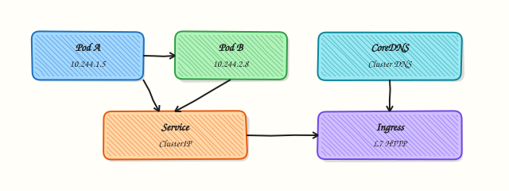
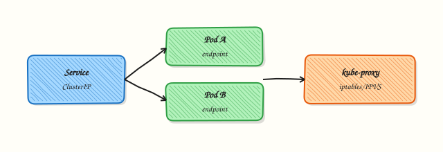

# Kubernetes Networking Fundamentals

## Overview

Kubernetes networking answers four questions: How do Pods get IP addresses? How do Pods talk to each other? How do clients find Pods? How do you restrict traffic? The answers involve the **Container Network Interface (CNI)**, **Services** (ClusterIP, NodePort, LoadBalancer), **Ingress** / Gateway API, **CoreDNS**, and **NetworkPolicies**.

A **Pod** is the smallest deployable unit and usually has its own IP on a flat Pod network. A **Service** gives a stable virtual IP (VIP) and Domain Name System (DNS) name in front of changing Pods. **kube-proxy** (or an equivalent data plane such as IP Virtual Server (IPVS) mode) implements Service routing. In this tutorial you will either inspect a live cluster with `kubectl`/`kind` **or** write dry-run manifests and validate YAML — without destroying any cluster.

Platform engineers who only memorise YAML struggle in incidents. You need the packet path: client → Service VIP → endpoint Pod IP → container port — plus DNS names like `my-svc.my-ns.svc.cluster.local`. NetworkPolicies add least-privilege between Pods when the CNI supports them.

This is the core tutorial in **Module 14: Kubernetes Networking** of the REBASH Academy **Networking for Cloud & DevOps Engineers** series. Evidence goes under `~/rebash-networking/lab18`.

## Prerequisites

- [Reverse Proxy and Ingress Basics](reverse-proxy-and-ingress-basics.md)
- [Load Balancing Fundamentals](load-balancing-fundamentals.md)
- Optional but ideal: `kubectl` and a practice cluster (`kind`, `minikube`, or remote). Lab works offline with manifests if no cluster exists.

## Learning Objectives

By the end of this tutorial, you will be able to:

- [ ] Describe Pod networking and the role of CNI
- [ ] Contrast ClusterIP, NodePort, and LoadBalancer Services
- [ ] Explain how Endpoints/EndpointSlices connect Services to Pods
- [ ] Query CoreDNS naming for in-cluster service discovery
- [ ] State what NetworkPolicies allow and deny at a practical level
- [ ] Collect kubectl evidence **or** validated dry-run manifests

## Architecture

Pods sit on a CNI-provided network. Services select Pods by labels and expose a stable VIP. Ingress/Gateway fronts HTTP to Services. NetworkPolicies filter Pod-to-Pod (and sometimes namespace) traffic when enforced.



Service VIP to Pod endpoints (same idea as a load balancer pool):



## Theory

### What it is

| Object | Job |
|--------|-----|
| Pod IP | Address of a running Pod on the cluster network |
| CNI plugin | Creates interfaces/routes/policies for Pod networking |
| Service | Stable VIP + DNS in front of Pods |
| EndpointSlice | Concrete backend addresses for a Service |
| Ingress / Gateway | L7 HTTP(S) routing to Services |
| NetworkPolicy | Declarative allow-list for Pod traffic |

```bash
kubectl get pods -o wide
kubectl get svc,endpoints
kubectl get endpointslices
```

### Why it matters

Pods are disposable; their IPs change. Services and DNS keep clients stable. Wrong Service selectors yield empty endpoints and mysterious timeouts. Missing NetworkPolicies leave flat networks wide open inside the cluster — a common audit finding.

### How it works

1. Scheduler places a Pod; CNI assigns a Pod IP.  
2. Service selects Pods by label; EndpointSlices list ready addresses.  
3. Client (Pod or external via NodePort/LB) targets the Service.  
4. Data plane DNAT/forwards to a backend Pod.  
5. CoreDNS answers `*.svc.cluster.local`.  
6. NetworkPolicy may drop non-allowed flows.

### Key concepts and comparisons

| Service type | Reachability |
|--------------|--------------|
| ClusterIP | Inside the cluster (default) |
| NodePort | Via each node IP on a high port |
| LoadBalancer | Via cloud (or MetalLB) external IP |
| ExternalName | DNS CNAME to external name |

| Pattern | Prefer when | Avoid when |
|---------|-------------|------------|
| ClusterIP + Ingress | HTTP microservices | Raw TCP without Ingress support |
| NodePort for demos | Learning / bare metal | Exposing NodePorts widely in prod |
| NetworkPolicy default-deny + allows | Zero-trust east-west | CNI without policy support (policy objects ignored) |

### Common pitfalls

- Service selector labels do not match Pod labels → **0 endpoints**.  
- Probing Pod IP from outside the cluster (often impossible).  
- Assuming NetworkPolicy works without a supporting CNI.  
- Mixing `targetPort` names/numbers incorrectly.  
- Destroying kind clusters casually in shared labs — this tutorial never requires cluster destroy.

## Hands-on Lab

### Objective

If `kubectl` can reach a cluster, gather Pod/Service/Endpoint evidence. Otherwise write manifests under `~/rebash-networking/lab18`, validate YAML, and document the dry-run path. **Do not** delete namespaces or destroy kind clusters.

### Prerequisites

- `kubectl` optional; `python3` for YAML sanity checks if no cluster
- Optional: `kind` cluster already running

### Lab environment

Workspace: `~/rebash-networking/lab18`

```bash
mkdir -p ~/rebash-networking/lab18 && cd ~/rebash-networking/lab18
set -euo pipefail
whoami | tee admin-user.txt
command -v kubectl >/dev/null && echo kubectl=yes | tee tools.txt || echo kubectl=no | tee tools.txt
if command -v kubectl >/dev/null 2>&1; then
  kubectl config current-context 2>&1 | tee context.txt || echo 'no-context' | tee context.txt
  kubectl cluster-info 2>&1 | tee cluster-info.txt || echo 'no-cluster' | tee cluster-info.txt
fi
```

**Expected output:** tools/context files exist; cluster may be absent (dry-run path still valid).

### Real-world scenario

On-call asks whether a Service has endpoints after a deploy. You either inspect the live cluster or prepare correct manifests with validation for a pull request — without running destructive cluster teardown commands.

### Step-by-step tasks

#### Task 1 – Write reference manifests (always)

```bash
cd ~/rebash-networking/lab18
set -euo pipefail
```

Create `deploy-svc.yaml`:

```yaml
apiVersion: apps/v1
kind: Deployment
metadata:
  name: rebash-netdemo
  labels:
    app: rebash-netdemo
spec:
  replicas: 2
  selector:
    matchLabels:
      app: rebash-netdemo
  template:
    metadata:
      labels:
        app: rebash-netdemo
    spec:
      containers:
        - name: web
          image: public.ecr.aws/docker/library/nginx:1.27-alpine
          ports:
            - name: http
              containerPort: 80
---
apiVersion: v1
kind: Service
metadata:
  name: rebash-netdemo
spec:
  selector:
    app: rebash-netdemo
  ports:
    - name: http
      port: 80
      targetPort: http
  type: ClusterIP
```

```bash
# Structural validation without apply (works offline)
python3 - << 'PY' | tee yaml-validate.txt
import sys
path = "deploy-svc.yaml"
text = open(path).read()
docs = [d for d in text.split("---") if d.strip()]
assert len(docs) >= 2, "expected Deployment + Service"
assert "kind: Deployment" in text
assert "kind: Service" in text
assert "app: rebash-netdemo" in text
print("yaml-basic-ok docs=%d" % len(docs))
PY

if command -v kubectl >/dev/null 2>&1; then
  kubectl apply --dry-run=client -f deploy-svc.yaml 2>&1 | tee dry-run-client.txt || \
    echo "dry-run-unavailable" | tee dry-run-client.txt
fi
```

**Expected output:** `yaml-validate.txt` shows `yaml-basic-ok`; dry-run OK when kubectl exists.

#### Task 2 – Live inspect **or** offline endpoint story

```bash
cd ~/rebash-networking/lab18
set -euo pipefail

LIVE=0
if command -v kubectl >/dev/null 2>&1 && kubectl get ns >/dev/null 2>&1; then
  LIVE=1
fi

if [[ "$LIVE" -eq 1 ]]; then
  echo mode=live | tee mode.txt
  kubectl get pods -A -o wide 2>&1 | head -n 40 | tee pods-wide.txt
  kubectl get svc -A 2>&1 | head -n 40 | tee svc-list.txt
  kubectl get endpoints -A 2>&1 | head -n 40 | tee endpoints.txt || true
  kubectl get endpointslices -A 2>&1 | head -n 40 | tee endpointslices.txt || true
  # DNS CoreDNS pods (names vary by distro)
  kubectl -n kube-system get pods -l k8s-app=kube-dns 2>&1 | tee coredns-pods.txt || \
    kubectl -n kube-system get pods | grep -i dns | tee coredns-pods.txt || true
else
  echo mode=offline-dry-run | tee mode.txt
```

Create `endpoints-story.txt`:

```text
When the Deployment is applied and Pods become Ready:
  kubectl get endpoints rebash-netdemo
should list Pod IPs:container ports matching the Service selector.
Empty endpoints ⇒ selector/labels mismatch or Pods not Ready.
DNS name in-cluster: rebash-netdemo.<namespace>.svc.cluster.local
```

```bash
  cp endpoints-story.txt endpoints.txt
  echo "offline — no cluster destroy performed" | tee safety.txt
fi

test -f mode.txt
```

**Expected output:** `mode.txt` is `live` or `offline-dry-run` with matching evidence files.

#### Task 3 – NetworkPolicy sample + evidence pack

```bash
cd ~/rebash-networking/lab18
set -euo pipefail
```

Create `netpol-sample.yaml`:

```yaml
apiVersion: networking.k8s.io/v1
kind: NetworkPolicy
metadata:
  name: rebash-netdemo-allow-dns-and-http
spec:
  podSelector:
    matchLabels:
      app: rebash-netdemo
  policyTypes:
    - Ingress
    - Egress
  ingress:
    - from:
        - podSelector:
            matchLabels:
              role: frontend
      ports:
        - protocol: TCP
          port: 80
  egress:
    - to:
        - namespaceSelector: {}
      ports:
        - protocol: UDP
          port: 53
        - protocol: TCP
          port: 53
```

```bash
python3 - << 'PY' | tee netpol-validate.txt
text = open("netpol-sample.yaml").read()
assert "kind: NetworkPolicy" in text
assert "podSelector" in text
print("netpol-yaml-ok")
PY

if command -v kubectl >/dev/null 2>&1; then
  kubectl apply --dry-run=client -f netpol-sample.yaml 2>&1 | tee netpol-dry-run.txt || true
fi

tar -czf k8s-net-evidence.tgz \
  admin-user.txt tools.txt mode.txt \
  deploy-svc.yaml yaml-validate.txt \
  netpol-sample.yaml netpol-validate.txt \
  $(ls context.txt cluster-info.txt dry-run-client.txt \
       pods-wide.txt svc-list.txt endpoints.txt endpointslices.txt \
       coredns-pods.txt endpoints-story.txt safety.txt netpol-dry-run.txt \
       2>/dev/null || true)

ls -l k8s-net-evidence.tgz | tee evidence-ls.txt
test -s k8s-net-evidence.tgz
```

**Expected output:** NetworkPolicy YAML validated; `k8s-net-evidence.tgz` non-empty. No cluster deleted.

### Validation steps

- [ ] `deploy-svc.yaml` passes basic validation / client dry-run
- [ ] `mode.txt` records live vs offline
- [ ] Live mode has `pods-wide.txt` / `svc-list.txt` / endpoints evidence **or** offline story file exists
- [ ] No `kind delete` / `kubectl delete ns` was required

### Common errors and fixes

| Error | Cause | Fix |
|-------|-------|-----|
| `The connection to the server was refused` | No API server | Use offline mode; start kind later if desired |
| Empty endpoints after apply | Label mismatch | Align Service `selector` and Pod labels |
| NetworkPolicy has no effect | CNI lacks support | Check CNI docs (Calico/Cilium/etc.) |
| `dry-run=client` fails schema | Old kubectl | Upgrade kubectl or rely on Python checks |

### Challenge exercise

Add `ingress-sample.yaml` with an Ingress for `host: netdemo.lab.local` → Service `rebash-netdemo:80`. Validate with `kubectl apply --dry-run=client` or Python asserts for `kind: Ingress` and `backend` service name. Do **not** require a working Ingress controller for this challenge.

### Learning outcomes

- Connected CNI, Pod IP, Service, and DNS mentally
- Distinguished Service types for interviews
- Collected live evidence or safe dry-run manifests
- Avoided destructive cluster operations

### Cleanup

```bash
cd ~/rebash-networking/lab18
set -euo pipefail
# Safe cleanup: local files only. Do NOT destroy clusters.
# If you voluntarily applied manifests to a practice namespace, remove only those objects:
# kubectl delete -f deploy-svc.yaml --ignore-not-found
# Do not run: kind delete cluster
echo "lab18 cleanup: workspace files retained; no cluster destroy" | tee cleanup-note.txt
```

## Validation

- [ ] Lab finished under `~/rebash-networking/lab18/`
- [ ] You can explain ClusterIP vs NodePort vs LoadBalancer
- [ ] You know empty endpoints mean selector/Ready problems
- [ ] You know NetworkPolicy needs CNI enforcement

## Code Walkthrough

For “Service times out”: check `kubectl get svc,endpoints` (empty?), Pod Ready/labels, DNS from a debug Pod, then NetworkPolicy/CNI. Keep manifests in git; prefer dry-run in CI before apply.

## Security Considerations

- Default Pod network is often flat — plan NetworkPolicies  
- Avoid exposing NodePorts on public node IPs without need  
- Use private LoadBalancers for internal apps  
- Lock down kubelet / API access separately from Pod policy  
- Do not destroy shared training clusters  

## Common Mistakes

!!! warning "Debugging only with Pod IPs"
    Pod IPs change and may be unreachable externally. **Fix:** use Services and DNS names clients actually call.

!!! warning "Service with wrong selector"
    Endpoints stay empty; clients time out. **Fix:** compare labels with `kubectl describe svc` and `get pods --show-labels`.

!!! warning "Assuming NetworkPolicy is active everywhere"
    Some CNIs ignore it. **Fix:** verify CNI policy support before relying on it for compliance.

!!! warning "Deleting kind clusters to ‘reset networking’"
    Loses everyone’s work. **Fix:** delete specific objects; recreate only on disposable personal clusters with consent.

## Best Practices

- One Service per logical app port; clear labels  
- Prefer ClusterIP + Ingress for HTTP  
- Readiness probes so endpoints exclude not-Ready Pods  
- Policy-as-code for NetworkPolicies  
- Document CoreDNS and split-horizon DNS  

## Troubleshooting

| Symptom | Likely cause | Fix |
|---------|--------------|-----|
| Timeout to Service | No endpoints / policy drop | Fix selector; check NetworkPolicy |
| DNS name unknown | Wrong namespace FQDN | Use `svc.ns.svc.cluster.local` |
| Works in-cluster, fails externally | No NodePort/LB/Ingress | Publish correctly |
| Policy YAML present, no effect | CNI lacks enforcement | Use a policy-capable CNI |

## Summary

Kubernetes networking combines CNI Pod IPs, Services as stable front doors, DNS for discovery, and optional NetworkPolicies for least privilege. Practise with kubectl evidence or dry-run manifests — never casual cluster destroy. Next: [Cloud Networking — VPCs and Subnets](cloud-networking-vpc-and-subnets.md).

## Interview Questions

**1. Why do we need Services if Pods already have IPs?**

??? success "Reveal answer"
    Pod IPs are **ephemeral** and numerous. A Service gives a **stable virtual IP and DNS name**, load-balances across Ready Pods, and decouples clients from Pod lifecycle. Without Services, every client would chase changing IPs.

**2. What is the difference between `port` and `targetPort` on a Service?**

??? success "Reveal answer"
    **`port`** is the port on the Service VIP that clients use. **`targetPort`** is the port on the Pod (name or number) that receives traffic. They often match but need not — for example Service port 80 → container port 8080.

**3. A Service shows no endpoints (`<none>`). What do you check?**

??? success "Reveal answer"
    Selector labels vs Pod labels, Pod Ready/Running state, and the correct namespace. `kubectl describe svc` and `kubectl get pods -l … --show-labels` usually reveal the mismatch within a minute.

**4. Compare ClusterIP, NodePort, and LoadBalancer.**

??? success "Reveal answer"
    **ClusterIP** — internal only. **NodePort** — opens a port on each node to reach the Service. **LoadBalancer** — provisions an external (or internal) cloud LB that fronts the Service. Choose based on who must reach the app and whether you already have Ingress.

**5. How does CoreDNS help microservice communication?**

??? success "Reveal answer"
    Pods resolve `service.namespace.svc.cluster.local` (short names inside the same namespace) via CoreDNS, so apps use stable names instead of Pod IPs. DNS failures look like “connection errors” — always verify DNS in triage.

**6. What problem do NetworkPolicies solve, and what is required for them to work?**

??? success "Reveal answer"
    They express **allow-list** rules for Pod ingress/egress to limit east-west blast radius (how far an attacker can move inside the cluster). They only enforce if the **CNI** (or policy engine) implements the NetworkPolicy API.

**7. How is Ingress related to the reverse-proxy lab in Module 13?**

??? success "Reveal answer"
    Ingress declares Host/path → Service routing; a controller configures a reverse proxy (nginx, Traefik, cloud L7). Same Host-header mental model as curling a vhost — declarative and cluster-native.

## Related Tutorials

- [Networking for Cloud & DevOps – Overview](index.md)
- [Reverse Proxy and Ingress Basics](reverse-proxy-and-ingress-basics.md) *(previous)*
- [Cloud Networking — VPCs and Subnets](cloud-networking-vpc-and-subnets.md) *(next)*
- [Kubernetes — Services and Cluster Networking](../kubernetes/services-and-cluster-networking.md)
- [Linux Networking Toolkit](linux-networking-toolkit.md)

## References

- [Kubernetes Service](https://kubernetes.io/docs/concepts/services-networking/service/) — official docs  
- [Cluster Networking](https://kubernetes.io/docs/concepts/cluster-administration/networking/) — CNI overview  
- [NetworkPolicies](https://kubernetes.io/docs/concepts/services-networking/network-policies/) — policy API  
- [Ingress](https://kubernetes.io/docs/concepts/services-networking/ingress/) — L7 routing  
- Track index: [Networking for Cloud & DevOps Engineers](index.md)
