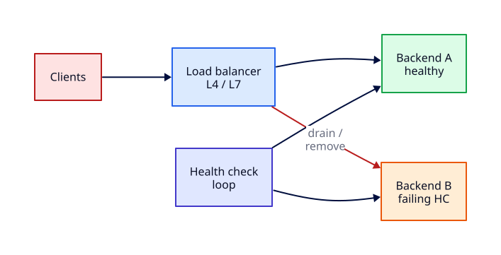

# Load Balancer Operations and Health Checks

## Overview

Load balancers are the traffic directors of production — they spread connections across healthy backends, shed failed nodes, and enable zero-downtime deploys. **Operations** differs from **design**: you live with algorithm choice, health-check tuning, connection draining, failover behaviour, and sticky-session trade-offs every deploy window.

This tutorial focuses on **L4 vs L7 operations**, health probes, graceful drain, and proving failover by killing a Python backend behind **HAProxy on loopback**. Conceptual foundations live in [Load Balancing Fundamentals](load-balancing-fundamentals.md). Per-host nginx upstream and TLS termination detail is in [nginx Web Server and Reverse Proxy](../linux/nginx-web-server-and-reverse-proxy.md) — not duplicated here.

This is **Tutorial 23** in **Module 7: Production Network Operations** of the REBASH Academy Networking series.

## Prerequisites

- Completed [Production DNS Operations](production-dns-operations.md)
- [Load Balancing Fundamentals](load-balancing-fundamentals.md) and [Reverse Proxy and Ingress Basics](reverse-proxy-and-ingress-basics.md)
- Ubuntu/Debian with `sudo`, `curl`, `python3`, and optional `apt install haproxy`
- Loopback-only lab — no cloud LB charges

## Learning Objectives

By the end of this tutorial, you will be able to:

- [ ] Compare L4 and L7 load balancing from an operator perspective
- [ ] Choose and explain balancing algorithms (round-robin, leastconn, hash)
- [ ] Configure HTTP/TCP health checks and interpret UP/DOWN states
- [ ] Drain backends before maintenance and verify zero failed user requests
- [ ] Describe sticky session benefits and operational downsides
- [ ] Prove automatic failover by stopping one backend in an HAProxy lab

## Architecture

Client traffic hits the load balancer front door; health checks gate backend pool membership; failed nodes drain from rotation while survivors absorb load.



## Theory

### L4 vs L7 operations

| Layer | OSI | LB sees | Health check | Typical ops concern |
|-------|-----|---------|--------------|---------------------|
| **L4** | Transport | IP + TCP/UDP port | TCP connect, custom TCP | Fast, low CPU; no URL awareness |
| **L7** | Application | HTTP headers, path, cookies | HTTP GET/HEAD, gRPC | Routing, WAF, stickiness, cert SNI |

**L4 (NLB-style):** millions of connections, TLS passthrough, static ports — ops tune idle timeouts and preserve client IP via PROXY protocol.

**L7 (ALB/HAProxy/nginx):** path-based routing, host-based rules, redirect HTTP→HTTPS — ops tune `option httpchk`, retry logic, and buffer sizes.

### Balancing algorithms (operator view)

| Algorithm | Behaviour | When to use |
|-----------|-----------|-------------|
| **roundrobin** | Rotate backends evenly | Homogeneous, short requests |
| **leastconn** | Fewest active connections | Long-lived connections, WebSockets |
| **source/uri hash** | Same client → same backend | Cache locality; careful with hot keys |
| **random** | Weighted random | Simple clouds with homogeneous nodes |

Change algorithms in maintenance windows — in-flight connections may stick to old backend until closed.

### Health checks

Health checks **remove unhealthy backends** from the pool:

```text
check interval → fail threshold → mark DOWN → stop new connections
pass threshold → mark UP → resume rotation
```

| Check type | Validates | Blind spot |
|------------|-----------|------------|
| TCP connect | Port open | App hung after accept |
| HTTP GET /health | Status 200 + body | DB dependency not tested |
| gRPC health | Service health RPC | Requires L7 support |

Tune **interval**, **rise**, and **fall** counts — aggressive checks add load; lazy checks keep dead nodes too long.

### Drain and failover

**Drain (soft disable):** stop sending **new** connections; existing sessions complete. Required before deploy or kernel reboot behind LB.

**Failover:** when health checks fail, LB routes to surviving backends. Capacity drops — alert on pool size `< N`.

**Fail closed vs open:** production LBs fail **closed** (remove bad node). Never "keep serving" from a known-dead backend unless you have a documented break-glass.

### Sticky sessions trade-offs

**Sticky sessions** (cookie insert, source IP affinity):

| Benefit | Cost |
|---------|------|
| Session state on one node | Uneven load when clients differ in weight |
| Simpler legacy apps | Node loss drops sessions unless externalised store |
| Cache warmth | Hot spots on popular clients |

Prefer **external session stores** (Redis) over stickiness for new systems. If stickiness is required, use **LB-generated cookies** with short TTL and monitor distribution skew.

## Hands-on Lab

**£0 local lab:** two Python HTTP backends on loopback, HAProxy front on 8888, kill one backend, observe failover.

### Step 1 – Install and verify HAProxy

```bash
sudo apt update
sudo apt install -y haproxy curl
haproxy -v | head -1
sudo systemctl is-active haproxy || true
```

**Expected output:** HAProxy version line (2.x on Ubuntu 22.04+); service may be inactive until configured.

### Step 2 – Start two backend servers

```bash
mkdir -p /tmp/lb-ops-lab/{web1,web2}
echo "Backend Alpha" > /tmp/lb-ops-lab/web1/index.html
echo "Backend Beta"  > /tmp/lb-ops-lab/web2/index.html
cd /tmp/lb-ops-lab/web1 && python3 -m http.server 18081 &
cd /tmp/lb-ops-lab/web2 && python3 -m http.server 18082 &
sleep 1
curl -s http://127.0.0.1:18081/
curl -s http://127.0.0.1:18082/
ss -tln | grep -E '1808[12]'
```

**Expected output:**

```text
Backend Alpha
Backend Beta
```

Listeners on 18081 and 18082.

### Step 3 – Configure HAProxy with health checks

```bash
sudo tee /etc/haproxy/haproxy.cfg <<'EOF'
global
    log /dev/log local0
    maxconn 2048

defaults
    log     global
    mode    http
    option  httplog
    timeout connect 5s
    timeout client  30s
    timeout server  30s

frontend lb_ops_front
    bind 127.0.0.1:8888
    default_backend lb_ops_pool

backend lb_ops_pool
    balance roundrobin
    option httpchk GET /
    http-check expect status 200
    server web1 127.0.0.1:18081 check inter 2s fall 3 rise 2
    server web2 127.0.0.1:18082 check inter 2s fall 3 rise 2
EOF

sudo haproxy -c -f /etc/haproxy/haproxy.cfg
sudo systemctl restart haproxy
sudo systemctl is-active haproxy
```

**Expected output:** `Configuration file is valid`; haproxy `active`.

### Step 4 – Verify round-robin through LB

```bash
for i in {1..6}; do curl -s http://127.0.0.1:8888/; echo; done
```

**Expected output:** Alternating `Backend Alpha` and `Backend Beta` (approximately equal distribution).

### Step 5 – Kill one backend and prove failover

```bash
kill $(lsof -t -i:18081) 2>/dev/null
echo "Waiting for health checks to mark web1 DOWN..."
sleep 8
for i in {1..5}; do curl -s http://127.0.0.1:8888/; echo; done
grep -E 'web1|web2|BACKEND' /var/log/haproxy.log 2>/dev/null | tail -5 || journalctl -u haproxy -n 10 --no-pager
```

**Expected output:** All responses show `Backend Beta` only — web1 removed after `fall 3` failed checks (~6s with 2s interval).

### Step 6 – Simulate drain (disable server via runtime API)

Re-start web1 for drain demo:

```bash
cd /tmp/lb-ops-lab/web1 && python3 -m http.server 18081 &
sleep 2
echo "show stat" | sudo socat stdio /run/haproxy/admin.sock 2>/dev/null | cut -d, -f1,2,18 | head -6 || echo "admin socket not enabled — observe via curl only"
curl -s http://127.0.0.1:8888/ | head -1
```

**Expected output:** Both backends may serve again; note admin socket requires extra config for production drain commands.

### Step 7 – Document ops checklist

```bash
cat <<'EOF' | tee /tmp/lb-ops-lab/runbook-snippet.md
## Pre-deploy LB drain checklist
1. Set server state DRAIN in LB (or weight 0)
2. Wait until active sessions = 0 (monitor LB stats)
3. Deploy/restart backend
4. Enable server; verify health UP
5. curl through VIP from external probe
EOF
cat /tmp/lb-ops-lab/runbook-snippet.md
```

**Expected output:** Runbook snippet suitable for your team's wiki.

### Step 8 – Cleanup

```bash
kill $(lsof -t -i:18081 -i:18082) 2>/dev/null || true
sudo systemctl stop haproxy 2>/dev/null || true
rm -rf /tmp/lb-ops-lab
```

**Expected output:** Lab backends stopped; HAProxy stopped if you started it only for this lab.

## Validation

Confirm the lab before moving on:

1. HAProxy config validates and serves both backends initially.
2. After killing web1, only Beta responds through port 8888.
3. You can explain health-check timing (`inter`, `fall`, `rise`).

| Check | Pass criteria |
|-------|----------------|
| Backends | Two Python servers on 18081/18082 |
| HAProxy | Listens 127.0.0.1:8888 with httpchk |
| Failover | Single-backend responses after kill |
| Runbook | Drain checklist documented |
| Cleanup | Processes and temp files removed |

## Code Walkthrough

| Command / directive | Description |
|---------------------|-------------|
| `option httpchk GET /` | L7 health probe path |
| `check inter 2s fall 3 rise 2` | Probe every 2s; 3 fails = DOWN |
| `balance roundrobin` | Equal rotation across UP servers |
| `haproxy -c -f` | Validate config before reload |
| `curl http://127.0.0.1:8888/` | Client-side verification through VIP |
| `ss -tln` | Confirm listeners before blaming LB |

## Security Considerations

- Bind admin stats and sockets to localhost or mgmt network only
- Terminate TLS at edge with modern ciphers — configure on Linux host per [TLS Certificates on Linux Servers](../linux/tls-certificates-on-linux-servers.md)
- Do not expose backend ports publicly when LB is the intended entry point
- Log LB decisions for audit; rate-limit health-check endpoints
- Validate `X-Forwarded-For` handling when trusting client IP at app layer

## Common Mistakes

!!! warning "Health check too shallow"
    TCP-only checks leave "zombie" backends that accept but never serve HTTP 200. Use L7 checks matching real user paths.

!!! warning "Reload without `-c` validation"
    Bad HAProxy/nginx config drops all traffic on failed reload. Always validate then `reload`.

!!! warning "Sticky sessions without capacity plan"
    Affinity means node loss drops sessions — size pools and plan external session store.

!!! warning "Ignoring connection drain"
    Hard kill during deploy causes 502 spikes. Drain first; align with [Production DNS Operations](production-dns-operations.md) TTL if VIP changes.

## Best Practices

!!! tip "Health endpoint mirrors dependencies"
    `/health/ready` checks DB connectivity; `/health/live` is cheap for kube liveness.

!!! tip "Alert on pool quorum"
    Page when `< 50%` backends UP — surviving nodes may be overloaded silently.

!!! tip "Same config in staging"
    Run identical HAProxy/nginx algorithms in staging to catch skew before prod.

!!! tip "Cross-link fundamentals"
    Review [Load Balancing Fundamentals](load-balancing-fundamentals.md) when choosing NLB vs ALB in cloud.

## Troubleshooting

| Symptom | Likely cause | Resolution |
|---------|--------------|------------|
| All backends DOWN | httpchk wrong path/status | Match probe to app; check `fall` threshold |
| Uneven load | Sticky cookie or long connections | Switch to leastconn; review keep-alive |
| 502 after deploy | Backend not re-enabled | Check HAProxy stats; verify listen address |
| Flapping UP/DOWN | Slow app startup | Increase `rise`; add warmup delay |
| Works direct, fails via LB | Wrong bind or firewall | `ss -tln`; curl VIP; check SG |

## Summary

- **L4 ops** focus on connections and ports; **L7 ops** on HTTP paths, headers, and certs
- **Health checks** must reflect real serving ability — tune interval and thresholds
- **Drain** before maintenance; **failover** relies on surviving capacity — monitor pool size
- **Sticky sessions** simplify legacy state but complicate load fairness and failure recovery
- HAProxy on loopback proves failover without cloud cost — same ops mental model as ALB/NLB
- Host nginx/TLS configuration belongs in **Linux Module 7** and **Load Balancing Fundamentals**

## Interview Questions

1. What is the operational difference between L4 and L7 load balancing?
2. How do HTTP health checks differ from TCP connect checks?
3. Explain connection draining and why it matters for deploys.
4. When would you choose leastconn over roundrobin?
5. What are the downsides of sticky sessions?
6. What do HAProxy `fall` and `rise` parameters control?
7. How would you verify failover during a game day?
8. What alerts would you set on a load balancer pool?
9. How would you explain LB operations to a junior engineer in two minutes?
10. What failure mode appears when health checks are misconfigured?

??? tip "Sample Answers (Questions 2 and 5)"

    **Q2 — HTTP vs TCP checks:** TCP connect only proves the port accepts connections — the app may hang after accept. HTTP GET to `/health` validates the application returns expected status (200), catching more failure modes at the cost of slightly higher probe load.

    **Q5 — Sticky session downsides:** Uneven load when client weights differ; session loss when a node dies unless state is externalised; hot spots on hashed keys. Prefer shared session stores for new architectures.

## Related Tutorials

- [Networking – Category Overview](index.md)
- [Production DNS Operations](production-dns-operations.md) *(Module 7 — previous)*
- Next: [Firewall Change Control and Production ACLs](firewall-change-control-and-production-acls.md) *(Module 7)*
- [Load Balancing Fundamentals](load-balancing-fundamentals.md)
- [Reverse Proxy and Ingress Basics](reverse-proxy-and-ingress-basics.md)
- [nginx Web Server and Reverse Proxy](../linux/nginx-web-server-and-reverse-proxy.md) *(Linux Module 7 — reverse proxy host detail)*
- [Network Segmentation and Trust Boundaries](network-segmentation-and-trust-boundaries.md)
- Cheat sheet: [Networking Cheat Sheet](../cheatsheets/networking.md)
- Interview prep: [Networking Interview Prep](../interview/networking.md)
- Learning path: [DevOps Engineer](../learning-paths/devops-engineer.md)

## References

- [HAProxy Configuration Manual](https://www.haproxy.org/download/2.9/doc/configuration.txt)
- [HAProxy Health Checks](https://www.haproxy.com/blog/how-to-enable-health-checks-in-haproxy)
- [nginx load balancing](https://nginx.org/en/docs/http/load_balancing.html)
- [Google SRE — Load Balancing at the Frontend](https://sre.google/sre-book/load-balancing-frontend/)
