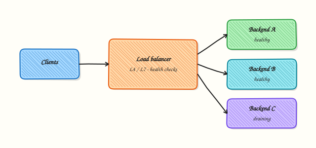

# Load Balancing Fundamentals

## Overview

A **load balancer** presents one stable front door and spreads traffic across healthy backends. It supports scale-out, rolling deploys, and failover. **Layer 4 (L4)** balancers forward Transmission Control Protocol (TCP) or User Datagram Protocol (UDP) by IP and port. **Layer 7 (L7)** balancers understand Hypertext Transfer Protocol (HTTP) — paths, Host headers, cookies — and often terminate Transport Layer Security (TLS).

Wrong tier choices cause silent bugs: an L4 balancer cannot route by URL path; an L7 balancer adds parsing and certificate complexity. Cloud products such as Application Load Balancer (ALB) and Network Load Balancer (NLB) map to these ideas. In this tutorial you will run a **local** demo with two Python HTTP backends and nginx (or a documented fallback) under `~/rebash-networking/lab16`.

Health checks decide which backends receive traffic. Bad checks flap instances or keep “zombie” nodes in the pool. Session persistence (stickiness) trades even load for session affinity. Production designs document algorithm, health check, idle timeouts, and drain behaviour for deploys.

This is **Tutorial 1** in **Module 13: Load Balancing** of the REBASH Academy **Networking for Cloud & DevOps Engineers** series. It is written for Cloud, DevOps, SRE, and platform engineers.

## Prerequisites

- [Linux Networking Toolkit](linux-networking-toolkit.md)
- [HTTP, HTTPS, and the Application Layer](http-https-and-application-layer.md)
- Practice Ubuntu VM with `python3` and preferably `nginx` (`sudo apt-get install -y nginx` if allowed)

## Learning Objectives

By the end of this tutorial, you will be able to:

- [ ] Contrast L4 vs L7 load balancing with one example each
- [ ] Explain round-robin, least-connections, and when stickiness is used
- [ ] Describe health-check design mistakes that cause outages
- [ ] Run two local backends behind nginx **or** a scripted fallback balancer
- [ ] Capture curl evidence proving traffic hits both backends

## Architecture

Clients hit a virtual IP or hostname on the load balancer. The balancer selects a healthy backend using an algorithm and optional persistence. Health checks run out-of-band from user traffic.



## Theory

### What it is

| Tier | Sees | Good for |
|------|------|----------|
| L4 | IP/port, TCP/UDP | High throughput, TLS pass-through, non-HTTP |
| L7 | HTTP methods, Host, path, headers | Path routing, Header-based canary, WAF pairing |

```bash
# Mental model — one VIP, many backends
# Client → LB:80 → backend-a:8081 or backend-b:8082
```

### Why it matters

Without a balancer, every client must know every instance. With one, you can replace backends during deploys. Cloud and Kubernetes Services/Ingress reuse these patterns. Choosing NLB vs ALB (or equivalents) is mostly L4 vs L7 plus operational features (health checks, idle timeout, cross-zone).

### How it works

1. **Bind** a front-end listener (port 80/443 or internal port).  
2. **Pool** backends with weights.  
3. **Health-check** each member (TCP connect or HTTP status).  
4. **Schedule** new connections (round-robin, least-conn, hash).  
5. **Drain** on deploy — stop new connections, finish in-flight.

### Key concepts and comparisons

| Algorithm | Behaviour | Prefer when |
|-----------|-----------|-------------|
| Round-robin | Rotate evenly | Similar backends, short requests |
| Least connections | Prefer quieter node | Long-lived connections |
| IP hash / cookie stickiness | Same client → same node | Stateful sessions without shared store |

| Pattern | Prefer when | Avoid when |
|---------|-------------|------------|
| L4 pass-through TLS | End-to-end TLS to app | You need path-based routing |
| L7 terminate TLS | Central certs, HTTP routing | Ultra-low latency UDP gaming |
| Shared session store | Horizontal scale without stickiness | You rely only on sticky cookies forever |

### Common pitfalls

- Health check hits `/` while the real app is `/healthz` (false healthy/unhealthy).  
- Idle timeout shorter than app long-polls.  
- Sticky sessions hiding uneven load and broken deploys.  
- Balancing to pods by Pod IP without a Service (Kubernetes lesson later).

## Hands-on Lab

### Objective

Run two backends on ports **18081** and **18082**, put a balancer on **18080**, prove both backends receive requests, and keep a working artefact (`nginx` config **or** `rr-client.sh` fallback).

### Prerequisites

- `python3`, `curl`
- Preferred: `nginx`  
- Fallback: pure bash round-robin client if nginx/haproxy/socat missing

### Lab environment

Workspace: `~/rebash-networking/lab16`

``` {.bash .ra-terminal title="Terminal"}
mkdir -p ~/rebash-networking/lab16 && cd ~/rebash-networking/lab16
set -euo pipefail
whoami | tee admin-user.txt
command -v nginx >/dev/null && echo nginx=yes | tee tools.txt || echo nginx=no | tee tools.txt
command -v haproxy >/dev/null && echo haproxy=yes | tee -a tools.txt || echo haproxy=no | tee -a tools.txt
command -v socat >/dev/null && echo socat=yes | tee -a tools.txt || echo socat=no | tee -a tools.txt
```

!!! example "Expected output"
    `tools.txt` records which balancers exist.


### Real-world scenario

Before buying a cloud load balancer, you prove the design on a laptop: two app instances, one front door, evidence that requests spread. You keep the config or fallback script as a teaching artefact for the team.

### Step-by-step tasks

#### Task 1 – Two Python backends

``` {.bash .ra-terminal title="Terminal"}
cd ~/rebash-networking/lab16
set -euo pipefail
```

Create `backend.py`:

```python title="backend.py"
#!/usr/bin/env python3
import sys
from http.server import BaseHTTPRequestHandler, HTTPServer

NAME = sys.argv[1]
PORT = int(sys.argv[2])

class H(BaseHTTPRequestHandler):
    def do_GET(self):
        body = f"backend={NAME}\n".encode()
        self.send_response(200)
        self.send_header("Content-Type", "text/plain")
        self.send_header("Content-Length", str(len(body)))
        self.end_headers()
        self.wfile.write(body)
    def log_message(self, *args):
        pass

HTTPServer.allow_reuse_address = True
HTTPServer(("127.0.0.1", PORT), H).serve_forever()
```

``` {.bash .ra-terminal title="Terminal"}
chmod +x backend.py
python3 backend.py A 18081 >backend-a.log 2>&1 &
echo $! > backend-a.pid
python3 backend.py B 18082 >backend-b.log 2>&1 &
echo $! > backend-b.pid
sleep 0.4
curl -sS http://127.0.0.1:18081/ | tee hit-a.txt
curl -sS http://127.0.0.1:18082/ | tee hit-b.txt
grep -q 'backend=A' hit-a.txt
grep -q 'backend=B' hit-b.txt
```

!!! example "Expected output"
    `hit-a.txt` / `hit-b.txt` show `backend=A` and `backend=B`.


#### Task 2 – nginx upstream **or** fallback balancer

Create `nginx-lb.conf`:

```nginx title="nginx-lb.conf"
worker_processes 1;
error_log /tmp/rebash-lab16-nginx.err;
pid /tmp/rebash-lab16-nginx.pid;
events { worker_connections 64; }
http {
  access_log /tmp/rebash-lab16-nginx.access;
  upstream rebash_backends {
    server 127.0.0.1:18081;
    server 127.0.0.1:18082;
  }
  server {
    listen 127.0.0.1:18080;
    location / {
      proxy_pass http://rebash_backends;
    }
  }
}
```

Create `rr-client.sh` (fallback when nginx is absent):


``` {.bash .ra-terminal title="Terminal"}
#!/usr/bin/env bash
set -euo pipefail
N="${1:-10}"
ports=(18081 18082)
i=0
for ((k=0; k<N; k++)); do
  p="${ports[$((i % ${#ports[@]}))]}"
  curl -sS "http://127.0.0.1:${p}/"
  i=$((i+1))
done
```


``` {.bash .ra-terminal title="Terminal"}
cd ~/rebash-networking/lab16
set -euo pipefail

if command -v nginx >/dev/null 2>&1; then
  nginx -t -c "$PWD/nginx-lb.conf"
  nginx -c "$PWD/nginx-lb.conf"
  echo mode=nginx | tee mode.txt
else
  # Fallback artefact: bash round-robin client (documents missing nginx)
  chmod +x rr-client.sh
  # Simple socat multiplexer if available
  if command -v socat >/dev/null 2>&1; then
    socat TCP-LISTEN:18080,bind=127.0.0.1,reuseaddr,fork \
      TCP:127.0.0.1:18081 &
    echo $! > socat.pid
    echo mode=socat-single-backend-demo | tee mode.txt
    echo "NOTE: socat demo forwards to A only; use rr-client.sh for spread proof" | tee -a mode.txt
  else
    echo mode=rr-client-fallback | tee mode.txt
  fi
fi

# Spread proof
: > hits.txt
if [[ "$(cat mode.txt)" == mode=nginx ]]; then
  for i in $(seq 1 10); do
    curl -sS http://127.0.0.1:18080/ >> hits.txt
  done
else
  ./rr-client.sh 10 >> hits.txt
fi

grep -c 'backend=A' hits.txt | tee count-a.txt
grep -c 'backend=B' hits.txt | tee count-b.txt
# At least one hit each when using nginx or rr-client
test "$(cat count-a.txt)" -ge 1
test "$(cat count-b.txt)" -ge 1
```

!!! example "Expected output"
    `hits.txt` contains both `backend=A` and `backend=B`; `mode.txt` records which path ran.


#### Task 3 – Evidence pack

``` {.bash .ra-terminal title="Terminal"}
cd ~/rebash-networking/lab16
set -euo pipefail

tar -czf lb-evidence.tgz \
  admin-user.txt tools.txt mode.txt \
  hit-a.txt hit-b.txt hits.txt count-a.txt count-b.txt \
  backend.py nginx-lb.conf rr-client.sh 2>/dev/null || \
tar -czf lb-evidence.tgz *.txt backend.py mode.txt \
  $(ls nginx-lb.conf rr-client.sh 2>/dev/null || true)

ls -l lb-evidence.tgz | tee evidence-ls.txt
test -s lb-evidence.tgz
```

!!! example "Expected output"
    `lb-evidence.tgz` is non-empty and includes the working artefact.


### Validation steps

- [ ] Both backends respond on 18081/18082
- [ ] Spread proof shows A and B in `hits.txt`
- [ ] `mode.txt` explains nginx vs fallback
- [ ] `lb-evidence.tgz` exists

### Common errors and fixes

| Error | Cause | Fix |
|-------|-------|-----|
| `nginx: bind failed` | Port in use | Change listen port or stop conflicting process |
| Only backend A in hits | socat single target | Use `rr-client.sh` or nginx upstream |
| `Connection refused` on 18080 | Balancer not started | Start nginx or use fallback client |
| Permission denied for nginx pid | Path rights | Use `/tmp` paths as in the config |

### Challenge exercise

Add an HTTP health note file `health-design.md` (short) listing: check path, interval idea, and what happens when one backend is killed. Then `kill` backend B’s PID, re-run five curls through nginx (if in nginx mode), and save `hits-degraded.txt` showing only A (or document fallback behaviour).

### Learning outcomes

- Distinguished L4 vs L7 in practical terms
- Ran a two-backend local balancer demo
- Kept a working config or fallback script artefact
- Linked health checks to deploy safety

### Cleanup

``` {.bash .ra-terminal title="Terminal"}
cd ~/rebash-networking/lab16
set -euo pipefail

if [[ -f /tmp/rebash-lab16-nginx.pid ]]; then
  nginx -s stop -c "$PWD/nginx-lb.conf" 2>/dev/null || \
    kill "$(cat /tmp/rebash-lab16-nginx.pid)" 2>/dev/null || true
fi
[[ -f socat.pid ]] && kill "$(cat socat.pid)" 2>/dev/null || true
[[ -f backend-a.pid ]] && kill "$(cat backend-a.pid)" 2>/dev/null || true
[[ -f backend-b.pid ]] && kill "$(cat backend-b.pid)" 2>/dev/null || true
rm -f backend-a.pid backend-b.pid socat.pid
ss -lnt '( sport = :18080 or sport = :18081 or sport = :18082 )' || true
```

## Validation

- [ ] Lab finished under `~/rebash-networking/lab16/`
- [ ] You can explain L4 vs L7 and one cloud mapping (NLB/ALB)
- [ ] You can describe a safe health check for rolling deploys
- [ ] You know stickiness trade-offs

## Code Walkthrough

Local demos mirror production:

1. **Backends first** — prove each instance alone  
2. **Pool config** — upstream / target group  
3. **Front listener** — VIP/port  
4. **Prove spread** — multiple curls, count backends  
5. **Break one backend** — confirm health/failover behaviour  

Cloud consoles hide the same objects: listeners, target groups, health checks.

## Security Considerations

- Prefer internal balancers for admin APIs  
- Terminate TLS with strong ciphers; manage certificates as secrets  
- Do not expose raw backend ports publicly when an LB exists  
- Restrict who can change target registration  
- Log enough to see which backend served a request when debugging  

## Common Mistakes

!!! warning "Using L4 when you need path-based routing"
    Paths are invisible at L4. **Fix:** use L7 (ALB/nginx/Ingress) for `/api` vs `/static`.

!!! warning "Health check on a heavy homepage"
    False unhealthy during cache misses. **Fix:** dedicated cheap `/healthz`.

!!! warning "Sticky sessions forever"
    Uneven load and painful deploys. **Fix:** shared session store; stickiness only when required.

!!! warning "Forgetting drain during deploy"
    In-flight requests die. **Fix:** connection draining / `preStop` hooks in Kubernetes.

## Best Practices

- Document algorithm, timeouts, and health path in the runbook  
- Test failover by stopping one backend in staging  
- Align idle timeouts across LB, proxy, and app  
- Use multiple availability zones for the balancer itself  
- Prefer immutable target registration via automation  

## Troubleshooting

| Symptom | Likely cause | Fix |
|---------|--------------|-----|
| 502/504 from LB | No healthy targets | Fix health checks / backends |
| Uneven load | Stickiness or long conn | Review algorithm |
| TLS errors at edge | Cert/SNI mismatch | Fix certificates / Host |
| Works via backend IP, fails via VIP | Security group on LB | Open listener SG |
| Flapping healthy/unhealthy | Borderline timeout | Relax threshold; fix app |

## Summary

Load balancers front many backends with health-aware scheduling. Choose L4 vs L7 deliberately, prove spread locally, and treat health checks as production code. Next: [Reverse Proxy and Ingress Basics](reverse-proxy-and-ingress-basics.md).

## Interview Questions

**1. When do you choose an L4 balancer over an L7 balancer?**

??? success "Reveal answer"
    Choose **L4** for raw TCP/UDP, TLS pass-through, extreme throughput, or non-HTTP protocols. Choose **L7** when you need Host/path routing, header-based rules, or central HTTP features. Cloud NLB ≈ L4; ALB ≈ L7 is a useful mapping, not a law.

**2. What makes a good HTTP health check?**

??? success "Reveal answer"
    A **cheap, dedicated** endpoint (for example `/healthz`) that checks critical dependencies the instance needs, returns clear status codes, and runs on an interval/threshold that avoids flapping. Checking a heavy homepage or external third party from every node is a common anti-pattern.

**3. How does round-robin differ from least-connections?**

??? success "Reveal answer"
    **Round-robin** sends new requests in turn, which works when requests are similar. **Least-connections** prefers the backend with fewer active connections — better for mixed long/short workloads. Interviewers also expect you to mention stickiness as a separate concern.

**4. Users keep hitting one backend after you scaled out. What do you suspect?**

??? success "Reveal answer"
    **Session stickiness** (cookie or IP hash), DNS caching to an old VIP, or a misconfigured target group that never registered new nodes. Check balancer stats and whether new targets are healthy.

**5. Why can idle timeout mismatches look like “random API failures”?**

??? success "Reveal answer"
    If the load balancer closes idle connections sooner than the client or app expects, long-polls or reused connections fail. Align LB, reverse proxy, and application timeouts and watch for 502/504 spikes.

**6. How would you prove a local lab balancer is actually distributing traffic?**

??? success "Reveal answer"
    Give each backend a distinct response body (as in this lab), send many requests through the front port, and **count** which backends appear. Config alone is not proof.

**7. Map Kubernetes Service `type: LoadBalancer` to this lesson.**

??? success "Reveal answer"
    The cloud provider creates an external (or internal) load balancer whose targets are nodes/NodePorts or pods via integrated mechanisms. Mentally it is still “VIP + healthy backends”; CNI and kube-proxy/IPVS add the cluster-side hop covered in Module 14.

## Related Tutorials

- [Networking for Cloud & DevOps – Overview](index.md)
- [Linux Networking Toolkit](linux-networking-toolkit.md) *(previous)*
- [Reverse Proxy and Ingress Basics](reverse-proxy-and-ingress-basics.md) *(next)*
- [Load Balancer Operations and Health Checks](load-balancer-operations-and-health-checks.md)
- [HTTP, HTTPS, and the Application Layer](http-https-and-application-layer.md)

## References

- [nginx reverse proxy / upstream](https://nginx.org/en/docs/http/ngx_http_proxy_module.html) — nginx  
- [AWS ELB product comparisons](https://docs.aws.amazon.com/elasticloadbalancing/latest/userguide/what-is-load-balancing.html) — L4/L7 mapping  
- Track index: [Networking for Cloud & DevOps Engineers](index.md)
