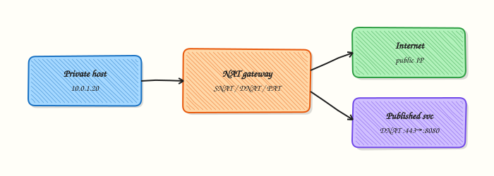

# NAT and Port Forwarding

## Overview

When many private hosts share one public Internet Protocol (IP) address, or when an external client must reach one service inside a private network, the boundary device rewrites addresses. That rewrite is **Network Address Translation (NAT)**. **Port forwarding** is the common name for destination NAT that opens one public port to one internal host and port.

**Source NAT (SNAT)** changes the source address of packets leaving a network (typical home router or cloud NAT gateway). **Destination NAT (DNAT)** changes the destination so inbound traffic reaches the right internal service. **Port Address Translation (PAT)** is many-to-one SNAT that also remaps source ports so many clients share one public IP. In this tutorial you will inspect NAT tables on Linux with **read-mostly** commands, optional network-namespace demos, and never leave permanent rules that break host internet access.

Cloud Virtual Private Cloud (VPC) **NAT gateways**, Kubernetes NodePort/LoadBalancer paths, and jump-server port forwards all use the same idea: rewrite at a boundary, keep a connection table, and log the **translated** address. If you only look at the public IP in access logs, you lose which private host made the call. In production, wrong DNAT or missing return path rules cause “it works from inside, fails from outside” tickets.

This is **Tutorial 1** in **Module 11: NAT & Firewalls** of the REBASH Academy **Networking for Cloud & DevOps Engineers** series. It is written for Cloud, DevOps, Site Reliability Engineering (SRE), and platform engineers. By the end, you will have evidence under `~/rebash-networking/lab13` you can attach to a change ticket or explain in an interview.

## Prerequisites

- [HTTP, HTTPS, and the Application Layer](http-https-and-application-layer.md)
- [Routing Fundamentals](routing-fundamentals.md) — default routes and forwarding
- A **practice Ubuntu 22.04/24.04 VM** with `sudo` (do **not** run permanent NAT changes on a shared production host)

## Learning Objectives

By the end of this tutorial, you will be able to:

- [ ] Explain SNAT, DNAT, and PAT in plain language with one real example each
- [ ] Read Linux NAT rules with `iptables -t nat` or `nft list` without guessing
- [ ] Relate Linux NAT chains to cloud NAT gateway behaviour
- [ ] Describe how port forwarding maps public port → private IP:port
- [ ] Capture read-only evidence and clean up any temporary lab namespace

## Architecture

NAT sits on a boundary host or appliance. Outbound traffic is often SNAT/PAT’d to a shared public IP. Inbound services use DNAT (port forward) to a private target. Connection tracking (conntrack) remembers the reverse mapping.



## Theory

### What it is

**NAT** rewrites the IP header (and often the transport port) as packets cross a trust or address boundary. Private ranges such as `10.0.0.0/8`, `172.16.0.0/12`, and `192.168.0.0/16` commonly need SNAT to reach the public internet. **Port forwarding** is DNAT plus a matching filter allow so clients can reach `public_ip:port` and land on `private_ip:port`.

```bash
# Read-only — never invent rules from memory
ip route show
sudo iptables -t nat -L -n -v 2>/dev/null || sudo nft list ruleset 2>/dev/null | head -n 80
```

### Why it matters

Without NAT, every host would need a public address (IPv4 scarcity) or complex routing. With NAT, debugging gets harder: the client sees the gateway IP; Application Programming Interface (API) rate limits and geo rules see the NAT IP; some protocols (File Transfer Protocol active mode, older Voice over IP) need helpers or break. Cloud teams use managed NAT so private subnets can pull packages without assigning public IPs to every instance.

### How it works

1. **Decide direction** — outbound (SNAT/PAT) vs inbound (DNAT / port forward).
2. **Rewrite** — the NAT engine changes source or destination (and often port).
3. **Track** — conntrack stores the reverse mapping so replies are un-translated correctly.
4. **Filter** — firewall policy must still allow the flow (NAT alone is not a permit).
5. **Observe** — `conntrack -L`, cloud flow logs, or load-balancer target health.

On Linux, classic **iptables** uses the `nat` table (`PREROUTING` for DNAT, `POSTROUTING` for SNAT/MASQUERADE). Modern Ubuntu often uses **nftables**; the ideas are the same even if the syntax differs.

```bash
# Concepts only — do not paste permanent MASQUERADE on a laptop without a plan
# SNAT/MASQUERADE: private → public shared IP
# DNAT: public:8080 → 10.0.0.20:80
```

### Key concepts and comparisons

| Term | Rewrites | Typical use |
|------|----------|-------------|
| SNAT | Source IP (and often port) | Private hosts going out |
| DNAT | Destination IP/port | Port forward / published service |
| PAT / masquerade | Many private → one public | Home router, cloud NAT |
| No NAT (public IP) | Nothing | Bastion, public load balancer node |

| Pattern | Prefer when | Avoid when |
|---------|-------------|------------|
| Managed cloud NAT | Private subnets need egress only | You need inbound to every instance |
| Explicit DNAT map | Few published ports, clear owners | Opening wide port ranges “temporarily” |
| Namespace lab demo | Learning on one host | Changing the host default route permanently |

### Common pitfalls

- Enabling IP forwarding and MASQUERADE on a laptop, then losing outbound until reboot.
- Port-forwarding to the wrong internal port and blaming DNS.
- Forgetting that **return traffic** must match conntrack; asymmetric routes break NAT.
- Reading only public IPs in logs and assuming every client is unique.
- Treating NAT as a security control — it hides topology but is **not** a firewall.

## Hands-on Lab

### Objective

On a practice Ubuntu VM, collect **read-mostly** NAT and routing evidence under `~/rebash-networking/lab13`. Optionally run a short network-namespace SNAT demo that you tear down completely. Do **not** leave permanent host NAT rules.

### Prerequisites

- Ubuntu 22.04/24.04 (or Debian) with `sudo`
- Packages: `iproute2`, and either `iptables` or `nftables` (usually present)
- Optional: `iptables` userspace tools for clearer `-t nat` output

### Lab environment

Workspace: `~/rebash-networking/lab13`

```bash
mkdir -p ~/rebash-networking/lab13 && cd ~/rebash-networking/lab13
set -euo pipefail
whoami | tee admin-user.txt
ip -br addr | tee ip-addr.txt
ip route show | tee ip-route.txt
command -v iptables >/dev/null && echo iptables=yes | tee tools.txt || echo iptables=no | tee tools.txt
command -v nft >/dev/null && echo nft=yes | tee -a tools.txt || echo nft=no | tee -a tools.txt
```

**Expected output:** `ip-addr.txt` and `ip-route.txt` exist; `tools.txt` lists which NAT tools are present.

### Real-world scenario

Security asks how private application VMs reach the internet and how a staging web port is published. You must show the current NAT/forwarding picture **without** changing production policy. You gather routing and NAT table evidence, optionally prove SNAT in an isolated namespace pair, and attach the evidence pack to the ticket.

### Step-by-step tasks

#### Task 1 – Read routes and NAT tables (safe)

```bash
cd ~/rebash-networking/lab13
set -euo pipefail

{
  echo "=== ip route ==="
  ip route show
  echo "=== ip rule ==="
  ip rule show 2>/dev/null || true
} | tee routing-snapshot.txt

if command -v iptables >/dev/null 2>&1; then
  sudo iptables -t nat -L -n -v 2>&1 | tee iptables-nat.txt || true
  sudo iptables -t filter -L FORWARD -n -v 2>&1 | tee iptables-forward.txt || true
fi

if command -v nft >/dev/null 2>&1; then
  sudo nft list ruleset 2>&1 | tee nft-ruleset.txt || true
fi

# IP forwarding sysctl (read-only)
sysctl net.ipv4.ip_forward 2>/dev/null | tee ip-forward.txt || true
```

**Expected output:** At least `routing-snapshot.txt` and either `iptables-nat.txt` or `nft-ruleset.txt` (empty NAT chains are normal on a plain desktop).

#### Task 2 – Optional namespace SNAT demo (isolated, then destroy)

This uses two network namespaces and a veth pair. It does **not** change your host default route. Skip if you lack `sudo` for `ip netns`.

```bash
cd ~/rebash-networking/lab13
set -euo pipefail

# Cleanup any previous lab namespaces first
sudo ip netns del rebash-nat-a 2>/dev/null || true
sudo ip netns del rebash-nat-b 2>/dev/null || true

sudo ip netns add rebash-nat-a
sudo ip netns add rebash-nat-b
sudo ip link add veth-a type veth peer name veth-b
sudo ip link set veth-a netns rebash-nat-a
sudo ip link set veth-b netns rebash-nat-b

sudo ip -n rebash-nat-a addr add 10.200.0.1/24 dev veth-a
sudo ip -n rebash-nat-b addr add 10.200.0.2/24 dev veth-b
sudo ip -n rebash-nat-a link set veth-a up
sudo ip -n rebash-nat-b link set veth-b up
sudo ip -n rebash-nat-a link set lo up
sudo ip -n rebash-nat-b link set lo up

# Ping across the pair (no host internet involved)
sudo ip netns exec rebash-nat-a ping -c 2 10.200.0.2 | tee ns-ping.txt

# Show addresses as "before SNAT" evidence
{
  echo "=== ns A ==="
  sudo ip -n rebash-nat-a addr
  echo "=== ns B ==="
  sudo ip -n rebash-nat-b addr
} | tee ns-addr.txt

# Tear down immediately so nothing lingers
sudo ip netns del rebash-nat-a
sudo ip netns del rebash-nat-b
echo "namespaces removed" | tee ns-cleanup.txt
```

**Expected output:** `ns-ping.txt` shows successful pings; `ns-cleanup.txt` confirms namespaces were removed.

#### Task 3 – Evidence pack and mental model notes

```bash
cd ~/rebash-networking/lab13
set -euo pipefail

cat > nat-mental-model.txt << 'EOF'
SNAT/PAT: private source rewritten for egress (cloud NAT gateway).
DNAT: public destination:port rewritten to private target (port forward).
Conntrack: remembers reverse mapping for replies.
NAT is not a firewall — filter policy still required.
EOF

tar -czf nat-evidence.tgz \
  admin-user.txt ip-addr.txt ip-route.txt tools.txt \
  routing-snapshot.txt ip-forward.txt nat-mental-model.txt \
  iptables-nat.txt iptables-forward.txt nft-ruleset.txt \
  ns-ping.txt ns-addr.txt ns-cleanup.txt 2>/dev/null || \
tar -czf nat-evidence.tgz \
  admin-user.txt ip-addr.txt ip-route.txt tools.txt \
  routing-snapshot.txt ip-forward.txt nat-mental-model.txt \
  $(ls iptables-nat.txt iptables-forward.txt nft-ruleset.txt \
       ns-ping.txt ns-addr.txt ns-cleanup.txt 2>/dev/null || true)

ls -l nat-evidence.tgz | tee evidence-ls.txt
test -s nat-evidence.tgz
```

**Expected output:** `nat-evidence.tgz` is non-empty; `evidence-ls.txt` shows its size.

### Validation steps

- [ ] `ip route` snapshot saved under `~/rebash-networking/lab13`
- [ ] NAT table listing captured (`iptables -t nat` and/or `nft list`)
- [ ] If Task 2 ran, namespaces are deleted (`ip netns list` shows no `rebash-nat-*`)
- [ ] Host default internet still works (`ping -c 1 1.1.1.1` or your usual check)
- [ ] `nat-evidence.tgz` exists

### Common errors and fixes

| Error | Cause | Fix |
|-------|-------|-----|
| `iptables: Permission denied` | Missing sudo | Re-run with `sudo` for table dumps |
| Empty NAT chains | Normal on desktop | Document “no host NAT” in the ticket |
| `Cannot open network namespace` | Kernel/netns blocked | Skip Task 2; keep Task 1 evidence |
| Host loses internet after experiments | Someone added MASQUERADE on main iface | Revert rules; reboot practice VM; never leave lab MASQUERADE |

### Challenge exercise

Write a short script `map-dnat.sh` that prints a table of “public port → private IP:port” by parsing `sudo iptables -t nat -L PREROUTING -n` **or** notes `NO_DNAT_RULES` if none exist. Save script output to `dnat-map.txt`. Do not add new DNAT rules on the host.

### Learning outcomes

- Distinguished SNAT, DNAT, and PAT with operational language
- Captured safe, read-mostly NAT and routing evidence
- Used optional namespaces without breaking host connectivity
- Packed proof suitable for a change ticket

### Cleanup

```bash
cd ~/rebash-networking/lab13
set -euo pipefail

sudo ip netns del rebash-nat-a 2>/dev/null || true
sudo ip netns del rebash-nat-b 2>/dev/null || true

# This lab is read-mostly — do not flush host iptables/nft here.
# Keep nat-evidence.tgz if you want; otherwise:
# rm -f nat-evidence.tgz *.txt
```

## Validation

- [ ] Lab finished under `~/rebash-networking/lab13/` with evidence files
- [ ] You can explain SNAT vs DNAT and why conntrack matters
- [ ] You can map Linux NAT ideas to a cloud NAT gateway
- [ ] You know why NAT alone is not a security boundary

## Code Walkthrough

Operational NAT work usually follows this order:

1. **Read routes** — `ip route`, cloud route tables  
2. **Read NAT** — `iptables -t nat -L -n -v` or `nft list ruleset`  
3. **Check forwarding** — `sysctl net.ipv4.ip_forward`  
4. **Check conntrack / flow logs** — for sticky failures  
5. **Change only with rollback** — never “try MASQUERADE” on a shared host  

Automation (Terraform NAT gateway, Ansible nft) still needs the same mental model when tickets say “cannot reach the internet from private subnet”.

## Security Considerations

- Prefer managed cloud NAT over ad-hoc host MASQUERADE on shared bastions  
- Publish only required ports with DNAT; audit them like firewall openings  
- Do not treat private addressing as encryption — use Transport Layer Security (TLS)  
- Log enough to map public sessions back to private sources when policy allows  
- Separate outbound NAT (egress) from inbound publish paths in design reviews  

## Common Mistakes

!!! warning "Adding permanent MASQUERADE on a practice laptop"
    You can break outbound networking until reboot. **Fix:** use network namespaces or a disposable VM; remove rules in Cleanup.

!!! warning "Confusing SNAT with a firewall allow"
    NAT rewrites addresses; filter policy still decides accept/drop. **Fix:** check both NAT and filter tables (or security groups).

!!! warning "Port forward to the service’s container port vs host port"
    Wrong target port looks like “DNAT is broken”. **Fix:** confirm the listening socket with `ss -lntp` on the target.

!!! warning "Debugging only from inside the private network"
    Hairpin and external paths differ. **Fix:** test from a client that uses the published path.

## Best Practices

- Document every published DNAT port with owner and expiry  
- Prefer cloud NAT + private subnets for egress at scale  
- Keep change tickets with before/after `iptables -t nat` or cloud console screenshots  
- Monitor NAT gateway port exhaustion and bandwidth  
- Teach juniors read-only inspection before any write  

## Troubleshooting

| Symptom | Likely cause | Fix |
|---------|--------------|-----|
| Private host has no internet | No SNAT / NAT gateway / route | Check route to NAT; security group egress |
| Port forward times out | DNAT wrong or filter drop | Verify DNAT target and allow rules |
| Works internally, fails externally | Testing wrong path | Test via public IP/DNS name |
| Random disconnects under load | PAT port exhaustion | Scale NAT; reduce churn; check metrics |
| Asymmetric replies | Return path bypasses NAT | Fix routes so replies hit the same boundary |

## Summary

NAT rewrites addresses at a boundary so private networks can share egress and publish selected services. Learn SNAT, DNAT, and PAT, read Linux NAT tables safely, and keep demos isolated. Next, harden what is allowed with [Firewalls and Access Control](firewalls-and-access-control.md).

## Interview Questions

**1. What is the difference between SNAT and DNAT, with one production example each?**

??? success "Reveal answer"
    **SNAT** rewrites the **source** address (private VM → shared NAT gateway IP for package downloads). **DNAT** rewrites the **destination** (internet client hits `203.0.113.10:443`, rewritten to `10.0.1.20:443`). Interviewers want clear direction of rewrite, not acronyms alone.

**2. Why do connection tracking (conntrack) entries matter for NAT?**

??? success "Reveal answer"
    After SNAT/DNAT, **return packets** must be un-translated to the original addresses. Conntrack stores that mapping. If the state table is full, timed out, or replies take a different path, sessions fail in confusing ways. Operators check conntrack or cloud flow logs when “half” of a conversation works.

**3. A junior enabled `net.ipv4.ip_forward=1` and MASQUERADE on eth0 on a shared bastion. What risks did they introduce?**

??? success "Reveal answer"
    The host may become an unintentional router, policy may be bypassed, and a bad rule can break everyone’s outbound path. Prefer managed NAT or a dedicated network appliance/VM with change control. Always have a rollback and never experiment on the only jump server.

**4. How does a cloud NAT gateway relate to Linux MASQUERADE?**

??? success "Reveal answer"
    Both provide **egress SNAT/PAT** so private hosts share public IPs. Cloud NAT is managed (high availability, metrics, no host iptables). Linux MASQUERADE is flexible but operationally risky on shared hosts. Same mental model, different ownership and blast radius (how many systems you can break).

**5. Port forwarding works from the office but not from home. What do you check first?**

??? success "Reveal answer"
    Confirm the client uses the **published** address/DNS name, not a private IP. Check internet firewall/security group on the public port, DNAT target correctness, and whether the service listens on the expected interface. Compare office VPN hairpin behaviour versus true external clients.

**6. Is NAT a security control? Why or why not?**

??? success "Reveal answer"
    NAT **hides** internal addresses and reduces direct inbound reachability by default, but it is **not** authentication, authorisation, or encryption. Pair NAT with firewalls, identity, and TLS. Relying on “we are behind NAT” alone fails audits and real attacks that use phishing or egress abuse.

**7. How would you prove in a ticket that you only inspected NAT and did not change production policy?**

??? success "Reveal answer"
    Attach read-only command output (`iptables -t nat -L -n -v` or `nft list`, `ip route`), timestamps, and a note that no `-A`/`-I` rules were added. If a namespace demo was used, show destroy output. Change tickets value evidence of **non-change** as much as change.

## Related Tutorials

- [Networking for Cloud & DevOps – Overview](index.md)
- [HTTP, HTTPS, and the Application Layer](http-https-and-application-layer.md) *(previous)*
- [Firewalls and Access Control](firewalls-and-access-control.md) *(next)*
- [Routing Fundamentals](routing-fundamentals.md)
- [Cloud Networking — VPCs and Subnets](cloud-networking-vpc-and-subnets.md)

## References

- [iptables(8) — nat table](https://manpages.ubuntu.com/manpages/jammy/en/man8/iptables.8.html) — Ubuntu man-pages  
- [nftables wiki — NAT](https://wiki.nftables.org/wiki-nftables/index.php/Performing_Network_Address_Translation_(NAT)) — nftables  
- [AWS NAT gateways](https://docs.aws.amazon.com/vpc/latest/userguide/vpc-nat-gateway.html) — cloud NAT pattern  
- Track index: [Networking for Cloud & DevOps Engineers](index.md)
