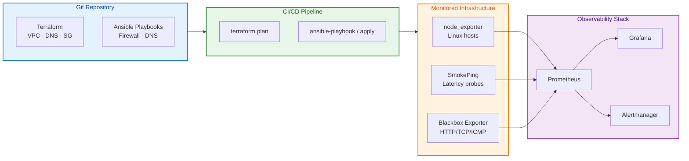

# Network Automation and Monitoring

## Overview

Manual network configuration does not scale. When you manage hundreds of firewall rules, dozens of DNS zones, and a fleet of load balancers, **infrastructure as code (IaC)** and **network automation** become mandatory. Ansible playbooks configure devices consistently, Terraform modules provision cloud networking, and GitOps workflows enforce review before any change hits production. Equally critical is **observability**: you cannot fix what you cannot measure. **Prometheus** with **node_exporter** exposes host and network metrics, **SmokePing** tracks latency and packet loss over time, and centralized dashboards turn raw data into actionable alerts.

This tutorial — the **final installment** of the REBASH Academy Networking series — teaches you to automate DNS and firewall management, use Ansible network modules, deploy Prometheus monitoring for network health, and integrate monitoring into your CI/CD pipeline. When you finish here, you will have the complete picture from TCP/IP fundamentals through production cloud networking, security, and operations.

This is **Tutorial 20** in **Module 6: Cloud & Advanced** of the REBASH Academy Networking series. It follows our [documentation standards](../about.md#documentation-standards) with theory, hands-on labs, and interview preparation.

## Prerequisites

- Completed the full Networking track (Tutorials 1–19) or equivalent experience
- Linux CLI proficiency ([Linux series](../linux/index.md) recommended)
- Basic YAML syntax and Git workflow
- Python 3 and pip available for Ansible installation
- Optional: Docker for local Prometheus/Grafana stack
- Familiarity with [Network Security Hardening](network-security-hardening.md) and [DNS Fundamentals](dns-fundamentals.md)

## Learning Objectives

By the end of this tutorial, you will be able to:

- [ ] Explain why network automation and monitoring are essential at scale
- [ ] Deploy Prometheus and node_exporter to collect host and network metrics
- [ ] Configure SmokePing for latency and packet loss monitoring
- [ ] Use Ansible to manage firewall rules and DNS records idempotently
- [ ] Manage cloud DNS and firewall rules as code with Terraform
- [ ] Design alerting rules for network connectivity failures
- [ ] Articulate next steps in the REBASH Academy learning path (Docker, Kubernetes, cloud)

## Architecture Diagram

The diagram shows a typical network observability and automation stack: Prometheus scrapes exporters, Grafana visualizes, Alertmanager notifies, and Ansible/Terraform push configuration from Git.



## Theory

### Why Automate Network Operations?

Manual CLI configuration creates **configuration drift** — each device accumulates unique rules that nobody documented. **Network automation** applies DevOps principles: version control, peer review, automated testing, and continuous delivery of infrastructure changes.

| Manual approach pain | Automation benefit |
|---------------------|-------------------|
| "Works on my router" differences | Idempotent, version-controlled configs |
| Undocumented emergency changes | Git history with PR review |
| Slow disaster recovery | Rebuild from code in minutes |
| Audit failures | IaC proves intended state |

### Infrastructure as Code for DNS

DNS is infrastructure. Treating DNS records as code prevents stale entries and enables reproducible environments.

| Tool | DNS scope | Example use |
|------|-----------|-------------|
| Terraform | Route 53, Cloud DNS, Azure DNS | `aws_route53_record` resources |
| Ansible | Route 53, bind | `amazon.aws.route53` module |
| ExternalDNS | Kubernetes → cloud DNS | Auto-create records for Ingress/LB |

Best practices: store zone files in Git; require PR approval for production zones; use low TTL (60–300s) before migrations; always run `terraform plan` before apply.

### Infrastructure as Code for Firewalls

| Platform | IaC tool | Resource type |
|----------|----------|---------------|
| AWS | Terraform | `aws_security_group`, `aws_network_acl` |
| GCP | Terraform | `google_compute_firewall` |
| Linux host | Ansible / nftables | `community.general.ufw`, nftables templates |
| Kubernetes | NetworkPolicy YAML | Calico, Cilium policies |

Review every `0.0.0.0/0` ingress in PR diffs. Integrate `checkov` or `tfsec` in CI to catch risky rules before merge.

### Ansible Network Modules Overview

Ansible automates configuration across Linux hosts and cloud APIs. Key modules:

| Module | Purpose | Target |
|--------|---------|--------|
| `ansible.builtin.iptables` | Manage iptables rules | Linux hosts |
| `community.general.nftables` | Manage nftables | Linux hosts |
| `ansible.posix.firewalld` | firewalld zone rules | RHEL-family |
| `amazon.aws.ec2_security_group` | AWS security groups | AWS API |
| `amazon.aws.route53` | DNS records | Route 53 |
| `community.general.ufw` | Uncomplicated Firewall | Ubuntu |

Ansible is **agentless** (SSH/API), **idempotent**, and supports **Vault** for secrets. Terraform often owns cloud provisioning; Ansible handles post-provision host configuration.

### Prometheus and node_exporter

**Prometheus** is a pull-based metrics time-series database. Targets expose HTTP `/metrics` endpoints; Prometheus scrapes at configured intervals.

**node_exporter** exposes hardware and OS metrics from Linux:

| Metric family | Examples | Network relevance |
|---------------|----------|-------------------|
| `node_network_*` | `receive_bytes_total`, `transmit_errs_total` | Interface throughput, errors |
| `node_netstat_*` | TCP retransmits | Connection health |
| `node_sockstat_*` | TCP sockets in use | Connection exhaustion |

Additional exporters: **blackbox_exporter** (HTTP/TCP/ICMP probes), **snmp_exporter** (switches/routers).

Alerting examples:

- `rate(node_network_receive_errs_total[5m]) > 0` — interface errors
- `rate(node_netstat_Tcp_RetransSegs[5m]) > 10` — network path problems
- `probe_success == 0` — endpoint unreachable (blackbox)

### SmokePing — Latency and Loss Monitoring

**SmokePing** measures **latency**, **packet loss**, and **jitter** to remote hosts over time. Unlike point-in-time `ping`, SmokePing stores historical data in RRD files and renders smoke graphs showing trends and spikes.

Use SmokePing for ISP path quality, VPN tunnel latency, DNS resolution time trends, and before/after migration baselines. SmokePing complements Prometheus: SmokePing excels at long-term latency visualization; Prometheus excels at metric correlation and alerting integration.

### Monitoring Strategy

| Layer | Tool | What to watch |
|-------|------|---------------|
| L3 | SmokePing, blackbox ICMP | Latency, loss, path changes |
| L4 | blackbox TCP, `ss`, conntrack | Port reachability |
| L7 | blackbox HTTP | Status codes, TLS expiry |
| Flow | VPC Flow Logs | Traffic patterns, exfiltration |
| Config | CloudTrail, Terraform drift | Unauthorized rule changes |

**Golden signals** for networking: **latency**, **packet loss**, **throughput**, and **availability**.

## Hands-on Lab

### Step 1 – Install Ansible and verify connectivity

**Command:**

```bash
pip install --user ansible amazon.aws community.general
ansible --version

mkdir -p ~/net-automation/{inventory,playbooks}
cat > ~/net-automation/inventory/hosts <<'EOF'
[webservers]
web1 ansible_host=127.0.0.1 ansible_connection=local
EOF

ansible webservers -m ping
```

**Expected output:**

```text
web1 | SUCCESS => { "changed": false, "ping": "pong" }
```

### Step 2 – Ansible playbook — manage UFW firewall rules

**Command:**

```bash
cat > ~/net-automation/playbooks/firewall.yml <<'EOF'
---
- name: Configure host firewall
  hosts: webservers
  become: true
  tasks:
    - name: Default deny incoming
      community.general.ufw:
        direction: incoming
        policy: deny

    - name: Allow SSH from admin subnet
      community.general.ufw:
        rule: allow
        port: "22"
        proto: tcp
        from_ip: "10.0.1.0/24"

    - name: Allow HTTP and HTTPS
      community.general.ufw:
        rule: allow
        port: "{{ item }}"
        proto: tcp
      loop: ["80", "443"]

    - name: Enable UFW
      community.general.ufw:
        state: enabled
EOF

ansible-playbook -i ~/net-automation/inventory/hosts ~/net-automation/playbooks/firewall.yml
```

**Explanation:** Idempotent firewall configuration — re-running produces no changes unless drift occurs.

### Step 3 – Deploy node_exporter

**Command:**

```bash
NODE_EXPORTER_VERSION="1.8.2"
curl -sLO "https://github.com/prometheus/node_exporter/releases/download/v${NODE_EXPORTER_VERSION}/node_exporter-${NODE_EXPORTER_VERSION}.linux-amd64.tar.gz"
tar xzf node_exporter-${NODE_EXPORTER_VERSION}.linux-amd64.tar.gz
sudo cp node_exporter-${NODE_EXPORTER_VERSION}.linux-amd64/node_exporter /usr/local/bin/

sudo tee /etc/systemd/system/node_exporter.service <<'EOF'
[Unit]
Description=Prometheus Node Exporter
After=network-online.target
[Service]
User=nobody
ExecStart=/usr/local/bin/node_exporter --web.listen-address=:9100
Restart=on-failure
[Install]
WantedBy=multi-user.target
EOF

sudo systemctl daemon-reload && sudo systemctl enable --now node_exporter
curl -s localhost:9100/metrics | grep node_network_receive_bytes_total | head -3
```

**Explanation:** Restrict port 9100 to Prometheus server IP via firewall — metrics expose system information.

### Step 4 – Configure Prometheus to scrape node_exporter

**Command:**

```bash
mkdir -p ~/prometheus-config
cat > ~/prometheus-config/prometheus.yml <<'EOF'
global:
  scrape_interval: 15s

scrape_configs:
  - job_name: node
    static_configs:
      - targets: [localhost:9100]
        labels:
          env: lab
EOF

docker run -d --name prometheus -p 9090:9090 \
  -v ~/prometheus-config/prometheus.yml:/etc/prometheus/prometheus.yml:ro \
  prom/prometheus:latest

curl -s 'http://localhost:9090/api/v1/targets' | python3 -m json.tool | head -20
```

**Explanation:** Open http://localhost:9090/targets — UP status means metrics are flowing.

### Step 5 – Query network metrics with PromQL

**Command:**

```bash
curl -sG 'http://localhost:9090/api/v1/query' \
  --data-urlencode 'query=rate(node_network_receive_bytes_total{device!="lo"}[5m])'

curl -sG 'http://localhost:9090/api/v1/query' \
  --data-urlencode 'query=rate(node_netstat_Tcp_RetransSegs[5m])'
```

**Explanation:** Sustained retransmit rates correlate with congestion, packet loss, or MTU mismatches.

### Step 6 – Install SmokePing (Docker)

**Command:**

```bash
mkdir -p ~/smokeping/config ~/smokeping/data
cat > ~/smokeping/config/config <<'EOF'
*** General ***
owner = Network Team

*** Probes ***
+ FPing
binary = /usr/bin/fping

*** Targets ***
probe = FPing

+ targets
menu = Network Latency

++ DNS_Public
menu = Public DNS

+++ Google_DNS
host = 8.8.8.8

+++ Cloudflare_DNS
host = 1.1.1.1
EOF

docker run -d --name smokeping -p 8080:80 \
  -v ~/smokeping/config:/config \
  -v ~/smokeping/data:/var/lib/smokeping \
  lscr.io/linuxserver/smokeping:latest
```

**Explanation:** Open http://localhost:8080 after 5–10 minutes to see latency smoke graphs populate.

### Step 7 – Cleanup lab resources

**Command:**

```bash
docker rm -f prometheus smokeping 2>/dev/null || true
sudo systemctl stop node_exporter 2>/dev/null || true
```

## Commands & Code

| Command | Description | Example |
|---------|-------------|---------|
| `ansible-playbook` | Run Ansible playbook | `ansible-playbook -i inventory/hosts playbooks/firewall.yml` |
| `terraform plan` | Preview IaC changes | `terraform plan` |
| `curl :9100/metrics` | node_exporter metrics | `curl -s localhost:9100/metrics \| head` |
| `promtool check rules` | Validate Prometheus alert rules | `promtool check rules alerts.yml` |
| `fping` | ICMP latency probe | `fping -c 5 8.8.8.8` |

```yaml
# Prometheus alert — network interface errors
- alert: NetworkInterfaceErrors
  expr: rate(node_network_receive_errs_total[5m]) > 0
  for: 5m
  labels:
    severity: warning
```

## Common Mistakes

!!! warning "Alert fatigue from uncalibrated thresholds"
    Alerting on every latency spike creates pager noise. Tune thresholds using SmokePing and Prometheus baselines; alert on SLO breaches with meaningful `for:` durations.

!!! warning "Scraping node_exporter from the internet"
    Metrics expose system details. Bind to internal IP and firewall port 9100 to Prometheus only.

!!! warning "Applying Terraform DNS changes without plan review"
    A typo in an A record can redirect production traffic. Always run `terraform plan` in CI with human approval.

!!! warning "Monitoring without runbooks"
    Every alert needs a linked runbook. Alerts without runbooks waste on-call time.

## Best Practices

!!! tip "GitOps for all network configuration"
    Store Terraform, Ansible, and DNS zone files in Git. Emergency console changes must be backported to code within 24 hours.

!!! tip "Synthetic monitoring from multiple regions"
    Deploy SmokePing slaves or blackbox probes in each region you serve.

!!! tip "Test disaster recovery by rebuilding from code"
    Quarterly, rebuild staging entirely from Terraform and Ansible.

## Troubleshooting

| Issue | Cause | Solution |
|-------|-------|----------|
| Prometheus target DOWN | Firewall blocks 9100 | Open scrape path; verify metrics endpoint |
| SmokePing graphs empty | ICMP blocked outbound | Check container logs; verify FPing works |
| Ansible UFW module fails | UFW not installed | Install UFW or use nftables on RHEL |

## Summary

- **Network automation** eliminates configuration drift — manage DNS, firewalls, and devices as version-controlled code
- **Ansible** provides agentless, idempotent configuration for Linux firewalls and cloud APIs
- **Terraform** provisions cloud DNS records and security groups with plan/review/apply workflows
- **Prometheus + node_exporter** collect host and network metrics for alerting and dashboards
- **SmokePing** visualizes latency and packet loss trends — essential for path quality monitoring
- This completes the **Networking track** — continue to [Docker](../docker/index.md) for container networking

## Interview Questions

1. Why is infrastructure as code important for network configuration?
2. Compare Ansible and Terraform for network automation. When use each?
3. What metrics does node_exporter provide that are relevant to network health?
4. How does SmokePing differ from a simple cron ping script?
5. What is PromQL, and give an example query for network monitoring?
6. How would you alert on network interface errors in Prometheus?
7. What are the risks of managing DNS records manually vs as code?

??? tip "Sample Answers (Questions 1 and 3)"

    **Q1 — IaC for networking:** Manual config causes drift and slow recovery. IaC provides version control, peer review, and audit trails.

    **Q3 — node_exporter metrics:** Throughput (`node_network_receive_bytes_total`), interface errors, TCP retransmissions, and connection counts.

## Related Tutorials

- [Networking – Category Overview](index.md)
- [Network Security Hardening](network-security-hardening.md) *(previous in Module 6)*
- [Linux – Category Overview](../linux/index.md)
- [Learning Paths – DevOps Engineer](../learning-paths/index.md)

## References

- [Prometheus Documentation](https://prometheus.io/docs/introduction/overview/)
- [node_exporter GitHub](https://github.com/prometheus/node_exporter)
- [SmokePing Documentation](https://oss.oetiker.ch/smokeping/doc/index.html)
- [Ansible Documentation](https://docs.ansible.com/)
