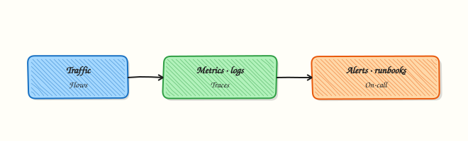

# Network Incident Response and Observability

## Overview

A network-heavy outage fails twice: once in production, and again in the response — unclear ownership, no timeline, and evidence scattered across chat. **Network incident response** is the practised way a team detects, triages, communicates, and resolves connectivity failures. **Observability** (metrics, logs, traces, and synthetics) supplies the signals; the incident process turns those signals into decisions and lasting fixes.

Incidents are not solved by more `tcpdump` alone. You combine Module 16 monitoring with Module 17 methodology: roles (incident commander, communications, operations), a shared timeline, severity that matches user impact, and a blameless follow-up. Site Reliability Engineering (SRE) teams page on customer impact; they ticket softer capacity warnings. After mitigate, the postmortem fixes the **class** of failure — alert gap, missing runbook, or architecture — not only the one host.

This tutorial builds a working **incident bundle**: a script collects `ss`, `ip`, a journal snippet, and failed `curl` output into `incident-bundle.tgz`, and writes a severity classification in JSON and text you can attach to a ticket.

This is **Tutorial 29** in **Module 17: Troubleshooting** of the REBASH Academy **Networking for Cloud & DevOps Engineers** series. It is written for Cloud, DevOps, Site Reliability Engineering (SRE), and platform engineers. By the end, you will have a reusable collector and a severity artefact suitable for interviews and on-call practice.

## Prerequisites

- [Packet Analysis with tcpdump and Wireshark](packet-analysis-tcpdump-wireshark.md)
- [Network Automation and Monitoring](network-automation-and-monitoring.md) recommended
- A **practice Ubuntu 22.04/24.04 VM** with Python 3 and normal user tools (`ip`, `ss`, `curl`, `journalctl` read access as available)

## Learning Objectives

By the end of this tutorial, you will be able to:

- [ ] Assign incident roles and explain what each owns during a network event
- [ ] Build a timeline with linked evidence files
- [ ] Collect host signals (`ss`, `ip`, journal, curl) into `incident-bundle.tgz`
- [ ] Classify severity in JSON/text from observable failure signals
- [ ] List postmortem actions that prevent the same class of failure

## Architecture

Detection feeds triage; roles coordinate lanes; evidence and severity drive communication; post-incident work hardens observability and runbooks.



## Theory

### What it is

**Incident response** for networking is a short operating model:

| Role | Owns |
|------|------|
| Incident commander | Priorities, decide mitigate vs investigate |
| Communications | Status page / stakeholder updates |
| Ops / lane leads | DNS, load balancer, cloud network, application |

**Observability** during the event means golden signals and path-specific views: load balancer 5xx and healthy host count, Domain Name System (DNS) error rate, Network Address Translation (NAT) port exhaustion, VPN tunnel state, and synthetic probes from user-like locations. Logs and flow logs prove denies; traces help after Layer 4 is healthy.

**Severity** is a label tied to **user impact**, not how exciting the packet capture looks:

| Severity | Typical meaning (adapt to your policy) |
|----------|----------------------------------------|
| SEV-1 | Widespread user-facing outage; all-hands |
| SEV-2 | Major feature or region impaired |
| SEV-3 | Limited impact; workaround exists |
| SEV-4 | Minor / no user impact; schedule fix |

### Why it matters

Network symptoms are multidisciplinary. DNS, certificates, security groups, NAT exhaustion, and application bugs all present as “timeouts.” Without roles and a shared evidence pack, people thrash in parallel and duplicate blast radius. Afterward, postmortems that only restart a box guarantee the next page. Indian and global teams often hand over across time zones — a tarball with `timeline.txt` and `severity.json` beats a long WhatsApp thread.

### How it works

1. **Detect** — alert, synthetic fail, or user report.  
2. **Declare** — open the incident channel; name a commander.  
3. **Triage** — impact, scope, recent changes; run the L1→L7 ladder.  
4. **Collect evidence** — dashboards, `ss`/`ip`, journal, curl failures, optional pcap.  
5. **Classify severity** — from impact + evidence, not from gut feel alone.  
6. **Mitigate** — rollback, fail over, enlarge pool, fix DNS — smallest safe change.  
7. **Communicate** — regular updates until resolve.  
8. **Postmortem** — detection gap, root cause, actions with owners and dates.

```bash
# Pattern: one collector, one bundle, one severity file
./collect-incident.sh
# → incident-bundle.tgz + severity.json + timeline.txt
```

### Key concepts and comparisons

| Signal type | Examples | Use in network IR |
|-------------|----------|-------------------|
| Metrics | LB 5xx, healthy hosts, DNS failures | Detect + confirm mitigate |
| Logs | Proxy access, firewall denies, `journalctl` | Prove who/what was refused |
| Traces | Span latency across services | After L4 healthy |
| Synthetics | External HTTP checks | User-like view |

| Page now | Ticket later |
|----------|--------------|
| Synthetic fail + rising 5xx | Single AZ capacity warning with headroom |
| VPN down for all remote staff | One unused route advertisement drift |

### Common pitfalls

- Declaring SEV-1 because a single internal tool failed for one engineer.  
- Collecting no artefacts — “we fixed it” with empty tickets.  
- Debugging forever without a mitigate path (rollback / failover).  
- Blame-focused postmortems that skip action items.  
- Ignoring observability gaps (“we had no alert for NAT ports”).

## Hands-on Lab

### Objective

Under `~/rebash-networking/lab29`, simulate a failed local dependency, run a timeline collector that gathers `ss` / `ip` / journal snippet / curl failures, pack `incident-bundle.tgz`, and emit severity classification in JSON and text.

### Prerequisites

- Ubuntu 22.04/24.04 (or Debian) with Python 3
- Packages: `iproute2`, `curl`, `tar`; `journalctl` available (systemd hosts)
- No cloud credentials required; all faults are local

### Lab environment

Workspace: `~/rebash-networking/lab29`

``` {.bash .ra-terminal title="Terminal"}
mkdir -p ~/rebash-networking/lab29/{evidence,bin} && cd ~/rebash-networking/lab29
set -euo pipefail
whoami | tee evidence/operator.txt
date -u +%Y-%m-%dT%H:%M:%SZ | tee evidence/lab-start-utc.txt
command -v python3
command -v curl
command -v ss
command -v ip
```

!!! example "Expected output"
    timestamps and tool paths recorded; workspace ready.


### Real-world scenario

On-call gets a page: “payments edge cannot reach dependency `dep.rebash.lab:18990`.” You are the ops lead. You must open a timeline, collect host evidence, classify severity for the commander, and hand over a single tarball — even though this practice run uses only loopback and a missing listener.

### Step-by-step tasks

#### Task 1 – Simulate the failed dependency and a healthy control probe

Do **not** start a listener on `18990`. Prove curl fails. Optionally start a control listener on `18991` so the bundle shows contrast.

``` {.bash .ra-terminal title="Terminal"}
cd ~/rebash-networking/lab29
set -euo pipefail

# Control service (healthy) on 18991
python3 - <<'PY' >evidence/control-server.log 2>&1 &
import http.server, socketserver
class H(http.server.BaseHTTPRequestHandler):
    def do_GET(self):
        body = b"ok-control\n"
        self.send_response(200)
        self.send_header("Content-Length", str(len(body)))
        self.end_headers()
        self.wfile.write(body)
    def log_message(self, *args):
        pass
socketserver.TCPServer.allow_reuse_address = True
with socketserver.TCPServer(("127.0.0.1", 18991), H) as httpd:
    httpd.serve_forever()
PY
echo $! > evidence/control-server.pid

sleep 0.4
curl -fsS --max-time 3 http://127.0.0.1:18991/ | tee evidence/curl-control.txt
grep -qx 'ok-control' evidence/curl-control.txt

# Broken dependency — nothing listens on 18990
set +e
curl -v --max-time 3 http://127.0.0.1:18990/ \
  >evidence/curl-dep.out 2>evidence/curl-dep.err
dep_rc=$?
set -e
echo "dep_curl_exit=$dep_rc" | tee evidence/curl-dep-rc.txt
test "$dep_rc" -ne 0
grep -Ei 'refused|Failed to connect|Could not|Couldn.t connect|Connection reset' evidence/curl-dep.err \
  || test -s evidence/curl-dep.err

ss -lnt | tee evidence/ss-before-collect.txt
```

!!! example "Expected output"
    control curl succeeds; dependency curl fails; `curl-dep-rc.txt` is non-zero.


#### Task 2 – Timeline collector script (`ss`, `ip`, journal, curl)

Create `bin/collect-incident.sh` that writes a timeline and copies probe outputs into `bundle/`.

``` {.bash .ra-terminal title="Terminal"}
cd ~/rebash-networking/lab29
set -euo pipefail
```

Create `bin/collect-incident.sh`:

```bash title="collect-incident.sh"
#!/usr/bin/env bash
set -euo pipefail
ROOT="${1:-$HOME/rebash-networking/lab29}"
STAMP="$(date -u +%Y%m%dT%H%M%SZ)"
BUNDLE="$ROOT/bundle"
EV="$ROOT/evidence"
mkdir -p "$BUNDLE/host" "$BUNDLE/probes" "$BUNDLE/meta"

ts() { date -u +%Y-%m-%dT%H:%M:%SZ; }

{
  echo "# Incident timeline (UTC)"
  echo "- $(ts) collector_start root=$ROOT"
} > "$BUNDLE/timeline.txt"

# ip / ss
ip -br link > "$BUNDLE/host/ip-link.txt" 2>&1 || true
ip -br addr > "$BUNDLE/host/ip-addr.txt" 2>&1 || true
ip route > "$BUNDLE/host/ip-route.txt" 2>&1 || true
ss -lntu > "$BUNDLE/host/ss-lntu.txt" 2>&1 || true
echo "- $(ts) captured ip and ss" >> "$BUNDLE/timeline.txt"

# journal snippet (network-ish); OK if empty/permission-limited
if command -v journalctl >/dev/null 2>&1; then
  journalctl -n 40 --no-pager 2>/dev/null \
    | tee "$BUNDLE/host/journal-snippet.txt" >/dev/null \
    || echo "journal_unavailable" > "$BUNDLE/host/journal-snippet.txt"
else
  echo "journalctl_not_found" > "$BUNDLE/host/journal-snippet.txt"
fi
echo "- $(ts) captured journal snippet" >> "$BUNDLE/timeline.txt"

# Curl probes — dependency fail + control
set +e
curl -v --max-time 3 http://127.0.0.1:18990/ \
  >"$BUNDLE/probes/curl-dep.out" 2>"$BUNDLE/probes/curl-dep.err"
echo $? > "$BUNDLE/probes/curl-dep.rc"
curl -v --max-time 3 http://127.0.0.1:18991/ \
  >"$BUNDLE/probes/curl-control.out" 2>"$BUNDLE/probes/curl-control.err"
echo $? > "$BUNDLE/probes/curl-control.rc"
set -e
echo "- $(ts) curl probes complete dep_rc=$(cat "$BUNDLE/probes/curl-dep.rc") control_rc=$(cat "$BUNDLE/probes/curl-control.rc")" \
  >> "$BUNDLE/timeline.txt"

# Copy prior lab evidence if present
cp -f "$EV/curl-dep.err" "$BUNDLE/probes/curl-dep-initial.err" 2>/dev/null || true
cp -f "$EV/operator.txt" "$BUNDLE/meta/operator.txt" 2>/dev/null || true

echo "- $(ts) collector_end" >> "$BUNDLE/timeline.txt"
echo "$STAMP" > "$BUNDLE/meta/collected-at-utc.txt"
echo "bundle_ready=$BUNDLE"
```

``` {.bash .ra-terminal title="Terminal"}
chmod +x bin/collect-incident.sh
./bin/collect-incident.sh "$HOME/rebash-networking/lab29" | tee evidence/collect-run.txt
test -s bundle/timeline.txt
test -s bundle/host/ss-lntu.txt
test -s bundle/probes/curl-dep.err
```

!!! example "Expected output"
    `bundle/timeline.txt` has UTC steps; `host/` and `probes/` files exist; dependency probe still failing.


#### Task 3 – Severity classification artefact and `incident-bundle.tgz`

Classify severity from probe exit codes and write both JSON and text; pack the bundle.

``` {.bash .ra-terminal title="Terminal"}
cd ~/rebash-networking/lab29
set -euo pipefail
```

Create `bin/classify-severity.py`:

```python title="classify-severity.py"
#!/usr/bin/env python3
"""Classify a simple lab incident from probe return codes and ss listeners."""
from __future__ import annotations

import json
import re
import sys
from pathlib import Path

root = Path(sys.argv[1] if len(sys.argv) > 1 else Path.home() / "rebash-networking/lab29")
bundle = root / "bundle"
dep_rc = int((bundle / "probes/curl-dep.rc").read_text().strip() or "1")
ctl_rc = int((bundle / "probes/curl-control.rc").read_text().strip() or "1")
ss_text = (bundle / "host/ss-lntu.txt").read_text(errors="replace")
dep_listening = bool(re.search(r":18990\b", ss_text))
ctl_listening = bool(re.search(r":18991\b", ss_text))

# Lab policy (teach the idea — replace with your real SEV matrix at work):
# - Dependency down + control up  → SEV-2 (major dependency path)
# - Both down                     → SEV-1
# - Dependency up                 → SEV-4 (false alarm / recovered)
if dep_rc == 0 and ctl_rc == 0:
    sev, impact = "SEV-4", "probes_healthy"
elif dep_rc != 0 and ctl_rc != 0:
    sev, impact = "SEV-1", "control_and_dependency_failing"
elif dep_rc != 0 and ctl_rc == 0:
    sev, impact = "SEV-2", "dependency_unreachable_control_ok"
else:
    sev, impact = "SEV-3", "control_failing_dependency_ok"

result = {
    "severity": sev,
    "impact": impact,
    "signals": {
        "dependency_curl_rc": dep_rc,
        "control_curl_rc": ctl_rc,
        "dependency_port_18990_listening": dep_listening,
        "control_port_18991_listening": ctl_listening,
    },
    "recommendation": (
        "Mitigate: restore listener or fix client URL for :18990; "
        "keep control :18991 as health contrast; escalate pcap if path unclear."
    ),
}

out_json = bundle / "severity.json"
out_txt = bundle / "severity.txt"
out_json.write_text(json.dumps(result, indent=2) + "\n", encoding="utf-8")
out_txt.write_text(
    f"severity={result['severity']}\n"
    f"impact={result['impact']}\n"
    f"dependency_curl_rc={dep_rc}\n"
    f"control_curl_rc={ctl_rc}\n"
    f"recommendation={result['recommendation']}\n",
    encoding="utf-8",
)
print(out_json)
print(result["severity"])
if sev not in {"SEV-1", "SEV-2", "SEV-3", "SEV-4"}:
    raise SystemExit("invalid severity")
if dep_rc != 0 and ctl_rc == 0 and sev != "SEV-2":
    raise SystemExit("expected SEV-2 for dep-down control-up lab")
```

``` {.bash .ra-terminal title="Terminal"}
chmod +x bin/classify-severity.py
python3 bin/classify-severity.py "$HOME/rebash-networking/lab29" | tee evidence/classify-run.txt
grep -q '"severity": "SEV-2"' bundle/severity.json
grep -q 'severity=SEV-2' bundle/severity.txt

# Working artefact for the ticket
tar -czf incident-bundle.tgz bundle bin/collect-incident.sh bin/classify-severity.py
ls -l incident-bundle.tgz | tee evidence/bundle-ls.txt
tar -tzf incident-bundle.tgz | tee evidence/bundle-list.txt
grep -q 'severity.json' evidence/bundle-list.txt
```

!!! example "Expected output"
    `severity.json` and `severity.txt` show **SEV-2**; `incident-bundle.tgz` lists `bundle/severity.json` and host/probe files.


### Validation steps

- [ ] Control probe on `18991` succeeds; dependency on `18990` fails
- [ ] `bundle/timeline.txt` includes collector start/end and probe return codes
- [ ] `bundle/host/` has `ss` and `ip` output; journal snippet file exists
- [ ] `incident-bundle.tgz` contains `severity.json` with `SEV-2` for this lab scenario

### Common errors and fixes

| Error | Cause | Fix |
|-------|-------|-----|
| Control curl fails | Server not started / port busy | Check `control-server.pid`; `ss -lnt \| grep 18991` |
| `severity` not SEV-2 | Dependency accidentally listening | Ensure nothing on 18990; re-run collector |
| Empty journal snippet | Permissions / container without systemd | Accept `journal_unavailable`; rely on ss/curl |
| `tar` missing files | Wrong working directory | Run from `~/rebash-networking/lab29` |
| Python JSON error | Missing probe rc files | Run `collect-incident.sh` before classify |

### Challenge exercise

Extend `bin/classify-severity.py` (or add `bin/classify-severity-v2.py`) so that if `ss` shows `:18990` listening **and** `curl-dep.rc` is non-zero, severity becomes `SEV-3` with impact `listener_present_but_http_failing` (application/firewall on path). Re-run after starting a temporary listener on 18990 that accepts TCP but closes without HTTP — or document the code path with a unit-style dry run writing `bundle/severity-challenge.json`. Keep the working classifier under `bin/`.

### Learning outcomes

- Simulated a dependency failure with a healthy control contrast
- Built a timeline collector for host and probe evidence
- Emitted severity JSON/text and packed `incident-bundle.tgz`
- Practised artefacts suitable for commander handover

### Cleanup

``` {.bash .ra-terminal title="Terminal"}
cd ~/rebash-networking/lab29
set -euo pipefail

if [[ -f evidence/control-server.pid ]]; then
  kill "$(cat evidence/control-server.pid)" 2>/dev/null || true
  rm -f evidence/control-server.pid
fi
# Optional keep: incident-bundle.tgz for portfolio / ticket practice
# rm -rf bundle evidence/*.txt bin
```

## Validation

- [ ] Lab finished under `~/rebash-networking/lab29/` with `incident-bundle.tgz`
- [ ] You can explain SEV labels in terms of user impact
- [ ] You can name commander / comms / ops responsibilities
- [ ] You can list two postmortem actions that improve detection next time

## Code Walkthrough

Production habits for **Network Incident Response and Observability**:

1. **Declare and role-up** before deep debugging  
2. **Collect once** into a bundle others can open  
3. **Severity from impact + signals**, written as a file  
4. **Mitigate then analyse** — rollback beats perfect root cause during SEV-1  
5. **Close the loop** — alerts, runbooks, and architecture actions with owners  

Keep collectors boring and checked into your platform repo next to runbooks.

## Security Considerations

- Incident bundles may contain hostnames, IPs, and URL paths — store in private incident systems  
- Redact tokens from `curl -v` output before wide sharing  
- Limit who can download production pcaps and flow logs  
- Do not disable authentication to “make the incident easier”  
- Preserve evidence integrity (timestamps, checksums) for regulated environments

## Common Mistakes

!!! warning "Skipping severity and jumping straight into packet capture"
    Leadership and comms cannot prioritise. **Fix:** write `severity.json` from impact first; capture when the ladder needs proof.

!!! warning "No timeline — only chat screenshots"
    Handovers fail across shifts. **Fix:** append UTC lines as you work; pack `timeline.txt` in the tarball.

!!! warning "Declaring SEV-1 for a single-user VPN glitch"
    Alert fatigue and false urgency. **Fix:** use a written severity matrix tied to user impact and region scope.

!!! warning "Postmortem with no owners or dates"
    The same outage returns. **Fix:** every action item needs name, due date, and a detection or prevention outcome.

## Best Practices

- Keep a one-page network IR card: roles, severity matrix, evidence checklist  
- Prefer synthetic probes that mirror real user paths  
- Store incident bundles next to the ticket ID  
- Rehearse collectors on practice VMs before Black Friday / festival traffic peaks  
- Review Module 16 monitoring gaps in every network postmortem

## Troubleshooting

| Symptom | Likely cause | Fix |
|---------|--------------|-----|
| Bundle missing `severity.json` | Classify not run | Run `classify-severity.py` after collect |
| SEV flips every minute | Flapping probe / wrong URL | Pin probe targets; confirm with `ss` |
| Journal empty | Non-systemd or permissions | Note limitation; add cloud audit logs instead |
| Commander asks for “more dumps” | Unclear story | Point to timeline + severity + one root-cause hypothesis |
| Mitigate unclear | No rollback plan | Prefer last known good DNS/LB weight/config |

## Summary

Network incident response joins people, observability, and evidence. In this lab you simulated a failed dependency, collected host and probe data into a timeline, classified **SEV-2** in JSON/text, and packed `incident-bundle.tgz`. Use the same pattern on real pages — then return to the [Networking course overview](index.md) or the [roadmap](roadmap.md) for what to learn next.

## Interview Questions

**1. What does an incident commander own during a network outage, and what should they *not* do?**

??? success "Reveal answer"
    The commander owns **priorities**, decision cadence, and whether the team mitigates or keeps digging. They should not disappear into deep packet analysis on one lane. Comms owns stakeholder updates; lane leads own DNS, load balancer, or cloud changes. Interviewers look for clear role separation under pressure.

**2. How do you choose SEV-1 versus SEV-2 for a “network” symptom?**

??? success "Reveal answer"
    Severity follows **user impact and scope**, not the tool you used. Widespread checkout failure across regions is SEV-1. One dependency path failing while a control path works may be SEV-2. A single engineer’s VPN glitch is usually lower. Write the label with the signals that justified it (`severity.json`).

**3. Which observability signals do you open first for an edge timeout storm?**

??? success "Reveal answer"
    Load balancer 5xx and healthy host count, synthetic probes from user-like locations, DNS error rates, and NAT/VPN tunnel health if relevant. Then flow or access logs for denies. Traces come after Layer 4 looks healthy. Dashboards first; pcap when layers disagree.

**4. Why keep a healthy control probe next to a failing dependency probe in the evidence pack?**

??? success "Reveal answer"
    Contrast proves the host can still make successful HTTP calls. That pushes the hypothesis toward the dependency path (listener, security group, URL) rather than “the whole VM has no network.” Your lab’s SEV-2 rule depends on that contrast.

**5. What belongs in a network incident timeline?**

??? success "Reveal answer"
    UTC timestamps for detect/declare, evidence collection steps, changes attempted, mitigate time, and resolve time — with links or filenames for artefacts (`ss`, curl, pcap). Avoid undated chat paraphrases as the only record.

**6. How do you avoid blame while still improving the system in a postmortem?**

??? success "Reveal answer"
    Describe what happened and which **defences** failed (alert missing, no runbook, unsafe default). Assign actions to systems: add a synthetic, tighten a dashboard, automate a rollback. Do not centre the document on a person. Ask “how did the system allow this?” 

**7. A mitigate rollback restores traffic, but root cause is unknown. What do you do before closing the incident?**

??? success "Reveal answer"
    Keep the incident open long enough to capture evidence (bundle, metrics window, config diff), set severity accurately, schedule the postmortem, and add a temporary detection if needed. Do not delete pcaps or logs the moment traffic recovers. Closing without learning guarantees a repeat.

**8. How would you demonstrate incident readiness in an interview using this lab’s artefacts?**

??? success "Reveal answer"
    Show `incident-bundle.tgz`: `timeline.txt`, `host/ss-lntu.txt`, failed and control curl probes, and `severity.json` with a clear policy. Explain how you would swap lab ports for real synthesised checks and attach the same layout to a production ticket ID.

## Related Tutorials

- [Networking for Cloud & DevOps – Overview](index.md)
- [Packet Analysis with tcpdump and Wireshark](packet-analysis-tcpdump-wireshark.md) *(previous)*
- [Networking roadmap](roadmap.md) *(next / track map)*
- [Network Troubleshooting Methodology](network-troubleshooting-methodology.md)
- [Network Automation and Monitoring](network-automation-and-monitoring.md)

## References

- [Google SRE — Managing Incidents](https://sre.google/sre-book/managing-incidents/)  
- [Google SRE — Postmortem Culture](https://sre.google/sre-book/postmortem-culture/)  
- [`journalctl(1)`](https://manpages.ubuntu.com/manpages/jammy/en/man1/journalctl.1.html) — systemd logs  
- [`ss(8)`](https://manpages.ubuntu.com/manpages/jammy/en/man8/ss.8.html) — socket evidence  
- Track index: [Networking for Cloud & DevOps Engineers](index.md)
