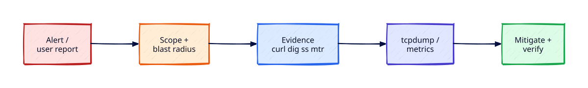

# Network Incident Response and Observability

## Overview

Network incidents do not wait for stand-ups. The **first hour** sets trajectory: confirm scope, preserve evidence, stabilise service, and communicate honestly. Operators reach for **`curl`**, **`dig`**, **`ss`**, **`mtr`/`traceroute`**, and sometimes **`tcpdump`** — each tool answers a different question. **SLO and alert hygiene** separates actionable pages from noise that hides real outages.

This **Module 7 capstone** ties segmentation, DNS ops, load balancers, and firewall change control into an incident workflow. You will inject a local DNS/port fault, capture a timeline, fix it, and write a mini postmortem. Deep nginx/TLS host triage remains in [Troubleshooting Linux Systems](../linux/troubleshooting-linux-systems.md) and [Linux Module 7](../linux/index.md).

This is **Tutorial 25** in **Module 7: Production Network Operations** of the REBASH Academy Networking series.

## Prerequisites

- Completed Module 7 tutorials [21–24](network-segmentation-and-trust-boundaries.md)
- [Network Troubleshooting Methodology](network-troubleshooting-methodology.md) and [Packet Analysis with tcpdump and Wireshark](packet-analysis-tcpdump-wireshark.md)
- Linux with `curl`, `dig`, `ss`, `mtr` or `traceroute`, optional `tcpdump`
- `sudo` for hosts file edits and packet capture

## Learning Objectives

By the end of this tutorial, you will be able to:

- [ ] Execute a first-hour network incident checklist: scope, evidence, stabilise, communicate
- [ ] Collect evidence with curl, dig, ss, and mtr/traceroute in structured order
- [ ] Decide when tcpdump is worth the operational cost
- [ ] Apply SLO thinking to network alerts and avoid alert fatigue
- [ ] Inject and resolve a local DNS or port fault with documented timeline
- [ ] Write a concise blameless mini postmortem with action items

## Architecture

Incidents flow from detection through scoped investigation, evidence capture, remediation, and observability feedback into alert and runbook improvements.



## Theory

### First-hour incident framework

| Phase | Goal | Key actions |
|-------|------|-------------|
| **Triage** | Is it us or upstream? | Status page, synthetic checks, recent changes |
| **Scope** | Who/what is affected? | Regions, tiers, percentage of errors |
| **Evidence** | Facts before theories | Timestamps, dig/ss/curl output saved to ticket |
| **Stabilise** | Stop bleeding | Rollback DNS/firewall/LB change; drain bad node |
| **Communicate** | Single voice | Incident channel, customer-facing ETA if needed |

Assume **recent change** until proven otherwise — correlate with Terraform, DNS, and ACL tickets from Module 7.

### Evidence toolkit

| Tool | Answers | Example |
|------|---------|---------|
| **`curl -sI -w '%{http_code} %{time_connect}\n'`** | HTTP reachability and latency | Edge vs origin |
| **`dig @1.1.1.1 +noall +answer`** | DNS resolution path | Stale A record |
| **`ss -tlnp` / `ss -tan state established`** | Listeners and connections | Service down vs firewall |
| **`mtr -rwzc 10 host`** | Path loss/latency | Upstream provider issue |
| **`traceroute`** | Hop discovery | When mtr unavailable |
| **`tcpdump -i any port 443 -c 20`** | Packet-level proof | SYN no SYN-ACK |

Save command output with **UTC timestamps** in the incident doc — memory lies under pressure.

### When to tcpdump

Use **tcpdump** when:

- SYN packets leave but no SYN-ACK returns (firewall vs routing)
- TLS handshake fails ambiguously (cipher vs cert vs reset)
- Intermittent drops need correlation with flags/RST

Skip tcpdump when:

- `curl`/`dig` already prove DNS or HTTP misconfiguration
- Capture volume would violate privacy/compliance without approval
- Managed LB/cloud edge hides payload you cannot see anyway

Capture **short, filtered** bursts: `sudo tcpdump -ni any host x.x.x.x and port 443 -w /tmp/incident.pcap -c 100`

### SLO and alert hygiene

Network alerts should tie to **user-impacting SLOs**:

| Good alert | Bad alert |
|------------|-----------|
| `5xx rate > 1% for 5m on prod LB` | Single ping loss to dev router |
| `DNS lookup failure synthetic > 3 regions` | Interface counter increment once |
| `LB pool < 2 healthy backends` | SmokePing yellow without customer impact |

Every alert needs: **runbook link**, **severity**, **owner**, and **`for:` duration** to reduce flapping — see [Network Automation and Monitoring](network-automation-and-monitoring.md).

### Mini postmortem structure

1. **Summary** — one paragraph, customer impact duration
2. **Timeline** — UTC markers from detection to resolution
3. **Root cause** — technical + contributing factors (process)
4. **What went well / poorly**
5. **Action items** — owner + due date (fix, detect faster, prevent)

Blameless culture — focus on systems, not individuals.

## Hands-on Lab

**£0 capstone:** run a small HTTP service, break resolution with `/etc/hosts`, diagnose with dig/ss/curl, optional tcpdump, fix, postmortem.

### Step 1 – Establish healthy baseline

```bash
mkdir -p /tmp/ir-lab/www
echo "IR lab healthy" > /tmp/ir-lab/www/index.html
cd /tmp/ir-lab/www && python3 -m http.server 9191 &
sleep 1
date -u +"%Y-%m-%dT%H:%M:%SZ" | tee /tmp/ir-lab/timeline.txt
echo "T+0 BASELINE OK" | tee -a /tmp/ir-lab/timeline.txt
ss -tln | grep 9191
curl -s http://127.0.0.1:9191/
```

**Expected output:** UTC timestamp; listener on 9191; `IR lab healthy`.

### Step 2 – Add hosts alias for service name

```bash
grep ir-lab-svc /etc/hosts || echo '127.0.0.1 ir-lab-svc.local' | sudo tee -a /etc/hosts
curl -s http://ir-lab-svc.local:9191/
dig @8.8.8.8 ir-lab-svc.local A +short 2>&1 | head -2 | tee -a /tmp/ir-lab/timeline.txt
```

**Expected output:** HTTP via hostname works locally; public dig likely NXDOMAIN — noted in timeline.

### Step 3 – Inject fault (bad hosts entry)

```bash
date -u +"%Y-%m-%dT%H:%M:%SZ" | tee -a /tmp/ir-lab/timeline.txt
echo "T+5 INJECT FAULT bad IP in hosts" | tee -a /tmp/ir-lab/timeline.txt
sudo sed -i 's/^127.0.0.1 ir-lab-svc/127.0.0.2 ir-lab-svc/' /etc/hosts
getent hosts ir-lab-svc.local
curl -s -o /dev/null -w "HTTP %{http_code} connect %{time_connect}\n" --connect-timeout 2 http://ir-lab-svc.local:9191/ || echo "FAIL expected"
```

**Expected output:** Resolution to `127.0.0.2`; curl fails or times out — simulated DNS/config fault.

### Step 4 – First-hour evidence collection

```bash
{
  echo "=== ss listeners ==="
  ss -tln | grep 9191
  echo "=== curl direct IP ==="
  curl -s -o /dev/null -w "127.0.0.1:9191 -> %{http_code}\n" http://127.0.0.1:9191/
  echo "=== curl broken hostname ==="
  curl -s -o /dev/null -w "ir-lab-svc.local:9191 -> %{http_code}\n" --connect-timeout 2 http://ir-lab-svc.local:9191/ || echo "failed"
  echo "=== dig public ==="
  dig @8.8.8.8 ir-lab-svc.local A +short
  echo "=== mtr/traceroute loopback ==="
  mtr -rwzc 3 127.0.0.1 2>/dev/null | tail -3 || traceroute -m 3 127.0.0.1 2>/dev/null | tail -3
} | tee /tmp/ir-lab/evidence.txt
```

**Expected output:** Direct IP 200; hostname fails; evidence file captures contradiction — points to name resolution not process death.

### Step 5 – Optional tcpdump (short capture)

```bash
sudo tcpdump -ni lo port 9191 -c 10 2>/dev/null &
TCPDUMP_PID=$!
sleep 1
curl -s --connect-timeout 1 http://127.0.0.2:9191/ >/dev/null 2>&1 || true
wait $TCPDUMP_PID 2>/dev/null || echo "tcpdump optional — install with apt install tcpdump"
```

**Expected output:** Few packets on lo:9191 or note tcpdump unavailable — demonstrates when packet capture adds detail.

### Step 6 – Stabilise (fix fault)

```bash
date -u +"%Y-%m-%dT%H:%M:%SZ" | tee -a /tmp/ir-lab/timeline.txt
echo "T+15 FIX restore hosts" | tee -a /tmp/ir-lab/timeline.txt
sudo sed -i 's/^127.0.0.2 ir-lab-svc/127.0.0.1 ir-lab-svc/' /etc/hosts
curl -s http://ir-lab-svc.local:9191/
```

**Expected output:** `IR lab healthy` again — incident stabilised.

### Step 7 – Mini postmortem

```bash
cat <<'EOF' | tee /tmp/ir-lab/postmortem.md
# Mini postmortem — ir-lab-svc.local outage (lab)

## Summary
Local HTTP service remained healthy on 127.0.0.1:9191 but hostname failed after hosts file pointed to 127.0.0.2. Duration: ~10 min lab window.

## Timeline (UTC)
See /tmp/ir-lab/timeline.txt

## Root cause
Incorrect static hosts mapping — analogous to bad internal DNS or stale cache.

## Detection gap
No synthetic check on ir-lab-svc.local hostname — only IP probe.

## Action items
| Action | Owner | Due |
|--------|-------|-----|
| Add synthetic DNS+HTTP check | NET-OPS | 7d |
| Document hosts/DNS rollback in change template | NET-OPS | 14d |
EOF
cat /tmp/ir-lab/postmortem.md
```

**Expected output:** Blameless postmortem with timeline reference and action items.

### Step 8 – Cleanup

```bash
kill $(lsof -t -i:9191) 2>/dev/null || true
sudo sed -i '/ir-lab-svc/d' /etc/hosts
rm -rf /tmp/ir-lab
```

**Expected output:** Service stopped; hosts entry removed.

## Validation

Confirm the lab before completing Module 7:

1. Timeline file has inject, evidence, and fix markers.
2. Evidence shows service up on IP but failed on bad hostname.
3. Postmortem includes detection gap and action items.

| Check | Pass criteria |
|-------|----------------|
| Baseline | Port 9191 serving before fault |
| Fault inject | Hostname fails after bad mapping |
| Evidence | evidence.txt with ss, curl, dig |
| Fix | Hostname works after rollback |
| Postmortem | Summary, timeline, actions |

## Code Walkthrough

| Command | Description |
|---------|-------------|
| `date -u +"%Y-%m-%dT%H:%M:%SZ"` | UTC timestamps for timeline |
| `curl -w '%{http_code} %{time_connect}'` | Status and connect timing |
| `dig @1.1.1.1 name A +short` | Public resolver perspective |
| `ss -tlnp` | Confirm process listening |
| `mtr -rwzc N host` | Combined ping/traceroute report |
| `tcpdump -ni lo port N -c 10` | Short filtered capture |

## Security Considerations

- Redact customer IPs and payloads in incident tickets shared broadly
- tcpdump on shared hosts may capture credentials — filter ports, limit retention
- Preserve evidence chain for compliance — write-once storage where required
- Break-glass ACL changes during incidents still need post-incident backport to IaC
- Do not exfiltrate pcap with sensitive HTTP bodies to personal machines

## Common Mistakes

!!! warning "Restarting services before collecting evidence"
    Overwrites logs and connection state — capture ss/dig/curl first, then restart.

!!! warning "Alert on every blip"
    Pager fatigue causes real outages to be ignored — tie alerts to SLOs.

!!! warning "tcpdump without filter on busy host"
    Megabyte pcaps unusable under pressure — always `-c` limit and port/host filter.

!!! warning "Postmortem without action items"
    Same incident repeats — every postmortem needs owned follow-ups.

## Best Practices

!!! tip "Incident commander role"
    One person coordinates comms; others gather evidence — avoids duplicated chaos.

!!! tip "Recent changes board"
    Auto-link last 24h DNS, ACL, LB deploys at top of incident channel.

!!! tip "Synthetic multi-path checks"
    Probe DNS + HTTP + TLS from outside and inside VPC — catches split-horizon bugs.

!!! tip "Module 7 cross-reference runbook"
    Link segmentation matrix, DNS change template, LB drain, ACL rollback in one wiki page.

## Troubleshooting

| Symptom | Likely cause | Resolution |
|---------|--------------|------------|
| curl IP works, name fails | DNS/hosts stale | dig multiple resolvers; fix record |
| ss shows listen, curl refused | Wrong IP bind | Check 127.0.0.1 vs 0.0.0.0 |
| Intermittent 502 | LB pool unhealthy | HAProxy stats; health check path |
| mtr loss at one hop | Provider or QoS | Open provider ticket with evidence |
| tcpdump empty | Wrong interface/filter | `-i any`; verify traffic path |

## Summary

- **First hour:** scope → evidence → stabilise → communicate — assume recent change
- **`curl`, `dig`, `ss`, `mtr`** answer different layers — run in structured order with UTC logs
- **`tcpdump`** for ambiguous L3/L4 failures — short filtered captures only
- **SLO-linked alerts** reduce fatigue; every alert needs a runbook
- **Capstone lab** proved diagnose/fix cycle and **blameless postmortem** habit
- Module 7 complete — continue to [Docker networking](../docker/index.md) or deepen [Linux Module 7](../linux/index.md)

## Interview Questions

1. What are the first four steps in a network incident's opening hour?
2. How do curl and dig evidence differ in a "site down" report?
3. When would you use tcpdump vs stopping at ss and curl?
4. What makes a network alert actionable vs noisy?
5. How do you scope an incident affecting "some users"?
6. What belongs in a blameless postmortem timeline?
7. Why check recent DNS and firewall changes early?
8. How does mtr help compared to traceroute?
9. How would you explain network incident response to a junior engineer in two minutes?
10. What Module 7 tutorials inform rollback during a network outage?

??? tip "Sample Answers (Questions 1 and 3)"

    **Q1 — First hour:** (1) Triage — confirm real customer impact vs monitor flap. (2) Scope — regions, tiers, error rate. (3) Collect evidence — timestamped dig/ss/curl/mtr. (4) Stabilise — rollback last change or failover LB pool; communicate status.

    **Q3 — tcpdump timing:** Use tcpdump when application-layer tools show ambiguous connectivity (SYN without SYN-ACK, unexpected RST, TLS handshake reset). Skip when dig already proves wrong IP or ss shows service not listening — fix config first.

## Related Tutorials

- [Networking – Category Overview](index.md)
- [Firewall Change Control and Production ACLs](firewall-change-control-and-production-acls.md) *(Module 7 — previous)*
- [Network Segmentation and Trust Boundaries](network-segmentation-and-trust-boundaries.md) *(Module 7 start)*
- [Production DNS Operations](production-dns-operations.md)
- [Load Balancer Operations and Health Checks](load-balancer-operations-and-health-checks.md)
- [Network Troubleshooting Methodology](network-troubleshooting-methodology.md)
- [Packet Analysis with tcpdump and Wireshark](packet-analysis-tcpdump-wireshark.md)
- [Network Security Hardening](network-security-hardening.md) *(Module 6)*
- [Network Automation and Monitoring](network-automation-and-monitoring.md) *(Module 6)*
- [Troubleshooting Linux Systems](../linux/troubleshooting-linux-systems.md)
- Cheat sheet: [Networking Cheat Sheet](../cheatsheets/networking.md)
- Interview prep: [Networking Interview Prep](../interview/networking.md)
- Learning path: [DevOps Engineer](../learning-paths/devops-engineer.md)

## References

- [Google SRE — Managing Incidents](https://sre.google/sre-book/managing-incidents/)
- [PagerDuty Incident Response Guide](https://response.pagerduty.com/)
- [tcpdump man page](https://www.tcpdump.org/manpages/tcpdump.1.html)
- [mtr man page](https://www.bitwizard.nl/mtr/man-page.html)
