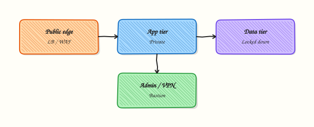

# Network Security Hardening

## Overview

**Network security hardening** means shrinking what can reach what — and proving it with evidence. You inventory listeners, tighten host network settings, keep admin paths on VPN or a jump server (bastion), and remove accidental public exposure. Zero Trust ideas help: assume the network is hostile, authenticate every request, and limit how far an attacker can move after one compromise.

In Cloud and DevOps work this sits on top of firewalls and Security Groups from earlier modules: no public databases, admin via VPN/bastion, Transport Layer Security (TLS) everywhere that users or APIs talk, and regular reviews of open rules. Hardening is not one script; it is a habit of inventory → reduce → verify.

In production, over-hardening without a console path locks teams out. Under-hardening leaves Redis, databases, or SSH on `0.0.0.0` facing the internet. Good practice is read-mostly checks first, then small reversible changes with rollback.

This is **Tutorial 21** in **Module 16: Production Networking** of the REBASH Academy **Networking for Cloud & DevOps Engineers** series. It is written for Cloud, DevOps, Platform, SRE, and DevSecOps engineers. By the end you will have a listening-port inventory and sysctl/sshd evidence under `~/rebash-networking/lab21`.

## Prerequisites

- [VPN and Tunneling Basics](vpn-and-tunneling-basics.md)
- [Firewalls and Access Control](firewalls-and-access-control.md)
- Practice Ubuntu VM with `sudo` (read-mostly lab; no production lockout)

## Learning Objectives

By the end of this tutorial, you will be able to:

- [ ] Apply least privilege to host and cloud network allows
- [ ] Inventory listening ports and flag unexpected public listeners
- [ ] Read key `net.ipv4` sysctl values and explain why they matter
- [ ] Check how `sshd` is listening (address and port)
- [ ] Prefer identity + VPN/bastion for admin paths
- [ ] Schedule periodic exposure reviews with saved evidence

## Architecture

Hardening control points sit at the edge, the host, and the trust boundaries between tiers.



## Theory

### What it is

Hardening reduces **attack surface**: fewer public listeners, tighter allow lists, safer kernel network defaults, and encrypted admin paths. Practical Zero Trust means you do not trust “inside the VPC” alone — you still authenticate and segment.

```bash
ss -lntu
sysctl net.ipv4.ip_forward net.ipv4.conf.all.accept_redirects
```

### Why it matters

Most breaches start from an exposed service that should never have been public, or from broad Security Group rules left “for debugging.” Cloud images may enable SSH widely. Without an inventory, you cannot prove what is reachable. Teams that keep evidence (listeners, sysctl, sshd) pass audits and close Sev tickets faster.

### How it works

1. **Inventory** — list listeners (`ss`), public cloud rules, and admin entry points.
2. **Classify** — intentional edge (LB :443) vs accidental (DB on `0.0.0.0`).
3. **Reduce** — bind to localhost/private IPs; tighten SG/NSG; disable unused services.
4. **Harden defaults** — review `ip_forward`, redirect acceptance, source routing (read before write).
5. **Prove** — positive test for needed access; negative test for blocked paths.
6. **Review** — calendar drift checks; prefer IaC for cloud rules.

| Control | Prefer | Avoid |
|---------|--------|-------|
| Admin access | VPN + bastion + keys | SSH open to `0.0.0.0/0` forever |
| Data services | Private subnets only | Public IP on databases |
| Filters | SG→SG references | Wide CIDR soup |
| Encryption | TLS / VPN / mTLS where needed | Cleartext admin protocols on the internet |

### Common pitfalls

- Closing SSH without console/serial access ready
- Trusting “private IP” without checking SG/NSG still allows the world via a mis-associated public path
- Ignoring IPv6 listeners when you only audited IPv4
- Treating VPN as complete Zero Trust
- Changing sysctl in production without measuring impact

## Hands-on Lab

### Objective

On a practice Ubuntu VM, read key network sysctl values, check where `sshd` listens, and build a listening-ports inventory script. This lab is **read-mostly** — do not lock yourself out of SSH.

### Prerequisites

- Ubuntu 22.04/24.04 with `sudo`, `ss`, `sysctl`, `sshd` (or another SSH server)
- Do **not** run this hardening lab on a shared production jump server

### Lab environment

Workspace: `~/rebash-networking/lab21`

```bash
mkdir -p ~/rebash-networking/lab21 && cd ~/rebash-networking/lab21
set -euo pipefail
whoami | tee admin-user.txt
uname -a | tee uname.txt
```

**Expected output:** workspace files created.

### Real-world scenario

Security asks for a quick network exposure baseline on a new Ubuntu VM before it joins the platform pool: which ports listen, how SSH is bound, and whether IP forwarding or dangerous redirects are enabled. You collect read-only evidence and a small inventory script for the ticket.

### Step-by-step tasks

#### Task 1 – Read network sysctl baseline

```bash
cd ~/rebash-networking/lab21
set -euo pipefail

{
  echo "=== ipv4 core ==="
  sysctl net.ipv4.ip_forward \
    net.ipv4.conf.all.accept_redirects \
    net.ipv4.conf.default.accept_redirects \
    net.ipv4.conf.all.send_redirects \
    net.ipv4.conf.all.accept_source_route \
    net.ipv4.conf.all.rp_filter \
    net.ipv4.tcp_syncookies 2>&1 || true
  echo "=== ipv6 (if present) ==="
  sysctl net.ipv6.conf.all.accept_redirects \
    net.ipv6.conf.all.accept_ra 2>&1 || echo "ipv6 sysctl: unavailable"
} | tee sysctl-net.txt

test -s sysctl-net.txt
```

**Expected output:** `sysctl-net.txt` lists forwarding, redirects, and related values.

#### Task 2 – Check sshd listen addresses

```bash
cd ~/rebash-networking/lab21
set -euo pipefail

{
  echo "=== ss listeners on ssh ports ==="
  ss -lntp | grep -E '(:22|:2222)\b' || echo "no ssh listener matched on 22/2222"
  echo "=== sshd config listen directives (effective files) ==="
  if command -v sshd >/dev/null 2>&1; then
    sudo sshd -T 2>/dev/null | grep -Ei '^(port|listenaddress|permitrootlogin|passwordauthentication) ' \
      | tee sshd-effective.txt
  else
    echo "sshd binary not found" | tee sshd-effective.txt
  fi
} | tee sshd-listen-check.txt

test -s sshd-listen-check.txt
```

**Expected output:** evidence of SSH listen address/port (or an honest “not found”).

#### Task 3 – Listening ports inventory script

```bash
cd ~/rebash-networking/lab21
set -euo pipefail
```

Create `inventory-listeners.sh`:

```bash
#!/usr/bin/env bash
set -euo pipefail
OUT="${1:-listeners-inventory.txt}"
{
  date -u +"generated_at=%Y-%m-%dT%H:%M:%SZ"
  echo "host=$(hostname)"
  echo "=== TCP/UDP listeners ==="
  if command -v ss >/dev/null 2>&1; then
    ss -lntuap 2>/dev/null || ss -lntu
  else
    echo "ss not found"
    exit 1
  fi
  echo "=== possible public binds (0.0.0.0 or *) ==="
  ss -lntu | awk 'NR==1 || /0\.0\.0\.0|\*:/'
} | tee "$OUT"

# Flag common risky service ports if bound broadly (informational)
if ss -lntu | grep -E '0\.0\.0\.0:(3306|5432|6379|27017)\b' >/dev/null 2>&1; then
  echo "WARNING: database-like port appears on 0.0.0.0" | tee -a "$OUT"
fi
```

```bash
chmod +x inventory-listeners.sh
./inventory-listeners.sh listeners-inventory.txt
test -s listeners-inventory.txt

tar -czf hardening-evidence.tgz \
  admin-user.txt uname.txt sysctl-net.txt \
  sshd-listen-check.txt sshd-effective.txt \
  inventory-listeners.sh listeners-inventory.txt
ls -l hardening-evidence.tgz | tee evidence-ls.txt
```

**Expected output:** script is executable; `listeners-inventory.txt` and `hardening-evidence.tgz` exist.

### Validation steps

- [ ] `sysctl-net.txt` captured `ip_forward` and redirect-related keys
- [ ] SSH listen check completed without changing sshd config
- [ ] `inventory-listeners.sh` produces a timestamped inventory
- [ ] Evidence archive exists under `~/rebash-networking/lab21`

### Common errors and fixes

| Error | Cause | Fix |
|-------|-------|-----|
| `ss: command not found` | Minimal image | Install `iproute2` |
| `sshd -T` permission denied | Need root to dump effective config | Use `sudo sshd -T` |
| Empty SSH listeners | sshd not installed / different port | Note it honestly; inventory still valid |
| Tempted to set `PermitRootLogin no` live | Can lock out wrong setup | Change only on practice VM with console access |

### Challenge exercise

Extend `inventory-listeners.sh` to write a second file `listeners.csv` with columns `proto,local_address,pid_program` parsed from `ss -lntup` (best-effort awk/cut). Keep the script read-only — no firewall changes.

### Learning outcomes

- Read kernel network hardening knobs without guessing
- Verified sshd listen posture
- Built a reusable listener inventory artefact

### Cleanup

```bash
cd ~/rebash-networking/lab21
set -euo pipefail
# Read-mostly lab — nothing to revert on the host firewall
# Optional: rm -f hardening-evidence.tgz *.txt
true
```

## Validation

- [ ] Lab finished under `~/rebash-networking/lab21/`
- [ ] You can explain which listeners are intentional edge vs accidental
- [ ] You know why VPN alone is not Zero Trust
- [ ] You can describe one lockout risk when hardening SSH

## Code Walkthrough

Production hardening usually follows:

1. **Inventory first** — listeners, SG/NSG, public IPs
2. **Reduce exposure** — private bind, remove unused services
3. **Protect admin** — VPN/bastion, keys, no password SSH on the internet
4. **Evidence** — save `ss`/`sysctl` outputs in the change ticket
5. **Least privilege** — allow only required sources; calendar review

## Security Considerations

- Never harden yourself out without serial/console access
- Prefer private subnets for data plane services
- Encrypt in transit (TLS, VPN); consider mesh mTLS for east-west later
- Treat listener inventories as sensitive (they map your attack surface)
- Review cloud rule drift continuously

## Common Mistakes

!!! warning "Closing SSH from a single SSH session with no console"
    One mistake removes your only admin path. **Fix:** use a practice VM, keep console access, or add a timed allow first.

!!! warning "Auditing only IPv4"
    Services may listen on IPv6 (`::`). **Fix:** include `ss -lntu` output that shows v6 and review cloud IPv6 rules.

!!! warning "Equating VPN with Zero Trust"
    A stolen VPN session still moves laterally. **Fix:** segment tiers, authenticate apps, and keep least-privilege allows.

!!! warning "Changing sysctl blindly from a blog checklist"
    Wrong `rp_filter` or forwarding settings can break routing. **Fix:** read current values, change one at a time on a practice host, measure.

## Best Practices

- Default deny on host firewalls; explicit allows for needed ports
- Bastion or Identity-aware proxy for admin; no direct DB exposure
- Automate listener and SG drift reports weekly
- Encrypt edge traffic; disable cleartext admin protocols on public interfaces
- Pair hardening changes with rollback notes

## Troubleshooting

| Symptom | Likely cause | Fix |
|---------|--------------|-----|
| Locked out of SSH | Over-tight allow / wrong interface bind | Cloud serial console; fix sshd/SG |
| App breaks after harden | Missed dependency port | Trace with `ss`/flow logs; add least allow |
| “Port closed” but process runs | Bound to localhost only | Expected for admin-only; document |
| Forwarding surprises | `ip_forward=1` on non-router | Disable unless the host is a router/NAT |

## Summary

Hardening shrinks public surface, tightens allows, and proves posture with inventories. Read sysctl and sshd settings, list listeners, and prefer VPN/bastion admin paths. Next, design tier boundaries in [Network Segmentation and Trust Boundaries](network-segmentation-and-trust-boundaries.md).

## Interview Questions

**1. What does “network attack surface” mean on a Linux cloud VM?**

??? success "Reveal answer"
    Everything that accepts connections: listening sockets, public IPs, Security Group/NSG allows, and admin protocols. You reduce it by closing unused listeners, binding services privately, and tightening source allows.

**2. How would you quickly find unexpected public listeners on a host?**

??? success "Reveal answer"
    Run `ss -lntu` (and process details with `-p`), look for `0.0.0.0` or `*` binds on database/admin ports, and compare with the intended edge (usually LB/HTTPS and maybe SSH from a jump network). Save the output as evidence.

**3. Why keep databases off public subnets even if the Security Group looks tight?**

??? success "Reveal answer"
    Defence in depth. SG mistakes happen. A private subnet without an IGW route means a single wrong rule is less likely to expose the data store to the internet.

**4. Name two `net.ipv4` settings you would review during hardening and why.**

??? success "Reveal answer"
    Examples: **`ip_forward`** (should be off unless the host is a router/NAT), **`accept_redirects` / `send_redirects`** (ICMP redirects can be abused on untrusted networks), **`rp_filter`** (anti-spoofing; tune carefully), **`tcp_syncookies`** (SYN flood resilience). Always read current values before changing.

**5. How does a bastion (jump server) improve SSH hardening?**

??? success "Reveal answer"
    Only the bastion accepts SSH from approved admin networks/VPN. App servers allow SSH **from the bastion security group**, not from the whole internet. That shrinks exposure and centralises audit logs.

**6. What is a practical Zero Trust takeaway for network engineers?**

??? success "Reveal answer"
    Do not trust “inside the VPC” alone. Authenticate and authorise flows, segment blast radius, use short-lived credentials, and observe denies. VPN is one control, not the whole model.

**7. You must harden SSH tomorrow morning. What is your safe sequence?**

??? success "Reveal answer"
    Confirm **console/serial** access, inventory current `sshd -T` and SG rules, add the new allow, test a second session, then remove the broad allow. Never delete the only working path in your sole active session.

## Related Tutorials

- [Networking for Cloud & DevOps – Overview](index.md)
- [VPN and Tunneling Basics](vpn-and-tunneling-basics.md) *(previous)*
- [Network Segmentation and Trust Boundaries](network-segmentation-and-trust-boundaries.md) *(next)*
- [Firewalls and Access Control](firewalls-and-access-control.md)
- [Firewall Change Control and Production ACLs](firewall-change-control-and-production-acls.md)

## References

- [CIS Benchmarks](https://www.cisecurity.org/cis-benchmarks)
- [`ss(8)`](https://manpages.ubuntu.com/manpages/jammy/en/man8/ss.8.html)
- [`sysctl(8)`](https://manpages.ubuntu.com/manpages/jammy/en/man8/sysctl.8.html)
- Track index: [Networking for Cloud & DevOps Engineers](index.md)
