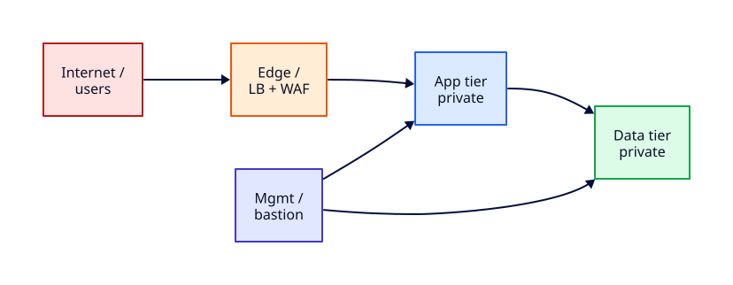

# Network Segmentation and Trust Boundaries

## Overview

Production networks are not flat address spaces where every host can reach every port. **Trust zones** — internet, edge, application, data, and management — define who may talk to whom and what happens when one tier is compromised. **Blast radius** is the damage spread from that compromise: a breached web tier should not expose the database subnet or admin jump hosts without explicit, audited paths.

This tutorial teaches how operators map **host firewalls** (nftables, ufw) to the **cloud security group mental model**, document tier allow matrices, and enforce least privilege on localhost demo ports. You will not reconfigure nginx or TLS on hosts here — those belong in [Linux Module 7](../linux/production-linux-hardening-and-performance.md) and [SSH Hardening and Firewalls](../linux/ssh-hardening-and-firewalls.md).

This is **Tutorial 21** in **Module 7: Production Network Operations** of the REBASH Academy Networking series.

## Prerequisites

- Completed [Network Automation and Monitoring](network-automation-and-monitoring.md) and [Network Security Hardening](network-security-hardening.md)
- Ubuntu 22.04+ or Debian with `sudo` and console access
- `ufw` or `nftables` available (`apt install ufw` or use preinstalled nft)
- Familiarity with [Firewalls and Access Control](firewalls-and-access-control.md) and [Cloud Networking — VPCs and Subnets](cloud-networking-vpc-and-subnets.md)

## Learning Objectives

By the end of this tutorial, you will be able to:

- [ ] Name standard trust zones (internet, edge, app, data, mgmt) and their typical traffic flows
- [ ] Explain blast radius and how segmentation contains lateral movement
- [ ] Map host firewall rules to cloud security group and NACL concepts
- [ ] Document a tier allow matrix with source, destination, port, and justification
- [ ] Apply nftables or ufw rules on loopback demo ports and validate with `ss` and `curl`
- [ ] Justify default-deny policies for production tiers

## Architecture

Trust boundaries stack from the public internet inward: edge termination, application processing, data persistence, and out-of-band management — each with explicit allow rules only.



## Theory

### Trust zones

| Zone | Typical assets | Trust level | Example inbound |
|------|----------------|-------------|-----------------|
| **Internet** | Untrusted clients, bots | None | N/A (source only) |
| **Edge** | Load balancers, WAF, CDN | Low | 443 from internet |
| **App** | Web/API workers, workers | Medium | 8080 from edge only |
| **Data** | Databases, caches, queues | High | 5432 from app tier CIDR |
| **Mgmt** | Bastion, CI runners, backup | Highest restriction | 22 from corp VPN CIDR |

Zones are **policy labels**, not magic. Enforcement happens with routing, security groups, NACLs, host firewalls, and application auth combined.

### Blast radius

**Blast radius** measures how far an attacker or misconfiguration can spread:

- **Flat VPC** — one stolen app credential may reach every internal IP
- **Segmented VPC** — web compromise yields app subnet access only; database requires another hop and credential
- **Micro-segmentation** — per-workload rules (Kubernetes NetworkPolicy, mTLS) shrink radius further

Design for **assume breach**: even "private" subnets require authentication and encryption, not just obscurity.

### Host firewall vs cloud security groups

The mental model is identical — **stateful allow lists on a boundary**:

| Concept | Cloud (AWS example) | Linux host |
|---------|---------------------|------------|
| Attach point | ENI / instance | Network interface / namespace |
| Default posture | SG: deny inbound by default | ufw/nft: policy drop |
| Rule shape | `(protocol, port, source CIDR)` | `(protocol, port, source IP)` |
| Direction | Separate inbound/outbound SG rules | Separate input/output chains |
| Stateful | Yes (return traffic allowed) | Yes with `ct state established,related` |
| Audit | IAM + flow logs | `journalctl`, `nft list ruleset` |

**Security groups** are distributed firewalls on each ENI. **NACLs** are stateless subnet borders — use both; SGs for fine control, NACLs for coarse subnet isolation. On bare metal or VMs, **nftables/ufw** is your SG equivalent.

### Allow matrix documentation

Before opening a port, document:

| Source zone | Dest zone | Port/proto | Purpose | Ticket |
|-------------|-----------|------------|---------|--------|
| Edge | App | TCP 8080 | HTTP from LB | NET-1234 |
| App | Data | TCP 5432 | Postgres queries | NET-1235 |
| Mgmt | App | TCP 22 | Break-glass SSH | NET-1236 |

Review matrices in change windows. Emergency holes must be backported to IaC within 24 hours — see [Network Automation and Monitoring](network-automation-and-monitoring.md).

### Loopback as a lab stand-in

On a single laptop you simulate tiers with **different loopback ports**:

- `127.0.0.1:9080` — edge (simulated LB)
- `127.0.0.1:9081` — app tier
- `127.0.0.1:9082` — data tier (simulated DB listener)

Firewall rules then prove "edge may reach app but internet-facing port on app is blocked" without cloud spend.

## Hands-on Lab

All steps use **£0 local tools** — Python `http.server`, ufw or nft, `ss`, and `curl` on loopback.

### Step 1 – Stand up tier demo listeners

```bash
mkdir -p /tmp/seg-lab/{edge,app,data}
echo "EDGE tier"  > /tmp/seg-lab/edge/index.html
echo "APP tier"   > /tmp/seg-lab/app/index.html
echo "DATA tier"  > /tmp/seg-lab/data/index.html

cd /tmp/seg-lab/edge && python3 -m http.server 9080 &
cd /tmp/seg-lab/app  && python3 -m http.server 9081 &
cd /tmp/seg-lab/data && python3 -m http.server 9082 &

sleep 1
ss -tln | grep -E '908[0-2]'
curl -s http://127.0.0.1:9080/
curl -s http://127.0.0.1:9081/
curl -s http://127.0.0.1:9082/
```

**Expected output:** Three listeners on 9080–9082; curl returns `EDGE tier`, `APP tier`, and `DATA tier`.

### Step 2 – Document the allow matrix

```bash
cat <<'EOF' | tee /tmp/seg-lab/allow-matrix.md
# Lab tier allow matrix (loopback simulation)

| Source        | Destination | Port | Action | Justification              |
|---------------|-------------|------|--------|----------------------------|
| Edge (9080)   | App (9081)  | 9081 | ALLOW  | LB forwards to app workers |
| App (9081)    | Data (9082) | 9082 | ALLOW  | App queries data tier      |
| Any other     | Data (9082) | 9082 | DENY   | Data not directly exposed  |
| Any other     | App (9081)  | 9081 | DENY   | App reachable via edge only|
EOF
cat /tmp/seg-lab/allow-matrix.md
```

**Expected output:** Markdown table saved; you can explain each row in an incident or change review.

### Step 3 – Baseline connectivity (no firewall yet)

```bash
curl -s -o /dev/null -w "app direct: %{http_code}\n" http://127.0.0.1:9081/
curl -s -o /dev/null -w "data direct: %{http_code}\n" http://127.0.0.1:9082/
```

**Expected output:** Both return `200` — flat network, full blast radius (intentionally bad).

### Step 4 – Apply ufw lab rules (Ubuntu)

```bash
# WARNING: keep console access; lab uses loopback-only ports
sudo ufw status verbose || sudo ufw --force enable
sudo ufw default deny incoming
sudo ufw default allow outgoing
sudo ufw allow in on lo
sudo ufw allow 9080/tcp comment 'edge tier lab'
sudo ufw deny 9081/tcp comment 'block direct app access'
sudo ufw deny 9082/tcp comment 'block direct data access'
sudo ufw status numbered | head -20
```

**Expected output:** ufw active; 9081 and 9082 denied inbound on non-loopback paths. Loopback traffic still works for local curl from the same host — note this limitation in production you enforce at SG/NACL level.

### Step 4 (alternative) – nftables allow matrix

If you prefer nftables:

```bash
sudo nft flush ruleset
sudo nft add table inet seglab
sudo nft add chain inet seglab input '{ type filter hook input priority 0; policy drop; }'
sudo nft add rule inet seglab input iif lo accept
sudo nft add rule inet seglab input tcp dport 9080 accept
sudo nft add rule inet seglab input tcp dport { 9081, 9082 } drop
sudo nft list ruleset
```

**Expected output:** Default drop; lo and 9080 accepted; 9081/9082 dropped on input hook.

### Step 5 – Validate enforcement with ss and curl

```bash
ss -tln | grep 908
curl -s -o /dev/null -w "edge: %{http_code}\n" http://127.0.0.1:9080/
curl -s -o /dev/null -w "app: %{http_code}\n"  http://127.0.0.1:9081/ || echo "app blocked or filtered"
```

**Expected output:** Listeners still bound (process level); ufw/nft may block depending on hook — document observed behaviour. On many lab hosts loopback bypasses ufw input; production rules apply on real interfaces.

### Step 6 – Simulate edge-to-app proxy path

Because direct app access should flow through edge in real designs, use a one-line relay:

```bash
# Simulate edge forwarding (conceptual — not production nginx)
curl -s http://127.0.0.1:9080/ && echo "(edge reachable)"
# Document: production edge uses LB/reverse proxy — see Linux nginx tutorial
```

**Expected output:** Edge tier responds; you record in notes that [Production Linux Hardening and Performance](../linux/production-linux-hardening-and-performance.md) terminates TLS and forwards upstream.

### Step 7 – Cleanup

```bash
kill $(lsof -t -i:9080 -i:9081 -i:9082) 2>/dev/null || true
sudo ufw delete deny 9081/tcp 2>/dev/null || true
sudo ufw delete deny 9082/tcp 2>/dev/null || true
sudo ufw delete allow 9080/tcp 2>/dev/null || true
rm -rf /tmp/seg-lab
```

**Expected output:** Demo listeners stopped; lab ufw rules removed or documented for revert.

## Validation

Confirm the lab before moving on:

1. Re-run listener and matrix steps; match expected output.
2. Explain blast radius before and after your deny rules.
3. Map each lab port to a cloud tier and SG equivalent.

| Check | Pass criteria |
|-------|----------------|
| Tier listeners | 9080–9082 serving distinct content |
| Allow matrix | Documented with source, dest, port, justification |
| Firewall | ufw or nft rules applied and listed |
| Cross-link | You can point TLS/nginx work to Linux Module 7 |
| Cleanup | Lab processes and rules reverted |

## Code Walkthrough

| Command / artefact | Description |
|--------------------|-------------|
| `ss -tln` | List TCP listeners — inventory before segmentation |
| `curl -s -o /dev/null -w '%{http_code}'` | HTTP probe without body noise |
| `ufw status numbered` | Review ordered host firewall rules |
| `nft list ruleset` | Inspect nftables chains and policies |
| Allow matrix markdown | Change-review artefact for auditors |

## Security Considerations

- **Default deny** on every tier; explicit allow with ticket reference
- **Management plane** separate from data plane — never expose admin ports to app subnets
- **Dual enforcement** — cloud SG plus host firewall where compliance requires
- **Document break-glass** console or serial access before tightening mgmt rules
- Segmentation without **identity and encryption** still fails — see [Network Security Hardening](network-security-hardening.md)

## Common Mistakes

!!! warning "Flat VPC with permissive default SG"
    Leaving `0.0.0.0/0` on application ports because "it's internal" collapses trust zones. Restrict sources to edge CIDR or SG references.

!!! warning "Segmentation on paper only"
    Diagrams without enforced SG/NACL/host rules provide audit comfort, not security. Validate with `ss`, flow logs, and connection tests.

!!! warning "Blocking loopback in lab and assuming production parity"
    ufw/nft on loopback behaves differently from ENI-bound rules. Always test on the actual interface or security group.

!!! warning "Ignoring east-west traffic"
    North-south (internet ↔ app) gets attention; east-west (app ↔ app) lateral movement causes breaches. Log and restrict app-to-app paths.

## Best Practices

!!! tip "One matrix per environment"
    Maintain dev/staging/prod matrices in Git; diff them in PR review to catch accidental prod openings.

!!! tip "Name SGs and rules after tiers"
    `sg-app-prod`, `sg-data-prod` beats `sg-12345` when paging at 03:00.

!!! tip "Measure blast radius in game days"
    Red-team exercises from a compromised web pod should stop at the data tier boundary.

!!! tip "Pair segmentation with DNS and LB ops"
    Tier changes affect DNS and health checks — coordinate Module 7 tutorials holistically.

## Troubleshooting

| Symptom | Likely cause | Resolution |
|---------|--------------|------------|
| curl works despite deny rule | Loopback bypass or wrong chain | Test from remote host or use `nc` from another namespace |
| ufw lockout | Applied deny before allow SSH | Use console; insert allow 22 from mgmt CIDR first |
| nft rules vanish after reboot | No persistent save | `nft list ruleset > /etc/nftables.conf`; enable `nftables.service` |
| App healthy but LB fails | Edge cannot reach app SG | Add SG reference from edge to app on app port |
| Over-segmentation | Missing return path for established flows | Ensure stateful accept or explicit egress rules |

## Summary

- **Trust zones** (internet → edge → app → data → mgmt) structure production network policy
- **Blast radius** shrinks when each tier has default-deny boundaries and documented allow matrices
- **Host firewalls** mirror **cloud security groups** — same `(source, dest, port)` thinking
- Document every allow rule with **justification and ticket** before implementation
- Loopback port labs prove matrix logic locally at **£0**; enforce on real interfaces in cloud
- TLS termination and reverse proxy host configuration live in **Linux Module 7**, not this tutorial

## Interview Questions

1. What are the five common production trust zones and what lives in each?
2. Define blast radius and give an example of reducing it with segmentation.
3. How does a security group differ from a NACL in AWS?
4. How would you map ufw rules to a tier allow matrix?
5. Why is default-deny preferred over default-allow for app tiers?
6. What is east-west traffic and why does it matter for zero trust?
7. How do Kubernetes NetworkPolicies relate to VPC segmentation?
8. When would host firewall rules duplicate cloud SG rules?
9. How would you explain trust boundaries to a junior engineer in two minutes?
10. What production failure mode appears when teams skip segmentation documentation?

??? tip "Sample Answers (Questions 1 and 2)"

    **Q1 — Trust zones:** Internet (untrusted clients), edge (LB/WAF/CDN), app (web/API workers), data (databases/caches), mgmt (bastion/CI/backup). Each tier accepts only explicitly allowed flows from adjacent or authorised zones.

    **Q2 — Blast radius:** Blast radius is how far compromise or misconfiguration propagates. Segmenting so web tier cannot reach database ports directly forces an attacker through additional credentials and rules — shrinking blast radius from "whole VPC" to "one app subnet".

## Related Tutorials

- [Networking – Category Overview](index.md)
- [Network Automation and Monitoring](network-automation-and-monitoring.md) *(Module 6 — previous)*
- Next: [Production DNS Operations](production-dns-operations.md) *(Module 7)*
- [Network Security Hardening](network-security-hardening.md)
- [Firewalls and Access Control](firewalls-and-access-control.md)
- [Cloud Networking — VPCs and Subnets](cloud-networking-vpc-and-subnets.md)
- [Production Linux Hardening and Performance](../linux/production-linux-hardening-and-performance.md) *(Linux Module 7 — host edge config)*
- Cheat sheet: [Networking Cheat Sheet](../cheatsheets/networking.md)
- Interview prep: [Networking Interview Prep](../interview/networking.md)
- Learning path: [DevOps Engineer](../learning-paths/devops-engineer.md)

## References

- [NIST SP 800-207 — Zero Trust Architecture](https://csrc.nist.gov/publications/detail/sp/800-207/final)
- [AWS Security Groups documentation](https://docs.aws.amazon.com/vpc/latest/userguide/vpc-security-groups.html)
- [nftables wiki — Quick reference](https://wiki.nftables.org/wiki-nftables/index.php/Quick_reference-nftables_in_10_minutes)
- [ufw man page](https://manpages.ubuntu.com/manpages/jammy/man8/ufw.8.html)
