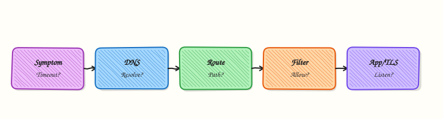

# Network Troubleshooting Methodology

## Overview

When an application “cannot connect”, the failure can sit at many layers: the name does not resolve, the packet never leaves the host, a firewall drops it silently, nothing is listening on the port, or the Hypertext Transfer Protocol (HTTP) response is wrong. **Network troubleshooting methodology** is a fixed order of checks — with evidence at each step — so you do not jump between `ping`, security groups, and random restarts.

A practical ladder for Cloud and DevOps work looks like the Open Systems Interconnection (OSI) model, but focused on what you can prove on a Linux host: interface and route (Layers 1–3), filters and sockets (Layer 4), then name resolution and the application protocol (Layer 7). You write **expected versus actual** at every step. Connection **refused** means something answered with a reset or there is no listener. A **timeout** often means a silent drop on a firewall or security group. Those two symptoms need different next checks.

On jump servers, Continuous Integration (CI) runners, Kubernetes nodes, and cloud virtual machines (VMs), a wrong Domain Name System (DNS) override, a stale client URL, or a listener on the wrong port wastes a full incident. Big teams use the same ladder in runbooks so any on-call engineer can hand over clean evidence. This tutorial injects a **lab-only** fault (HOSTALIASES name map plus a wrong client port) and walks an L1→L7 checklist script that finds it.

This is **Tutorial 27** in **Module 17: Troubleshooting** of the REBASH Academy **Networking for Cloud & DevOps Engineers** series. It is written for Cloud, DevOps, Site Reliability Engineering (SRE), and platform engineers. By the end, you will have a reusable triage script and evidence pack you can explain in an interview or a change ticket.

## Prerequisites

- [Firewall Change Control and Production ACLs](firewall-change-control-and-production-acls.md)
- Comfort with [Linux Networking Toolkit](linux-networking-toolkit.md) basics (`ip`, `ss`, `curl`)
- A **practice Ubuntu 22.04/24.04 VM** (or similar) with Python 3 — do **not** change production `/etc/hosts` or live firewalls for this lab

## Learning Objectives

By the end of this tutorial, you will be able to:

- [ ] Separate timeout, connection refused, DNS failure, and HTTP errors into first checks
- [ ] Walk an L1→L7 checklist and record expected versus actual at each layer
- [ ] Inject and contain a lab-only name/port fault with `HOSTALIASES` under the lab directory
- [ ] Run a triage script that captures evidence and names the fault
- [ ] Explain when to stop changing knobs and escalate to packet capture

## Architecture

Troubleshooting starts from the symptom, then proves each layer before you change production. Name resolution, routing, filters, listeners, and the application each leave different evidence.



## Theory

### What it is

A **troubleshooting methodology** is a repeatable path from symptom to root cause. For networking, map symptoms to layers:

| Symptom | First meaning | First checks |
|---------|---------------|--------------|
| NXDOMAIN / wrong host | Name problem | `getent hosts`, `dig`, nsswitch, lab `HOSTALIASES` |
| Timeout | Path or silent drop | `ip route get`, traceroute, security group / firewall counters |
| Connection refused | Reachable host; no accept / RST | `ss -lnt`, `nc -vz` |
| TLS / certificate error | Presentation / identity | `openssl s_client`, SNI, clock |
| HTTP 502 / 503 / 504 | Upstream or load balancer | Healthy target count, upstream listen |

`HOSTALIASES` is a glibc environment variable. It points to a **file** (often under your lab directory) that maps an alias name to another name. Processes that honour it resolve `app.rebash.lab` without editing system `/etc/hosts`. That makes it safe for practice: the override lives only in the lab shell.

```bash title="Terminal"
export HOSTALIASES="$HOME/rebash-networking/lab27/hostaliases"
getent hosts app.rebash.lab
```

### Why it matters

Random `ping` and “restart the pod” waste incidents. A fixed ladder keeps blast radius small: you prove DNS before you open a security group, and you prove a listener before you blame TLS. In India and globally, many teams share one on-call phone; clear evidence files (`addrs.txt`, `dns.txt`, `fault.txt`) make handovers fast across shifts and time zones. Production judgement: if two layers disagree (name points to A, listener is on B), stop flipping unrelated switches and fix the mismatch.

### How it works

1. **Define** — who is affected, from where, since when, exact error string, recent changes.  
2. **L1 / L2** — is the interface up? (`ip -br link`, `ip -br addr`)  
3. **L3** — does the kernel have a route to the destination? (`ip route get`)  
4. **L4** — is anything listening? (`ss -lnt`); refused versus timeout with `nc` or `curl`  
5. **Filter** — local `nft`/`iptables` or cloud security group (only after L3/L4 look healthy)  
6. **Name (DNS / HOSTALIASES)** — does the name map to the IP you expect?  
7. **L7** — does HTTP (or the app protocol) return the expected status and body?  
8. **Capture** — if layers still disagree, take a short pcap (next tutorial)

Never skip writing **expected vs actual** at each step. Change configuration only after the layer that failed is named.

```bash title="Terminal"
# Pattern: capture, then decide
ip -br addr | tee evidence/l1-addr.txt
ip route get 127.0.0.1 | tee evidence/l3-route.txt
ss -lnt | tee evidence/l4-listen.txt
```

### Key concepts and comparisons

| Layer focus | Tools | Pass criteria |
|-------------|-------|---------------|
| Interface | `ip -br link`, `ip -br addr` | Interface UP; address present |
| Route | `ip route get <dst>` | Route exists; correct device |
| Socket | `ss -lnt`, `nc -vz` | Listener on expected port, or clear refuse/timeout |
| Name | `getent hosts`, `HOSTALIASES`, `dig` | Name → expected IP |
| App | `curl -v`, status code | Expected HTTP status and body |

| Approach | Prefer when | Avoid when |
|----------|-------------|------------|
| Bottom-up ladder | Unknown failure class | You already have a proven layer from monitoring |
| Symptom-first jump | Clear NXDOMAIN or TLS alert | Temptation to skip evidence |
| Packet capture early | Layers disagree after checklist | First response to every alert (too noisy) |

### Common pitfalls

- Treating **timeout** and **refused** as the same bug.  
- Editing production `/etc/hosts` to “fix a lab” and forgetting to remove it.  
- Changing security groups before proving the destination IP and port.  
- Skipping name checks when the client uses a hostname from a config file.  
- Collecting no files — verbal updates do not survive shift handover.

## Hands-on Lab

### Objective

Under `~/rebash-networking/lab27`, start a local HTTP listener, inject a **lab-only** name/port fault with `HOSTALIASES` and a wrong client URL, then run an L1→L7 checklist script that captures evidence and names the fault.

### Prerequisites

- Ubuntu 22.04/24.04 (or Debian) with Python 3
- Packages: `iproute2`, `curl`, `python3` (usually present)
- Optional: `netcat-openbsd` (`nc`) for extra L4 checks
- No need to edit `/etc/hosts` or use `sudo` for the main path

### Lab environment

Workspace: `~/rebash-networking/lab27`

```bash title="Terminal"
mkdir -p ~/rebash-networking/lab27/{evidence,www} && cd ~/rebash-networking/lab27
set -euo pipefail
whoami | tee evidence/operator.txt
uname -s | tee evidence/os.txt
command -v python3
command -v curl
command -v ip
command -v ss
```

!!! example "Expected output"
    `evidence/operator.txt` and `evidence/os.txt` exist; `python3`, `curl`, `ip`, and `ss` are found.


### Real-world scenario

A small internal tool should answer on `http://app.rebash.lab:18780/`. After a config change, `curl` from the same host fails. Security asks you **not** to touch the company DNS or `/etc/hosts`. You keep the override inside the lab directory with `HOSTALIASES`, follow the L1→L7 ladder, and attach evidence to the ticket.

### Step-by-step tasks

#### Task 1 – Start a good local listener

Serve a tiny page on loopback port **18780** only. Keep the process PID in the lab directory.

```bash title="Terminal"
cd ~/rebash-networking/lab27
set -euo pipefail

printf 'ok-lab27\n' > www/index.html

# Bind only to loopback — do not expose on 0.0.0.0
(
  cd www
  exec python3 -m http.server 18780 --bind 127.0.0.1
) >evidence/server.log 2>&1 &
echo $! > evidence/server.pid

sleep 0.5
ss -lnt | grep -E ':18780\b' | tee evidence/l4-listen-good.txt
curl -fsS http://127.0.0.1:18780/ | tee evidence/curl-direct.txt
grep -qx 'ok-lab27' evidence/curl-direct.txt
```

!!! example "Expected output"
    `l4-listen-good.txt` shows `127.0.0.1:18780`; `curl-direct.txt` contains `ok-lab27`.


#### Task 2 – Inject a lab-only DNS override and wrong client URL

Map `app.rebash.lab` with `HOSTALIASES` (file under the lab root). Point the client config at the **wrong port** `18781` so the failure is local and reversible.

```bash title="Terminal"
cd ~/rebash-networking/lab27
set -euo pipefail
```

Create `hostaliases`:

```text title="hostaliases"
app.rebash.lab localhost
```

Create `client-broken.env`:

```bash title="client-broken.env"
export HOSTALIASES="$HOME/rebash-networking/lab27/hostaliases"
export APP_URL="http://app.rebash.lab:18781/"
```

Create `client-good.env`:

```bash title="client-good.env"
export HOSTALIASES="$HOME/rebash-networking/lab27/hostaliases"
export APP_URL="http://app.rebash.lab:18780/"
```

```bash title="Terminal"
# glibc HOSTALIASES: alias → canonical name (then normal resolution)
set -a
# shellcheck disable=SC1091
source ./client-broken.env
set +a

getent hosts app.rebash.lab | tee evidence/dns-hostaliases.txt
# Show the broken call fails (connection refused on most Linux hosts)
set +e
curl -v --max-time 3 "$APP_URL" >evidence/curl-broken.out 2>evidence/curl-broken.err
broken_rc=$?
set -e
echo "curl_exit=$broken_rc" | tee evidence/curl-broken-rc.txt
test "$broken_rc" -ne 0
grep -Ei 'refused|Failed to connect|Connection reset|Could not|Couldn.t connect' evidence/curl-broken.err \
  || test -s evidence/curl-broken.err
```

!!! example "Expected output"
    `dns-hostaliases.txt` maps `app.rebash.lab` (via `localhost`); curl to port **18781** fails; `curl-broken-rc.txt` is non-zero.


#### Task 3 – L1→L7 checklist script that finds the fault

Run a triage script that writes one evidence file per layer and a final `fault.txt`.

```bash title="Terminal"
cd ~/rebash-networking/lab27
set -euo pipefail
```

Create `triage-l1-l7.sh`:

```bash title="triage-l1-l7.sh"
#!/usr/bin/env bash
set -euo pipefail
ROOT="${1:-$HOME/rebash-networking/lab27}"
EV="$ROOT/evidence"
mkdir -p "$EV"
# shellcheck disable=SC1091
source "$ROOT/client-broken.env"
export HOSTALIASES

echo "=== DEFINE ===" | tee "$EV/l0-define.txt"
{
  echo "symptom: curl to APP_URL fails"
  echo "APP_URL=$APP_URL"
  echo "HOSTALIASES=$HOSTALIASES"
  echo "expected: HTTP 200 body ok-lab27 on port 18780"
} | tee -a "$EV/l0-define.txt"

echo "=== L1/L2 interface ===" | tee "$EV/l1-link.txt"
ip -br link | tee -a "$EV/l1-link.txt"
ip -br addr | tee "$EV/l2-addr.txt"

echo "=== L3 route ===" | tee "$EV/l3-route.txt"
ip route get 127.0.0.1 | tee -a "$EV/l3-route.txt"

echo "=== L4 sockets ===" | tee "$EV/l4-ss.txt"
ss -lnt | tee -a "$EV/l4-ss.txt"
# Parse URL host/port roughly for local lab
PORT="$(printf '%s' "$APP_URL" | sed -n 's#.*:\([0-9][0-9]*\)/.*#\1#p')"
HOST="$(printf '%s' "$APP_URL" | sed -n 's#https\?://\([^:/]*\).*#\1#p')"
echo "parsed HOST=$HOST PORT=$PORT" | tee "$EV/l4-parsed.txt"
if ss -lnt | grep -qE ":${PORT}\\b"; then
  echo "listener_on_client_port=yes" | tee "$EV/l4-client-port.txt"
else
  echo "listener_on_client_port=no" | tee "$EV/l4-client-port.txt"
fi
if ss -lnt | grep -qE ':18780\b'; then
  echo "listener_on_18780=yes" | tee "$EV/l4-good-port.txt"
else
  echo "listener_on_18780=no" | tee "$EV/l4-good-port.txt"
fi

echo "=== L5/L6 (session/TLS) ===" | tee "$EV/l56-note.txt"
echo "plain HTTP lab — TLS not in path; skip openssl" | tee -a "$EV/l56-note.txt"

echo "=== NAME (DNS / HOSTALIASES) ===" | tee "$EV/l7-dns.txt"
getent hosts "$HOST" | tee -a "$EV/l7-dns.txt" || echo "getent_failed" | tee -a "$EV/l7-dns.txt"

echo "=== L7 application probe ===" | tee "$EV/l7-curl.txt"
set +e
curl -v --max-time 3 "$APP_URL" >>"$EV/l7-curl.txt" 2>&1
rc=$?
set -e
echo "curl_exit=$rc" | tee "$EV/l7-curl-rc.txt"

# Conclude
{
  echo "fault_summary:"
  if grep -q 'listener_on_client_port=no' "$EV/l4-client-port.txt" \
    && grep -q 'listener_on_18780=yes' "$EV/l4-good-port.txt"; then
    echo "ROOT_CAUSE=client_port_mismatch"
    echo "detail: name resolves via HOSTALIASES; nothing listens on $PORT; service listens on 18780"
    echo "fix: use client-good.env (port 18780) or move the listener"
  elif ! getent hosts "$HOST" >/dev/null 2>&1; then
    echo "ROOT_CAUSE=name_resolution_failure"
    echo "detail: HOSTALIASES or DNS did not resolve $HOST"
  else
    echo "ROOT_CAUSE=needs_deeper_capture"
    echo "detail: layers did not isolate a simple port/DNS mismatch"
  fi
} | tee "$EV/fault.txt"

grep -q 'ROOT_CAUSE=client_port_mismatch' "$EV/fault.txt"
echo "triage_ok"
```

```bash title="Terminal"
chmod +x triage-l1-l7.sh
./triage-l1-l7.sh "$HOME/rebash-networking/lab27" | tee evidence/triage-run.txt
grep -q 'ROOT_CAUSE=client_port_mismatch' evidence/fault.txt

tar -czf methodology-evidence.tgz evidence hostaliases client-broken.env client-good.env triage-l1-l7.sh
ls -l methodology-evidence.tgz | tee evidence/evidence-ls.txt
```

!!! example "Expected output"
    `evidence/fault.txt` contains `ROOT_CAUSE=client_port_mismatch`; `methodology-evidence.tgz` is non-empty; `triage-run.txt` ends with `triage_ok`.


### Validation steps

- [ ] Python server PID file exists and `ss` shows `127.0.0.1:18780`
- [ ] `HOSTALIASES` file is under `~/rebash-networking/lab27/` (not `/etc/hosts`)
- [ ] Broken client fails on port `18781`; triage names `client_port_mismatch`
- [ ] `methodology-evidence.tgz` exists with layer files `l1`…`l7` and `fault.txt`

### Common errors and fixes

| Error | Cause | Fix |
|-------|-------|-----|
| `Address already in use` on 18780 | Previous lab server still running | `kill "$(cat evidence/server.pid)"` or `ss -lntp \| grep 18780` |
| `getent` does not show alias | Shell did not export `HOSTALIASES` | `source client-broken.env` then retry |
| Curl succeeds on “broken” URL | Something already listens on 18781 | Choose another free port or stop the other process |
| `HOSTALIASES` ignored | Non-glibc resolver / musl container | Use Ubuntu VM; or fall back to IP in URL for the same ladder |
| Permission denied writing `/etc/hosts` | Tried system file | Stay in lab dir — that is the point of this lab |

### Challenge exercise

Write `fix-client.sh` that sources `client-good.env`, curls `APP_URL`, asserts the body is `ok-lab27`, and writes `evidence/challenge-fixed.txt` with `status=fixed`. Keep using `HOSTALIASES` from the lab directory (do not edit `/etc/hosts`).

### Learning outcomes

- Separated name resolution from transport and application failure
- Used a lab-scoped `HOSTALIASES` override safely
- Captured L1→L7 evidence and a clear root-cause line
- Packed proof suitable for an incident ticket

### Cleanup

```bash title="Terminal"
cd ~/rebash-networking/lab27
set -euo pipefail

if [[ -f evidence/server.pid ]]; then
  kill "$(cat evidence/server.pid)" 2>/dev/null || true
  rm -f evidence/server.pid
fi
# Optional: remove working files; keep the archive if you want ticket proof
# rm -f methodology-evidence.tgz
# rm -rf evidence www hostaliases client-*.env triage-l1-l7.sh fix-client.sh
```

## Validation

- [ ] Lab finished under `~/rebash-networking/lab27/` with `fault.txt` and `methodology-evidence.tgz`
- [ ] You can explain timeout versus connection refused in your own words
- [ ] You can describe why lab DNS overrides belong in `HOSTALIASES` / lab files, not production `/etc/hosts`
- [ ] You know when the next step is packet capture instead of more config changes

## Code Walkthrough

In real incidents, methodology for **Network Troubleshooting Methodology** usually follows this order:

1. **Define before you dig** — write symptom, scope, and recent changes  
2. **One layer at a time** — interface → route → socket → name → app  
3. **Evidence files** — every command tees to a path the next engineer can open  
4. **Name the fault** — one `ROOT_CAUSE=` line beats a long chat thread  
5. **Least change** — fix the broken layer only; escalate to pcap when layers disagree  

Later you can wrap the same ladder in Ansible or a chat-ops bot. Humans still own the judgement call.

## Security Considerations

- Keep practice overrides under a lab directory — never leave fake hostnames in production `/etc/hosts`  
- Do not capture or paste customer payloads into public tickets; store redacted evidence  
- Treat DNS and firewall changes as privileged — use change control from Module 16  
- Limit who can edit resolver config and security groups  
- Prefer short, time-bounded captures when you escalate (privacy and disk)

## Common Mistakes

!!! warning "Editing `/etc/hosts` for a quick test"
    The override outlives the incident and breaks the next deploy. **Fix:** use lab-scoped `HOSTALIASES` or a disposable VM snapshot.

!!! warning "Opening cloud security groups before proving the port"
    You widen blast radius without fixing a wrong URL. **Fix:** run `ss` / `nc` against the exact IP:port from the client config first.

!!! warning "Calling every failure a timeout"
    Refused and TLS errors need different owners. **Fix:** read the exact `curl -v` / browser error; record it in `l0-define.txt`.

!!! warning "Changing three things at once"
    You cannot prove which change helped. **Fix:** one hypothesis, one change, one validation.

## Best Practices

- Keep a printed or wiki ladder with the same L1→L7 headings as your script  
- Store evidence in a dated folder or tarball on every Sev-1 / Sev-2  
- Compare expected IP and port from the service catalogue to live `ss` output  
- Prefer `ip` and `ss` over deprecated `ifconfig` / `netstat` when available  
- Stop and capture packets when two trustworthy tools disagree

## Troubleshooting

| Symptom | Likely cause | Fix |
|---------|--------------|-----|
| `getent hosts` empty for alias | `HOSTALIASES` not exported | Export path; re-open shell; confirm glibc |
| Curl timeout to local port | Firewall dropped locally | Check `nft`/`iptables`; confirm address is 127.0.0.1 |
| Curl refused | No listener / wrong port | Align client port with `ss -lnt` |
| Works with IP, fails with name | DNS / HOSTALIASES mismatch | Fix name map; do not hard-code IP in production without review |
| Triage says `needs_deeper_capture` | Rare path / middlebox | Move to [Packet Analysis](packet-analysis-tcpdump-wireshark.md) |

## Summary

A good network methodology is boring on purpose: define the symptom, prove each layer, write expected versus actual, and name one root cause. In this lab you kept the DNS override inside the lab directory, found a client port mismatch with an L1→L7 script, and packed evidence for a ticket. Next, learn to capture and read the TCP handshake in [Packet Analysis with tcpdump and Wireshark](packet-analysis-tcpdump-wireshark.md).

## Interview Questions

**1. A user says “the site is down.” What do you ask in the first two minutes before you touch infrastructure?**

??? success "Reveal answer"
    Ask **who** is affected, **from where** (office, VPN, region), **since when**, the **exact error** (timeout, refused, certificate, 5xx), and **what changed** recently. Write that as the define step. Without scope, you cannot tell DNS from firewall from application. Interviewers want a calm intake, not an immediate security-group edit.

**2. How do connection refused and connection timeout differ, and what do you check next for each?**

??? success "Reveal answer"
    **Refused** usually means the packet reached a host that sent RST or has no listener — check `ss -lnt` / target process and the exact port. **Timeout** often means silent drop or wrong path — check route, security group / Network Access Control List (NACL), and firewall counters. Mixing them up sends you to the wrong team.

**3. What is `HOSTALIASES`, and why is it useful in a lab compared with editing `/etc/hosts`?**

??? success "Reveal answer"
    `HOSTALIASES` points to a **user-owned file** that maps alias names for processes that honour glibc name resolution. The override stays in the lab directory and the shell environment, so you do not need root and you do not pollute the system hosts file. Production still needs proper DNS; this is for safe practice and controlled fault injection.

**4. Walk through an L1→L7 checklist for “curl to app.example.com:8443 fails” on a Linux jump host.**

??? success "Reveal answer"
    Confirm interface and address (L1/L2), `ip route get` to the resolved IP (L3), `ss`/`nc` for listen versus refuse/timeout (L4), filters only if L3/L4 look healthy, resolve the name and compare to catalogue IP, then `curl -v` / TLS checks (L7). Record evidence at each step. Escalate to pcap if two layers disagree.

**5. Why should you capture expected versus actual at every layer?**

??? success "Reveal answer"
    Expected versus actual turns troubleshooting into a proof, not a debate. It shows where the first mismatch appears (for example name → 10.0.0.5 but listener only on 10.0.0.8). That line is what you put in the ticket and the postmortem. Without it, people keep changing unrelated knobs.

**6. When do you stop the checklist and take a packet capture?**

??? success "Reveal answer"
    When the ladder is complete but tools still disagree — for example route and security group look open, `ss` shows a listener, yet the client times out — or when you need to prove SYN is sent and no SYN-ACK returns. Capture should be short, filtered, and privacy-aware. Do not start with a full `tcpdump -i any` on a busy edge as the first response.

**7. How would you prove in a change ticket that a “DNS issue” was actually a wrong client port?**

??? success "Reveal answer"
    Attach name resolution output (`getent` / `dig`) showing the name is correct, `ss -lnt` showing the service on the real port, client config showing the wrong port, and a successful curl after correcting only the port. One `ROOT_CAUSE=client_port_mismatch` line plus those files is enough for most tickets.

**8. A junior engineer wants to “fix connectivity” by opening 0.0.0.0/0 on the security group. How do you respond using methodology?**

??? success "Reveal answer"
    Refuse the wide open change. Ask which layer failed. If the failure is connection refused to the wrong port, opening the security group will not help and increases risk. If there is a real filter drop, open only the required source prefix and port, with change control and a rollback — as in Module 16 firewall change control.

## Related Tutorials

- [Networking for Cloud & DevOps – Overview](index.md)
- [Firewall Change Control and Production ACLs](firewall-change-control-and-production-acls.md) *(previous)*
- [Packet Analysis with tcpdump and Wireshark](packet-analysis-tcpdump-wireshark.md) *(next)*
- [DNS Records and Troubleshooting](dns-records-and-troubleshooting.md)
- [Linux Networking Toolkit](linux-networking-toolkit.md)

## References

- [Google SRE — Effective Troubleshooting](https://sre.google/sre-book/effective-troubleshooting/)  
- [`ip(8)`](https://manpages.ubuntu.com/manpages/jammy/en/man8/ip.8.html) — iproute2  
- [`ss(8)`](https://manpages.ubuntu.com/manpages/jammy/en/man8/ss.8.html) — socket statistics  
- [`curl(1)`](https://manpages.ubuntu.com/manpages/jammy/en/man1/curl.1.html) — HTTP client for L7 probes  
- Track index: [Networking for Cloud & DevOps Engineers](index.md)
