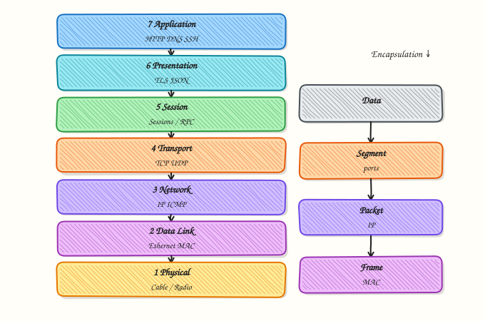

# OSI Model

## Overview

When an application cannot reach a database, people often say “the network is broken.” That phrase is too vague for an incident. The **Open Systems Interconnection (OSI) model** gives seven named layers so you can say which part failed: cable or Wi‑Fi (Layer 1), Ethernet frames (Layer 2), Internet Protocol (IP) packets (Layer 3), Transmission Control Protocol (TCP) or User Datagram Protocol (UDP) ports (Layer 4), or the application protocol such as Hypertext Transfer Protocol (HTTP) (Layer 7).

You do not need to memorise the OSI model as exam trivia alone. Cloud consoles, load balancers, and security products still say “Layer 4” and “Layer 7”. A Network Load Balancer that forwards TCP ports is Layer 4 style. An Application Load Balancer that reads HTTP host headers is Layer 7 style. On Linux, your tools already sit on layers: `ping` tests Layer 3 reachability with Internet Control Message Protocol (ICMP), `tcpdump` can show frames and packets from Layer 2 upward, and `curl` exercises Layer 7 while depending on everything underneath.

Encapsulation is the key mental model: each layer wraps the data from the layer above with its own header (and sometimes a trailer). Troubleshooting works best when you stop at the **first failing layer** instead of guessing at the top. In production, a clear layer statement in the ticket (“DNS works, TCP handshake fails on port 5432”) saves hours.

This is **Tutorial 2** in **Module 2: OSI Model** of the REBASH Academy **Networking for Cloud & DevOps Engineers** series. It is written for Cloud, DevOps, Site Reliability Engineering (SRE), and platform engineers. By the end, you will map real commands to layers and save a layer table artefact from a practice Ubuntu VM.

## Prerequisites

- [What is Networking?](introduction-to-networking.md)
- A **practice Ubuntu 22.04/24.04 VM** with outbound network access
- Tools: `ip`, `ping`, `ss`, `curl`; `tcpdump` optional but useful (`sudo apt-get install -y tcpdump`)

## Learning Objectives

By the end of this tutorial, you will be able to:

- [ ] Name OSI layers 1–7 with one protocol or example each
- [ ] Explain encapsulation and the common Protocol Data Unit (PDU) names
- [ ] Map Linux tools (`ping`, `ss`, `tcpdump`, `curl`) to OSI layers
- [ ] Run a simple top-down or bottom-up check and stop at the first failure
- [ ] Explain Layer 4 vs Layer 7 load balancing vocabulary used in cloud products

## Architecture

The OSI stack places physical signalling at the bottom and user-facing applications at the top. Each layer serves the layer above and uses the layer below.



## Theory

### What it is

The **OSI model** is a seven-layer reference model published by the International Organization for Standardization (ISO). It is a teaching and vocabulary model. Real Internet traffic follows the TCP/IP suite (next tutorial), but engineers still use OSI layer numbers every day.

| Layer | Name | Job (plain language) | Examples |
|------:|------|----------------------|----------|
| 7 | Application | What the user/app speaks | HTTP, DNS, SSH |
| 6 | Presentation | Data format / encryption (conceptually) | TLS often discussed here or with L5/L7 |
| 5 | Session | Dialog / session control (conceptually) | Session ideas in APIs; less visible on Linux CLI |
| 4 | Transport | Ports, reliability choices | TCP, UDP |
| 3 | Network | Logical addressing and routing | IPv4, IPv6, ICMP |
| 2 | Data Link | Frames on a local link | Ethernet, MAC addresses, ARP |
| 1 | Physical | Bits on wire / radio / virtual NIC | Cables, Wi‑Fi PHY, cloud vNIC |

Common PDU names: **bits** (L1), **frames** (L2), **packets** (L3), **segments/datagrams** (L4), **data** (L5–L7).

### Why it matters

Shared language shortens incidents. “Layer 3 is fine, Layer 4 is blocked” tells the firewall owner what to check. “Layer 7 returns 502” tells the platform team to inspect the reverse proxy or upstream app. Without layers, teams argue about “the network” while looking at different problems. Cloud marketing also uses L4/L7 labels — you need the model to choose the right load balancer and security control.

### How it works

1. **Send path** — the application creates data; each lower layer adds a header (encapsulation).
2. **Wire / path** — frames and packets travel across links and routers.
3. **Receive path** — each layer removes its header (decapsulation) and passes payload upward.
4. **Troubleshoot** — pick a direction (bottom-up from Physical/Link, or top-down from Application) and stop at the first failure.

```bash
# L3 reachability (ICMP)
ping -c 2 1.1.1.1

# L4 listening sockets
ss -tuln

# L7 HTTP
curl -I --max-time 5 https://example.com
```

### Key concepts and comparisons

| Tool | Primary layers | What it proves |
|------|----------------|----------------|
| Link lights / `ip link` | L1–L2 | Interface exists and is UP |
| `ip addr`, `ping` | L3 | Addressing and IP reachability |
| `ss`, `nc` / port checks | L4 | Ports open or listening |
| `curl`, browsers, API clients | L7 | Application protocol works |
| `tcpdump` / Wireshark | L2–L7 (capture) | What actually went on the wire |

| Load balancer style | OSI focus | Typical use |
|---------------------|-----------|-------------|
| L4 | TCP/UDP ports | High performance, simple forward |
| L7 | HTTP/gRPC hosts and paths | Host-based routing, headers, WAF features |

### Common pitfalls

- Memorising layer names without mapping them to tools you actually run.
- Blaming Layer 7 when DNS (often discussed at L7) or TCP (L4) never completed.
- Assuming TLS is “only Layer 6” — in practice you verify certificates and HTTPS with application tools.
- Capturing with `tcpdump` without a filter and drowning in noise.
- Skipping Layer 1/2 on cloud VMs — a detached elastic network interface looks like “routing is broken”.

## Hands-on Lab

### Objective

Map real Linux tools to OSI layers on a practice Ubuntu VM, run layer-focused commands, and save a **layer mapping table** artefact plus evidence under `~/rebash-networking/lab02`.

### Prerequisites

- Ubuntu 22.04/24.04 with sudo
- Packages: `iproute2`, `iputils-ping`, `curl`; install `tcpdump` and `dnsutils` if missing:
  `sudo apt-get update && sudo apt-get install -y tcpdump dnsutils`

### Lab environment

Workspace: `~/rebash-networking/lab02`

```bash
mkdir -p ~/rebash-networking/lab02 && cd ~/rebash-networking/lab02
set -euo pipefail
hostname | tee hostname.txt
command -v ping curl ss ip | tee tools-present.txt
```

**Expected output:** `tools-present.txt` lists paths for `ping`, `curl`, `ss`, and `ip`.

### Real-world scenario

During an incident bridge, someone asks: “Is this Layer 3 or Layer 7?” You need a repeatable mini-checklist on the jump host: prove link/IP, prove ports, prove HTTP, and optionally capture a few packets. You leave behind a filled layer table so the handover is clear.

### Step-by-step tasks

#### Task 1 – Layer 1–3 checks with `ip` and `ping`

```bash
cd ~/rebash-networking/lab02
set -euo pipefail

ip -br link | tee l1l2-link.txt
ip -br a | tee l3-addr.txt
ip route show default | tee l3-default-route.txt || true

ping -c 3 -W 2 1.1.1.1 2>&1 | tee l3-ping.txt || true
# Local L3 always available
ping -c 2 127.0.0.1 2>&1 | tee l3-ping-localhost.txt
```

**Expected output:** `l1l2-link.txt` shows interface states; `l3-ping-localhost.txt` shows successful replies; Internet ping may succeed or be blocked — both outcomes are recorded.

#### Task 2 – Layer 4 with `ss` and Layer 7 with `curl`

```bash
cd ~/rebash-networking/lab02
set -euo pipefail

ss -tuln | tee l4-ss-tuln.txt

curl -sS -I --max-time 8 https://example.com 2>&1 | tee l7-curl-headers.txt || true
# Show verbose handshake evidence (TLS + HTTP)
curl -v --max-time 8 -o /dev/null https://example.com 2>l7-curl-verbose.txt || true
test -s l7-curl-verbose.txt

# Optional DNS (application-related name resolution)
if command -v dig >/dev/null 2>&1; then
  dig +time=2 +tries=1 example.com A 2>&1 | tee l7-dig.txt || true
fi
```

**Expected output:** `l4-ss-tuln.txt` lists listening sockets; `l7-curl-verbose.txt` is non-empty (success or connection error text).

#### Task 3 – Optional `tcpdump` sample and layer table artefact

If `tcpdump` is installed, capture a few packets while curling. Always write the layer mapping table (the required artefact).

```bash
cd ~/rebash-networking/lab02
set -euo pipefail

if command -v tcpdump >/dev/null 2>&1; then
  # Short capture — may need sudo
  sudo timeout 5 tcpdump -ni any -c 20 host example.com or icmp 2>tcpdump-stderr.txt \
    | tee tcpdump-sample.txt || true
else
  echo "tcpdump not installed" | tee tcpdump-sample.txt
fi


Create `osi-layer-tool-map.txt`:

```text
OSI layer | Name          | Lab command / evidence file           | What success means
1-2       | Physical/Link | ip -br link  → l1l2-link.txt          | NIC present and UP
3         | Network       | ping / ip route → l3-*.txt            | IP path or honest block
4         | Transport     | ss -tuln → l4-ss-tuln.txt             | See listeners / ports
7         | Application   | curl / dig → l7-*.txt                 | App protocol responds
2-4       | Capture       | tcpdump → tcpdump-sample.txt          | Packets observed
```

```bash
cat osi-layer-tool-map.txt

tar -czf osi-layer-evidence.tgz \
  hostname.txt tools-present.txt \
  l1l2-link.txt l3-addr.txt l3-default-route.txt \
  l3-ping.txt l3-ping-localhost.txt \
  l4-ss-tuln.txt l7-curl-headers.txt l7-curl-verbose.txt \
  tcpdump-sample.txt osi-layer-tool-map.txt \
  $(ls l7-dig.txt tcpdump-stderr.txt 2>/dev/null || true)
ls -l osi-layer-evidence.tgz | tee evidence-ls.txt
test -s osi-layer-evidence.tgz
```

**Expected output:** `osi-layer-tool-map.txt` exists with the mapping table; `osi-layer-evidence.tgz` is non-empty.

### Validation steps

- [ ] Localhost ping succeeded and is logged
- [ ] `ss -tuln` evidence file exists
- [ ] `curl -v` evidence file exists (even if the remote site failed)
- [ ] `osi-layer-tool-map.txt` maps tools to layers
- [ ] `osi-layer-evidence.tgz` exists under `~/rebash-networking/lab02`

### Common errors and fixes

| Error | Cause | Fix |
|-------|-------|-----|
| `ping: Operation not permitted` | Capabilities / policy | Use localhost ping + `curl`; install `iputils-ping` |
| `curl: could not resolve host` | DNS failure (often discussed at L7) | Fix resolvers; note layer in the table |
| `tcpdump: permission denied` | Needs root | `sudo tcpdump ...` or skip capture and keep the table |
| Empty Internet ping | ICMP blocked | Expected in some clouds — document it |
| `ss: command not found` | Old image | `sudo apt-get install -y iproute2` |

### Challenge exercise

Create an executable script `~/rebash-networking/lab02/osi-checklist.sh` that prints a pass/fail line for: (1) any non-`lo` interface UP, (2) default route present, (3) localhost ping, (4) at least one listening TCP socket in `ss -tuln`, (5) `curl -I` to `https://example.com` within 8 seconds. Write results to `osi-checklist-results.txt`. Run the script once. This is a working artefact, not a notes file.

### Learning outcomes

- Mapped OSI layers to concrete Linux commands
- Separated L3, L4, and L7 failure signals
- Produced a reusable layer table for incident handovers
- Practised optional packet capture without changing production routes

### Cleanup

```bash
cd ~/rebash-networking/lab02
set -euo pipefail
# No persistent network changes in the main lab
# Optional: rm -f *.txt *.tgz
ls -la
```

## Validation

- [ ] Lab finished under `~/rebash-networking/lab02/` with evidence archive
- [ ] You can name layers 1–7 with one example each
- [ ] You can explain encapsulation in one short paragraph
- [ ] You can distinguish L4 vs L7 load balancing vocabulary

## Code Walkthrough

Layered checks in operations usually follow:

1. **Link** — is the NIC UP? (`ip -br link`)  
2. **Network** — address and ping / route (`ip addr`, `ip route`, `ping`)  
3. **Transport** — is the port listening or reachable? (`ss`, port probe)  
4. **Application** — does HTTP/DNS/SSH succeed? (`curl`, `dig`, client errors)  
5. **Capture** — when needed, `tcpdump` with a tight filter  

Stop at the first failing layer; escalate with that layer named in the ticket.

## Security Considerations

- Packet captures can include secrets (tokens in HTTP, credentials) — store captures carefully  
- Prefer filtered `tcpdump` on practice hosts; avoid long captures on production without approval  
- Do not disable firewalls “to test Layer 4” on shared servers  
- Treat verbose `curl -v` logs as sensitive if they show Authorization headers  
- Use least privilege: many checks need no root; capture and interface changes often do  

## Common Mistakes

!!! warning "Calling every failure Layer 7"
    Timeouts during TCP handshake are Layer 4 path/firewall issues. **Fix:** confirm `ss`/port reachability before debugging HTTP status codes.

!!! warning "Ignoring ARP / local link"
    Same-subnet failures can be Layer 2. **Fix:** check `ip neigh` and NIC state, not only routes.

!!! warning "Memorising without tools"
    Interview answers need examples. **Fix:** keep the layer↔tool map from this lab.

!!! warning "Huge unfiltered captures"
    You miss the packet that matters. **Fix:** filter by host and port; limit `-c` count.

## Best Practices

- State the failing layer in incident updates  
- Keep a personal OSI↔tool cheat sheet (this lab’s table)  
- Use bottom-up for “new VM has no network”, top-down for “one URL fails”  
- Align cloud LB choice with L4 vs L7 needs  
- Re-test after each fix at the layer you changed  

## Troubleshooting

| Symptom | Likely cause | Fix |
|---------|--------------|-----|
| NIC DOWN | Detached interface / driver | Cloud console NIC; `ip link set … up` only if appropriate |
| Ping fails, TCP works | ICMP blocked | Use TCP/`curl` checks |
| Connection timed out | L3/L4 path or firewall | Trace routes/security groups; `ss` on server |
| HTTP 502/504 | L7 upstream | Check proxy and app health, not only ping |
| TLS errors | Certificate / time / SNI | Inspect `curl -v`; fix certs or clock |

## Summary

The OSI model is a seven-layer language for designing and debugging networks. Map each layer to tools, prove failures with evidence, and speak clearly about L4 versus L7 services. Next, connect OSI vocabulary to the four-layer Internet model in [TCP/IP Model](tcp-ip-model.md).

## Interview Questions

**1. Name the seven OSI layers from Layer 1 to Layer 7 and give one example for each of Layers 2, 3, 4, and 7.**

??? success "Reveal answer"
    Layers: Physical, Data Link, Network, Transport, Session, Presentation, Application. Examples: **L2** Ethernet/MAC, **L3** IPv4/ICMP, **L4** TCP/UDP ports, **L7** HTTP or DNS. Interviewers care that you can map examples, not only recite names.

**2. What is encapsulation?**

??? success "Reveal answer"
    **Encapsulation** means each layer adds its own header (and sometimes trailer) around the payload from the layer above before sending downward. On receive, headers are removed (decapsulation). That is why a capture shows Ethernet, IP, and TCP headers around an HTTP request.

**3. Which OSI layers do `ping`, `ss -tuln`, and `curl` primarily exercise?**

??? success "Reveal answer"
    **`ping`** primarily tests **Layer 3** (ICMP over IP). **`ss -tuln`** shows **Layer 4** sockets (TCP/UDP listen state). **`curl`** is an **Layer 7** client (HTTP/HTTPS) that still depends on DNS, TCP, IP, and the link underneath. Always mention the dependencies in interviews.

**4. A user sees HTTP 503 in the browser. Which layer is that message from, and what should you verify underneath first?**

??? success "Reveal answer"
    **503** is an **application (Layer 7)** response from a proxy or service — so L7 is reachable enough to return HTTP. Still verify L4 connectivity to the upstream and that the upstream process is healthy. Do not start with cable checks if you already have an HTTP status from the edge.

**5. How do Layer 4 and Layer 7 load balancers differ?**

??? success "Reveal answer"
    A **Layer 4** load balancer forwards based on IP and TCP/UDP ports without reading HTTP. A **Layer 7** load balancer understands application protocols (HTTP host, path, headers) and can route or terminate TLS with richer rules. Choose L4 for raw performance/simplicity; L7 for content-based routing and app features.

**6. Why is “the network is down” a weak incident statement?**

??? success "Reveal answer"
    It does not name a layer, symptom, or evidence. Prefer: “DNS resolves, TCP to port 443 times out from subnet A” or “ICMP blocked but HTTPS works.” Layered statements assign owners faster (platform vs network vs app).

**7. Where does ARP sit in OSI thinking, and when does it matter?**

??? success "Reveal answer"
    Address Resolution Protocol (ARP) maps IPv4 addresses to MAC addresses on a local link — **Layer 2** work supporting **Layer 3** delivery on Ethernet. It matters for same-subnet failures, wrong VLANs, and duplicate IPs. Check with `ip neigh` when local peers fail but remote routing looks fine.

**8. How would you use OSI layers in a design review for a public API?**

??? success "Reveal answer"
    Call out L3 addressing and routing (public/private), L4 ports and security groups, L7 TLS and HTTP behaviour, and which LB layer you need. Mention observability per layer (flow logs vs access logs). This shows you design with failure domains, not only happy-path diagrams.

## Related Tutorials

- [What is Networking?](introduction-to-networking.md) *(previous)*
- [TCP/IP Model](tcp-ip-model.md) *(next)*
- [Network Troubleshooting Methodology](network-troubleshooting-methodology.md)
- [Packet Analysis with tcpdump and Wireshark](packet-analysis-tcpdump-wireshark.md)

## References

- [ISO/IEC 7498 OSI reference model](https://www.iso.org/standard/20269.html) — OSI overview (standards catalogue)  
- [RFC 3439](https://www.rfc-editor.org/rfc/rfc3439) — some realities of protocol layering  
- [`tcpdump` man-page](https://www.tcpdump.org/manpages/tcpdump.1.html)  
- Track index: [Networking for Cloud & DevOps Engineers](index.md)
