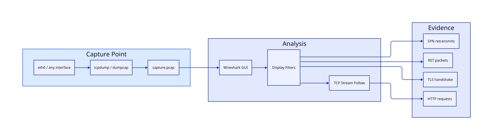

# Packet Analysis with tcpdump and Wireshark

## Overview

When logs and `curl` are not enough, **packet capture** shows exactly what crosses the wire — SYN packets that never get ACKed, TLS handshakes failing on cipher mismatch, DNS responses with wrong TTL, or HTTP requests hitting the wrong virtual host. **tcpdump** captures packets on Linux servers where GUI tools cannot run. **Wireshark** provides deep protocol dissection, TCP stream reassembly, and visual timelines for analysis.

Packet analysis is a core SRE and security skill. It confirms whether a problem is network, firewall, or application — with evidence, not guesses. This tutorial covers capture techniques, tcpdump filter expressions, transferring captures to Wireshark, reading TCP streams, and the filter library you will use in every production incident.

This is **Tutorial 15** in **Module 5: Troubleshooting** of the REBASH Academy Networking series.

## Prerequisites

- Complete [Network Troubleshooting Methodology](network-troubleshooting-methodology.md)
- Complete [TCP and UDP Deep Dive](tcp-and-udp-deep-dive.md) — understand SYN/ACK/FIN and port concepts
- Linux VM or cloud instance with `sudo` and outbound network access
- Wireshark installed on your workstation ([wireshark.org](https://www.wireshark.org/)) for GUI analysis

## Learning Objectives

By the end of this tutorial, you will be able to:

- [ ] Capture packets on specific interfaces with tcpdump and write to pcap files
- [ ] Construct tcpdump filter expressions for host, port, and protocol filtering
- [ ] Transfer and analyse captures in Wireshark with proper dissection
- [ ] Follow TCP streams to reconstruct HTTP conversations
- [ ] Identify common failure patterns: SYN retransmits, RST, TLS failures, DNS issues
- [ ] Apply a library of production-ready tcpdump and Wireshark display filters

## Architecture

The diagram below summarises the core relationships for **Packet Analysis with tcpdump and Wireshark**.




## Theory

### When to Capture Packets

Use packet capture when:

- **Connection timeouts** — no application log entry; need to see if SYN reaches server
- **Intermittent failures** — capture during the failure window
- **TLS/SSL mysteries** — handshake failures before HTTP logs exist
- **DNS discrepancies** — verify actual queries and responses on the wire
- **Performance debugging** — retransmissions, zero-window, high latency segments
- **Security incidents** — unauthorized traffic, data exfiltration patterns

Avoid capture when:

- Volume would overwhelm disk (busy production NIC — use filters and ring buffer)
- Legal/compliance prohibits capture (PII-heavy traffic without approval)
- Simpler tools suffice (`curl -v`, `ss`, application logs)

### Capture Points Matter

Where you capture determines what you see:

| Location | Sees |
|----------|------|
| Client host | Outbound requests, DNS to resolver |
| Server host (INPUT) | Packets arriving at server — post-NAT source may be LB IP |
| Load balancer | Client IP (if preserved), backend connection |
| Mirror/SPAN port | Copy of traffic through switch — non-intrusive |
| Container network namespace | Pod-to-pod traffic (`ip netns exec`) |

Capturing on the **server** during a timeout: if you see SYN arrive but no SYN-ACK leave, the local firewall or app is the problem. If no SYN arrives, the problem is upstream.

### tcpdump Fundamentals

**tcpdump** reads packets from interfaces and optionally writes **pcap** format for Wireshark.

Basic syntax:

```bash
tcpdump [options] [filter expression]
```

| Flag | Purpose |
|------|---------|
| `-i eth0` | Interface (use `any` for all) |
| `-n` | No DNS resolution (faster, clearer IPs) |
| `-nn` | No DNS or port name resolution |
| `-c 100` | Stop after 100 packets |
| `-w file.pcap` | Write to file (analyse later in Wireshark) |
| `-r file.pcap` | Read from file |
| `-v`, `-vv`, `-vvv` | Verbose detail |
| `-A` | ASCII payload (careful with secrets) |
| `-s 0` | Full packet capture (default may truncate) |
| `-X` | Hex and ASCII dump |

**Permission:** Capturing requires `CAP_NET_RAW` or root (`sudo tcpdump`).

### tcpdump Filter Expressions

Filters use **Berkeley Packet Filter (BPF)** syntax — evaluated in kernel for efficiency.

**Primitives:**

```bash
host 10.0.1.5              # src or dst
src host 10.0.1.5
dst host 10.0.1.5
net 10.0.1.0/24
port 443
src port 1024
dst port 8080
portrange 8000-8010
```

**Protocols:**

```bash
tcp
udp
icmp
arp
```

**Combinators:**

```bash
and    # both conditions
or     # either condition
not    # negation
```

**Production examples:**

```bash
# HTTPS traffic to/from web server
sudo tcpdump -i any -nn 'host 10.0.2.10 and port 443'

# SYN packets only (connection attempts)
sudo tcpdump -i any -nn 'tcp[tcpflags] & tcp-syn != 0 and tcp[tcpflags] & tcp-ack == 0'

# DNS queries
sudo tcpdump -i any -nn 'udp port 53'

# Exclude SSH noise during capture
sudo tcpdump -i any -nn 'not port 22'

# Traffic between two hosts
sudo tcpdump -i any -nn 'host 10.0.1.5 and host 10.0.2.10'
```

!!! warning "Capture size and privacy"
    Full packet capture on production may record credentials, cookies, and PII in HTTP bodies. Use port-specific filters, truncate payloads (`-s 128`), restrict capture duration, and follow data handling policies. Prefer capturing headers only during incidents.

### Wireshark Analysis Workflow

1. **Open pcap** — File → Open, or drag-and-drop
2. **Apply display filter** — narrows view without re-capturing (non-destructive)
3. **Follow TCP stream** — right-click packet → Follow → TCP Stream
4. **Expert Information** — Analyse → Expert Information (warnings, retransmits)
5. **IO Graphs / Flow Graph** — Statistics menu for timing visualization
6. **Export** — Save filtered packets or export objects (HTTP files)

**Display filters** (Wireshark syntax — different from tcpdump):

```text
ip.addr == 10.0.1.5
tcp.port == 443
http.request.method == "GET"
tls.handshake.type == 1
dns.qry.name contains "example.com"
tcp.flags.syn == 1 && tcp.flags.ack == 0
tcp.analysis.retransmission
```

### Reading TCP Streams

A **TCP stream** is the conversation between two endpoints (IP:port ↔ IP:port). Wireshark reassembles segments into readable byte streams.

**Healthy HTTP over TLS flow:**

1. TCP three-way handshake (SYN → SYN-ACK → ACK)
2. TLS Client Hello → Server Hello → Certificate → Finished
3. Encrypted application data (HTTP inside TLS after decryption if key available)

**Failure patterns:**

| Pattern | Meaning |
|---------|---------|
| SYN, SYN, SYN (retransmits) | No SYN-ACK — filtered, wrong IP, or server down |
| SYN → SYN-ACK → RST | Port closed or firewall REJECT |
| SYN → SYN-ACK → ACK → RST immediately | App rejected connection (wrong protocol, ACL) |
| Many `[TCP Retransmission]` | Packet loss, congestion, or asymmetric routing |
| TLS Alert after Client Hello | Cipher/protocol mismatch, cert problem |
| HTTP 502 in stream | Proxy received invalid backend response |

**Follow TCP Stream** shows red (client→server) and blue (server→client) text — ideal for debugging HTTP headers, SMTP dialogs, and Redis commands.

### Decrypting TLS in Wireshark

Production HTTPS appears encrypted in Wireshark unless you provide keys:

- **Server private key** — import in Preferences → Protocols → TLS (rarely available in prod)
- **PREMASTER-SECRET log** — set `SSLKEYLOGFILE` env var on client or server
- **Mitigation** — capture on loopback before TLS (`curl http://localhost:8080`) or use staging with key access

For most ops work, analyse TLS **handshake** metadata (cipher, SNI, cert CN) without decrypting application data.

## Hands-on Lab

Run these exercises on a Linux lab host. Install tcpdump if needed: `sudo apt install tcpdump`.

### Step 1 – Identify interfaces and baseline capture

**Command:**

```bash
ip link show
sudo tcpdump -i any -nn -c 5
```

**Explanation:** `any` captures all interfaces — useful when unsure which NIC carries traffic. `-c 5` stops after five packets.

**Expected output:**

```text
tcpdump: data link type LINUX_SLL2
15:04:01.123456 IP 10.0.1.5.54321 > 93.184.216.34.443: Flags [S], seq ...
...
5 packets captured
```

### Step 2 – Capture DNS and HTTP to pcap file

**Command:**

```bash
# Terminal 1: start capture
sudo tcpdump -i any -nn -s 0 -w /tmp/lab.pcap 'host 93.184.216.34 or port 53' &
TCPDUMP_PID=$!
sleep 1

# Terminal 2: generate traffic
dig example.com +short
curl -sI http://example.com/ | head -3

# Stop capture
sleep 2
sudo kill $TCPDUMP_PID
ls -lh /tmp/lab.pcap
```

**Explanation:** Write to pcap for Wireshark analysis. Filter limits file size to relevant traffic.

**Expected output:**

```text
-rw-r--r-- 1 tcpdump tcpdump 4.2K ... /tmp/lab.pcap
```

### Step 3 – Read pcap with tcpdump (command-line analysis)

**Command:**

```bash
sudo tcpdump -nn -r /tmp/lab.pcap | head -20
sudo tcpdump -nn -r /tmp/lab.pcap 'tcp[tcpflags] & tcp-syn != 0' 
sudo tcpdump -nn -r /tmp/lab.pcap -A 'tcp port 80' 2>/dev/null | head -30
```

**Explanation:** `-r` reads file offline. SYN filter shows connection attempts. `-A` prints ASCII — useful for cleartext HTTP.

**Expected result:**

```text
IP a.b.c.d.ep > e.f.g.h.443: Flags [P.], seq ...
```

Readable summaries from the saved pcap.

### Step 4 – Capture SYN-only handshake to example.com:80

**Command:**

```bash
sudo tcpdump -i any -nn -c 10 'tcp port 80 and host 93.184.216.34' &
sleep 1
curl -s http://93.184.216.34/ -H "Host: example.com" -o /dev/null
wait
```

**Expected output:**

```text
IP 10.0.x.x.XXXXX > 93.184.216.34.80: Flags [S], seq ...
IP 93.184.216.34.80 > 10.0.x.x.XXXXX: Flags [S.], seq ..., ack ...
IP 10.0.x.x.XXXXX > 93.184.216.34.80: Flags [.], ack ...
```

Observe three-way handshake: `[S]`, `[S.]`, `[.]`.

### Step 5 – Filter DNS queries

**Command:**

```bash
sudo tcpdump -i any -nn -vv 'udp port 53' -c 6 &
dig example.com @8.8.8.8 +short
dig google.com @8.8.8.8 +short
wait
```

**Explanation:** `-vv` shows DNS query names in tcpdump output when formatted as DNS packets.

Transfer `/tmp/lab.pcap` to Wireshark on your workstation (`scp` or open locally). Apply display filter `dns || http || tcp.flags.syn == 1`, then use Follow → TCP Stream and Statistics → Conversations.

**Expected result:**

UDP/53 packets with DNS query names visible after generating lookups (for example `dig`).

## Validation

Confirm the lab before moving on:

1. Confirm `/tmp/lab.pcap` (or your path) contains packets and readable summaries.
2. Explain one TCP conversation using Wireshark or `tcpdump -r`.
3. Delete pcaps that may contain sensitive data after the exercise.

| Check | Pass criteria |
|-------|----------------|
| Capture | pcap non-empty; `tcpdump -r` shows frames |
| Filters | BPF filter limits capture to intended traffic |
| DNS filter | DNS query packets visible when generated |
| Analysis | You can identify src/dst/ports for a sample flow |
| Cleanup | Lab pcaps deleted or moved to an encrypted store |

## Code Walkthrough

| Command | Description | Example |
|---------|-------------|---------|
| `tcpdump -i any -w f.pcap` | Capture all interfaces to file | Add filter expression |
| `tcpdump -r f.pcap` | Read pcap file | `tcpdump -nn -r f.pcap` |
| `tcpdump -c N` | Capture N packets then stop | `-c 100` |
| `tcpdump -G SEC` | Rotate file every SEC seconds | `-G 60 -w hourly.pcap` |
| `tshark -r f.pcap -Y filter` | Wireshark CLI display filter | `tshark -r f.pcap -Y dns` |
| `ss -ti` | TCP info with retransmit counters | Debug without capture |

## Security Considerations

- Capture only with explicit authorisation; unauthorised sniffing may violate law and policy
- Store pcaps encrypted and delete them after analysis — they often contain credentials and PII
- Prefer capture filters to reduce volume; never capture on mirrored production spans longer than necessary
- Run Wireshark as an unprivileged user on exported pcaps when possible; avoid routine root GUI use
- Redact packet contents before sharing traces in tickets or chat

## Common Mistakes

!!! warning "Capturing without a filter on busy interfaces"
    A 10 Gbps NIC can fill disk in seconds. Always use filters, `-c` count limits, `-C`/`-W` rotation, or `-s` snaplen truncation.

!!! warning "Analyzing on production server with Wireshark GUI"
    Install tcpdump only on servers; copy pcap to workstation. GUI on servers adds attack surface and resource load.

!!! warning "Confusing tcpdump and Wireshark filter syntax"
    `tcpdump host 10.0.1.5` ≠ Wireshark `host 10.0.1.5` (similar but tcp flags differ). Wireshark uses `ip.addr == 10.0.1.5`. Display filters in Wireshark do not affect saved pcap content.

!!! warning "Ignoring capture point NAT effects"
    On server capture, source IP may be the load balancer, not the client. To see real client IP, capture at LB or enable PROXY protocol logging.

## Best Practices

!!! tip "Capture before restart"
    Restarting services destroys in-flight connection evidence. Capture 30–60 seconds first, then remediate.

!!! tip "Correlate timestamps with logs"
    tcpdump and application logs must use UTC. Align SYN time with app "connection refused" log line for causal proof.

!!! tip "Use `-nn` always in production"
    Reverse DNS lookups during capture slow output and may leak internal IP queries to external resolvers.

!!! tip "Store pcaps securely and delete after analysis"
    Pcaps contain session tokens and credentials. Encrypt at rest; delete per retention policy after incident closes.

## Troubleshooting

| Issue | Cause | Solution |
|-------|-------|----------|
| `tcpdump: eth0: No such device` | Wrong interface name | Use `ip link`; cloud uses `ens5`, containers use `eth0` |
| `Permission denied` | Non-root without CAP_NET_RAW | Run with `sudo` or grant capability |
| Empty pcap file | Filter too restrictive or no traffic | Test with `-c 5` unfiltered; verify interface with `-i any` |
| Wireshark shows `[Encrypted Application Data]` only | HTTPS without keys | Analyse TLS handshake; capture cleartext on loopback in staging |
| Cannot see VLAN tags | Capture on wrong interface | Mirror port or capture on trunk; filter `vlan` |
| Huge pcap won't open | File exceeds RAM | Use `editcap -c 10000 big.pcap chunk.pcap` to split |
| tcpdump syntax error on complex filter | Unescaped shell characters | Quote filter: `'port 443 and host 10.0.1.5'` |
| Pod traffic invisible | Wrong network namespace | `kubectl debug` or capture on node with pod IP filter |

## Summary

- **tcpdump** captures on Linux servers; write to **pcap** and analyse in **Wireshark**
- **BPF filters** (`host`, `port`, `tcp`, combinators) limit capture to relevant traffic
- Capture **point** determines whether you see client IP, NAT'd IP, or LB IP
- **Follow TCP Stream** in Wireshark reconstructs application conversations
- **SYN retransmits** imply filtering or no route; **RST** implies closed port or rejection
- Use **ring buffers**, **snaplen limits**, and **privacy policies** for production captures
- Keep a **filter cookbook** for tcpdump and Wireshark display filters — speed matters during incidents

## Interview Questions

1. When would you use packet capture instead of application logs?
2. Explain the tcpdump command: `tcpdump -i any -nn -w out.pcap 'host 10.0.1.5 and port 443'`
3. What does it mean when you see repeated SYN packets without SYN-ACK?
4. How do tcpdump capture filters differ from Wireshark display filters?
5. How would you capture traffic for a specific Kubernetes pod?
6. What is the TCP three-way handshake, and how does it appear in a capture?
7. Why should you avoid full payload capture in production?
8. How do you follow an HTTP conversation inside a pcap?

??? tip "Sample Answers (Questions 2, 3, and 9)"

    **Q2 — tcpdump command breakdown:** `-i any` captures on all interfaces. `-nn` disables DNS and port name lookup for readable numeric output. `-w out.pcap` writes packets to a file for Wireshark analysis instead of printing to stdout. The filter `'host 10.0.1.5 and port 443'` captures only traffic to or from IP 10.0.1.5 involving port 443 (typically HTTPS). BPF evaluates in kernel for efficiency.

    **Q3 — Repeated SYN without SYN-ACK:** The client sends SYN and retransmits because it never received SYN-ACK. Causes: (1) firewall or ACL silently dropping inbound SYN or outbound SYN-ACK; (2) wrong destination IP (stale DNS); (3) server down or not listening; (4) asymmetric routing where return path fails. This is a timeout symptom, not connection refused (which would show RST).

    **Q9 — Retransmission filter:** In Wireshark display filter: `tcp.analysis.retransmission` shows retransmitted segments. Broader: `tcp.analysis.flags` for all expert analysis flags including duplicate ACKs, out-of-order, and window issues. In tcpdump, look for duplicate sequence numbers in verbose output or analyse in Wireshark after capture.

9. How would you explain packet analysis tcpdump wireshark to a junior engineer in two minutes?
10. What production failure mode appears when teams ignore packet analysis tcpdump wireshark?

## Related Tutorials

- [Networking – Category Overview](index.md)
- [Network Troubleshooting Methodology](network-troubleshooting-methodology.md) *(previous in Module 5)*
- [Cloud Networking — VPCs and Subnets](cloud-networking-vpc-and-subnets.md) *(next — Module 6)*
- [TCP and UDP Deep Dive](tcp-and-udp-deep-dive.md)
- [Linux Networking Tools](../linux/linux-networking-tools.md)
- Cheat sheet: [Networking Cheat Sheet](../cheatsheets/networking.md)
- Interview prep: [Networking Interview Prep](../interview/networking.md)
- Learning path: [DevOps Engineer](../learning-paths/devops-engineer.md)

## References

- [tcpdump man page](https://www.tcpdump.org/manpages/tcpdump.1.html)
- [Wireshark User's Guide](https://www.wireshark.org/docs/wsug_html_chunked/)
- [BPF syntax overview](https://biot.com/capstats/bpf.html)
