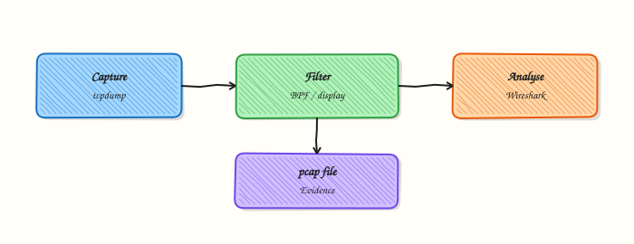

# Packet Analysis with tcpdump and Wireshark

## Overview

When the Layer 1→7 checklist still disagrees — the route looks fine, a process listens, yet the client times out — you need a **packet capture**. A capture is a time-ordered record of frames on an interface. On Linux, **`tcpdump`** writes that record to a **pcap** file. **Wireshark** (graphical) and **`tshark`** (terminal) read the same file so you can see Transmission Control Protocol (TCP) flags, Domain Name System (DNS) queries, and Transport Layer Security (TLS) ClientHello fields without guessing.

Packet analysis is the court reporter of networking. You use it after methodology narrows the path, not as the first click on every alert. Capture only what you need: a short window, a Berkeley Packet Filter (BPF) such as `host` and `port`, and preferably a non-production interface. Mind privacy — payloads can hold passwords, tokens, and personal data.

In Cloud and DevOps work you often capture on a jump host, a sidecar, or the loopback interface (`lo`) of a node. This tutorial stays on **loopback**: you start a tiny local server, capture the TCP three-way handshake with `tcpdump` on `lo`, save a pcap, then prove the handshake with `tcpdump -r` and `tshark` when available.

This is **Tutorial 28** in **Module 17: Troubleshooting** of the REBASH Academy **Networking for Cloud & DevOps Engineers** series. It is written for Cloud, DevOps, Site Reliability Engineering (SRE), and platform engineers. By the end, you will have a pcap and a text summary you can attach to an incident ticket.

## Prerequisites

- [Network Troubleshooting Methodology](network-troubleshooting-methodology.md)
- [TCP and UDP Deep Dive](tcp-and-udp-deep-dive.md) recommended
- A **practice Ubuntu 22.04/24.04 VM** with `sudo` (tcpdump usually needs privileges to open interfaces)
- Packages: `tcpdump`, `python3` or `netcat-openbsd`; optional `tshark` (Wireshark CLI)

## Learning Objectives

By the end of this tutorial, you will be able to:

- [ ] Capture traffic on `lo` to a pcap with snaplen and BPF filter choices
- [ ] Generate a localhost TCP handshake against a lab listener (`nc` or Python)
- [ ] Read SYN / SYN-ACK / ACK from `tcpdump -r` (and `tshark` if installed)
- [ ] Explain when pcap evidence helps — and when encrypted payloads limit what you see
- [ ] Package capture metadata and summaries as incident evidence

## Architecture

Capture sits beside the path: packets cross the interface, `tcpdump` filters and writes a pcap, then Wireshark or `tshark` decode headers for humans and tickets.



## Theory

### What it is

**tcpdump** is a command-line packet sniffer. It attaches to an interface (`-i lo`, `-i eth0`, or `-i any` on Linux), applies an optional BPF filter, and either prints a summary or writes a file with `-w`. **Wireshark** is a graphical analyser for the same pcap format. **tshark** is Wireshark’s terminal twin — useful on servers without a display.

A **TCP three-way handshake** is:

1. Client → server: **SYN**  
2. Server → client: **SYN-ACK**  
3. Client → server: **ACK**  

If you see SYN with no SYN-ACK, the path or filter is dropping replies (or the server never got the SYN). If you see SYN then RST, something refused the connection. That is why capture follows the methodology ladder.

```bash
# List interfaces, then capture (example — lab uses lo and a fixed port)
ip -br link
sudo tcpdump -i lo -n -s 0 -w lab.pcap 'tcp port 18880'
```

### Why it matters

Metrics say “error rate up.” Logs say “timeout.” Only a pcap proves whether SYN left the host and whether SYN-ACK returned. In production you use captures to settle arguments between app and network teams. You also learn the limits: TLS encrypts payloads, so you may only see the handshake and certificate names (Server Name Indication), not the HTTP body. Capturing on the wrong node (client vs load balancer vs pod) wastes time — place the capture where the symptom is.

### How it works

1. **Choose interface** — `lo` for localhost labs; the uplink or `any` for north-south traffic.  
2. **Choose filter** — BPF: `host`, `net`, `port`, `tcp`, `udp` to keep files small.  
3. **Snaplen** — `-s 0` (or a large value) stores full packets; smaller snaplen saves disk but truncates.  
4. **Write pcap** — `-w file.pcap` for later analysis; avoid huge unfiltered `-i any` on busy edges.  
5. **Read** — `tcpdump -n -r file.pcap` for a quick text view; `tshark -r file.pcap` for fields; Wireshark for deep click-through.  
6. **Stop cleanly** — Ctrl+C; note packet counts; hash or list the file for the ticket.

```bash
sudo tcpdump -i lo -n -c 20 -w handshake.pcap 'tcp port 18880'
tcpdump -n -r handshake.pcap 'tcp[tcpflags] & (tcp-syn|tcp-ack) != 0'
```

### Key concepts and comparisons

| Tool | Role | Typical use |
|------|------|-------------|
| `tcpdump` | Capture + light decode | Servers, scripts, CI evidence |
| `tshark` | Field extraction | Grep-friendly summaries on headless hosts |
| Wireshark GUI | Deep decode, graphs | Laptops; follow TCP stream |

| Flag | Meaning |
|------|---------|
| `-i` | Interface (`lo`, `eth0`, `any`) |
| `-n` | Do not resolve addresses (faster, clearer) |
| `-s 0` | Full snaplen (store whole packet) |
| `-c N` | Stop after N packets |
| `-w` / `-r` | Write / read pcap |
| `-v` | More protocol detail in text mode |

| Capture placement | Prefer when | Avoid when |
|-------------------|-------------|------------|
| Client host `lo` / uplink | Prove what the client sends | Issue is only inside another VPC hop |
| Load balancer / proxy | Prove upstream health | You lack permission or mirror ports |
| Destination node | Prove SYN arrives | Traffic terminates earlier (TLS offload) |

### Common pitfalls

- Capturing without a BPF filter on a busy interface (multi-gigabyte pcaps).  
- Forgetting `-n` and waiting on reverse DNS for every line.  
- Capturing on the wrong host in a multi-tier path.  
- Expecting to read HTTPS bodies without TLS keys or a terminator.  
- Leaving `tcpdump` running overnight on a shared bastion.

## Hands-on Lab

### Objective

Under `~/rebash-networking/lab28`, start a localhost TCP service, capture the handshake on `lo` with `tcpdump`, save a pcap, and produce text evidence with `tcpdump -r` and `tshark` when available.

### Prerequisites

- Ubuntu 22.04/24.04 with `sudo` for `tcpdump`
- `tcpdump` installed (`sudo apt-get install -y tcpdump` if needed)
- `python3` **or** `nc` (`netcat-openbsd`)
- Optional: `tshark` (`sudo apt-get install -y tshark`) — lab continues without it

### Lab environment

Workspace: `~/rebash-networking/lab28`

```bash
mkdir -p ~/rebash-networking/lab28/evidence && cd ~/rebash-networking/lab28
set -euo pipefail
whoami | tee evidence/operator.txt
command -v tcpdump
command -v python3 || command -v nc
sudo -n true 2>/dev/null || sudo -v
ip -br link | tee evidence/links.txt
```

**Expected output:** `tcpdump` is found; `sudo` works; `links.txt` lists `lo` among interfaces.

### Real-world scenario

Methodology shows a listener on the app port, but one client still fails. You need proof of the TCP handshake on the same host. You capture on loopback against a lab port, keep a short pcap, and attach a text decode so the ticket does not depend on opening Wireshark.

### Step-by-step tasks

#### Task 1 – Start a localhost TCP server

Listen on `127.0.0.1:18880`. Prefer Python; fall back to `nc` if needed.

```bash
cd ~/rebash-networking/lab28
set -euo pipefail

if command -v python3 >/dev/null 2>&1; then
  python3 - <<'PY' >evidence/server.log 2>&1 &
import socket
s = socket.socket(socket.AF_INET, socket.SOCK_STREAM)
s.setsockopt(socket.SOL_SOCKET, socket.SO_REUSEADDR, 1)
s.bind(("127.0.0.1", 18880))
s.listen(1)
conn, addr = s.accept()
data = conn.recv(64)
conn.sendall(b"PONG\n")
conn.close()
s.close()
PY
  echo $! > evidence/server.pid
else
  nc -l 127.0.0.1 18880 >evidence/server.log 2>&1 &
  echo $! > evidence/server.pid
fi

sleep 0.3
ss -lnt | grep -E ':18880\b' | tee evidence/listen.txt
test -s evidence/listen.txt
```

**Expected output:** `listen.txt` shows a socket on port **18880**.

#### Task 2 – Sniff on `lo` and complete a handshake

Start `tcpdump` on loopback, then open a client connection so SYN / SYN-ACK / ACK appear in the pcap.

```bash
cd ~/rebash-networking/lab28
set -euo pipefail

# Capture a small, filtered pcap on loopback only
sudo tcpdump -i lo -n -s 0 -c 30 -w evidence/lo-handshake.pcap \
  'tcp port 18880' >evidence/tcpdump-capture.log 2>&1 &
echo $! > evidence/tcpdump.pid
sleep 0.5

# Client: send a line and read the response (works with the Python server)
python3 - <<'PY' | tee evidence/client-out.txt
import socket
s = socket.create_connection(("127.0.0.1", 18880), timeout=3)
s.sendall(b"PING\n")
print(s.recv(64).decode(errors="replace").strip())
s.close()
PY

# Allow tcpdump to flush / hit -c
sleep 1
if [[ -f evidence/tcpdump.pid ]]; then
  sudo kill "$(cat evidence/tcpdump.pid)" 2>/dev/null || true
  rm -f evidence/tcpdump.pid
fi
sleep 0.3

test -s evidence/lo-handshake.pcap
ls -l evidence/lo-handshake.pcap | tee evidence/pcap-ls.txt
```

**Expected output:** `lo-handshake.pcap` is non-empty; client output shows `PONG` when using the Python server (nc-only servers may show empty client text — the pcap still matters).

#### Task 3 – Read the pcap with `tcpdump -r` and optional `tshark`

Decode flags and write a summary for the ticket.

```bash
cd ~/rebash-networking/lab28
set -euo pipefail

# Text decode — look for SYN / SYN-ACK / ACK style lines
sudo tcpdump -n -vv -r evidence/lo-handshake.pcap \
  | tee evidence/tcpdump-read.txt

# Flag-focused view (portable enough for teaching)
sudo tcpdump -n -r evidence/lo-handshake.pcap 'tcp' \
  | tee evidence/tcpdump-tcp-lines.txt

# Count lines that look like handshake activity
grep -Eic 'Flags \[S\]|Flags \[S\.\]|Flags \[.\]|synth|SYN' evidence/tcpdump-read.txt \
  | tee evidence/syn-like-count.txt \
  || true
# Soft assert: file has TCP lines
test -s evidence/tcpdump-tcp-lines.txt

if command -v tshark >/dev/null 2>&1; then
  tshark -r evidence/lo-handshake.pcap -T fields \
    -e frame.number -e ip.src -e ip.dst -e tcp.srcport -e tcp.dstport -e tcp.flags.str \
    2>/dev/null | tee evidence/tshark-flags.txt
  test -s evidence/tshark-flags.txt
  echo "tshark=yes" | tee evidence/tshark-status.txt
else
  echo "tshark=not_installed" | tee evidence/tshark-status.txt
  echo "Install later with: sudo apt-get install -y tshark" | tee evidence/tshark-hint.txt
fi

# Evidence pack
sha256sum evidence/lo-handshake.pcap | tee evidence/pcap-sha256.txt
tar -czf packet-evidence.tgz evidence
ls -l packet-evidence.tgz | tee evidence/evidence-ls.txt
```

**Expected output:** `tcpdump-read.txt` shows TCP lines for port 18880; `tshark-status.txt` is `yes` or `not_installed`; `packet-evidence.tgz` exists.

### Validation steps

- [ ] `evidence/lo-handshake.pcap` is non-zero size
- [ ] `tcpdump -r` output mentions port `18880` and TCP
- [ ] You can point to SYN / SYN-ACK / ACK (or equivalent flag text) in the decode
- [ ] `packet-evidence.tgz` contains the pcap and text summaries

### Common errors and fixes

| Error | Cause | Fix |
|-------|-------|-----|
| `tcpdump: lo: You don't have permission` | Missing capabilities / sudo | Run capture with `sudo`; do not chmod random setuid hacks |
| Empty pcap | Client ran before tcpdump ready, or wrong filter | Start tcpdump first; confirm `tcp port 18880`; retry |
| `Address already in use` | Old server still bound | `kill "$(cat evidence/server.pid)"`; re-check `ss` |
| No SYN lines in text | Different tcpdump flag format | Open pcap in Wireshark; or use `tshark -e tcp.flags.str` |
| Huge capture | Forgot BPF / used `-i any` in production | Always filter; use `-c` for labs |

### Challenge exercise

Write `capture-once.sh` that: (1) starts a one-shot Python listener on `127.0.0.1:18881`, (2) runs `sudo tcpdump -i lo -c 15 -w evidence/challenge.pcap 'tcp port 18881'`, (3) connects with Python, (4) writes `evidence/challenge-summary.txt` containing `packets=` from `tcpdump -r … 2>&1 | tail` or `tshark -r … | wc -l`, and (5) stops cleanly. Keep artefacts under `~/rebash-networking/lab28/`.

### Learning outcomes

- Captured a filtered localhost pcap on `lo`
- Confirmed TCP handshake evidence with `tcpdump -r`
- Used `tshark` when present without failing the lab when absent
- Built a ticket-ready evidence tarball

### Cleanup

```bash
cd ~/rebash-networking/lab28
set -euo pipefail

if [[ -f evidence/server.pid ]]; then
  kill "$(cat evidence/server.pid)" 2>/dev/null || true
  rm -f evidence/server.pid
fi
if [[ -f evidence/tcpdump.pid ]]; then
  sudo kill "$(cat evidence/tcpdump.pid)" 2>/dev/null || true
  rm -f evidence/tcpdump.pid
fi
# Optional: rm -f packet-evidence.tgz evidence/*.pcap
```

## Validation

- [ ] Lab finished under `~/rebash-networking/lab28/` with `lo-handshake.pcap` and `packet-evidence.tgz`
- [ ] You can explain SYN / SYN-ACK / ACK and what missing SYN-ACK suggests
- [ ] You can write a minimal BPF filter for host and port
- [ ] You can describe one privacy risk of unrestricted capture

## Code Walkthrough

Production habits for **Packet Analysis with tcpdump and Wireshark**:

1. **Methodology first** — capture after L1→L7 narrows the path  
2. **Filter always** — BPF on host/port; prefer `-c` or a short time window  
3. **Write then read** — `-w` for evidence; `-r` / `tshark` / Wireshark for decode  
4. **Modern tools** — `tcpdump` + `tshark` on servers; GUI Wireshark on your laptop  
5. **Least data** — avoid full payload retention; redact before sharing outside the incident channel  

Automate naming (`pcap-$(date +%Y%m%d-%H%M%S).pcap`) so handovers stay clear.

## Security Considerations

- Captures can contain secrets — store under restricted paths; delete when the incident closes  
- Prefer filtered captures over `tcpdump -i any -s 0` on shared bastions  
- Follow company policy before capturing customer traffic (consent / legal hold)  
- Do not publish raw pcaps in public Git repositories  
- Limit sudoers for tcpdump to trained on-call roles where possible

## Common Mistakes

!!! warning "Capturing without a filter on a busy NIC"
    Disk fills and analysis becomes impossible. **Fix:** BPF `host`/`port`; use `-c` or timeout; sample on a span/mirror port if needed.

!!! warning "Reading HTTPS bodies from a pcap and declaring ‘empty traffic’"
    Payloads are encrypted. **Fix:** judge TCP/TLS handshakes and errors; decrypt only with approved keys in a controlled lab.

!!! warning "Capturing on the app pod when the drop is at the load balancer"
    Wrong vantage point. **Fix:** place capture (or VPC flow logs) at the hop where the symptom appears.

!!! warning "Leaving tcpdump running after the incident"
    Continuous capture burns disk and privacy budget. **Fix:** `-c`, `timeout 60s sudo tcpdump …`, or kill when done.

## Best Practices

- Name pcaps with UTC timestamps and the interface  
- Store a text decode next to the pcap for reviewers without Wireshark  
- Prefer `lo` and lab ports when teaching or testing tooling  
- Correlate pcap time with metrics and change tickets  
- Document snaplen and filter in the incident timeline

## Troubleshooting

| Symptom | Likely cause | Fix |
|---------|--------------|-----|
| Permission denied opening interface | No root/capabilities | Use `sudo` or grant `cap_net_raw` carefully |
| 0 packets captured | Wrong iface/filter; traffic elsewhere | Verify with `ss`/`tcpdump -i lo -n` live; relax filter briefly |
| Truncated packets | Small snaplen | Use `-s 0` or adequate snaplen |
| `tshark: The file appears to be damaged` | Incomplete write / kill -9 | Stop tcpdump gracefully; recapture |
| Wireshark shows only ACK storms | Missed start of flow | Start capture before the client; increase `-c` |

## Summary

Packet analysis turns “it feels like the network” into proof: filtered capture, pcap on disk, handshake flags in text. You practised on loopback with `tcpdump`, read the file back, and optionally used `tshark`. Next, turn captures and host evidence into a structured incident bundle in [Network Incident Response and Observability](network-incident-response-and-observability.md).

## Interview Questions

**1. When do you choose packet capture instead of continuing with `curl` and `ss` alone?**

??? success "Reveal answer"
    When the methodology ladder is done but tools disagree — for example a listener exists and the route looks fine, yet the client times out — or when you must prove SYN leaves and SYN-ACK never returns. Capture is evidence, not the first step for every alert.

**2. Explain the TCP three-way handshake and what a pcap with only SYN (no SYN-ACK) suggests.**

??? success "Reveal answer"
    Client sends **SYN**, server replies **SYN-ACK**, client sends **ACK**. SYN with no SYN-ACK suggests the server never answered: drop on a firewall/security group, wrong host, asymmetric routing, or capture on the wrong interface. Next checks are path/filters and capture placement — not only restarting the app.

**3. What is a BPF filter, and why does `tcp port 443 and host 10.0.0.5` matter in production?**

??? success "Reveal answer"
    A Berkeley Packet Filter expression selects which packets `tcpdump` keeps. Filtering by port and host keeps pcaps small, protects privacy, and makes analysis possible on busy links. Unfiltered captures on edge routers are rarely appropriate for routine incidents.

**4. Compare `tcpdump -w`, `tcpdump -r`, Wireshark, and `tshark`.**

??? success "Reveal answer"
    `-w` writes a pcap; `-r` reads it as text. **Wireshark** is the graphical deep analyser. **tshark** extracts fields on headless servers. Typical flow: capture with tcpdump on the server, review with tshark there or copy the pcap to a laptop for Wireshark.

**5. Why might an HTTPS pcap show a complete TCP handshake but no readable HTTP URL?**

??? success "Reveal answer"
    TLS encrypts the application data. You still see TCP and often TLS handshake metadata (and sometimes Server Name Indication). The HTTP path and headers are not cleartext unless you terminate TLS or use approved decryption keys. Do not claim “the app sent nothing” from an encrypted payload you cannot read.

**6. How would you capture safely on a shared jump server?**

??? success "Reveal answer"
    Use a tight BPF filter, short duration or `-c`, write under a restricted directory, avoid `-i any` unless required, notify per policy, and delete or archive pcaps after the incident. Prefer capturing on the affected host or a dedicated mirror path when possible.

**7. A colleague pastes a pcap into a public Slack channel. What is wrong, and what should you do?**

??? success "Reveal answer"
    Pcaps can hold credentials, session cookies, and personal data. Ask for deletion from the channel, rotate any exposed secrets, move analysis to a private incident store, and remind the team of redaction rules. Treat it like any other data-loss event.

**8. How do you prove in an interview that a localhost lab capture actually contains a handshake?**

??? success "Reveal answer"
    Show the non-empty pcap, `tcpdump -n -r` lines for the lab port with SYN/SYN-ACK/ACK (or `tshark -e tcp.flags.str`), and the listener/`ss` evidence from the same time window. Mention filter (`tcp port …`) and interface (`lo`) so the reviewer trusts placement.

## Related Tutorials

- [Networking for Cloud & DevOps – Overview](index.md)
- [Network Troubleshooting Methodology](network-troubleshooting-methodology.md) *(previous)*
- [Network Incident Response and Observability](network-incident-response-and-observability.md) *(next)*
- [TCP and UDP Deep Dive](tcp-and-udp-deep-dive.md)
- [Linux Networking Toolkit](linux-networking-toolkit.md)

## References

- [`tcpdump` man page / project](https://www.tcpdump.org/)  
- [Wireshark User’s Guide](https://www.wireshark.org/docs/)  
- [`tshark(1)`](https://www.wireshark.org/docs/man-pages/tshark.html)  
- [TCP/IP Illustrated ideas via Ubuntu `tcpdump(8)`](https://manpages.ubuntu.com/manpages/jammy/en/man8/tcpdump.8.html)  
- Track index: [Networking for Cloud & DevOps Engineers](index.md)
