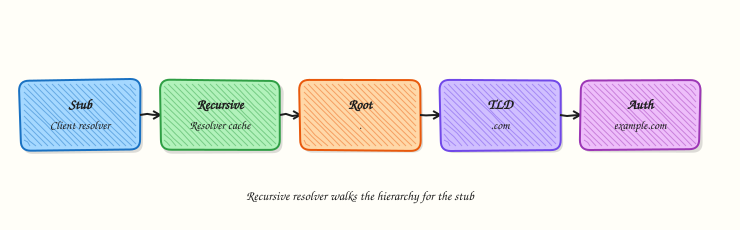

# Production DNS Operations

## Overview

**Production Domain Name System (DNS) operations** is how you change and run DNS safely at scale: Time To Live (TTL) planning, authoritative verification, dual-provider resilience, health-based failover, and change control. The protocol is the same as fundamentals; the stakes are cutover windows, global caches, and customer traffic.

In Cloud and DevOps work you lower TTL before migrations, query authoritative nameservers (not only public resolvers), and keep rollback records ready. Cloud DNS products (Route 53, Azure DNS, Cloud DNS) still need the same habits — the console is not a substitute for TTL maths.

In production, a wrong A/AAAA or CNAME can black-hole a region. Caches hold old answers until TTL expires, so “I fixed it” and “users see it” can be hours apart. Stale TTL is not a slogan; you measure it with `dig +stats` and plan the wait.

This is **Tutorial 24** in **Module 16: Production Networking** of the REBASH Academy **Networking for Cloud & DevOps Engineers** series. It is written for Cloud, DevOps, Platform, and SRE engineers. By the end you will run timing and SOA/NS checks under `~/rebash-networking/lab24`.

## Prerequisites

- [DNS Records and Troubleshooting](dns-records-and-troubleshooting.md)
- [Network Automation and Monitoring](network-automation-and-monitoring.md)
- Host with `dig` (`dnsutils` / `bind-utils`) and outbound UDP/TCP 53

## Learning Objectives

By the end of this tutorial, you will be able to:

- [ ] Plan TTL before migrations and explain cache delay
- [ ] Measure query timing with `dig +stats`
- [ ] Verify SOA and NS at authoritative servers
- [ ] Distinguish recursive cache answers from authoritative truth
- [ ] Design rollback for DNS changes
- [ ] Avoid dangling CNAMEs and apex mistakes in cutovers

## Architecture

Resolvers cache answers for the TTL. Operators must verify at authoritative nameservers during incidents and cutovers.




## Theory

### What it is

Production DNS ops covers safe publish, verify, and rollback of records that steer real traffic. Key artefacts: **SOA** (zone serial and timers), **NS** (delegation), data records (A/AAAA/CNAME/MX/TXT), and **TTL** (how long caches may keep an answer).

```bash
dig example.com A +stats
dig example.com NS +short
dig example.com SOA +noall +answer
```

### Why it matters

DNS mistakes have high blast radius. Registrar or single-provider outages have taken large sites offline. “Instant failover” lies if TTL is still 3600 seconds on old answers. SRE teams treat DNS like production config: tickets, dual control, measured validation.

### How it works

1. **Lower TTL early** — wait at least the old TTL before the flip.
2. **Publish** — IaC or API change with peer review.
3. **Query authoritative NS** — `dig @ns … +norecurse` for zone truth.
4. **Check public resolvers** — see what users may still cache.
5. **Watch timing** — `dig +stats` shows query time; slow DNS is an incident signal.
6. **Rollback** — restore previous RRset / previous IaC commit.

| Concern | Operational focus |
|---------|-------------------|
| TTL | Lower before cutover; measure remaining cache risk |
| Authoritative check | `dig @ns` not only `8.8.8.8` |
| SOA serial | Monotonic increase on changes |
| Failover | Health-checked records / traffic policies |
| Dual DNS | Second provider or secondary for resilience |

### Common pitfalls

- Flipping records without lowering TTL first
- Trusting only recursive resolvers during an incident
- Dangling CNAMEs after LB decommission
- Apex CNAME where the provider forbids it (use ALIAS/ANAME/flattening)
- No rollback record set documented in the ticket

## Hands-on Lab

### Objective

Measure `dig` timing, build a SOA/NS check script for a domain, and capture `+stats` evidence that explains stale TTL risk. Work under `~/rebash-networking/lab24`. Use a public domain you are allowed to query (default `example.com`).

### Prerequisites

- `dig` installed (`sudo apt-get install -y dnsutils` on Ubuntu if needed)
- Network allow for DNS queries

### Lab environment

Workspace: `~/rebash-networking/lab24`

```bash
mkdir -p ~/rebash-networking/lab24 && cd ~/rebash-networking/lab24
set -euo pipefail
DOMAIN="${DOMAIN:-example.com}"
echo "domain=${DOMAIN}" | tee domain.txt
command -v dig | tee dig-path.txt
dig -v 2>&1 | head -n 1 | tee dig-version.txt || true
```

**Expected output:** `domain.txt` set; `dig` found.

### Real-world scenario

Before a blue/green cutover, SRE asks you to prove you can measure resolver latency, list NS/SOA for the zone, and explain how long old A records may live in caches. You run the checks and attach the files to the change ticket.

### Step-by-step tasks

#### Task 1 – dig timing with +stats

```bash
cd ~/rebash-networking/lab24
set -euo pipefail
DOMAIN="$(cut -d= -f2 domain.txt)"

dig "$DOMAIN" A +stats | tee dig-a-stats.txt
dig "$DOMAIN" AAAA +stats | tee dig-aaaa-stats.txt

# Extract Query time for discussion
grep -E 'Query time:|ANSWER SECTION|IN[[:space:]]+A' dig-a-stats.txt | tee dig-timing-summary.txt
test -s dig-a-stats.txt
```

**Expected output:** `dig-a-stats.txt` includes `Query time:` and an answer or status.

#### Task 2 – SOA/NS check script

```bash
cd ~/rebash-networking/lab24
set -euo pipefail
DOMAIN="$(cut -d= -f2 domain.txt)"
```

Create `check-soa-ns.sh`:

```bash
#!/usr/bin/env bash
set -euo pipefail
DOMAIN="${1:?usage: check-soa-ns.sh domain}"
OUTDIR="${2:-.}"
mkdir -p "$OUTDIR"

dig "$DOMAIN" NS +noall +answer | tee "$OUTDIR/ns-answer.txt"
dig "$DOMAIN" SOA +noall +answer | tee "$OUTDIR/soa-answer.txt"

NS1="$(awk '/IN[[:space:]]+NS[[:space:]]+/ {print $5; exit}' "$OUTDIR/ns-answer.txt")"
if [[ -z "${NS1}" ]]; then
  echo "ERROR: no NS found for ${DOMAIN}" >&2
  exit 1
fi
# Trim trailing dot for dig @server
NS1="${NS1%.}"
echo "authoritative_ns_sample=${NS1}" | tee "$OUTDIR/ns-sample.txt"

dig @"$NS1" "$DOMAIN" SOA +norecurse +noall +answer +stats \
  | tee "$OUTDIR/soa-auth-stats.txt"
dig @"$NS1" "$DOMAIN" A +norecurse +noall +answer +stats \
  | tee "$OUTDIR/a-auth-stats.txt"

# TTL from authoritative A answer (field 2 in dig presentation)
TTL="$(awk '/IN[[:space:]]+A[[:space:]]+/ {print $2; exit}' "$OUTDIR/a-auth-stats.txt" || true)"
echo "observed_a_ttl_seconds=${TTL:-unknown}" | tee "$OUTDIR/ttl-observed.txt"

if [[ -n "${TTL}" && "${TTL}" =~ ^[0-9]+$ ]]; then
  echo "stale_cache_risk: after a flip, some resolvers may serve the old A for up to ~${TTL}s (plus resolver skew)." \
    | tee "$OUTDIR/ttl-risk.txt"
else
  echo "stale_cache_risk: could not parse A TTL; discuss SOA minimum and record TTLs from ns-answer/soa-answer." \
    | tee "$OUTDIR/ttl-risk.txt"
fi
```

```bash
chmod +x check-soa-ns.sh
./check-soa-ns.sh "$DOMAIN" .
test -s soa-answer.txt && test -s ns-answer.txt && test -s ttl-risk.txt
```

**Expected output:** NS/SOA files exist; `ttl-risk.txt` explains cache delay using the measured TTL.

#### Task 3 – Recursive vs authoritative comparison + evidence

```bash
cd ~/rebash-networking/lab24
set -euo pipefail
DOMAIN="$(cut -d= -f2 domain.txt)"
NS1="$(cut -d= -f2 ns-sample.txt)"

{
  echo "=== recursive default resolver ==="
  dig "$DOMAIN" A +noall +answer +stats
  echo "=== authoritative @${NS1} ==="
  dig @"$NS1" "$DOMAIN" A +norecurse +noall +answer +stats
} | tee recursive-vs-auth.txt

tar -czf dns-ops-evidence.tgz \
  domain.txt dig-path.txt dig-version.txt \
  dig-a-stats.txt dig-aaaa-stats.txt dig-timing-summary.txt \
  check-soa-ns.sh ns-answer.txt soa-answer.txt ns-sample.txt \
  soa-auth-stats.txt a-auth-stats.txt ttl-observed.txt ttl-risk.txt \
  recursive-vs-auth.txt
ls -l dns-ops-evidence.tgz | tee evidence-ls.txt
```

**Expected output:** comparison file and non-empty archive.

### Validation steps

- [ ] `dig-a-stats.txt` shows Query time
- [ ] `check-soa-ns.sh` exits 0 for your domain
- [ ] `ttl-risk.txt` ties stale answers to measured TTL
- [ ] Evidence under `~/rebash-networking/lab24`

### Common errors and fixes

| Error | Cause | Fix |
|-------|-------|-----|
| `dig: command not found` | Package missing | `sudo apt-get install -y dnsutils` |
| No NS in answer | Wrong domain / NXDOMAIN | Set `DOMAIN` to a real zone apex |
| `connection timed out; no servers could be reached` | DNS egress blocked | Use another network; lab needs DNS |
| Authoritative dig fails | NS host firewall / anycast | Try the next NS from `ns-answer.txt` |

### Challenge exercise

Extend `check-soa-ns.sh` to loop all NS hosts from `ns-answer.txt` and write `ns-soa-matrix.tsv` with columns `ns,query_time_ms,soa_serial` (parse Query time and SOA serial). Fail if serials disagree.

### Learning outcomes

- Measured DNS latency with `+stats`
- Verified SOA/NS at an authoritative server
- Explained stale TTL risk with a measured number

### Cleanup

```bash
cd ~/rebash-networking/lab24
set -euo pipefail
# Query-only lab — keep evidence or remove:
# rm -f dns-ops-evidence.tgz *.txt
true
```

## Validation

- [ ] Lab finished under `~/rebash-networking/lab24/`
- [ ] You can explain TTL wait before cutover
- [ ] You know why authoritative queries matter in incidents
- [ ] You can describe a DNS rollback

## Code Walkthrough

Production DNS changes usually follow:

1. **Read current TTL and RRset** — recursive and authoritative
2. **Lower TTL** and wait out the previous TTL
3. **Publish** via IaC with review
4. **Verify `@ns`** then major resolvers
5. **Rollback plan** — previous records ready before the flip

## Security Considerations

- Protect registrar and DNS console accounts with MFA
- Watch for dangling CNAMEs that attackers can claim
- Treat DNS change roles as privileged
- Validate DNSSEC only if your zone uses it (do not break signed zones casually)
- Log who published production record changes

## Common Mistakes

!!! warning "Flipping DNS with TTL still at 3600"
    Users keep old IPs for up to an hour (or more). **Fix:** lower TTL ahead of time; wait; then flip; raise TTL later.

!!! warning "Checking only 8.8.8.8 during an outage"
    Caches disagree. **Fix:** query authoritative NS with `dig @ns` and compare.

!!! warning "No rollback RRset in the ticket"
    Panic edits make things worse. **Fix:** save previous answers before change; revert IaC commit.

!!! warning "Decommissioning an LB hostname still used as CNAME"
    Dangling alias. **Fix:** search for CNAMEs before delete; use short TTLs during migrations.

## Best Practices

- Dual DNS or secondary for critical public zones
- Automate expiry checks for certificates tied to names
- Use health-based failover where the provider supports it
- Document apex strategy (ALIAS/ANAME vs A records)
- Keep a dig runbook for Sev-1 DNS incidents

## Troubleshooting

| Symptom | Likely cause | Fix |
|---------|--------------|-----|
| Some users see old IP | TTL cache | Wait / lower TTL earlier next time; purge only if provider supports |
| SERVFAIL | Broken delegation / DNSSEC | Check NS/SOA; validate DS if signed |
| NXDOMAIN after flip | Wrong name / removed RR | Restore from rollback |
| Slow dig | Resolver or network path | Compare Query time recursive vs `@ns` |

## Summary

Production DNS is change control plus measurement: TTL planning, authoritative verification, and rollback. Use `dig +stats` and SOA/NS scripts as evidence. Next, operate balancers in [Load Balancer Operations and Health Checks](load-balancer-operations-and-health-checks.md).

## Interview Questions

**1. Why lower TTL before a DNS cutover?**

??? success "Reveal answer"
    Caches may keep the old answer until the **TTL expires**. Lowering TTL early makes the final flip take effect faster for most users. If you flip while TTL is still high, “DNS is updated” and “users moved” can be far apart.

**2. How do you verify a DNS change at the source of truth?**

??? success "Reveal answer"
    Query an **authoritative** nameserver: `dig @ns1.example.net example.com A +norecurse`. Recursive resolvers may still show cached data and are not enough during cutovers.

**3. What does `dig +stats` give you that a plain dig misses?**

??? success "Reveal answer"
    It prints **Query time** and other stats so you can measure resolver latency and compare recursive vs authoritative paths during incidents.

**4. What is SOA useful for in operations?**

??? success "Reveal answer"
    SOA carries the **serial** and zone timers. Operators confirm the serial increased after a change and that secondaries are consistent. It is a quick authoritative health signal.

**5. What is a dangling CNAME and why is it dangerous?**

??? success "Reveal answer"
    A CNAME points to a name you no longer control (for example a deleted cloud LB hostname). An attacker who claims that target name can receive your traffic. Remove or retarget CNAMEs before decommission.

**6. How would you roll back a bad A record change?**

??? success "Reveal answer"
    Republish the **previous RRset** from IaC or from saved dig output, verify at authoritative NS, and communicate remaining TTL delay. Do not invent new records under pressure without evidence.

**7. Users in one ISP still hit the old IP after you verified `@ns`. What is happening?**

??? success "Reveal answer"
    That ISP’s recursive resolvers are still **caching** the old answer until TTL expiry (or a buggy long cache). Authoritative truth is new; user visibility waits on caches. This is expected stale-TTL behaviour.

## Related Tutorials

- [Networking for Cloud & DevOps – Overview](index.md)
- [Network Automation and Monitoring](network-automation-and-monitoring.md) *(previous)*
- [Load Balancer Operations and Health Checks](load-balancer-operations-and-health-checks.md) *(next)*
- [DNS Fundamentals](dns-fundamentals.md)
- [DNS Records and Troubleshooting](dns-records-and-troubleshooting.md)

## References

- [RFC 1035 — Domain names](https://www.rfc-editor.org/rfc/rfc1035)
- [`dig(1)`](https://manpages.ubuntu.com/manpages/jammy/en/man1/dig.1.html)
- [Amazon Route 53 Developer Guide](https://docs.aws.amazon.com/route53/)
- Track index: [Networking for Cloud & DevOps Engineers](index.md)
