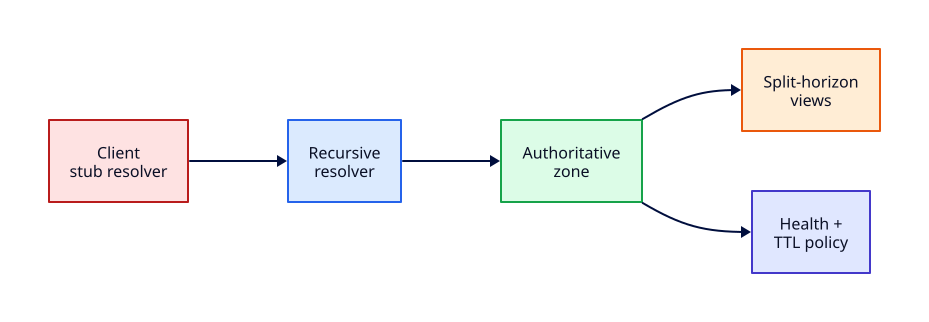

# Production DNS Operations

## Overview

DNS is the control plane of the internet — a wrong A record or aggressive TTL change redirects production traffic faster than most deploy pipelines. **Production DNS operations** means understanding **recursive vs authoritative** roles, how **TTL and caching** shape cutovers, when **split-horizon** views differ inside and outside the corporate network, and how **change control** prevents Friday-afternoon outages.

This tutorial teaches operator playbooks: document intent, lower TTL before migration, validate with `dig`, and observe cache behaviour locally using `/etc/hosts` plus public resolvers. Host-level nginx and TLS certificate issuance on Linux are covered in [TLS Certificates on Linux Servers](../linux/tls-certificates-on-linux-servers.md) — here we focus on the DNS layer only.

This is **Tutorial 22** in **Module 7: Production Network Operations** of the REBASH Academy Networking series.

## Prerequisites

- Completed [Network Segmentation and Trust Boundaries](network-segmentation-and-trust-boundaries.md) and Module 3 DNS tutorials
- [DNS Fundamentals](dns-fundamentals.md) and [DNS Records and Troubleshooting](dns-records-and-troubleshooting.md)
- Linux host with `dig`, `host`, and optional `systemd-resolved`
- Ability to edit `/etc/hosts` with `sudo` for lab steps

## Learning Objectives

By the end of this tutorial, you will be able to:

- [ ] Distinguish recursive resolvers from authoritative nameservers in production traffic paths
- [ ] Explain TTL impact on caching resolvers and plan cutover windows
- [ ] Describe split-horizon DNS and when internal vs external answers differ
- [ ] Follow DNS change control: ticket, TTL prep, staged rollout, validation, rollback
- [ ] Use a `dig` playbook for pre/post change verification
- [ ] Observe TTL expiry behaviour with local overrides and public DNS queries

## Architecture

Production DNS spans authoritative zones, recursive resolvers, caching layers, and change-control gates before any record reaches the public internet.



## Theory

### Recursive vs authoritative

| Role | Answers | Example in production |
|------|---------|----------------------|
| **Recursive resolver** | Queries on behalf of clients; caches results | `systemd-resolved`, corporate AD DNS, `8.8.8.8` |
| **Authoritative nameserver** | Owns zone data; no recursion for others' zones | Route 53, Cloudflare, BIND primary |
| **Stub resolver** | Forwards to configured recursive | `/etc/resolv.conf` on Linux |

Client query flow: stub → recursive (cache hit or iterative queries to authority) → cached answer returned with remaining TTL.

### TTL and caching

**TTL (Time To Live)** on a record tells resolvers how long they may cache the answer.

| TTL choice | Use case | Risk |
|------------|----------|------|
| 300s (5 min) | Pre-migration window | Higher query load on authority |
| 3600s (1 h) | Steady state | Slow rollback if wrong IP published |
| 86400s (24 h) | Stable infra | Painful emergency changes |

**Change playbook:**

1. Lower TTL to 300 **24–48 hours before** the change (old TTL must expire first)
2. Apply new record at cutover
3. Validate with `dig` from multiple resolvers
4. Raise TTL after stability confirmed

Resolvers honour **minimum** of record TTL and any cache policy — you cannot force instant global purge without provider-specific flush tools.

### Split-horizon concept

**Split-horizon** (split DNS) serves **different answers** for the same name depending on client location:

- `app.internal.example.com` → `10.0.1.50` (VPC resolver, private view)
- `app.example.com` → `203.0.113.10` (public view via CDN/LB)

Use cases: hairpin NAT avoidance, hiding internal topology, staging environments reachable only on VPN. Pitfall: laptop on VPN sees internal view; CI outside sees public — test both.

### Change control for DNS

Treat DNS like database schema:

| Stage | Action |
|-------|--------|
| Request | Ticket with record name, type, value, TTL, rollback value |
| Review | Peer check for apex CNAME bans, duplicate names, TTL policy |
| Pre-check | `dig +trace`, `dig @authority`, compare to expected |
| Apply | IaC (`terraform apply`) or provider API with audit log |
| Post-check | Multi-resolver `dig`, synthetic HTTP/TLS probe |
| Rollback | Restore previous record; TTL governs recovery speed |

Pair with [Network Automation and Monitoring](network-automation-and-monitoring.md) for Git-backed zones.

### dig playbook (operator reference)

```bash
# Full answer with TTL and flags
dig +noall +answer example.com A

# Query specific public resolver (bypass local cache)
dig @8.8.8.8 +ttlunits example.com A

# Authoritative only (no recursion)
dig @ns1.example.com +norecurse example.com A

# Trace delegation chain
dig +trace example.com A

# Compare TTL remaining
dig example.com | grep -E '^example|IN[[:space:]]A'
```

Always record **which resolver** you queried — `dig example.com` alone uses local stub cache and misleads during incidents.

## Hands-on Lab

All steps use **£0 local tools** — `/etc/hosts`, `dig`, public resolvers, and optional Python HTTP for correlation.

### Step 1 – Baseline resolver and dig

```bash
dig +version
cat /etc/resolv.conf | head -5
dig +noall +answer example.com A +ttlunits
dig @8.8.8.8 +noall +answer example.com A +ttlunits
```

**Expected output:** `dig` version string; upstream resolver listed; `example.com` A record with TTL (often 3600s or provider-specific).

### Step 2 – Create a lab hostname via /etc/hosts

```bash
grep rebash-lab /etc/hosts || echo '127.0.0.1 rebash-lab.local rebash-lab-app' | sudo tee -a /etc/hosts
getent hosts rebash-lab.local
ping -c 1 rebash-lab.local
```

**Expected output:** `127.0.0.1 rebash-lab.local` resolves locally — simulates split-horizon internal override (hosts file takes precedence over DNS).

### Step 3 – Serve content on the lab name

```bash
mkdir -p /tmp/dns-lab/www
echo "REBASH DNS lab OK" > /tmp/dns-lab/www/index.html
cd /tmp/dns-lab/www && python3 -m http.server 8090 &
curl -s http://rebash-lab.local:8090/
curl -s http://127.0.0.1:8090/
```

**Expected output:** `REBASH DNS lab OK` via hostname and IP — proves local name maps to loopback service.

### Step 4 – Simulate TTL observation with dig against public DNS

Pick a name with short TTL if available, or observe TTL countdown:

```bash
dig @1.1.1.1 +noall +answer cloudflare.com A +ttlunits | tee /tmp/dns-lab/ttl-1.txt
sleep 30
dig @1.1.1.1 +noall +answer cloudflare.com A +ttlunits | tee /tmp/dns-lab/ttl-2.txt
echo "=== TTL comparison ==="
diff /tmp/dns-lab/ttl-1.txt /tmp/dns-lab/ttl-2.txt || true
```

**Expected output:** Second query shows **lower TTL** (approximately 30 seconds less) — demonstrates resolver caching countdown.

### Step 5 – Split-horizon thought experiment

```bash
cat <<'EOF' | tee /tmp/dns-lab/split-horizon-notes.md
# Split-horizon lab notes

| View     | Client              | rebash-lab.local answer |
|----------|---------------------|---------------------------|
| Internal | /etc/hosts override | 127.0.0.1                 |
| Public   | dig @8.8.8.8        | NXDOMAIN (no public zone)|

Production: internal AD/BIND view vs Route 53 public zone.
EOF
dig @8.8.8.8 rebash-lab.local A +short 2>&1 | head -3
cat /tmp/dns-lab/split-horizon-notes.md
```

**Expected output:** Public resolver returns no answer; local hosts file still resolves — classic split-view discrepancy to test in staging.

### Step 6 – Change-control dry run document

```bash
cat <<'EOF' | tee /tmp/dns-lab/change-request.txt
CHANGE: rebash-lab.local A 127.0.0.1 -> 127.0.0.2 (lab only)
TTL before: n/a (hosts) / 300 planned for real zone
Rollback: restore 127.0.0.1
Validation:
  dig @8.8.8.8 rebash-lab.example.com A +short
  curl -sI http://rebash-lab.example.com/
Approver: NET-OPS
EOF
cat /tmp/dns-lab/change-request.txt
```

**Expected output:** Structured change template ready for real provider API or Terraform apply.

### Step 7 – dig playbook drill

```bash
for ns in "" "@8.8.8.8" "@1.1.1.1"; do
  echo "=== dig $ns example.com A ==="
  dig $ns +noall +answer example.com A +ttlunits 2>/dev/null | head -3
done
```

**Expected output:** Three resolver perspectives; note TTL differences if local cache is warm.

### Step 8 – Cleanup

```bash
kill $(lsof -t -i:8090) 2>/dev/null || true
sudo sed -i '/rebash-lab/d' /etc/hosts
rm -rf /tmp/dns-lab
getent hosts rebash-lab.local 2>&1 || echo "hosts entry removed"
```

**Expected output:** HTTP server stopped; lab hosts lines removed.

## Validation

Confirm the lab before moving on:

1. Re-run dig baseline and TTL observation steps.
2. Explain recursive vs authoritative using your lab commands.
3. Complete a change-request template for a hypothetical A record update.

| Check | Pass criteria |
|-------|----------------|
| dig playbook | Queried local stub and `@8.8.8.8` / `@1.1.1.1` |
| hosts override | rebash-lab.local resolved locally during lab |
| TTL observation | Noted decreasing TTL between two queries |
| Change doc | Rollback and validation steps documented |
| Cleanup | hosts entry and listener removed |

## Code Walkthrough

| Command | Description |
|---------|-------------|
| `dig +noall +answer` | Answer section only — clean for scripts |
| `dig @8.8.8.8` | Query specific recursive resolver |
| `dig +norecurse @ns` | Authoritative-style query to nameserver |
| `dig +trace` | Walk delegation from root to zone |
| `dig +ttlunits` | Human-readable TTL suffix (e.g. 1h) |
| `/etc/hosts` | Local override — lab split-horizon analogue |

## Security Considerations

- Restrict DNS admin API keys and Terraform roles — DNS hijack equals traffic hijack
- Enable DNSSEC validation on resolvers where provider supports it
- Log authoritative change audit trails; alert on apex NS or SOA modifications
- Never paste production zone files into public tickets — redact internal IPs
- Pair DNS changes with TLS cert SAN checks — see [TLS Certificates on Linux Servers](../linux/tls-certificates-on-linux-servers.md)

## Common Mistakes

!!! warning "CNAME at zone apex"
    RFC constraints forbid CNAME at apex on many providers — use ALIAS/ANAME or A record. Breaks email and apex HTTPS.

!!! warning "Forgetting to lower TTL before migration"
    Publishing a new IP while old TTL is 86400s means day-long stale caches worldwide.

!!! warning "Testing with only local dig"
    Stub resolver cache hides authority mistakes — always query `@8.8.8.8` and `@1.1.1.1` post-change.

!!! warning "Split-horizon drift"
    Internal and external zones diverge silently — automate consistency checks or document intentional differences.

## Best Practices

!!! tip "Runbook every record type"
    Maintain dig one-liners for A, AAAA, CNAME, MX, TXT in your ops wiki.

!!! tip "IaC for DNS with plan review"
    Terraform Cloudflare/Route53 modules with mandatory PR approval — see Module 6 automation tutorial.

!!! tip "Synthetic checks after DNS change"
    Blackbox probe HTTP/TLS from multiple regions after A/AAAA updates.

!!! tip "Document negative answers"
    NXDOMAIN for typo-squat monitoring names is as important as positive records.

## Troubleshooting

| Symptom | Likely cause | Resolution |
|---------|--------------|------------|
| Old IP still served | TTL not expired | Wait min TTL; check `@1.1.1.1` vs local cache |
| Works on VPN only | Split-horizon internal view | Test public resolver; align views or document |
| Intermittent resolution | Mixed A/AAAA; broken glue | `dig +trace`; fix NS glue records |
| Certificate mismatch after DNS change | SAN not updated | Re-issue cert; verify with `openssl s_client` on Linux host |
| dig SERVFAIL | Authority unreachable | Check NS health; DNSSEC validation failure |

## Summary

- **Recursive resolvers** cache on behalf of clients; **authoritative servers** own zone data
- **TTL** governs cutover speed — lower before change, raise after stability
- **Split-horizon** serves different answers by client context — test all views
- **Change control** requires ticket, validation from multiple resolvers, and rollback values
- **`dig` playbook** with explicit `@resolver` avoids false confidence from local cache
- TLS and web server host configuration remain in **Linux Module 7** — DNS ops stand alone here

## Interview Questions

1. What is the difference between a recursive and an authoritative DNS server?
2. How does TTL affect a production DNS cutover?
3. Describe split-horizon DNS and one use case.
4. What steps belong in a DNS change request before editing a zone?
5. Why query `@8.8.8.8` instead of bare `dig` during validation?
6. What is DNS propagation and why is it misleading terminology?
7. How would you roll back a bad A record change?
8. When would you use `dig +trace` vs `dig +norecurse`?
9. How would you explain production DNS operations to a junior engineer in two minutes?
10. What failure mode appears when teams treat DNS as "just change the record"?

??? tip "Sample Answers (Questions 1 and 2)"

    **Q1 — Recursive vs authoritative:** Recursive resolvers (8.8.8.8, corporate DNS) fetch answers for clients and cache them. Authoritative nameservers hold the official zone data and answer queries for names they own without recursing into other zones.

    **Q2 — TTL and cutover:** TTL tells resolvers how long to cache. Before migration, lower TTL so stale answers expire quickly. After publishing the new record, recovery from mistakes is bounded by remaining TTL — plan cutovers when old TTL has mostly expired.

## Related Tutorials

- [Networking – Category Overview](index.md)
- [Network Segmentation and Trust Boundaries](network-segmentation-and-trust-boundaries.md) *(Module 7 — previous)*
- Next: [Load Balancer Operations and Health Checks](load-balancer-operations-and-health-checks.md) *(Module 7)*
- [DNS Fundamentals](dns-fundamentals.md)
- [DNS Records and Troubleshooting](dns-records-and-troubleshooting.md)
- [Network Automation and Monitoring](network-automation-and-monitoring.md)
- [TLS Certificates on Linux Servers](../linux/tls-certificates-on-linux-servers.md) *(Linux Module 7)*
- Cheat sheet: [Networking Cheat Sheet](../cheatsheets/networking.md)
- Interview prep: [Networking Interview Prep](../interview/networking.md)
- Learning path: [DevOps Engineer](../learning-paths/devops-engineer.md)

## References

- [RFC 1034 — Domain Names — Concepts and Facilities](https://www.rfc-editor.org/rfc/rfc1034)
- [RFC 1035 — Domain Names — Implementation and Specification](https://www.rfc-editor.org/rfc/rfc1035)
- [dig man page](https://bind9.readthedocs.io/en/latest/manpages.html#dig-dns-lookup-utility)
- [AWS Route 53 best practices](https://docs.aws.amazon.com/Route53/latest/DeveloperGuide/best-practices.html)
