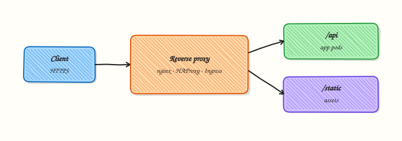

# Reverse Proxy and Ingress Basics

## Overview

A **reverse proxy** accepts client traffic and forwards it to internal backends. It often terminates Transport Layer Security (TLS), routes by **Host** header or URL path, adds forwarding headers, and applies rate limits. Many products are both proxy and load balancer (nginx upstreams, cloud Application Load Balancers, Kubernetes Ingress controllers).

**Ingress** (and newer Gateway Application Programming Interface (API) resources) declare HTTP routing for Kubernetes Services in YAML; a controller turns that into reverse-proxy config. In this tutorial you will run nginx or Caddy on localhost, proxy to a Python backend, and prove routing with `curl -H 'Host: …'`. Evidence lives under `~/rebash-networking/lab17`.

Without a reverse proxy, every service would expose its own certificates and ports. With one, platform teams standardise TLS, logs, and routing. Mistakes with Host headers and `X-Forwarded-*` cause wrong sites, redirect loops, and security bugs when apps trust spoofed headers.

This is **Tutorial 2** in **Module 13: Load Balancing** of the REBASH Academy **Networking for Cloud & DevOps Engineers** series. It is written for Cloud, DevOps, SRE, and platform engineers.

## Prerequisites

- [Load Balancing Fundamentals](load-balancing-fundamentals.md)
- [HTTP, HTTPS, and the Application Layer](http-https-and-application-layer.md)
- Practice Ubuntu VM with `python3` and preferably `nginx` (or `caddy`)

## Learning Objectives

By the end of this tutorial, you will be able to:

- [ ] Explain reverse proxy vs load balancer roles (they often overlap)
- [ ] Configure a local reverse proxy to a localhost backend
- [ ] Prove Host-based routing with `curl -H 'Host: …'`
- [ ] List common forwarding headers and their risks
- [ ] Map the pattern to Kubernetes Ingress at a practical level

## Architecture

Clients reach the proxy; the proxy selects a backend by Host/path and optionally terminates TLS. Ingress controllers implement the same idea inside a cluster.



## Theory

### What it is

| Role | Focus |
|------|-------|
| Reverse proxy | Single entry, routing, TLS, headers, caching |
| Load balancer | Distribute across many identical backends |
| Ingress | Kubernetes API for L7 routing to Services |

```bash
curl -sS -H 'Host: app.lab.local' http://127.0.0.1:18080/
```

### Why it matters

Virtual hosting packs many sites on one IP. Platforms inject `X-Forwarded-For` and `X-Forwarded-Proto` so apps know the original client and scheme. If an app trusts those headers from the open internet, attackers can spoof identity. Kubernetes Ingress moves the same config into git-reviewed YAML.

### How it works

1. Client connects to proxy listener (often 443).  
2. Proxy matches **server_name** / Host / path rules.  
3. Proxy opens (or reuses) a connection to the backend.  
4. Optional TLS terminate at proxy; backend may be HTTP on a private network.  
5. Response returns via the proxy; logs show both sides.

### Key concepts and comparisons

| Feature | Reverse proxy | Pure L4 LB |
|---------|---------------|------------|
| Host/path routing | Yes | No |
| TLS terminate | Common | Optional/passthrough |
| Request buffering / rewrites | Common | Rare |

| Pattern | Prefer when | Avoid when |
|---------|-------------|------------|
| Edge TLS terminate | Central cert management | Strict end-to-end TLS mandatory without re-encrypt |
| Path-based routing | One domain, many apps | Apps need raw TCP |
| Trust `X-Forwarded-For` only from proxy | Hardened networks | Headers accepted from any client |

### Common pitfalls

- Testing with `curl http://127.0.0.1` but forgetting the **Host** header the vhost needs.  
- Backend redirects to `http://` when clients used `https://` (missing forwarded proto).  
- Open proxy that forwards to arbitrary upstreams.  
- Ingress class mismatch — YAML accepted but no controller implements it.

## Hands-on Lab

### Objective

Run a backend on **18081**, reverse-proxy on **18080**, prove Host-header routing, and clean up. Prefer nginx; fall back to Caddy if present; otherwise a tiny Python proxy artefact.

### Prerequisites

- `python3`, `curl`
- Preferred: `nginx` or `caddy`

### Lab environment

Workspace: `~/rebash-networking/lab17`

```bash
mkdir -p ~/rebash-networking/lab17 && cd ~/rebash-networking/lab17
set -euo pipefail
whoami | tee admin-user.txt
command -v nginx >/dev/null && echo nginx=yes | tee tools.txt || echo nginx=no | tee tools.txt
command -v caddy >/dev/null && echo caddy=yes | tee -a tools.txt || echo caddy=no | tee -a tools.txt
```

**Expected output:** `tools.txt` lists available proxies.

### Real-world scenario

You must show a junior engineer why `curl` to an IP fails for a name-based vhost, and how Ingress will use the same Host rule in Kubernetes. You build a localhost demo with proof files for the change ticket.

### Step-by-step tasks

#### Task 1 – Backend that echoes Host

```bash
cd ~/rebash-networking/lab17
set -euo pipefail

cat > backend.py << 'EOF'
#!/usr/bin/env python3
from http.server import BaseHTTPRequestHandler, HTTPServer

class H(BaseHTTPRequestHandler):
    def do_GET(self):
        host = self.headers.get("Host", "")
        xf = self.headers.get("X-Forwarded-For", "")
        body = f"backend-ok host={host} xff={xf}\n".encode()
        self.send_response(200)
        self.send_header("Content-Type", "text/plain")
        self.send_header("Content-Length", str(len(body)))
        self.end_headers()
        self.wfile.write(body)
    def log_message(self, *args):
        pass

HTTPServer.allow_reuse_address = True
HTTPServer(("127.0.0.1", 18081), H).serve_forever()
EOF

python3 backend.py >backend.log 2>&1 &
echo $! > backend.pid
sleep 0.3
curl -sS -H 'Host: app.lab.local' http://127.0.0.1:18081/ | tee direct-backend.txt
grep -q 'backend-ok' direct-backend.txt
```

**Expected output:** `direct-backend.txt` contains `backend-ok` and the Host you sent.

#### Task 2 – Reverse proxy with Host proof

```bash
cd ~/rebash-networking/lab17
set -euo pipefail

start_nginx() {
  cat > nginx-proxy.conf << 'EOF'
worker_processes 1;
error_log /tmp/rebash-lab17-nginx.err;
pid /tmp/rebash-lab17-nginx.pid;
events { worker_connections 64; }
http {
  access_log /tmp/rebash-lab17-nginx.access;
  server {
    listen 127.0.0.1:18080;
    server_name app.lab.local;
    location / {
      proxy_pass http://127.0.0.1:18081;
      proxy_set_header Host $host;
      proxy_set_header X-Forwarded-For $remote_addr;
      proxy_set_header X-Forwarded-Proto $scheme;
    }
  }
  server {
    listen 127.0.0.1:18080 default_server;
    server_name _;
    return 404 "no-vhost\n";
  }
}
EOF
  nginx -t -c "$PWD/nginx-proxy.conf"
  nginx -c "$PWD/nginx-proxy.conf"
  echo mode=nginx | tee mode.txt
}

start_caddy() {
  cat > Caddyfile << 'EOF'
http://app.lab.local:18080 {
  bind 127.0.0.1
  reverse_proxy 127.0.0.1:18081
}
EOF
  caddy run --config "$PWD/Caddyfile" --adapter caddyfile >caddy.log 2>&1 &
  echo $! > caddy.pid
  sleep 0.5
  echo mode=caddy | tee mode.txt
}

start_python_proxy() {
  cat > proxy.py << 'EOF'
#!/usr/bin/env python3
from http.server import BaseHTTPRequestHandler, HTTPServer
import urllib.request

class P(BaseHTTPRequestHandler):
    def do_GET(self):
        host = self.headers.get("Host", "")
        if host.split(":")[0] != "app.lab.local":
            body = b"no-vhost\n"
            self.send_response(404)
            self.end_headers()
            self.wfile.write(body)
            return
        req = urllib.request.Request(
            "http://127.0.0.1:18081" + self.path,
            headers={"Host": host, "X-Forwarded-For": self.client_address[0]},
        )
        with urllib.request.urlopen(req, timeout=3) as resp:
            data = resp.read()
        self.send_response(200)
        self.send_header("Content-Type", "text/plain")
        self.send_header("Content-Length", str(len(data)))
        self.end_headers()
        self.wfile.write(data)
    def log_message(self, *args):
        pass

HTTPServer.allow_reuse_address = True
HTTPServer(("127.0.0.1", 18080), P).serve_forever()
EOF
  python3 proxy.py >proxy.log 2>&1 &
  echo $! > proxy.pid
  echo mode=python-proxy | tee mode.txt
}

if command -v nginx >/dev/null 2>&1; then
  start_nginx
elif command -v caddy >/dev/null 2>&1; then
  start_caddy
else
  start_python_proxy
fi

# Host header proof
curl -sS -H 'Host: app.lab.local' http://127.0.0.1:18080/ | tee via-proxy-ok.txt
grep -q 'backend-ok' via-proxy-ok.txt

curl -sS -H 'Host: other.lab.local' http://127.0.0.1:18080/ | tee via-proxy-miss.txt || true
grep -E 'no-vhost|404' via-proxy-miss.txt || grep -qv 'backend-ok' via-proxy-miss.txt
```

**Expected output:** `via-proxy-ok.txt` shows backend success for `app.lab.local`; wrong Host does not return a normal backend-ok page (404/`no-vhost`).

#### Task 3 – Evidence and Ingress mental model

```bash
cd ~/rebash-networking/lab17
set -euo pipefail

cat > ingress-analogy.txt << 'EOF'
Kubernetes Ingress (simplified):
  host: app.lab.local
  path: /
  backend service: app-svc:80
Controller (nginx/traefik/etc.) renders reverse-proxy config — same Host proof as this lab.
EOF

tar -czf proxy-evidence.tgz \
  admin-user.txt tools.txt mode.txt \
  direct-backend.txt via-proxy-ok.txt via-proxy-miss.txt \
  ingress-analogy.txt backend.py \
  $(ls nginx-proxy.conf Caddyfile proxy.py 2>/dev/null || true)

ls -l proxy-evidence.tgz | tee evidence-ls.txt
test -s proxy-evidence.tgz
```

**Expected output:** `proxy-evidence.tgz` includes Host proof files and the proxy artefact.

### Validation steps

- [ ] Backend alone answers on 18081
- [ ] Proxy answers on 18080 for `Host: app.lab.local`
- [ ] Wrong Host does not silently serve the app as a normal 200 backend-ok (per mode)
- [ ] Cleanup stops proxy and backend

### Common errors and fixes

| Error | Cause | Fix |
|-------|-------|-----|
| Always 404 | Host header missing/wrong | Pass `-H 'Host: app.lab.local'` |
| `nginx` bind error | Port busy | Stop old lab nginx; check `ss -lnt` |
| Caddy needs privileges | Low privileged ports | Lab uses 18080 — keep high ports |
| Backend sees wrong Host | Forgot `proxy_set_header Host` | Set Host/`$host` explicitly |

### Challenge exercise

Add a second path rule (nginx `location /api/` or Python path check) that returns `api-ok` from a second tiny handler or a static `return 200`. Prove with `curl` to `/` vs `/api/` and save `path-proof.txt`.

### Learning outcomes

- Configured a local reverse proxy to a backend
- Proved Host-based virtual hosting with curl
- Connected the demo to Kubernetes Ingress concepts
- Cleaned up listeners safely

### Cleanup

```bash
cd ~/rebash-networking/lab17
set -euo pipefail

if [[ -f /tmp/rebash-lab17-nginx.pid ]]; then
  nginx -s stop -c "$PWD/nginx-proxy.conf" 2>/dev/null || \
    kill "$(cat /tmp/rebash-lab17-nginx.pid)" 2>/dev/null || true
fi
[[ -f caddy.pid ]] && kill "$(cat caddy.pid)" 2>/dev/null || true
[[ -f proxy.pid ]] && kill "$(cat proxy.pid)" 2>/dev/null || true
[[ -f backend.pid ]] && kill "$(cat backend.pid)" 2>/dev/null || true
rm -f caddy.pid proxy.pid backend.pid
```

## Validation

- [ ] Lab finished under `~/rebash-networking/lab17/`
- [ ] You can explain why Host headers matter for vhosts and Ingress
- [ ] You know risks of trusting `X-Forwarded-*` from clients
- [ ] You can sketch Ingress → Service → Pods

## Code Walkthrough

Edge flow: DNS → proxy VIP → optional TLS terminate → match Host/path → proxy to backend with forwarding headers → log at the edge. Kubernetes Ingress YAML is the declarative form of the match/proxy steps; the controller is the nginx/Caddy of the cluster.

## Security Considerations

- Only trust forwarded headers from the proxy network  
- Keep backends off the public internet when proxied  
- Manage TLS certificates with automation and expiry monitoring  
- Rate-limit and authenticate admin UIs at the edge  
- Review catch-all / default_server behaviour carefully  

## Common Mistakes

!!! warning "Curling the IP without a Host header"
    Default server may 404 or serve the wrong site. **Fix:** pass the real Host, or use `--resolve`.

!!! warning "Apps trusting X-Forwarded-For from anyone"
    Clients can spoof IPs. **Fix:** strip/overwrite at the proxy; trust only proxy hops.

!!! warning "Redirect loops after enabling HTTPS at the edge"
    App still thinks it is HTTP. **Fix:** set `X-Forwarded-Proto` and configure framework trusted proxies.

!!! warning "Ingress object exists but no address"
    Wrong ingress class or controller down. **Fix:** check controller pods and Ingress class name.

## Best Practices

- One clear Host/path map owned by the platform team  
- Standard forwarding headers, documented for app developers  
- GitOps for Ingress/Gateway objects  
- Synthetic probes through the same Host clients use  
- Separate internal vs public proxies  

## Troubleshooting

| Symptom | Likely cause | Fix |
|---------|--------------|-----|
| 404 at proxy, 200 at backend | Host/server_name mismatch | Align Host and vhost |
| 502 Bad Gateway | Backend down / wrong port | Check `ss` and upstream |
| HTTPS redirect loop | Proto header / app config | Fix forwarded proto |
| Ingress pending | Controller/class | Fix controller install |

## Summary

Reverse proxies front applications with Host/path routing and TLS. Prove behaviour with curl Host headers, then recognise the same pattern in Kubernetes Ingress. Next: [Kubernetes Networking Fundamentals](kubernetes-networking-fundamentals.md).

## Interview Questions

**1. How does a reverse proxy differ from a forward proxy?**

??? success "Reveal answer"
    A **reverse proxy** protects and routes to **servers** you operate (clients know the proxy name). A **forward proxy** sits in front of **clients** (enterprise egress). Interviewers want this direction clear before nginx details.

**2. Why do we set `proxy_set_header Host $host`?**

??? success "Reveal answer"
    So the backend sees the **original client Host** (virtual host / generate correct URLs), not the upstream socket name (`127.0.0.1:18081`). Wrong Host breaks multi-tenant apps and absolute redirects.

**3. What is Kubernetes Ingress in one sentence, related to this lab?**

??? success "Reveal answer"
    Ingress is a **declarative HTTP routing object**; a controller turns it into reverse-proxy configuration (Host/path → Service), the same idea as our nginx `server_name` demo.

**4. Why can trusting `X-Forwarded-For` be dangerous?**

??? success "Reveal answer"
    If the app accepts the header from the open internet, clients can **spoof** client IPs for logging, allow-lists, or rate limits. Only trust headers appended by your proxy and strip inbound values at the edge.

**5. Client uses HTTPS but the app generates `http://` links. What is wrong?**

??? success "Reveal answer"
    TLS terminated at the proxy; the app saw HTTP. Pass **`X-Forwarded-Proto: https`** (and configure the framework’s trusted proxy settings) so generated URLs and secure cookies work.

**6. How do you prove Host-based routing in an interview whiteboard?**

??? success "Reveal answer"
    Show two `curl` commands to the same IP with different `Host` headers and different responses (as in this lab). That is stronger than drawing boxes alone.

**7. When would you pick Gateway API over classic Ingress?**

??? success "Reveal answer"
    When you need richer, more portable L7 expressions, cleaner separation of platform vs app roles, or vendor features moving to Gateway API. Classic Ingress remains common; know both at a practical level.

## Related Tutorials

- [Networking for Cloud & DevOps – Overview](index.md)
- [Load Balancing Fundamentals](load-balancing-fundamentals.md) *(previous)*
- [Kubernetes Networking Fundamentals](kubernetes-networking-fundamentals.md) *(next)*
- [HTTP, HTTPS, and the Application Layer](http-https-and-application-layer.md)

## References

- [nginx `ngx_http_proxy_module`](https://nginx.org/en/docs/http/ngx_http_proxy_module.html) — reverse proxy  
- [Kubernetes Ingress](https://kubernetes.io/docs/concepts/services-networking/ingress/) — official docs  
- [Caddy reverse_proxy](https://caddyserver.com/docs/caddyfile/directives/reverse_proxy) — alternative proxy  
- Track index: [Networking for Cloud & DevOps Engineers](index.md)
