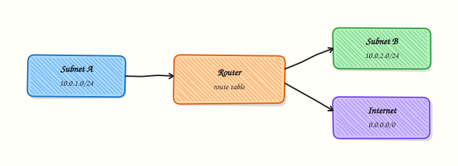

# Routing Fundamentals

## Overview

**Routing** is how a host or router chooses the **next hop** for a packet when the destination is not on the local subnet. On Linux, the kernel consults a **routing table**. You read it with `ip route show`. A typical workstation has a **default route** (`default via …`) toward a gateway that knows how to reach the rest of the Internet Protocol (IP) world.

Cloud Virtual Private Clouds (VPCs) use the same idea with route tables attached to subnets: local VPC traffic stays local; `0.0.0.0/0` often points to an Internet gateway or Network Address Translation (NAT) gateway. If the route is wrong, you see timeouts even when security groups allow the port. If two routes match, the **longest prefix** (most specific) wins; metrics break remaining ties depending on the platform.

In this tutorial you practise safe operations: inspect routes, optionally create a **network namespace** lab playground to add and delete a temporary unreachable route without disturbing the host’s main table, and capture a `traceroute` (or `tracepath`) toward `1.1.1.1` when the network allows it. Cleanup must remove any temporary routes you add.

This is **Tutorial 6** in **Module 6: Routing** of the REBASH Academy **Networking for Cloud & DevOps Engineers** series. It is written for Cloud, DevOps, Site Reliability Engineering (SRE), and platform engineers. By the end, you will explain route selection, prove it with Linux tools, and leave the system clean.

## Prerequisites

- [Subnetting and VLSM](subnetting-and-vlsm.md)
- A **practice Ubuntu 22.04/24.04 VM** where you have `sudo`
- Tools: `iproute2` (`ip`), `iputils-ping`; `traceroute` or `tracepath` (`sudo apt-get install -y traceroute` optional)

## Learning Objectives

By the end of this tutorial, you will be able to:

- [ ] Explain what a route is and what a default gateway does
- [ ] Read `ip route show` and identify connected, via-gateway, and default routes
- [ ] Describe longest-prefix matching in plain language
- [ ] Add and delete a temporary route inside a network namespace (safe sandbox) or document the table carefully
- [ ] Capture path evidence with `traceroute`/`tracepath` to `1.1.1.1` when permitted, and always clean up

## Architecture

Hosts send packets to a gateway when the destination is remote. Routers forward hop by hop using their own tables until the destination network is reached.



## Theory

### What it is

A **route** maps a destination prefix to an interface and often a **next-hop** (gateway) address. Types you will see on Linux:

| Route kind | Example | Meaning |
|------------|---------|---------|
| Connected / link | `192.168.1.0/24 dev eth0` | Destination is on that interface’s network |
| Via gateway | `10.0.0.0/8 via 192.168.1.1` | Send to next hop |
| Default | `default via 192.168.1.1` | Same as `0.0.0.0/0` — when nothing else matches |

**Static routing** means humans (or automation) install routes. **Dynamic routing** (Open Shortest Path First — OSPF, Border Gateway Protocol — BGP) learns routes from peers — covered more deeply in advanced ops; the mental model remains “prefix → next hop”.

### Why it matters

Most “cannot reach the database” tickets that are not DNS or firewall end up as routing: missing route to a peered VPC, wrong NAT, blackhole route, or asymmetric return path. Kubernetes nodes, Docker bridges, and service meshes all add routes. If you cannot read `ip route`, you cannot debug them. Cloud interviews expect you to explain default routes and longest-prefix match.

### How it works

1. **Lookup** — kernel finds the best matching route for the destination IP.
2. **Longest prefix** — `/32` beats `/24` beats `/16` beats `/0`.
3. **Forward** — packet goes out the chosen device toward the next hop or local delivery.
4. **Observe** — `ip route get 1.1.1.1` shows what the kernel would do for one destination.

``` {.bash .ra-terminal title="Terminal"}
ip route show
ip route get 1.1.1.1
```

### Key concepts and comparisons

| Question | Tool |
|----------|------|
| What does the host know? | `ip route show` / `ip -4 route` |
| What would it do for X? | `ip route get X` |
| Where do packets go hop-by-hop? | `traceroute` / `tracepath` / `mtr` |
| Isolated experiments | Network namespaces (`ip netns`) |

| Preference | Prefer when | Avoid when |
|------------|-------------|------------|
| Inspect only | Production jump hosts | You need to prove add/del safely — use `netns` |
| Temporary route in `netns` | Learning labs | You forget cleanup on the main table |
| Changing main table default | Controlled windows only | Shared VMs without approval |

### Common pitfalls

- Adding a bad default route on the main table and losing SSH — use namespaces for experiments.
- Forgetting cleanup so a blackhole route remains.
- Reading `traceroute` stars (`* * *`) as total failure — ICMP may be filtered.
- Confusing “no route” with “firewall drop” — different signals (`Network is unreachable` vs timeout).
- Using obsolete `route`/`ifconfig` when `ip` is available.

## Hands-on Lab

### Objective

Document the main routing table, practise a temporary route **add/del inside a network namespace** (preferred safe method), capture optional `traceroute` to `1.1.1.1`, and remove all temporary state. Workspace: `~/rebash-networking/lab06`.

### Prerequisites

- Ubuntu 22.04/24.04 with sudo
- `iproute2` installed
- Optional: `sudo apt-get install -y traceroute`

### Lab environment

Workspace: `~/rebash-networking/lab06`

``` {.bash .ra-terminal title="Terminal"}
mkdir -p ~/rebash-networking/lab06 && cd ~/rebash-networking/lab06
set -euo pipefail
hostname | tee hostname.txt
whoami | tee admin-user.txt
sudo -n true 2>/dev/null || sudo -v
command -v ip | tee tools-present.txt
```

!!! example "Expected output"
    sudo works; `ip` is available.


### Real-world scenario

Before approving a VPC peering change, you document how a lab VM currently routes Internet and private traffic. You also rehearse adding a deliberate blackhole-style route in a disposable network namespace so you understand failure symptoms — without breaking your SSH session on the main table.

### Step-by-step tasks

#### Task 1 – Document the main routing table and route lookup

``` {.bash .ra-terminal title="Terminal"}
cd ~/rebash-networking/lab06
set -euo pipefail

ip route show | tee ip-route.txt
ip -6 route show 2>/dev/null | tee ip6-route.txt || true
ip route show default | tee ip-route-default.txt || true

ip route get 1.1.1.1 2>&1 | tee ip-route-get-1.1.1.1.txt || true
ip route get 127.0.0.1 2>&1 | tee ip-route-get-localhost.txt

# Human-readable summary for the ticket
{
  echo "default_line: $(ip route show default 2>/dev/null | head -n1 || echo none)"
  echo "route_get_1.1.1.1: $(tr '\n' ' ' < ip-route-get-1.1.1.1.txt)"
} | tee route-summary.txt
```

!!! example "Expected output"
    `ip-route.txt` lists routes; `ip-route-get-localhost.txt` succeeds; Internet lookup may work or explain missing default.


#### Task 2 – Temporary unreachable route inside a network namespace

This sandbox avoids breaking the host default route. Cleanup deletes the namespace (and its routes).

``` {.bash .ra-terminal title="Terminal"}
cd ~/rebash-networking/lab06
set -euo pipefail

NS="rebash-lab06"
# Clean leftover namespace from a previous interrupted run
sudo ip netns del "$NS" 2>/dev/null || true
sudo ip netns add "$NS"

# Loopback inside netns so the namespace has a basic stack
sudo ip -n "$NS" link set lo up
sudo ip -n "$NS" route show | tee netns-routes-before.txt

# Add a blackhole-style unreachable route for a documentation TEST-NET prefix
sudo ip -n "$NS" route add unreachable 203.0.113.0/24
sudo ip -n "$NS" route show | tee netns-routes-after-add.txt
grep -F '203.0.113.0/24' netns-routes-after-add.txt

# Show the failure mode inside the namespace (must fail)
if sudo ip netns exec "$NS" ping -c 1 -W 1 203.0.113.10 2>netns-ping-unreachable.txt; then
  echo "ERROR: ping unexpectedly succeeded" >&2
  exit 1
fi
cat netns-ping-unreachable.txt
grep -Ei 'unreachable|Network is unreachable|100% packet loss|Permission|denied|error' \
  netns-ping-unreachable.txt || test -s netns-ping-unreachable.txt

# Delete the temporary route, then show table again
sudo ip -n "$NS" route del unreachable 203.0.113.0/24
sudo ip -n "$NS" route show | tee netns-routes-after-del.txt
if grep -F '203.0.113.0/24' netns-routes-after-del.txt; then
  echo "ERROR: route still present after delete" >&2
  exit 1
fi
echo "route_removed_ok" | tee netns-route-removed.txt
```

!!! example "Expected output"
    Route appears after add, ping fails as unreachable (or equivalent error text), route is gone after delete, `netns-route-removed.txt` contains `route_removed_ok`.


#### Task 3 – Traceroute evidence (safe) and pack; keep cleanup ready

``` {.bash .ra-terminal title="Terminal"}
cd ~/rebash-networking/lab06
set -euo pipefail

if command -v traceroute >/dev/null 2>&1; then
  traceroute -n -w 2 -q 1 -m 10 1.1.1.1 2>&1 | tee traceroute-1.1.1.1.txt || true
elif command -v tracepath >/dev/null 2>&1; then
  tracepath -n 1.1.1.1 2>&1 | tee traceroute-1.1.1.1.txt || true
else
  echo "traceroute/tracepath not installed" | tee traceroute-1.1.1.1.txt
  # Minimal safe substitute: repeated route get
  ip route get 1.1.1.1 2>&1 | tee -a traceroute-1.1.1.1.txt || true
fi

tar -czf routing-evidence.tgz \
  hostname.txt admin-user.txt tools-present.txt \
  ip-route.txt ip6-route.txt ip-route-default.txt \
  ip-route-get-1.1.1.1.txt ip-route-get-localhost.txt route-summary.txt \
  netns-routes-before.txt netns-routes-after-add.txt \
  netns-ping-unreachable.txt netns-routes-after-del.txt netns-route-removed.txt \
  traceroute-1.1.1.1.txt
ls -l routing-evidence.tgz | tee evidence-ls.txt
test -s routing-evidence.tgz
```

!!! example "Expected output"
    `routing-evidence.tgz` is non-empty; traceroute file exists (full path, partial stars, or honest “not installed”).


### Validation steps

- [ ] Main table captured with `ip route show`
- [ ] `ip route get` evidence saved for localhost and `1.1.1.1`
- [ ] Namespace route was added, shown failing, then deleted
- [ ] Evidence tarball exists under `~/rebash-networking/lab06`
- [ ] Cleanup (next section) removes the namespace so nothing temporary remains

### Common errors and fixes

| Error | Cause | Fix |
|-------|-------|-----|
| `Cannot open network namespace` | Missing privileges | Use `sudo`; ensure `iproute2` installed |
| Lost SSH after bad route | Edited **main** table default | Prefer `ip netns`; recover via console |
| `traceroute: not found` | Package missing | Use `tracepath` or `ip route get`; optional install |
| Ping succeeds to `203.0.113.10` | Route not applied / wrong netns | Re-check `ip -n … route show` |
| Leftover `rebash-lab06` netns | Skipped cleanup | Run Cleanup commands |

### Challenge exercise

Create executable script `~/rebash-networking/lab06/netns-route-lab.sh` that: creates netns `rebash-lab06-ch`, adds `unreachable 198.51.100.0/24`, saves `ip route` before/after to files under a `challenge-out/` directory, deletes the route, deletes the netns, and writes `challenge-out/DONE` containing `OK` only if the route is absent and the netns is gone. Run it once. Working script artefact — not a notes runbook.

### Learning outcomes

- Read and summarised Linux routing tables
- Used `ip route get` to explain forwarding decisions
- Practised safe temporary blackhole routes in a network namespace
- Captured path evidence and removed temporary state

### Cleanup

``` {.bash .ra-terminal title="Terminal"}
cd ~/rebash-networking/lab06
set -euo pipefail

# Remove lab namespaces (main tasks + challenge name if present)
sudo ip netns del rebash-lab06 2>/dev/null || true
sudo ip netns del rebash-lab06-ch 2>/dev/null || true

# Ensure no leftover TEST-NET unreachable routes on the **main** table
# (should not exist if you followed the lab; remove only if you added by mistake)
if ip route show | grep -E '203\.0\.113\.0/24|198\.51\.100\.0/24'; then
  sudo ip route del unreachable 203.0.113.0/24 2>/dev/null || true
  sudo ip route del unreachable 198.51.100.0/24 2>/dev/null || true
fi

ip netns list | tee netns-list-after-cleanup.txt || true
ip route show | tee ip-route-after-cleanup.txt
echo "cleanup_complete" | tee cleanup-complete.txt
```

!!! example "Expected output"
    Lab netns names are gone; main table has no leftover lab unreachable routes; `cleanup-complete.txt` exists.


## Validation

- [ ] Lab finished under `~/rebash-networking/lab06/` with evidence archive
- [ ] Temporary namespace routes were removed
- [ ] You can explain default route and longest-prefix match
- [ ] You know when traceroute stars are inconclusive

## Code Walkthrough

Routing operations on Linux usually follow:

1. **Inspect** — `ip route show`, `ip route get DEST`  
2. **Experiment safely** — network namespaces or change windows  
3. **Change** — `ip route add` / `del` with documented prefixes  
4. **Prove** — ping/traceroute/`ip route get`  
5. **Clean up** — delete temporary routes and namespaces  

Cloud consoles edit the same ideas as route table entries; Linux `ip route` is the node-level view.

## Security Considerations

- Rogue default routes can redirect traffic (man-in-the-middle risk) — protect who may change routes  
- Blackhole routes can be used for abuse control — document them  
- Do not experiment on production defaults over SSH without out-of-band console  
- Treat routing tables as sensitive (internal topology)  
- Prefer Infrastructure as Code for persistent cloud routes, not manual hotfixes alone  

## Common Mistakes

!!! warning "Adding lab routes to the main table over SSH"
    A wrong default can disconnect you. **Fix:** use `ip netns` sandboxes or have serial/console access.

!!! warning "Leaving blackhole routes behind"
    Later traffic fails mysteriously. **Fix:** always run Cleanup; automate `DONE` checks in challenge scripts.

!!! warning "Treating traceroute `* * *` as proof the Internet is down"
    ICMP TTL exceeded may be filtered. **Fix:** combine with `ip route get`, TCP checks, and cloud flow logs.

!!! warning "Ignoring longest-prefix match"
    A leftover `/32` can override a summary. **Fix:** read the full table; delete stale specifics.

## Best Practices

- Document default gateway and critical prefixes in baseline packs  
- Use namespaces or disposable VMs for destructive routing labs  
- Prefer specific routes over broad surprises when designing VPCs  
- Pair route changes with rollback commands in the change ticket  
- Standardise on `ip` for all modern Linux runbooks  

## Troubleshooting

| Symptom | Likely cause | Fix |
|---------|--------------|-----|
| `Network is unreachable` | No matching route | Add correct route / fix VPC route table |
| Connection timeout | Firewall or blackhole | Distinguish with `ip route get` + security group checks |
| Asymmetric failure | Return path missing | Check peer route tables both ways |
| Wrong interface used | More specific route | Inspect `ip route get`; remove bad specifics |
| netns commands fail | Typo / missing sudo | Confirm `ip netns list` |

## Summary

Routing decides the next hop for each destination using prefix matching. Read Linux tables with `ip route`, practise temporary failures safely in a network namespace, gather traceroute evidence when you can, and always remove temporary routes. Next, move from routed IP networks to local Layer 2 design in [Ethernet, Switching, and VLANs](ethernet-switching-and-vlans.md).

## Interview Questions

**1. What is a default route, and how does it appear in `ip route` on Linux?**

??? success "Reveal answer"
    A **default route** is used when no more specific prefix matches. On Linux it usually appears as `default via <gateway> dev <iface>` (equivalent to `0.0.0.0/0`). Without it, a host can often reach its local subnet but not the wider Internet or other remote networks.

**2. What is longest-prefix matching?**

??? success "Reveal answer"
    When several routes match a destination, the kernel (or router) chooses the **most specific** prefix — the longest mask. For example, a `/32` host route beats a `/24`, which beats a `/16`, which beats the default `/0`. Stale specific routes are a common outage cause.

**3. How do you ask Linux which route it would use for `1.1.1.1` without sending a full traceroute?**

??? success "Reveal answer"
    Run **`ip route get 1.1.1.1`**. It shows the selected path (device, source, via/gateway) according to the current table. It is faster and clearer than guessing from a long `ip route` dump.

**4. Why did this lab use a network namespace to add an `unreachable` route?**

??? success "Reveal answer"
    Adding bad routes on the **main** table can break SSH and production traffic. A **network namespace** gives an isolated routing table for experiments. You still learn the symptoms of unreachable destinations, then delete the namespace safely.

**5. How does VPC routing relate to what you see on an EC2/Ubuntu instance?**

??? success "Reveal answer"
    The cloud **subnet route table** decides where the virtual network sends traffic (local, NAT, peering, Internet gateway). On the instance, `ip route` shows the guest OS view (default via the VPC gateway IP, local subnet routes, and any OS-added routes). Both layers must be correct.

**6. What is the difference between “Network is unreachable” and a hanging TCP timeout?**

??? success "Reveal answer"
    **Unreachable** usually means no route (or an explicit unreachable/blackhole route) — the OS fails fast. A **timeout** often means packets are forwarded somewhere but filtered or dropped without ICMP feedback (firewall/security group/asymmetric path). Choose fixes based on that distinction.

**7. When is traceroute evidence weak, and what else should you collect?**

??? success "Reveal answer"
    Many networks filter ICMP used by traceroute, producing `* * *` even when TCP works. Also collect `ip route get`, successful/failed `curl` to a TCP port, and cloud routing/flow logs. Traceroute is helpful but not definitive alone.

**8. How would you prove cleanup after a routing lab for a change ticket?**

??? success "Reveal answer"
    Show `ip netns list` without the lab namespace, `ip route show` without the temporary prefixes, and keep before/after files in an evidence tarball. Interviewers and auditors care that temporary blackholes do not remain on shared hosts.

## Related Tutorials

- [Subnetting and VLSM](subnetting-and-vlsm.md) *(previous)*
- [Ethernet, Switching, and VLANs](ethernet-switching-and-vlans.md) *(next)*
- [Linux Networking Toolkit](linux-networking-toolkit.md)
- [Cloud Networking — VPCs and Subnets](cloud-networking-vpc-and-subnets.md)

## References

- [`ip-route(8)`](https://manpages.ubuntu.com/manpages/jammy/en/man8/ip-route.8.html) — Ubuntu man-page  
- [`ip-netns(8)`](https://manpages.ubuntu.com/manpages/jammy/en/man8/ip-netns.8.html) — network namespaces  
- [RFC 1812](https://www.rfc-editor.org/rfc/rfc1812) — Requirements for IP Version 4 Routers (classic reference)  
- [RFC 5737](https://www.rfc-editor.org/rfc/rfc5737) — IPv4 Address Blocks Reserved for Documentation (TEST-NET)  
- Track index: [Networking for Cloud & DevOps Engineers](index.md)
