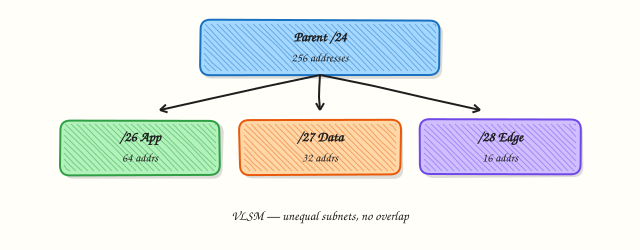

# Subnetting and VLSM

## Overview

**Subnetting** means splitting a larger Internet Protocol version 4 (IPv4) network into smaller networks. You borrow host bits to create more network prefixes. For example, a `/24` network has 256 addresses; splitting it into four `/26` networks gives four subnets with 64 addresses each. **Variable Length Subnet Mask (VLSM)** means those subnets do not all need the same size — you can give a point-to-point link a `/30` and a user LAN a `/24` from the same summary block.

Cloud engineers use subnetting constantly: Virtual Private Cloud (VPC) design, Kubernetes pod CIDRs, VPN pools, and firewall rules. Wrong maths causes overlapping ranges, failed peering, and “IP exhausted” incidents. Good maths leaves room to grow and keeps routes tidy.

On a practice Ubuntu VM you can calculate with `ipcalc` (when installed) or a small Python script using the standard `ipaddress` module. You can also read the prefix length already on your interfaces with `ip addr`. This lab stays **safe**: no destructive changes to production routers or cloud route tables — calculation and verification only.

This is **Tutorial 5** in **Module 5: Subnetting** of the REBASH Academy **Networking for Cloud & DevOps Engineers** series. It is written for Cloud, DevOps, Site Reliability Engineering (SRE), and platform engineers. By the end, you will split a `/24` into `/26` networks, show the maths, and save a working calculator artefact.

## Prerequisites

- [IP Addressing](ip-addressing.md)
- A **practice Ubuntu 22.04/24.04 VM** with `python3`
- Optional package: `ipcalc` (`sudo apt-get install -y ipcalc`)

## Learning Objectives

By the end of this tutorial, you will be able to:

- [ ] Explain why organisations subnet IPv4 space
- [ ] Calculate network address, broadcast, and usable hosts for a prefix
- [ ] Split a `/24` into `/26` subnets (fixed-length example)
- [ ] Describe VLSM and when unequal subnet sizes help
- [ ] Verify calculations with `ipcalc` and/or Python, and compare with `ip addr` prefixes

## Architecture

Subnetting carves a summary CIDR into longer prefixes. Routers (and cloud route tables) then forward toward the most specific matching prefix.



## Theory

### What it is

A **subnet** is a contiguous block of addresses identified by a network prefix. Moving from `/24` to `/26` increases the prefix length by 2 bits, creating \(2^2 = 4\) subnets. **VLSM** allows mixing prefix lengths inside one organisation block — for example `/26`, `/27`, and `/30` — as long as ranges do not overlap.

| Prefix | Addresses (total) | Typical usable hosts (classical IPv4) |
|--------|-------------------|----------------------------------------|
| `/24` | 256 | 254 |
| `/25` | 128 | 126 |
| `/26` | 64 | 62 |
| `/30` | 4 | 2 (common on point-to-point) |
| `/32` | 1 | single host |

Cloud platforms sometimes treat the “usable” count differently (they may reserve more addresses per subnet). Always check the cloud provider’s reservations when planning VPC subnets.

### Why it matters

Without subnetting, one flat network becomes hard to secure and impossible to scale cleanly. With careless subnetting, two teams reuse `10.0.0.0/16` and cannot peer. VLSM saves space: tiny links should not waste a whole `/24`. Interviews and design reviews expect you to compute a split and spot overlaps quickly.

### How it works

1. **Start** from an allocated CIDR (for example `192.168.10.0/24`).
2. **Choose** a longer prefix for each subnet (`/26`).
3. **Compute** network, first/last usable, broadcast for each piece.
4. **Assign** subnets to tiers (app, data, management) without overlap.
5. **Verify** with a calculator tool; document the plan before applying in cloud consoles.

```bash
# Example with ipcalc if installed
ipcalc 192.168.10.0/24
ipcalc 192.168.10.0/26
```

### Key concepts and comparisons

| Approach | Prefer when | Avoid when |
|----------|-------------|------------|
| Fixed-length subnets | Simple ops, equal tiers | You waste large empty subnets |
| VLSM | Mixed link and LAN sizes | Your tooling cannot show the plan clearly |
| One huge flat `/16` | Tiny lab only | Any production multi-tier design |

| `/24` → `/26` block | Network | Broadcast (classical) |
|---------------------|---------|------------------------|
| 0 | `x.x.x.0/26` | `x.x.x.63` |
| 1 | `x.x.x.64/26` | `x.x.x.127` |
| 2 | `x.x.x.128/26` | `x.x.x.191` |
| 3 | `x.x.x.192/26` | `x.x.x.255` |

### Common pitfalls

- Off-by-one errors on broadcast and usable ranges.
- Overlapping VLSM allocations (“this `/27` sits inside that `/26`” by accident).
- Forgetting cloud reserved addresses when sizing Kubernetes node subnets.
- Changing live router interfaces to “test” maths — use calculators first.
- Assuming IPv6 subnetting rules are identical — different practice (not this lab’s focus).

## Hands-on Lab

### Objective

Calculate a `/24` → `/26` split with `ipcalc` and/or Python, verify interface prefixes with `ip addr` where possible, and store results under `~/rebash-networking/lab05` **without** destructive router changes.

### Prerequisites

- Ubuntu 22.04/24.04, `python3`
- Optional: `sudo apt-get update && sudo apt-get install -y ipcalc`

### Lab environment

Workspace: `~/rebash-networking/lab05`

```bash
mkdir -p ~/rebash-networking/lab05 && cd ~/rebash-networking/lab05
set -euo pipefail
hostname | tee hostname.txt
python3 --version | tee python-version.txt
command -v ipcalc >/dev/null 2>&1 && ipcalc --version 2>&1 | tee ipcalc-version.txt || echo "ipcalc not installed" | tee ipcalc-version.txt
```

**Expected output:** Python version recorded; `ipcalc-version.txt` either shows a version or “not installed”.

### Real-world scenario

Your team receives `192.168.10.0/24` for a small non-production VPC style lab plan. You must propose four equal `/26` subnets (web, app, data, management), prove the maths with a script, and attach the plan to the design review — without touching production routers.

### Step-by-step tasks

#### Task 1 – Calculate with `ipcalc` when available

```bash
cd ~/rebash-networking/lab05
set -euo pipefail

BASE="192.168.10.0/24"
echo "$BASE" | tee base-cidr.txt

if command -v ipcalc >/dev/null 2>&1; then
  ipcalc "$BASE" | tee ipcalc-base.txt
  for net in 192.168.10.0/26 192.168.10.64/26 192.168.10.128/26 192.168.10.192/26; do
    echo "===== $net ====="
    ipcalc "$net"
  done | tee ipcalc-subnets.txt
else
  echo "ipcalc missing — Task 2 Python calculator is authoritative" | tee ipcalc-base.txt
  cp ipcalc-base.txt ipcalc-subnets.txt
fi
```

**Expected output:** Either full `ipcalc` tables for base and four `/26` networks, or a clear note that Python will carry the lab.

#### Task 2 – Python `/24` → `/26` calculator (required artefact)

```bash
cd ~/rebash-networking/lab05
set -euo pipefail

cat > subnet_split.py << 'PY'
#!/usr/bin/env python3
"""Split a base IPv4 network into equal longer prefixes (REBASH lab05)."""
from __future__ import annotations

import ipaddress
import json
import sys
from pathlib import Path


def split(base: str, new_prefix: int) -> list[dict[str, str]]:
    net = ipaddress.ip_network(base, strict=True)
    if new_prefix < net.prefixlen:
        raise SystemExit("new_prefix must be longer (more specific) than base")
    rows: list[dict[str, str]] = []
    for sub in net.subnets(new_prefix=new_prefix):
        # classical usable range (may differ in cloud)
        hosts = list(sub.hosts())
        rows.append(
            {
                "cidr": str(sub),
                "network": str(sub.network_address),
                "broadcast": str(sub.broadcast_address),
                "first_usable": str(hosts[0]) if hosts else "",
                "last_usable": str(hosts[-1]) if hosts else "",
                "total_addresses": str(sub.num_addresses),
            }
        )
    return rows


def main() -> None:
    base = Path("base-cidr.txt").read_text(encoding="utf-8").strip() or "192.168.10.0/24"
    new_prefix = 26
    rows = split(base, new_prefix)
    lines = [
        f"{r['cidr']}\tnet={r['network']}\tbcast={r['broadcast']}\t"
        f"usable={r['first_usable']}-{r['last_usable']}\ttotal={r['total_addresses']}"
        for r in rows
    ]
    text = "\n".join(lines) + "\n"
    Path("subnet-split.txt").write_text(text, encoding="utf-8")
    Path("subnet-split.json").write_text(json.dumps(rows, indent=2) + "\n", encoding="utf-8")
    print(text)
    if len(rows) != 4:
        raise SystemExit(f"expected 4 subnets for /24→/26, got {len(rows)}")


if __name__ == "__main__":
    main()
PY

chmod +x subnet_split.py
python3 subnet_split.py | tee subnet-split-run.txt
test "$(wc -l < subnet-split.txt | tr -d ' ')" -eq 4
grep -F '192.168.10.0/26' subnet-split.txt
grep -F '192.168.10.192/26' subnet-split.txt
```

**Expected output:** Exactly four lines in `subnet-split.txt`, including `.0/26` and `.192/26`; JSON twin file written.

#### Task 3 – Compare with live `ip addr` prefixes (read-only) and pack evidence

```bash
cd ~/rebash-networking/lab05
set -euo pipefail

ip -4 -o addr show | tee live-ip4-oneline.txt
{
  echo "interface cidr prefix_len notes"
  while read -r num iface fam cidr rest; do
    [ "$fam" = "inet" ] || continue
    pfx="${cidr#*/}"
    note="observed-on-host"
    echo "$iface $cidr $pfx $note"
  done < <(ip -4 -o addr show)
} | tee live-prefix-compare.txt

# Read-only note: we do NOT add addresses or change routers in this lab
cat > safety-note.txt << 'EOF'
REBASH lab05 safety: calculations only.
No ip addr add, no route changes, no cloud VPC edits.
Compare planned /26 table in subnet-split.txt with any live prefixes above.
EOF

tar -czf subnetting-evidence.tgz \
  hostname.txt python-version.txt ipcalc-version.txt base-cidr.txt \
  ipcalc-base.txt ipcalc-subnets.txt \
  subnet_split.py subnet-split.txt subnet-split.json subnet-split-run.txt \
  live-ip4-oneline.txt live-prefix-compare.txt safety-note.txt
ls -l subnetting-evidence.tgz | tee evidence-ls.txt
test -s subnetting-evidence.tgz
```

**Expected output:** `live-prefix-compare.txt` lists real host prefixes; `subnetting-evidence.tgz` is non-empty; no new addresses were configured.

### Validation steps

- [ ] `subnet_split.py` produced four `/26` rows for `192.168.10.0/24`
- [ ] `subnet-split.json` exists
- [ ] Live interface prefixes captured with `ip` (read-only)
- [ ] Evidence tarball exists under `~/rebash-networking/lab05`
- [ ] No persistent routing or addressing changes were made

### Common errors and fixes

| Error | Cause | Fix |
|-------|-------|-----|
| `ValueError: … has host bits set` | Non-network address as base | Use `192.168.10.0/24`, not `192.168.10.1/24`, with `strict=True` |
| `ipcalc: not found` | Package missing | Rely on Python; optional `apt-get install ipcalc` |
| Wrong subnet count | Wrong new prefix | `/24`→`/26` must yield 4 networks |
| Temptation to `ip addr add` | Trying to “make it real” | Keep lab read-only; use cloud sandbox later |

### Challenge exercise

Write `vlsm_plan.py` that takes a base `10.0.0.0/24` and allocates **unequal** subnets in this order without overlap: `/26` (lan), `/27` (app), `/28` (mgmt), and a `/30` (link), printing each allocation and the remaining free space summary to `vlsm-plan.txt`. Exit non-zero if any allocation does not fit. Run it once. Working calculator artefact — not a markdown notes file.

### Learning outcomes

- Split a `/24` into `/26` subnets with correct boundaries
- Used Python `ipaddress` as a reliable calculator
- Cross-checked live interface prefixes without changing them
- Understood why VLSM exists for mixed subnet sizes

### Cleanup

```bash
cd ~/rebash-networking/lab05
set -euo pipefail
# Nothing to revert on the network stack if you followed the lab
ls -la
# Optional: rm -f *.txt *.json *.tgz
```

## Validation

- [ ] Lab finished under `~/rebash-networking/lab05/`
- [ ] You can compute a `/24`→`/26` split on paper or with a script
- [ ] You can explain VLSM in one short example
- [ ] You know cloud subnets may reserve extra addresses

## Code Walkthrough

Subnet planning workflow:

1. **Receive** a summary CIDR from IP Address Management (IPAM) or cloud design  
2. **Split** with fixed length or VLSM using a calculator (`ipaddress`, `ipcalc`)  
3. **Check** overlaps and growth headroom  
4. **Document** before applying in VPC/router config  
5. **Verify** live prefixes with `ip addr` / cloud console after change windows  

Never invent overlapping ranges to “make the diagram pretty.”

## Security Considerations

- Overlapping subnets break isolation assumptions between environments  
- Document who owns each subnet to avoid shadow IT reuse  
- Smaller subnets can support tighter firewall zones — use that deliberately  
- Do not test subnet changes on production routers during learning  
- Treat IPAM exports as sensitive infrastructure data  

## Common Mistakes

!!! warning "Using host addresses as network bases in strict calculators"
    `ipaddress` with `strict=True` rejects host bits. **Fix:** zero the host portion (`…0/24`).

!!! warning "Ignoring provider reserved IPs"
    AWS/Azure/GCP reserve addresses per subnet. **Fix:** read provider docs when sizing.

!!! warning "VLSM without a written plan"
    Overlaps appear months later during peering. **Fix:** keep `vlsm-plan.txt` style artefacts.

!!! warning "Shrinking production subnets in place"
    Renumbering is painful. **Fix:** plan growth first; migrate with new CIDRs when needed.

## Best Practices

- Keep a single source of truth for CIDR allocations  
- Prefer scripted checks in pull requests for IaC subnet modules  
- Leave spare capacity in each tier  
- Align subnet boundaries with security zones  
- Practise maths with labs before touching live VPCs  

## Troubleshooting

| Symptom | Likely cause | Fix |
|---------|--------------|-----|
| Peering fails | Overlapping CIDRs | Renumber or use NAT/special patterns |
| “Insufficient free IPs” | Subnet too small / reservations | Expand or add subnets; recount usable |
| Host cannot reach gateway | Wrong mask on NIC | Match designed prefix; check DHCP |
| Calculator disagrees with spreadsheet | Off-by-one | Trust `ipaddress`/`ipcalc`; fix the sheet |
| Route missing for one `/26` | Aggregation mistake | Advertise or attach the specific prefix |

## Summary

Subnetting and VLSM turn a summary IPv4 block into right-sized networks. Calculate carefully, verify with tools, and avoid risky live changes while learning. Next, see how packets choose paths in [Routing Fundamentals](routing-fundamentals.md).

## Interview Questions

**1. What is subnetting, and why do we use CIDR instead of old classful A/B/C thinking alone?**

??? success "Reveal answer"
    **Subnetting** splits a larger network into smaller prefixes by using a longer prefix length. **CIDR** allows any prefix length, not only classful `/8`, `/16`, `/24`. That flexibility matches modern Internet and VPC design. Classful language still appears in old texts, but production planning is CIDR-based.

**2. How many `/26` subnets fit inside one `/24`, and how many total addresses does each `/26` have?**

??? success "Reveal answer"
    **Four** `/26` subnets fit in one `/24` (\(2^{26-24}=4\)). Each `/26` has **64** total addresses. Classical usable hosts are 62 after excluding network and broadcast; cloud providers may reserve additional addresses.

**3. What is VLSM?**

??? success "Reveal answer"
    **Variable Length Subnet Mask (VLSM)** means subnets carved from the same summary block can have **different** prefix lengths — for example a `/30` for a link and a `/26` for a LAN — without overlap. It improves address efficiency compared with forcing every subnet to the same size.

**4. Give the four network addresses when splitting `192.168.10.0/24` into `/26`.**

??? success "Reveal answer"
    `192.168.10.0/26`, `192.168.10.64/26`, `192.168.10.128/26`, and `192.168.10.192/26`. Interviewers often ask for the third or fourth network to catch weak boundary maths.

**5. A team wants `10.0.0.0/16` for VPC A and `10.0.0.0/24` for VPC B. What goes wrong?**

??? success "Reveal answer"
    The ranges **overlap** (`/24` is inside `/16`). Native VPC peering and many routing designs cannot handle overlapping CIDRs cleanly. Redesign with non-overlapping blocks before peering.

**6. How can you verify subnet maths on Ubuntu without changing the network?**

??? success "Reveal answer"
    Use **`ipcalc`** and/or Python’s **`ipaddress`** module to print network, broadcast, and subnets. Separately, `ip -4 addr` shows prefixes already configured. Keep learning labs read-only; apply designs later through change control.

**7. Why might a cloud `/24` not provide 254 usable IPs for your application?**

??? success "Reveal answer"
    Providers **reserve** several addresses per subnet (gateway, DNS, future use, etc.). Always check the cloud documentation when sizing node groups or database subnets. Classical “minus network/broadcast” maths is not the whole story in VPCs.

**8. When would you choose a `/30` instead of a `/24` for a link?**

??? success "Reveal answer"
    A **/30** provides two usable addresses — enough for a classic point-to-point link — and avoids wasting a large LAN-sized block. VLSM encourages matching subnet size to purpose. Some modern designs use `/31` for point-to-point; know your platform’s support before choosing.

## Related Tutorials

- [IP Addressing](ip-addressing.md) *(previous)*
- [Routing Fundamentals](routing-fundamentals.md) *(next)*
- [Cloud Networking — VPCs and Subnets](cloud-networking-vpc-and-subnets.md)
- [Linux Networking Toolkit](linux-networking-toolkit.md)

## References

- [RFC 4632](https://www.rfc-editor.org/rfc/rfc4632) — CIDR  
- [RFC 1878](https://www.rfc-editor.org/rfc/rfc1878) — Variable Length Subnet Table (historic, useful background)  
- Python [`ipaddress`](https://docs.python.org/3/library/ipaddress.html) — subnet calculations  
- [`ipcalc` package](https://manpages.ubuntu.com/manpages/jammy/en/man1/ipcalc.1.html) — Ubuntu man-page  
- Track index: [Networking for Cloud & DevOps Engineers](index.md)
