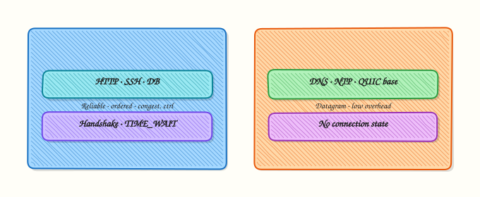

# TCP and UDP Deep Dive

## Overview

Transport protocols decide **how** applications exchange data. **Transmission Control Protocol (TCP)** is reliable, ordered, and connection-oriented. **User Datagram Protocol (UDP)** is lightweight and best-effort. Most production symptoms — connection refused, timeouts, “too many open files,” and `TIME_WAIT` storms — land at this layer.

You will use `ss` to read socket states, `nc` (netcat) for localhost TCP and UDP demos, and `curl` timings for a real HTTPS sample. These are the same tools you use on jump servers and in incident bridges.

This is **Tutorial 9** in **Module 8: TCP & UDP** of the REBASH Academy **Networking for Cloud & DevOps Engineers** series. It is written for Cloud, DevOps, Site Reliability Engineering (SRE), and platform engineers. Evidence goes under `~/rebash-networking/lab09`.

## Prerequisites

- [ICMP, ARP, DHCP, and Network Services](icmp-arp-dhcp-and-network-services.md)
- Ubuntu practice host with `ss`, `nc` (`netcat-openbsd` or `ncat`), and `curl`
- Comfort with client–server ideas (one process listens, another connects)

## Learning Objectives

By the end of this tutorial, you will be able to:

- [ ] Contrast TCP and UDP for real Cloud / DevOps workloads
- [ ] Explain the TCP three-way handshake and common socket states
- [ ] Use `ss` to show listening ports and established connections
- [ ] Demo localhost TCP and UDP with `nc` and prove states
- [ ] Read basic `curl` timing output and relate it to connect vs transfer

## Architecture

TCP builds a connection with a three-way handshake before data. UDP sends datagrams without that setup.




## Theory

### What it is

A **port** is a 16-bit number that identifies an application endpoint on a host. A **socket** is the local address + port (and for TCP, the remote pair) that the kernel tracks. **TCP** provides a byte stream with acknowledgements, retransmission, and congestion control. **UDP** provides datagrams with no built-in delivery guarantee — Domain Name System (DNS), QUIC, and many discovery protocols use it.

```bash
ss -lntu | head
```

### Why it matters

“Connection refused” means nothing is listening (or a reject rule sent RST). A **timeout** often means drops or a black hole — different fix. Load balancers, Kubernetes Services, and health checks are all port and protocol decisions. Choosing TCP vs UDP wrong (for example forcing TCP-only health checks on a UDP service) creates false downs.

### How it works

**TCP three-way handshake:** client sends SYN → server replies SYN-ACK → client sends ACK → state becomes ESTABLISHED. Teardown uses FIN/ACK (or RST on abort). Common states you will see in `ss`: `LISTEN`, `ESTAB`, `TIME-WAIT`, `CLOSE-WAIT`.

**UDP:** no handshake. `ss -lu` shows listening UDP sockets; “connected” UDP is optional and means the kernel remembers a default peer.

```bash
# Listen TCP on localhost (lab uses explicit ports)
nc -l 127.0.0.1 19090
```

### Key concepts and comparisons

| Feature | TCP | UDP |
|---------|-----|-----|
| Connection | Yes | No (usually) |
| Ordered / reliable | Yes | No |
| Header cost | Higher | Lower |
| Typical uses | HTTP(S), SSH, databases | DNS, DHCP, metrics, games, QUIC |

| Symptom | Often means |
|---------|-------------|
| Connection refused | No listener / active reject |
| Timeout | Filter, drop, or wrong route |
| `TIME-WAIT` many entries | Recent closes; usually normal, can stress under churn |

### Common pitfalls

- Using `netstat` only — prefer `ss`.
- Forgetting `-u` when checking UDP listeners.
- Treating `TIME-WAIT` as a leak without checking connection rate.
- Binding `0.0.0.0` in a lab and exposing ports beyond localhost by mistake.

## Hands-on Lab

### Objective

Prove TCP and UDP behaviour on localhost with `nc`, inspect states with `ss`, and capture `curl` timings to a public HTTPS endpoint. Save evidence under `~/rebash-networking/lab09`.

### Prerequisites

- `iproute2` (`ss`), `curl`, and netcat (`nc -h` should work)
- Outbound HTTPS allowed for the curl task (or note failure honestly)

### Lab environment

Workspace: `~/rebash-networking/lab09`

```bash
mkdir -p ~/rebash-networking/lab09 && cd ~/rebash-networking/lab09
set -euo pipefail
whoami | tee admin-user.txt
command -v ss | tee tools-ss.txt
command -v nc | tee tools-nc.txt
command -v curl | tee tools-curl.txt
ss -lntu | head -n 40 | tee ss-baseline.txt
```

**Expected output:** tool paths recorded; baseline `ss` snapshot saved.

### Real-world scenario

An API owner says “the load balancer is broken.” You must show whether anything listens on the port, whether a TCP handshake completes on localhost, whether UDP reachability works for a sidecar check, and how long TLS connect takes from this host — with files for the bridge call.

### Step-by-step tasks

#### Task 1 – TCP listen / connect on localhost

```bash
cd ~/rebash-networking/lab09
set -euo pipefail

TCP_PORT=19090
# Start listener in background
nc -l 127.0.0.1 "$TCP_PORT" > tcp-server.out 2>tcp-server.err &
echo $! > tcp-server.pid
sleep 0.3

ss -lnt "( sport = :$TCP_PORT )" | tee ss-tcp-listen.txt
grep -E ":$TCP_PORT|LISTEN" ss-tcp-listen.txt

printf 'rebash-tcp-ok\n' | nc -w 2 127.0.0.1 "$TCP_PORT" | tee tcp-client.out || true
sleep 0.2
cat tcp-server.out | tee tcp-payload.txt
grep -q 'rebash-tcp-ok' tcp-payload.txt

# States snapshot (listener may have closed after one connection depending on nc)
ss -nt | tee ss-tcp-after.txt || true

kill "$(cat tcp-server.pid)" 2>/dev/null || true
wait "$(cat tcp-server.pid)" 2>/dev/null || true
```

**Expected output:** `ss-tcp-listen.txt` shows LISTEN on `19090`; `tcp-payload.txt` contains `rebash-tcp-ok`.

#### Task 2 – UDP localhost demo

```bash
cd ~/rebash-networking/lab09
set -euo pipefail

UDP_PORT=19091
nc -u -l 127.0.0.1 "$UDP_PORT" > udp-server.out 2>udp-server.err &
echo $! > udp-server.pid
sleep 0.3

ss -lun "( sport = :$UDP_PORT )" | tee ss-udp-listen.txt
grep -E ":$UDP_PORT|UNCONN|udp" ss-udp-listen.txt || test -s ss-udp-listen.txt

printf 'rebash-udp-ok\n' | nc -u -w 2 127.0.0.1 "$UDP_PORT"
sleep 0.3
cat udp-server.out | tee udp-payload.txt
grep -q 'rebash-udp-ok' udp-payload.txt

kill "$(cat udp-server.pid)" 2>/dev/null || true
wait "$(cat udp-server.pid)" 2>/dev/null || true
```

**Expected output:** UDP listener visible in `ss`; `udp-payload.txt` contains `rebash-udp-ok`.

#### Task 3 – curl timings + evidence pack

```bash
cd ~/rebash-networking/lab09
set -euo pipefail

# connect / starttransfer / total (seconds)
curl -sS -o /dev/null -w 'namelookup=%{time_namelookup}\nconnect=%{time_connect}\nappconnect=%{time_appconnect}\nstarttransfer=%{time_starttransfer}\ntotal=%{time_total}\nhttp_code=%{http_code}\n' \
  https://example.com | tee curl-timings.txt

grep -E 'connect=|total=|http_code=' curl-timings.txt

ss -s | tee ss-summary.txt

tar -czf tcp-udp-evidence.tgz \
  admin-user.txt ss-baseline.txt \
  ss-tcp-listen.txt tcp-payload.txt \
  ss-udp-listen.txt udp-payload.txt \
  curl-timings.txt ss-summary.txt ss-tcp-after.txt
ls -l tcp-udp-evidence.tgz | tee evidence-ls.txt
```

**Expected output:** timings file has numeric fields; HTTPS `http_code` is often `200` (or another valid code if the edge changes); archive exists.

### Validation steps

- [ ] TCP payload `rebash-tcp-ok` received
- [ ] UDP payload `rebash-udp-ok` received
- [ ] `ss` showed the TCP LISTEN socket during Task 1
- [ ] `curl-timings.txt` includes connect and total times
- [ ] `tcp-udp-evidence.tgz` exists under `~/rebash-networking/lab09`

### Common errors and fixes

| Error | Cause | Fix |
|-------|-------|-----|
| `nc: Address already in use` | Port busy | Choose another high port or kill leftover `nc` |
| OpenBSD vs traditional nc flags | Different `nc` packages | Use `nc -l 127.0.0.1 port` / `nc -u`; check `nc -h` |
| UDP payload empty | Timing / buffering | Small `sleep` after send; retry Task 2 |
| curl DNS/connect fail | No egress | Record the error in `curl-timings.txt`; localhost tasks still pass |
| `ss` filter syntax error | Older ss | Use `ss -lnt \| grep 19090` instead |

### Challenge exercise

Write `prove-states.sh` that: starts `nc -l 127.0.0.1 19092` in the background, runs `ss -lnt | grep 19092`, connects once with `nc`, saves both `ss` snapshots to `states-listen.txt` and `states-after.txt`, then kills the listener. This script is the stretch artefact.

### Learning outcomes

- Proved TCP and UDP localhost delivery with evidence
- Used `ss` as the modern socket inspector
- Linked curl timing fields to connect vs transfer delay

### Cleanup

```bash
cd ~/rebash-networking/lab09
set -euo pipefail
kill "$(cat tcp-server.pid 2>/dev/null)" 2>/dev/null || true
kill "$(cat udp-server.pid 2>/dev/null)" 2>/dev/null || true
pkill -f 'nc -l 127.0.0.1 1909' 2>/dev/null || true
# rm -f tcp-udp-evidence.tgz *.txt *.out *.err *.pid
```

## Validation

- [ ] Lab finished under `~/rebash-networking/lab09/`
- [ ] You can explain SYN / SYN-ACK / ACK in one short paragraph
- [ ] You can contrast connection refused vs timeout
- [ ] You prefer `ss` over legacy `netstat` for daily work

## Code Walkthrough

Transport debugging in production usually follows:

1. **Is anything listening?** — `ss -lntu`  
2. **Can this host connect?** — localhost/`nc` or `curl` to the real port  
3. **What state are sockets in?** — `ESTAB`, `TIME-WAIT`, `CLOSE-WAIT`  
4. **Where is time spent?** — curl `%{time_connect}` vs `%{time_starttransfer}`  
5. **Least exposure** — bind lab listeners to `127.0.0.1` only  

Packet capture comes after these basics, not before.

## Security Considerations

- Bind practice listeners to **localhost** only  
- Do not open high ports on public interfaces “for a quick test”  
- TCP clearsight into ESTABLISHED peers can reveal unexpected clients — handle as sensitive  
- UDP amplification risks exist for some services — rate-limit on the edge  
- Prefer TLS on application protocols that carry credentials (covered next modules)  

## Common Mistakes

!!! warning "Calling every failure a timeout"
    Refused vs timeout vs TLS error need different fixes. **Fix:** capture the exact client error and a matching `ss` snapshot.

!!! warning "Ignoring UDP in health checks"
    A TCP probe against a UDP-only service is a false signal. **Fix:** match probe protocol to the service.

!!! warning "Panicking at TIME_WAIT"
    Short-lived connections create many `TIME-WAIT` entries. **Fix:** check churn and file-descriptor limits before changing kernel timers casually.

!!! warning "Using 0.0.0.0 in shared labs"
    Others on the network may connect. **Fix:** `127.0.0.1` for demos.

## Best Practices

- Standardise on `ss` in runbooks  
- Record listen address and port in every change ticket  
- Separate connect failures from application 5xx after handshake  
- Use curl timing format for slow HTTPS complaints  
- Know which of your stack is TCP vs UDP (DNS, metrics, QUIC)  

## Troubleshooting

| Symptom | Likely cause | Fix |
|---------|--------------|-----|
| Connection refused | Nothing on port / wrong IP | `ss -lnt`; fix bind address |
| Timeout | Drop / wrong security group | Trace path; open correct proto/port |
| `CLOSE-WAIT` pile-up | App not reading/closing | Fix application close path |
| UDP “works sometimes” | No reliability | Add app-level retry or use TCP/QUIC |
| High connect time | Network/TLS | Use curl timings; check DNS and TLS |

## Summary

TCP gives you a reliable stream and visible connection states; UDP gives you speed with less help from the kernel. Prove both with `ss`, `nc`, and curl timings before you blame the load balancer. Next: [DNS Fundamentals](dns-fundamentals.md).

## Interview Questions

**1. Walk through the TCP three-way handshake.**

??? success "Reveal answer"
    Client sends **SYN**, server replies **SYN-ACK**, client sends **ACK**. After that the connection is **ESTABLISHED** and data can flow. Interviewers also expect you to know teardown uses FIN/ACK (or RST on abort) and that middleboxes can interfere with handshake packets.

**2. How do you distinguish connection refused from a timeout?**

??? success "Reveal answer"
    **Refused** usually means the host responded with a TCP **RST** (nothing listening, or an active reject). A **timeout** means no useful response — often a **drop** in a firewall/security group or a black hole. Refused → check listener/`ss`. Timeout → check path and filters.

**3. When would you choose UDP over TCP?**

??? success "Reveal answer"
    When you want low overhead and can handle loss in the application — classic **DNS**, DHCP, many telemetry streams, and modern **QUIC** (UDP-based). Choose TCP when you need a reliable byte stream without implementing retransmission yourself (HTTP/1.1, databases, SSH).

**4. What does `ss -lntu` show you that `ping` cannot?**

??? success "Reveal answer"
    It shows **which ports are listening** for TCP and UDP and related socket state. Ping only tests ICMP reachability. Services can be up on TCP 443 while ping fails, or listening only on localhost while the world cannot connect.

**5. What is TIME_WAIT and is it always a problem?**

??? success "Reveal answer"
    After an active close, TCP keeps the tuple in **TIME_WAIT** so delayed packets do not corrupt a new connection with the same 4-tuple. Many short connections create many TIME_WAIT entries — often **normal**. It becomes a problem under extreme churn or port exhaustion; fix connection reuse or architecture before randomly tuning timeouts.

**6. How do curl `time_connect` and `time_starttransfer` help in an incident?**

??? success "Reveal answer"
    **`time_connect`** covers TCP connect (and related network delay to the accept). **`time_appconnect`** adds TLS. **`time_starttransfer`** waits until the first response byte. Large connect time → network/LB. Large gap after connect → slow TLS or slow app. This splits “network” from “application” quickly.

**7. Why bind lab `nc` servers to 127.0.0.1?**

??? success "Reveal answer"
    Binding to all interfaces can expose an unauthenticated listener on the LAN or public IP. Localhost keeps the demo **safe** while still proving TCP/UDP and `ss` states. Production services should bind intentionally and sit behind controls.

## Related Tutorials

- [Networking for Cloud & DevOps – Overview](index.md)
- [ICMP, ARP, DHCP, and Network Services](icmp-arp-dhcp-and-network-services.md) *(previous)*
- [DNS Fundamentals](dns-fundamentals.md) *(next)*
- [HTTP, HTTPS, and the Application Layer](http-https-and-application-layer.md)

## References

- [RFC 9293 — TCP](https://www.rfc-editor.org/rfc/rfc9293)  
- [RFC 768 — UDP](https://www.rfc-editor.org/rfc/rfc768)  
- [`ss(8)`](https://manpages.ubuntu.com/manpages/jammy/en/man8/ss.8.html)  
- Track index: [Networking for Cloud & DevOps Engineers](index.md)
