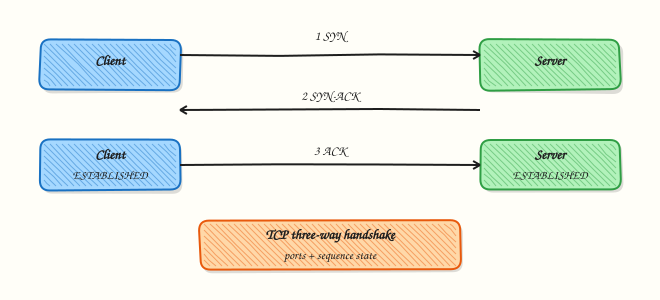

# TCP and UDP Deep Dive

## Overview

Explain TCP vs UDP, walk the three-way handshake and teardown, read connection states with `ss`, and diagnose refused vs timeout vs TIME_WAIT problems on a Linux lab host.

Transport protocols decide **how** applications exchange data. **TCP (Transmission Control Protocol)** is reliable, ordered, and connection-oriented. **UDP (User Datagram Protocol)** is lightweight and best-effort. Production symptoms — connection refused, timeouts, “too many open files,” and TIME_WAIT storms — almost always land here.

This is **Module 8 — TCP & UDP**. Complete [ICMP, ARP, DHCP, and Network Services](icmp-arp-dhcp-and-network-services.md) first. Diagrams use Excalidraw only.

This is a core tutorial in **Module 8 · TCP & UDP** of the REBASH Academy **Networking for Cloud & DevOps Engineers** series — written for Cloud, DevOps, Platform, and SRE engineers.

## Prerequisites

### Required

- [ICMP, ARP, DHCP, and Network Services](icmp-arp-dhcp-and-network-services.md)
- Linux host with network access
- Familiarity with client–server apps

### Recommended

- `sudo` for `ss -p` and sysctl inspection
- `nc` (netcat) for socket experiments

## Learning Objectives

By the end of this tutorial, you will be able to:

- [ ] Explain the TCP three-way handshake and FIN/ACK teardown  
- [ ] Distinguish ports, sockets, and file descriptors  
- [ ] List key TCP states and interpret `ss` output  
- [ ] Explain TIME_WAIT and practical mitigations  
- [ ] Choose UDP vs TCP for common Cloud/DevOps workloads  
- [ ] Describe flow control vs congestion control at a practical level  
- [ ] Debug “connection refused” vs “timeout” vs “address already in use”

## Architecture

TCP completes a three-way handshake before data. UDP sends datagrams with no connection state.



## Theory

### Ports and sockets

A **port** is a 16-bit number (0–65535) naming an application endpoint on a host:

| Range | Name | Usage |
|-------|------|-------|
| 0–1023 | Well-known | HTTP 80, HTTPS 443, SSH 22 |
| 1024–49151 | Registered | Databases, app services |
| 49152–65535 | Ephemeral | Client source ports |

A **socket** is the kernel endpoint — for TCP typically the 5-tuple `(protocol, local IP, local port, remote IP, remote port)`. Listening sockets accept new connections; connected sockets carry sessions. On Linux, sockets are **file descriptors**; `ulimit -n` caps how many a process may open.

### TCP — reliability and control

TCP provides:

- **Reliability** — retransmission of lost segments  
- **Ordering** — sequence numbers  
- **Flow control** — receiver window (do not overwhelm the peer)  
- **Congestion control** — adjust send rate to network conditions (cwnd, algorithms such as CUBIC)

#### Three-way handshake

1. **SYN** — client proposes initial sequence  
2. **SYN-ACK** — server acknowledges and proposes its sequence  
3. **ACK** — client acknowledges; both enter **ESTABLISHED**

Half-open SYNs without completion are the basis of SYN floods — mitigated with SYN cookies and edge rate limits.

#### Teardown and TIME_WAIT

Graceful close uses **FIN/ACK** in both directions (or **RST** for abort). The active closer enters **TIME_WAIT** for about **2×MSL** so delayed segments cannot corrupt a new connection on the same 4-tuple. High-churn clients and proxies accumulate TIME_WAIT — prefer keep-alive and pooling; treat `tcp_tw_reuse` carefully; do not revive obsolete `tcp_tw_recycle` advice.

#### TCP states (practical set)

| State | Meaning |
|-------|---------|
| LISTEN | Waiting for connections |
| SYN-SENT / SYN-RECV | Handshake in progress |
| ESTABLISHED | Data can flow |
| FIN-WAIT-* / CLOSE-WAIT | Shutdown in progress |
| TIME-WAIT | Active closer waiting 2×MSL |
| CLOSED | No connection |

Stuck **CLOSE-WAIT** usually means the application never called `close()` after the peer finished.

### UDP — datagrams

UDP has no handshake, no delivery guarantee, and an 8-byte header. Use it when latency matters more than per-packet reliability, or when the application (or QUIC) adds its own reliability.

| Use case | Why UDP |
|----------|---------|
| DNS | Small query/response |
| NTP | Tiny periodic sync |
| VoIP / gaming | Loss preferred over late retransmit |
| QUIC (HTTP/3) | Reliability and TLS in user space over UDP |

### ss vs netstat

Prefer **`ss`** (netlink, maintained). Useful flags: `-t`/`-u`, `-l`/`-a`, `-n`, `-p` (root), `-i` (RTT/cwnd), `-o` (timers).

## Hands-on Lab

**Focus:** practise the core workflow for TCP and UDP Deep Dive

```bash
mkdir -p ~/rebash-networking/module-08
cd ~/rebash-networking/module-08

sudo apt-get update
sudo apt-get install -y iproute2 netcat-openbsd dnsutils curl
```

Confirm tools:

```bash
ss -h | head -3
nc -h 2>&1 | head -2
```

### Step 1 – List listening ports

```bash
ss -tuln
sudo ss -tulpn | head -20
```

`0.0.0.0` means all interfaces; `127.0.0.1` is localhost only.

### Step 2 – Established connections

```bash
ss -tn state established
curl -s -o /dev/null https://example.com
ss -tn state established '( dport = :443 or sport = :443 )'
```

### Step 3 – Local handshake with netcat

```bash
nc -l 9999 &
LISTEN_PID=$!
sleep 1
echo "hello" | nc 127.0.0.1 9999
ss -tn sport = :9999 || true
wait $LISTEN_PID 2>/dev/null || kill $LISTEN_PID 2>/dev/null || true
```

### Step 4 – TIME_WAIT after short clients

```bash
ss -tan | awk '/TIME-WAIT/ {c++} END {print "TIME-WAIT:", c+0}'
sysctl net.ipv4.ip_local_port_range
for i in $(seq 1 20); do curl -s -o /dev/null http://example.com || true; done
ss -tan | awk '/TIME-WAIT/ {c++} END {print "TIME-WAIT after burst:", c+0}'
```

### Step 5 – UDP sockets

```bash
ss -uln
dig +short example.com @8.8.8.8
```

### Step 6 – Refused vs timeout

```bash
nc -zv -w 2 127.0.0.1 19999 2>&1 || true
nc -zv -w 2 10.255.255.1 443 2>&1 || true
```

**Refused** = RST (nothing listening, host reachable). **Timeout** = no SYN-ACK (filter, black hole, or dead path).

### Step 7 – TCP internals

```bash
ss -ti state established | head -30
```

Look for `rtt`, `cwnd`, and retransmission clues.

## Validation

- [ ] Lab commands run under `~/rebash-networking/module-08/`
- [ ] You can explain each Theory section in your own words
- [ ] You used modern tooling where it applies to this topic
- [ ] You can describe one production failure mode for this topic

## Code Walkthrough

Production practice for **TCP and UDP Deep Dive** always combines:

1. Inspect before you change (status, plan, logs, dry-run)
2. Prefer reversible, documented changes (Git, IaC, drop-ins, version pins)
3. Capture evidence (command output, pipeline logs) for handovers
4. Prefer current tools and APIs over legacy shortcuts
5. Least privilege — escalate credentials only when required

Keep runbooks short enough to follow under pressure. Automate checks; keep humans for judgement.

## Security Considerations

- Treat credentials and tokens for networking as privileged — never commit them
- Prefer short-lived auth (OIDC, roles, SSO) over long-lived keys
- Validate blast radius before apply/deploy/delete operations
- Restrict who can approve production changes
- Collect audit logs; limit who can read sensitive traces

## Common Mistakes

!!! warning "Skipping fundamentals for TCP and UDP Deep Dive"
    Validate assumptions against the Theory section and official docs before changing production.

!!! warning "Treating lab defaults as production-ready for TCP and UDP Deep Dive"
    Lab shortcuts (open security groups, admin roles, skip approvals) must not ship unchanged.

!!! warning "Changing production without a rollback path"
    Always know how to revert (previous artefact, prior release, state rollback, DNS failback).

## Best Practices

- Encode TCP and UDP Deep Dive changes as code and review them in pull requests
- Pin versions (images, modules, actions, provider plugins)
- Separate environments with clear promotion gates
- Alert on symptoms with runbooks attached
- Destroy lab resources; tag everything with owner and expiry where possible

## Troubleshooting

| Issue | Likely cause | What to do |
|-------|--------------|------------|
| Connection refused | No listener / wrong bind | `ss -tlnp`; check bind address |
| Connection timed out | Firewall or routing | SG/iptables; `traceroute`; confirm host up |
| Address already in use | Conflict or TIME_WAIT | `ss -tlnp`; wait; `SO_REUSEADDR` in apps |
| TIME_WAIT storm | Short-lived clients | Keep-alive; pool; widen ephemeral range carefully |
| High CLOSE-WAIT | App not closing FDs | Fix application; restart as stopgap |
| SYN drops under load | Backlog / `somaxconn` | Align backlog; SYN cookies at edge |

## Summary

- **TCP** = handshake, reliability, flow and congestion control, connection states  
- **UDP** = datagrams for DNS, NTP, media, and QUIC  
- **Ports** name services; **sockets** are the full endpoints  
- **TIME_WAIT** protects against stale segments; manage it with design, not folklore  
- Use **`ss`**; distinguish **refused** from **timeout**

## Interview Questions

1. How does **TCP and UDP Deep Dive** show up when operating Cloud or production platforms?
2. What would you check first if this area misbehaves in production?
3. Which modern tools or APIs replace older equivalents here?
4. What security control should accompany this capability?
5. How would you automate verification of this topic in CI?

!!! tip "Sample answer — question 2"
    Start with blast radius and recent changes, gather evidence (logs, status, plan/diff), then fix forward with a known rollback path — not guesswork.

## Related Tutorials

- [Course overview](index.md)
- - [DNS Fundamentals](dns-fundamentals.md)  
- [HTTP, HTTPS, and the Application Layer](http-https-and-application-layer.md)  
- [Packet Analysis with tcpdump and Wireshark](packet-analysis-tcpdump-wireshark.md)  
- [Networking Cheat Sheet](../cheatsheets/networking.md)  
- [Networking Interview Prep](../interview/networking.md)

## References

- [RFC 793 — TCP](https://www.rfc-editor.org/rfc/rfc793)  
- [RFC 768 — UDP](https://www.rfc-editor.org/rfc/rfc768)  
- [ss(8)](https://man7.org/linux/man-pages/man8/ss.8.html)  
- [Linux ip-sysctl](https://www.kernel.org/doc/Documentation/networking/ip-sysctl.txt)  
- [IANA port registry](https://www.iana.org/assignments/service-names-port-numbers/)
