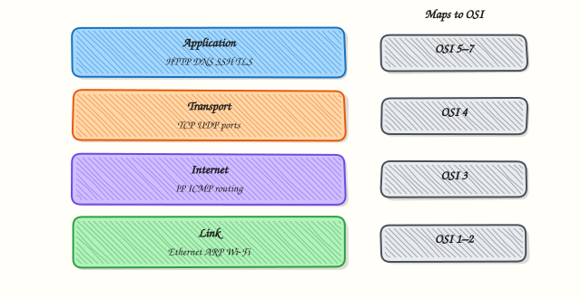

# TCP/IP Model

## Overview

Map every protocol you use (Ethernet, IP, TCP/UDP, HTTP/DNS) onto the four TCP/IP layers and explain how that mapping relates to OSI.

The **TCP/IP model** (Internet protocol suite) is how the Internet is actually implemented. OSI is the precise vocabulary; TCP/IP is the deployed stack. Engineers use both.

This is a core tutorial in **Module 3 · TCP/IP Model** of the REBASH Academy **Networking for Cloud & DevOps Engineers** series — written for Cloud, DevOps, Platform, and SRE engineers.

## Prerequisites

- [OSI Model](osi-model.md)

## Learning Objectives

By the end of this tutorial, you will be able to:

- [ ] Name the four TCP/IP layers and their jobs  
- [ ] Map TCP/IP layers to OSI layers  
- [ ] Place common protocols on the correct layer  
- [ ] Trace an HTTP request through the stack  
- [ ] Choose diagnostics per TCP/IP layer

## Architecture

This topic’s control points and relationships are shown below.



## Theory

### Four layers

| TCP/IP layer | Job | Key protocols | OSI mapping |
|--------------|-----|---------------|-------------|
| **Application** | User services | HTTP, DNS, SSH, TLS, SMTP | 5–7 |
| **Transport** | Host-to-host | TCP, UDP, QUIC | 4 |
| **Internet** | Routing & addressing | IPv4, IPv6, ICMP | 3 |
| **Link** | Framing & media access | Ethernet, Wi‑Fi, ARP | 1–2 |

### Protocol mapping cheat sheet

| Protocol | TCP/IP layer |
|----------|--------------|
| HTTP / HTTPS | Application |
| DNS | Application |
| SSH | Application |
| TLS | Application (presentation role) |
| TCP / UDP | Transport |
| IP / ICMP | Internet |
| ARP | Link (IP↔MAC) |
| Ethernet | Link |

### Packet flow (HTTP GET)

1. Application builds HTTP  
2. TLS protects the bytes (HTTPS)  
3. TCP adds ports and reliability  
4. IP adds addresses and forwards hop by hop  
5. Ethernet delivers frames on each LAN segment  

### Why DevOps cares

- **Security groups** mostly act at Internet/Transport (IP + ports)  
- **ALB/Ingress** act at Application (HTTP)  
- **NLB** acts at Transport  
- **VPC routing** is Internet layer policy

## Hands-on Lab

**Focus:** practise the core workflow for TCP/IP Model

```bash
mkdir -p ~/rebash-networking/module-03
cd ~/rebash-networking/module-03
```

### Step 1 — Application evidence

```bash
curl -sI --max-time 10 https://example.com/ | head -n 8
dig +short example.com A
```

### Step 2 — Transport evidence

```bash
ss -tulpn | head
nc -vz example.com 443
```

### Step 3 — Internet evidence

```bash
ip route get "$(dig +short example.com A | head -n 1)"
ping -c 2 1.1.1.1 || true
```

### Step 4 — Link evidence

```bash
ip -br link
ip neigh show | head
```

### Step 5 — Write a mapping note

```bash
cat > tcpip-mapping.txt <<'EOF'
Application: HTTP/DNS observed via curl/dig
Transport: TCP/443 via nc/ss
Internet: route via ip route get
Link: MAC/neigh via ip neigh
EOF
```

## Validation

- [ ] Four layers named correctly  
- [ ] At least eight protocols placed correctly  
- [ ] `tcpip-mapping.txt` exists

## Code Walkthrough

Production practice for **TCP/IP Model** always combines:

1. Inspect before you change (status, plan, logs, dry-run)
2. Prefer reversible, documented changes (Git, IaC, drop-ins, version pins)
3. Capture evidence (command output, pipeline logs) for handovers
4. Prefer current tools and APIs over legacy shortcuts
5. Least privilege — escalate credentials only when required

Keep runbooks short enough to follow under pressure. Automate checks; keep humans for judgement.

## Security Considerations

- Treat credentials and tokens for networking as privileged — never commit them
- Prefer short-lived auth (OIDC, roles, SSO) over long-lived keys
- Validate blast radius before apply/deploy/delete operations
- Restrict who can approve production changes
- Collect audit logs; limit who can read sensitive traces

## Common Mistakes

!!! warning "Skipping fundamentals for TCP/IP Model"
    Validate assumptions against the Theory section and official docs before changing production.

!!! warning "Treating lab defaults as production-ready for TCP/IP Model"
    Lab shortcuts (open security groups, admin roles, skip approvals) must not ship unchanged.

!!! warning "Changing production without a rollback path"
    Always know how to revert (previous artefact, prior release, state rollback, DNS failback).

## Best Practices

- Encode TCP/IP Model changes as code and review them in pull requests
- Pin versions (images, modules, actions, provider plugins)
- Separate environments with clear promotion gates
- Alert on symptoms with runbooks attached
- Destroy lab resources; tag everything with owner and expiry where possible

## Troubleshooting

If HTTP fails, ask which TCP/IP layer failed first — Application (DNS/HTTP), Transport (port), Internet (route), or Link (MAC/neighbour).

## Summary

TCP/IP is the Internet’s four-layer model. Map protocols deliberately. Use OSI numbers when vendors say L4/L7; use TCP/IP when reading packet paths.

## Interview Questions

1. How does **TCP/IP Model** show up when operating Cloud or production platforms?
2. What would you check first if this area misbehaves in production?
3. Which modern tools or APIs replace older equivalents here?
4. What security control should accompany this capability?
5. How would you automate verification of this topic in CI?

!!! tip "Sample answer — question 2"
    Start with blast radius and recent changes, gather evidence (logs, status, plan/diff), then fix forward with a known rollback path — not guesswork.

## Related Tutorials

- [Course overview](index.md)
- - [IP Addressing](ip-addressing.md)

## References

- [RFC 1122](https://www.rfc-editor.org/rfc/rfc1122)  
- [RFC 793 TCP](https://www.rfc-editor.org/rfc/rfc793)
