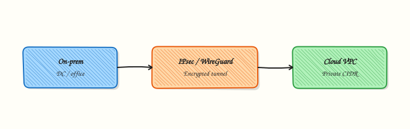

# VPN and Tunneling Basics

## Overview

A **Virtual Private Network (VPN)** encrypts traffic so private networks can talk across the public internet. **Site-to-site** links a data centre to a cloud VPC continuously. **Remote access** brings an engineer’s laptop into private subnets. **Tunnels** (IPsec, WireGuard, or TLS-based VPN) carry inner packets inside outer encrypted packets. Ops care about tunnel state, routes for private CIDRs, and split vs full tunnel — not only “the VPN app connected.”

In Cloud and DevOps work, hybrid admin paths and legacy site links still use managed IPsec VPN gateways. Modern overlays often use WireGuard. For high sustained throughput or strict private-path rules, teams add **private connectivity** (AWS Direct Connect, Azure ExpressRoute, Google Cloud Interconnect) and keep VPN as backup.

In production, a tunnel that is “up” but missing routes looks like a Security Group deny. Overlapping `10.0.0.0/8` ranges block hybrid designs. Pre-shared keys in tickets and git create silent risk. You must prove encryption **and** routing.

This is **Tutorial 20** in **Module 16: Production Networking** of the REBASH Academy **Networking for Cloud & DevOps Engineers** series. It is written for Cloud, DevOps, Platform, and SRE engineers. By the end you will demonstrate a local tunnel or SOCKS dynamic forward and keep cleanup evidence under `~/rebash-networking/lab20`.

## Prerequisites

- [Cloud Networking — VPCs and Subnets](cloud-networking-vpc-and-subnets.md)
- [Routing Fundamentals](routing-fundamentals.md)
- Practice Ubuntu VM with `sudo`, `iproute2`, `ssh`, `curl`
- Optional: WireGuard tools (`wg`) if already installed

## Learning Objectives

By the end of this tutorial, you will be able to:

- [ ] Contrast site-to-site and remote-access VPN
- [ ] Describe IPsec and WireGuard roles at an ops level
- [ ] Explain split tunnel vs full tunnel trade-offs
- [ ] Demonstrate `ssh -D` SOCKS, inspect WireGuard if present, or build a namespace tunnel
- [ ] List hybrid failure modes: PSK, routes, overlapping CIDR, one-way traffic
- [ ] Clean up lab tunnels safely

## Architecture

On-prem and cloud private networks join through an encrypted tunnel; both sides must route private CIDRs after the tunnel is up.



## Theory

### What it is

A VPN creates a protected path over an untrusted network. The **outer** packet goes to a public VPN endpoint. The **inner** packet keeps private source and destination addresses. Common technologies:

- **IPsec** (often IKEv2) — dominant for cloud site-to-site gateways
- **WireGuard** — simple keys, UDP, popular for modern overlays
- **TLS-based VPN** (for example OpenVPN-style) — sometimes easier through strict egress

``` {.bash .ra-terminal title="Terminal"}
# Dynamic SOCKS proxy over SSH (remote-access style demo)
ssh -D 1080 -N -f user@bastion.example.com
```

### Why it matters

Hybrid cloud and private admin access still depend on tunnels. Without correct routes, encryption alone does nothing useful. Choosing VPN when you need dedicated bandwidth creates chronic latency tickets. Leaving full-tunnel VPN on every laptop can hairpin all SaaS traffic through your data centre.

### How it works

1. **Authenticate** — PSK, certificates, or WireGuard keys.
2. **Negotiate / bring up tunnel** — IKE/IPsec SAs, WireGuard handshake, or SSH channel.
3. **Install routes** — private CIDRs on both sides (policy-based or route-based).
4. **Filter** — still apply SG/NSG/host firewalls; VPN is not a free pass.
5. **Monitor** — tunnel up/down, bytes, packet loss, and synthetic checks through the path.

| Type | Typical use |
|------|-------------|
| Site-to-site | DC ↔ VPC always-on |
| Remote access | Admin laptop → private network |
| Client mesh | Identity-centric access (WireGuard/Tailscale-style) |

| Mode | Behaviour |
|------|-----------|
| Split tunnel | Only private destinations via VPN |
| Full tunnel | All client traffic via VPN |

### Common pitfalls

- Declaring success when Phase 1/2 is up but routes are missing
- Overlapping CIDRs across on-prem and cloud
- PSKs in tickets or git; no rotation
- Full tunnel without capacity planning
- No monitoring of tunnel state or bytes

## Hands-on Lab

### Objective

Prove a tunnel or VPN-like path on a practice Ubuntu VM: prefer `ssh -D` SOCKS and/or `wg show` if WireGuard exists; otherwise build a GRE or veth tunnel between namespaces. Save evidence under `~/rebash-networking/lab20` and clean up.

### Prerequisites

- Ubuntu with `sudo`, `ssh`, `curl`, `iproute2`
- Optional: local SSH server (`sshd`) for SOCKS demo to localhost
- Optional: `wireguard-tools` if already installed (do not force a full WireGuard deploy)

### Lab environment

Workspace: `~/rebash-networking/lab20`

``` {.bash .ra-terminal title="Terminal"}
mkdir -p ~/rebash-networking/lab20 && cd ~/rebash-networking/lab20
set -euo pipefail
whoami | tee admin-user.txt
command -v ssh | tee ssh-path.txt
command -v wg >/dev/null 2>&1 && wg --version 2>&1 | tee wg-version.txt || echo "wg: not installed" | tee wg-version.txt
```

!!! example "Expected output"
    workspace ready; `ssh-path.txt` exists.


### Real-world scenario

An engineer needs a safe way to reach an internal HTTP service without opening the service to the internet. You demonstrate a SOCKS dynamic forward (or inspect an existing WireGuard interface). If neither is available, you show a namespace tunnel so the team understands “outer path vs inner packet” before requesting a managed cloud VPN.

### Step-by-step tasks

#### Task 1 – Inventory and choose demo path

``` {.bash .ra-terminal title="Terminal"}
cd ~/rebash-networking/lab20
set -euo pipefail

{
  echo "ssh=$(command -v ssh || true)"
  echo "wg=$(command -v wg || true)"
  echo "sshd_listen=$(ss -lntp 2>/dev/null | grep -E ':22\b' || true)"
} | tee inventory.txt

DEMO=namespace
if ss -lntp 2>/dev/null | grep -qE ':22\b'; then
  DEMO=socks
fi
if command -v wg >/dev/null 2>&1 && sudo wg show 2>/dev/null | grep -q .; then
  DEMO=wireguard
fi
echo "demo=${DEMO}" | tee demo-path.txt
```

!!! example "Expected output"
    `demo-path.txt` is `socks`, `wireguard`, or `namespace`.


#### Task 2 – SOCKS (`ssh -D`) or WireGuard inspect or namespace tunnel

**Path A — SOCKS over SSH to localhost** (when sshd listens on 22):

``` {.bash .ra-terminal title="Terminal"}
cd ~/rebash-networking/lab20
set -euo pipefail

if grep -q '=socks$' demo-path.txt; then
  # Kill any previous lab SOCKS
  pkill -f 'ssh -D 11080' 2>/dev/null || true
  ssh -o StrictHostKeyChecking=accept-new -D 11080 -N -f "$USER@127.0.0.1" \
    || ssh -o StrictHostKeyChecking=accept-new -D 11080 -N -f "localhost"

  sleep 1
  ss -lntp | grep 11080 | tee socks-listen.txt
  curl -sS --max-time 10 --socks5-hostname 127.0.0.1:11080 https://example.com \
    | head -c 200 | tee socks-http-snippet.txt
  test -s socks-listen.txt
fi
```

**Path B — WireGuard already up:**

``` {.bash .ra-terminal title="Terminal"}
cd ~/rebash-networking/lab20
set -euo pipefail

if grep -q '=wireguard$' demo-path.txt; then
  sudo wg show | tee wg-show.txt
  ip -br a | tee wg-addrs.txt
  test -s wg-show.txt
fi
```

**Path C — Namespace GRE/veth tunnel:**

``` {.bash .ra-terminal title="Terminal"}
cd ~/rebash-networking/lab20
set -euo pipefail

if grep -q '=namespace$' demo-path.txt; then
  for ns in lab20-a lab20-b; do sudo ip netns del "$ns" 2>/dev/null || true; done
  sudo ip netns add lab20-a
  sudo ip netns add lab20-b

  # Underlay link (simulates internet path)
  sudo ip link add veth-a0 type veth peer name veth-b0
  sudo ip link set veth-a0 netns lab20-a
  sudo ip link set veth-b0 netns lab20-b
  sudo ip -n lab20-a addr add 203.0.113.1/30 dev veth-a0
  sudo ip -n lab20-b addr add 203.0.113.2/30 dev veth-b0
  sudo ip -n lab20-a link set lo up
  sudo ip -n lab20-b link set lo up
  sudo ip -n lab20-a link set veth-a0 up
  sudo ip -n lab20-b link set veth-b0 up

  # GRE tunnel carrying private "inner" addresses
  sudo ip -n lab20-a tunnel add gre20 mode gre remote 203.0.113.2 local 203.0.113.1 ttl 64
  sudo ip -n lab20-b tunnel add gre20 mode gre remote 203.0.113.1 local 203.0.113.2 ttl 64
  sudo ip -n lab20-a addr add 10.20.0.1/30 dev gre20
  sudo ip -n lab20-b addr add 10.20.0.2/30 dev gre20
  sudo ip -n lab20-a link set gre20 up
  sudo ip -n lab20-b link set gre20 up

  {
    sudo ip -n lab20-a link show gre20
    sudo ip -n lab20-b link show gre20
  } | tee gre-links.txt

  sudo ip netns exec lab20-a ping -c 3 -W 2 10.20.0.2 | tee gre-ping.txt
  grep -q 'bytes from' gre-ping.txt
fi
```

!!! example "Expected output"
    SOCKS listener + proxied HTTP snippet, or `wg show` output, or successful GRE ping over `10.20.0.0/30`.


#### Task 3 – Evidence pack

``` {.bash .ra-terminal title="Terminal"}
cd ~/rebash-networking/lab20
set -euo pipefail

tar -czf vpn-evidence.tgz \
  admin-user.txt ssh-path.txt wg-version.txt inventory.txt demo-path.txt \
  $(ls socks-listen.txt socks-http-snippet.txt 2>/dev/null || true) \
  $(ls wg-show.txt wg-addrs.txt 2>/dev/null || true) \
  $(ls gre-links.txt gre-ping.txt 2>/dev/null || true)
ls -l vpn-evidence.tgz | tee evidence-ls.txt
test -s vpn-evidence.tgz
```

!!! example "Expected output"
    `vpn-evidence.tgz` is non-empty.


### Validation steps

- [ ] `demo-path.txt` records which path ran
- [ ] At least one of: SOCKS on `11080`, non-empty `wg-show.txt`, or GRE ping success
- [ ] You can explain outer underlay vs inner private addresses
- [ ] Cleanup removes tunnels / background SSH

### Common errors and fixes

| Error | Cause | Fix |
|-------|-------|-----|
| `ssh: Permission denied` | No local key/password for localhost | Use Path C namespace tunnel instead |
| `curl: (7) Failed to connect to SOCKS` | SSH `-D` not running | Check `ss -lntp`; restart Task 2 Path A |
| `tunnel add gre20: File exists` | Previous lab left devices | Run Cleanup, then retry |
| `Operation not permitted` for netns | Missing sudo | Use practice VM with sudo |
| WireGuard empty | No interface configured | Fall back to SOCKS or namespace path |

### Challenge exercise

Write `tunnel-check.sh` that: (1) prints whether port `11080` is listening, (2) if `wg` exists prints `wg show` interface names, (3) exits `0` only if at least one tunnel-like path is active. Save a run as `tunnel-check-out.txt`.

### Learning outcomes

- Contrasted VPN types and tunnel technologies
- Demonstrated a real local tunnel or SOCKS path
- Captured evidence and cleaned up disposable tunnels

### Cleanup

``` {.bash .ra-terminal title="Terminal"}
cd ~/rebash-networking/lab20
set -euo pipefail

pkill -f 'ssh -D 11080' 2>/dev/null || true
for ns in lab20-a lab20-b; do
  sudo ip -n "$ns" link del gre20 2>/dev/null || true
  sudo ip netns del "$ns" 2>/dev/null || true
done
```

## Validation

- [ ] Lab finished under `~/rebash-networking/lab20/`
- [ ] You can explain site-to-site vs remote access
- [ ] You know why routes matter after the tunnel is up
- [ ] You can compare VPN vs Direct Connect–style private links

## Code Walkthrough

Production hybrid VPN work usually follows:

1. **Inspect** — tunnel state, last handshake, bytes, gateway alarms
2. **Check routes** — both sides advertise/install private CIDRs
3. **Validate** — ping/TCP from a known host through the tunnel
4. **Prefer managed gateways + IaC** for site-to-site
5. **Least privilege** — VPN pool CIDR in SG/NSG allows, not `0.0.0.0/0`

## Security Considerations

- Never store PSKs or private keys in git or chat
- Prefer certificate or identity-based auth where available
- Split tunnel by default unless policy requires full tunnel
- Still enforce host and cloud firewalls inside the VPN
- Monitor for tunnel flaps and unexpected peer changes

## Common Mistakes

!!! warning "Tunnel up means application works"
    Missing routes or selectors break traffic while the tunnel shows green. **Fix:** validate private CIDR reachability end-to-end.

!!! warning "Overlapping hybrid CIDRs"
    Both sides claim the same `10.x` range. **Fix:** re-IP or plan non-overlap before the project starts.

!!! warning "Full tunnel for every user"
    All SaaS traffic hairpins through your network. **Fix:** use split tunnel unless compliance requires otherwise; size capacity if full tunnel is mandatory.

!!! warning "Leaving lab SOCKS proxies running"
    Forgotten `ssh -D` processes linger. **Fix:** always run Cleanup; check with `ss -lntp`.

## Best Practices

- Dual tunnels / dual AZs for site-to-site production
- Alert on tunnel down and on zero-byte anomalies
- Document split vs full tunnel policy per role
- Use private connectivity for sustained high volume; VPN for backup/admin
- Rotate keys and review peer lists on a calendar

## Troubleshooting

| Symptom | Likely cause | Fix |
|---------|--------------|-----|
| Tunnel down | PSK/IKE/firewall UDP 500/4500 | Check gateway logs and security rules |
| Tunnel up, no ping | Routes / traffic selectors | Align CIDRs; check route tables |
| One-way traffic | Asymmetric routing | Fix return routes |
| Intermittent | Single AZ VPN | Add redundant tunnels |
| SOCKS works, browser fails | Wrong proxy settings | Use `--socks5-hostname` / correct client config |

## Summary

VPNs encrypt hybrid and admin paths; routes and CIDRs make them usable. IPsec dominates classic cloud site-to-site; WireGuard and SSH-based patterns cover modern overlays and quick remote access. Next, harden exposure in [Network Security Hardening](network-security-hardening.md).

## Interview Questions

**1. Site-to-site vs remote-access VPN — when do you use each?**

??? success "Reveal answer"
    **Site-to-site** keeps two networks (for example DC and VPC) connected always for applications and shared services. **Remote access** connects a person (laptop) into private networks for admin or developer access. Many enterprises run both: site-to-site for systems, remote access or a bastion pattern for humans.

**2. The IPsec tunnel shows UP but users cannot reach private IPs. What do you check?**

??? success "Reveal answer"
    Check **routes and traffic selectors** on both sides, Security Group/NSG rules for the VPN pool, overlapping CIDRs, and whether DNS returns private answers. Tunnel state alone is not enough.

**3. Split tunnel vs full tunnel — what is the trade-off?**

??? success "Reveal answer"
    **Split tunnel** sends only private destinations through the VPN (better performance, less hairpinning). **Full tunnel** sends all traffic through the VPN (stronger egress control, higher cost/latency). Choose based on security policy and capacity.

**4. When would you prefer Direct Connect / ExpressRoute / Interconnect over VPN?**

??? success "Reveal answer"
    When you need **higher sustained throughput**, more predictable latency, or a private path that VPN over the internet cannot guarantee. Keep VPN as backup for resilience.

**5. How does WireGuard differ from classic IPsec from an ops viewpoint?**

??? success "Reveal answer"
    WireGuard has a **smaller config surface** (keys, peers, allowed IPs) and typically runs over UDP with simple interfaces (`wg show`). IPsec/IKE has richer enterprise features and is what most **managed cloud VPN gateways** expose. Ops still must get routing and firewall rules right for both.

**6. Why is putting VPN PSKs in a ticket or git repo dangerous?**

??? success "Reveal answer"
    Anyone with ticket or repo access can **impersonate a peer** or join the hybrid path. Store secrets in a vault, rotate them, and limit who can read VPN gateway configuration.

**7. How would you demo VPN concepts on a laptop without a cloud VPN gateway?**

??? success "Reveal answer"
    Use **`ssh -D`** for a SOCKS remote-access style path, inspect **`wg show`** if WireGuard is present, or build a **namespace GRE/veth tunnel** to show underlay vs inner private addressing — then clean up. Interviewers like a safe demo that proves understanding without paid resources.

## Related Tutorials

- [Networking for Cloud & DevOps – Overview](index.md)
- [Cloud Networking — VPCs and Subnets](cloud-networking-vpc-and-subnets.md) *(previous)*
- [Network Security Hardening](network-security-hardening.md) *(next)*
- [Network Segmentation and Trust Boundaries](network-segmentation-and-trust-boundaries.md)

## References

- [AWS Site-to-Site VPN](https://docs.aws.amazon.com/vpn/)
- [WireGuard](https://www.wireguard.com/)
- [`ssh(1)` dynamic forwarding (`-D`)](https://manpages.ubuntu.com/manpages/jammy/en/man1/ssh.1.html)
- Track index: [Networking for Cloud & DevOps Engineers](index.md)
