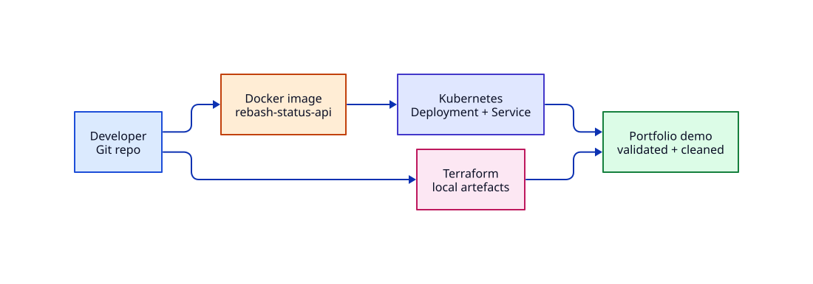

# Project — Status API Portfolio Build

End-to-end project that connects Git, Docker, Kubernetes, and Terraform into one demo you can show in interviews.

## Project Overview

**Goal:** Ship a tiny **status API** that returns JSON health, run it in containers, deploy it to a local Kubernetes cluster, and manage a related metadata artefact with Terraform.

**Deliverable for your portfolio:**

- A Git repository with clear commits
- Dockerfile + Compose (optional local run)
- Kubernetes manifests (Deployment + Service)
- Terraform root that writes release metadata locally
- A short README with architecture, how to run, and cleanup

**Estimated cost:** £0 (local Docker + kind/minikube + local Terraform provider).

## Architecture



## Prerequisites

Complete (or be comfortable with):

- [Linux](../linux/index.md) basics
- [Git](../git/index.md) basic workflow
- [Docker](../docker/index.md) images + Compose
- [Kubernetes](../kubernetes/index.md) Deployments + Services
- [Terraform](../terraform/index.md) CLI workflow

**Recommended labs first:**

- [Docker Compose Stack Recovery](../labs/docker-compose-stack-recovery.md)
- [Kubernetes Deployment Triage](../labs/kubernetes-deployment-triage.md)
- [Terraform Plan Review Workflow](../labs/terraform-plan-review-workflow.md)

### Tools

| Tool | Version hint |
|------|----------------|
| Git | any modern |
| Docker | Engine + Compose v2 |
| kubectl | matching cluster |
| kind or minikube | local cluster |
| Terraform | 1.9+ |

## Learning Objectives

- [ ] Structure a small multi-component repo for demos
- [ ] Build and run a containerised API
- [ ] Deploy and verify on local Kubernetes
- [ ] Use Terraform for repeatable metadata artefacts
- [ ] Document runbooks: start, verify, cleanup

## Phase 0 — Repository skeleton

``` {.bash .ra-terminal title="Terminal"}
mkdir -p ~/rebash-status-api/{app,deploy/k8s,infra} && cd ~/rebash-status-api
git init
```

Create `README.md` with: purpose, architecture (link the diagram concepts), prerequisites, quick start, cleanup.

**Success:** `git status` shows a clean plan for first commit after files exist.

## Phase 1 — Application

`app/server.py`:

```python
from http.server import BaseHTTPRequestHandler, HTTPServer
import json
import os

VERSION = os.environ.get("APP_VERSION", "0.1.0")

class Handler(BaseHTTPRequestHandler):
    def _json(self, code, payload):
        body = (json.dumps(payload) + "\n").encode()
        self.send_response(code)
        self.send_header("Content-Type", "application/json")
        self.send_header("Content-Length", str(len(body)))
        self.end_headers()
        self.wfile.write(body)

    def do_GET(self):
        if self.path in ("/", "/healthz"):
            self._json(200, {"status": "ok", "service": "status-api", "version": VERSION})
            return
        if self.path == "/version":
            self._json(200, {"version": VERSION})
            return
        self.send_error(404)

    def log_message(self, fmt, *args):
        return

if __name__ == "__main__":
    HTTPServer(("0.0.0.0", 8080), Handler).serve_forever()
```

`app/Dockerfile`:

```dockerfile
FROM python:3.12-alpine
WORKDIR /app
COPY server.py .
ENV APP_VERSION=0.1.0
EXPOSE 8080
USER nobody
CMD ["python", "server.py"]
```

**Validate locally:**

``` {.bash .ra-terminal title="Terminal"}
docker build -t rebash-status-api:0.1.0 ./app
docker run --rm -p 18082:8080 -e APP_VERSION=0.1.0 rebash-status-api:0.1.0
curl -sS http://127.0.0.1:18082/healthz
```

Stop the container when done (Ctrl+C or `docker stop`).

## Phase 2 — Optional Compose smoke test

`deploy/compose.yaml`:

```yaml
services:
  status-api:
    image: rebash-status-api:0.1.0
    build: ../app
    ports:
      - "18082:8080"
    environment:
      APP_VERSION: "0.1.0"
    healthcheck:
      test: ["CMD", "python", "-c", "import urllib.request; urllib.request.urlopen('http://127.0.0.1:8080/healthz')"]
      interval: 5s
      timeout: 3s
      retries: 5
```

``` {.bash .ra-terminal title="Terminal"}
docker compose -f deploy/compose.yaml up -d --build
curl -sS http://127.0.0.1:18082/version
docker compose -f deploy/compose.yaml down
```

## Phase 3 — Kubernetes deploy

Load the image into kind if needed:

``` {.bash .ra-terminal title="Terminal"}
# kind
kind load docker-image rebash-status-api:0.1.0
# minikube
# minikube image load rebash-status-api:0.1.0
```

`deploy/k8s/status-api.yaml`:

```yaml
apiVersion: v1
kind: Namespace
metadata:
  name: rebash-status
---
apiVersion: apps/v1
kind: Deployment
metadata:
  name: status-api
  namespace: rebash-status
spec:
  replicas: 2
  selector:
    matchLabels:
      app: status-api
  template:
    metadata:
      labels:
        app: status-api
    spec:
      containers:
        - name: status-api
          image: rebash-status-api:0.1.0
          imagePullPolicy: IfNotPresent
          ports:
            - containerPort: 8080
          env:
            - name: APP_VERSION
              value: "0.1.0"
          readinessProbe:
            httpGet:
              path: /healthz
              port: 8080
            initialDelaySeconds: 2
            periodSeconds: 5
          livenessProbe:
            httpGet:
              path: /healthz
              port: 8080
            initialDelaySeconds: 5
            periodSeconds: 10
          resources:
            requests:
              cpu: 50m
              memory: 64Mi
            limits:
              cpu: 200m
              memory: 128Mi
          securityContext:
            allowPrivilegeEscalation: false
            runAsNonRoot: true
            runAsUser: 65534
---
apiVersion: v1
kind: Service
metadata:
  name: status-api
  namespace: rebash-status
spec:
  selector:
    app: status-api
  ports:
    - port: 80
      targetPort: 8080
```

``` {.bash .ra-terminal title="Terminal"}
kubectl apply -f deploy/k8s/status-api.yaml
kubectl rollout status deploy/status-api -n rebash-status --timeout=120s
kubectl port-forward -n rebash-status svc/status-api 18083:80
# other terminal:
curl -sS http://127.0.0.1:18083/healthz
curl -sS http://127.0.0.1:18083/version
```

## Phase 4 — Terraform release metadata

Track release notes as a managed file (portfolio-friendly, no cloud bill):

``` {.bash .ra-terminal title="Terminal"}
cd ~/rebash-status-api/infra

cat > versions.tf <<'EOF'
terraform {
  required_version = ">= 1.9.0"
  required_providers {
    local = {
      source  = "hashicorp/local"
      version = "~> 2.9"
    }
  }
}
EOF

cat > main.tf <<'EOF'
variable "app_version" {
  type    = string
  default = "0.1.0"
}

resource "local_file" "release" {
  filename = "${path.module}/generated/release-${var.app_version}.json"
  content = jsonencode({
    service = "status-api"
    version = var.app_version
    runtime = "kubernetes"
  })
  file_permission = "0644"
}

output "release_file" {
  value = local_file.release.filename
}
EOF

cat > .gitignore <<'EOF'
.terraform/
*.tfstate*
tfplan
generated/
EOF

terraform fmt
terraform init -input=false
terraform plan -input=false -out=tfplan
terraform apply -input=false tfplan
cat "$(terraform output -raw release_file)"
```

## Phase 5 — Git hygiene for the portfolio

``` {.bash .ra-terminal title="Terminal"}
cd ~/rebash-status-api
printf '.terraform/\n*.tfstate*\ntfplan\n__pycache__/\n' >> .gitignore
git add README.md app deploy infra .gitignore
git commit -m "feat: status API with Docker, Kubernetes, and Terraform metadata"
```

Optional: push to GitHub and add screenshots of `kubectl get po` and `curl` output to the README.

## Validation checklist

| Area | Pass criteria |
|------|----------------|
| Docker | Image builds; `/healthz` returns ok |
| Kubernetes | Rollout successful; port-forward curl works |
| Terraform | Plan applied; release JSON exists |
| Git | Meaningful commit; secrets/state ignored |
| Docs | README explains run + cleanup |

## Troubleshooting

| Issue | Fix |
|-------|-----|
| kind cannot find image | `kind load docker-image rebash-status-api:0.1.0` |
| Probe fail | Confirm path `/healthz` and port `8080` |
| `runAsNonRoot` fails | Alpine `nobody` is UID 65534 — already set |
| Terraform provider download | Network to registry.terraform.io |

## Cleanup

``` {.bash .ra-terminal title="Terminal"}
kubectl delete namespace rebash-status --wait=true
cd ~/rebash-status-api/infra && terraform destroy -input=false -auto-approve
docker compose -f ~/rebash-status-api/deploy/compose.yaml down 2>/dev/null || true
docker rmi rebash-status-api:0.1.0 2>/dev/null || true
# keep the Git repo for your portfolio; delete only if desired:
# rm -rf ~/rebash-status-api
```

## Production discussion

To grow this project toward production:

- Push images to a registry with digests and SBOM/scan in CI
- Replace local Terraform `local_file` with cloud resources (after AWS track)
- Add Ingress + TLS and horizontal Pod autoscaling
- GitOps apply of `deploy/k8s`

## Interview talking points

- Why probes match application routes
- Why `IfNotPresent` + kind load for local demos
- Why Terraform lockfiles and plan artefacts matter
- How you would split environments next

## Related

- Labs: [Docker](../labs/docker-compose-stack-recovery.md) · [Kubernetes](../labs/kubernetes-deployment-triage.md) · [Terraform](../labs/terraform-plan-review-workflow.md)
- Path: [DevOps Engineer](../learning-paths/devops-engineer/)
- Tracks: [Docker](../docker/index.md) · [Kubernetes](../kubernetes/index.md) · [Terraform](../terraform/index.md)

## References

1. [Kubernetes Deployments](https://kubernetes.io/docs/concepts/workloads/controllers/deployment/)
2. [Docker build](https://docs.docker.com/reference/cli/docker/build/)
3. [Terraform local provider](https://registry.terraform.io/providers/hashicorp/local/latest/docs)
