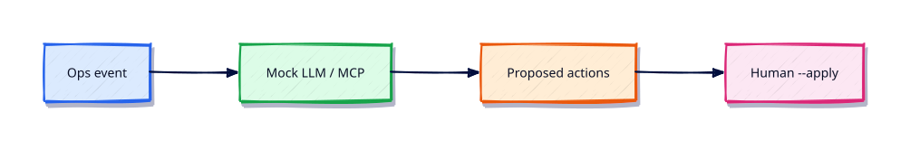

# AI for DevOps — OpenAI, MCP, and LangChain

## Overview

AI can draft runbooks and summarise incidents — but labs must never require real API keys.

This is **Tutorial 26** in **Module 26: AI for DevOps** of the REBASH Academy **Python for DevOps Engineers** series — written for DevOps engineers, SREs, platform engineers, and cloud engineers who automate infrastructure with production-quality Python.

## Prerequisites

- Security for DevOps Python
- Python 3.12+ on Linux (WSL2/VM/cloud)

## Learning Objectives

By the end of this tutorial, you will be able to:

- [ ] Apply the core ideas of “AI for DevOps — OpenAI, MCP, and LangChain” in real ops automation
- [ ] Use a project venv and avoid relying on system site-packages
- [ ] Produce clear stderr diagnostics and meaningful exit codes
- [ ] Prefer safe patterns (pathlib, subprocess list args, dry-run)
- [ ] Relate this topic to day-to-day DevOps and platform work

## Architecture

Ops Python sits between operators/CI and platforms (files, APIs, CLIs, and cloud control planes). This topic’s control points are shown below.



## Theory

### OpenAI SDK

Official client for chat/completions. In this course, call a **mock client** that returns fixture text so CI stays offline.

### MCP Clients

**Model Context Protocol (MCP)** connects assistants to tools (Kubernetes, Terraform, docs). Understand client/server roles; practise with stub tool lists.

### LangChain Basics

Chains/agents that call tools. Use only for well-bounded ops assistants with human approval on mutating tools.

### AI-assisted Automation

Summarise logs, propose kubectl/terraform commands, and draft PRs — always show the plan and require `--apply` / human confirm for side effects.

### AI Agents for Operations

Agents that can call inventory tools are useful; agents that can delete namespaces need strict allow-lists, dry-run defaults, and audit logs. Prefer recommendation over autonomous mutation.

## Hands-on Lab

Create a workspace for this tutorial.

```bash
mkdir -p ~/rebash-python/lab26 && cd ~/rebash-python/lab26
```

**Focus:** mock LLM client summarising a fixture log; no real API keys

### Step 1 – Skeleton

```bash
cat > lab.py << 'EOF'
#!/usr/bin/env python3
print("lab26 ai-for-devops-openai-mcp-langchain")
EOF
chmod +x lab.py
python3 lab.py
```

### Step 2 – Mock LLM summary

```bash
cat > incident.log << 'EOF'
ERROR nginx upstream timed out
WARN disk 85 percent
INFO deploy finished
EOF
cat > ai_ops.py << 'EOF'
#!/usr/bin/env python3
from pathlib import Path

class MockLLM:
    def summarise(self, text: str) -> str:
        errors = [ln for ln in text.splitlines() if "ERROR" in ln]
        return f"errors={len(errors)}; first={errors[0] if errors else 'none'}"

log = Path("incident.log").read_text()
plan = MockLLM().summarise(log)
print(f"SUMMARY {plan}")
print("WOULD_NOTIFY slack --apply required for send")
print("RESULT ok")
EOF
python3 ai_ops.py
```

### Final step – Cleanup note

```bash
python3 lab.py
# keep ~/rebash-python for later labs
```

## Validation

- [ ] Lab commands run under `~/rebash-python/lab26/`
- [ ] You can explain each Theory heading in your own words
- [ ] Failure path exits non-zero and prints diagnostics to stderr (where applicable)
- [ ] Dry-run / fixture behaviour is clear for any mutating or cloud action
- [ ] You can relate this topic to a real DevOps or platform task

## Code Walkthrough

Production Python for **AI for DevOps — OpenAI, MCP, and LangChain** always combines:

1. A clear entry point (`main()` + `if __name__ == "__main__"`)
2. A project virtual environment and pinned dependencies when third-party libs are used
3. Explicit error handling and logging (no silent `except Exception: pass`)
4. Safe I/O: `pathlib`, timeouts on HTTP, `subprocess.run([...])` without `shell=True`
5. Documented exit codes and dry-run defaults for mutating actions

Keep modules short enough to review in a single merge request. Prefer stdlib first; add httpx/requests, Typer, pytest, and platform SDKs when the job needs them.

## Security Considerations

- Treat all external input (args, files, env, API payloads) as untrusted until validated
- Never log secrets or `Authorization` headers; prefer masked CI variables and secret stores
- Prefer least privilege tokens and read-only / dry-run modes by default
- Avoid `shell=True`, unvalidated path deletes, and committing `.env` files
- Pin dependencies; review transitive packages for automation that runs in CI

## Common Mistakes

!!! warning "Using system Python without a venv"
    Global packages drift between laptops and CI. **Fix:** `python3 -m venv .venv` per project and pin dependencies.

!!! warning "Calling subprocess with shell=True"
    Untrusted strings become remote code execution. **Fix:** pass a list of arguments; never build a shell string for the happy path.

!!! warning "Mutating without dry-run"
    Cleanup and apply tools destroy shared environments. **Fix:** default to dry-run; require `--apply` for side effects.

## Best Practices

- One purpose per command; share helpers in a small library package
- Log to stderr; reserve stdout for data or RESULT lines
- Idempotent behaviour where schedulers and CI may retry
- Fixture / mock paths for GitHub, Docker, Kubernetes, Terraform, and cloud SDKs in CI
- Pair every new tool with at least one failing-path test you actually run

## Troubleshooting

| Symptom | Likely cause | Fix |
|---------|--------------|-----|
| `ModuleNotFoundError` in CI | Missing venv / pins | Recreate venv; install from lock/requirements |
| Works locally, fails in pipeline | Different Python or env | Pin `requires-python`; fingerprint env in the job |
| Hang on HTTP call | No timeout | Set `timeout=` on requests/httpx clients |
| Secrets in logs | Debug printing headers | Redact; never log tokens |
| Accidental prune/delete | No dry-run default | Default dry-run; label lab resources |

## Summary

**AI for DevOps — OpenAI, MCP, and LangChain** is a core skill for DevOps engineers automating real hosts, APIs, and pipelines with Python. Practise the lab until the failure path and dry-run path are as familiar as the happy path, then continue the track.

## Interview Questions

1. When would you choose Python over Bash for this kind of ops task?
2. What failure mode appears if you skip a venv, pinning, or dry-run here?
3. How would you test this behaviour in CI without live cloud credentials?
4. Where could secrets leak in a naive implementation of this topic?
5. What exit code contract would you document for teammates?

!!! tip "Sample answer — question 2"
    Floating dependencies and missing dry-run defaults create “works on my machine” automation that either breaks overnight or mutates shared infrastructure unexpectedly. Pin versions and default to report-only.

## Related Tutorials

- [Python for DevOps Engineers – Category Overview](index.md)
- [Security for DevOps Python](security-for-devops-python.md) *(previous)*
- [Troubleshooting Python Automation](troubleshooting-python-automation.md) *(next)*
- [Shell Scripting for DevOps Engineers](../shell/index.md)
- [Learning Paths](../learning-paths/index.md)

## References

- [Python 3 documentation](https://docs.python.org/3/)
- [requests documentation](https://requests.readthedocs.io/)
- [httpx documentation](https://www.python-httpx.org/)
- Track index: [Python for DevOps Engineers](index.md)
